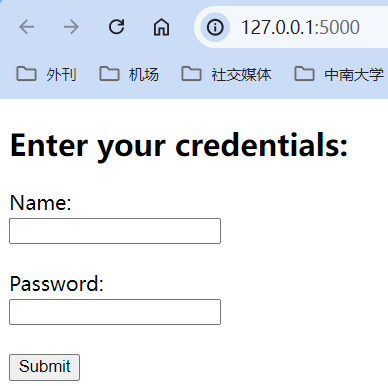
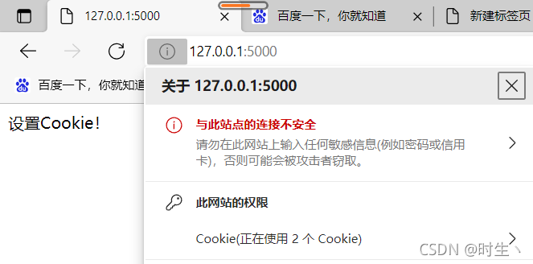

# [Flask 框架入门](https://blog.csdn.net/wly55690/article/details/131683846?ops_request_misc=%257B%2522request%255Fid%2522%253A%2522172005270916800225575750%2522%252C%2522scm%2522%253A%252220140713.130102334..%2522%257D&request_id=172005270916800225575750&biz_id=0&utm_medium=distribute.pc_search_result.none-task-blog-2~all~top_positive~default-1-131683846-null-null.142^v100^pc_search_result_base2&utm_term=Flask&spm=1018.2226.3001.4187)

## 简介

> [Flask](http://www.pythondoc.com/flask/) 是一个非常小的 PythonWeb 框架，被称为微型框架；只提供了一个稳健的核心，其他功能全部是通过扩展实现的；意思就是我们可以根据项目的需要量身定制，也意味着我们需要学习各种扩展库的使用。

## 概要

> 1）安装： `pip install flask`
> 2）组成：WSGI 系统、调试、路由
> 3）模板引擎：Jinja2（由 Flask 核心开发者人员开发）
> 4）使用到 [装饰器](https://www.cnblogs.com/ArmoredTitan/p/8878124.html)：以@开头的代码方法

## 知识点

### Flask 基础入门

#### 路由 route 的创建

[route 装饰器详解](https://www.cnblogs.com/open-yang/p/11172301.html)

- 通过创建路由并关联函数，实现一个基本的网页：

```py
from flask import Flask

# 用当前脚本名称实例化Flask对象，方便flask从该脚本文件中获取需要的内容
app = Flask(__name__)

#程序实例需要知道每个url请求所对应的运行代码是谁。
#所以程序中必须要创建一个url请求地址到python运行函数的一个映射。
#处理url和视图函数之间的关系的程序就是"路由"，在Flask中，路由是通过@app.route装饰器(以@开头)来表示的
@app.route("/")
#url映射的函数，要传参则在上述route（路由）中添加参数申明
def index():
    return "Hello World!"

# 直属的第一个作为视图函数被绑定，第二个就是普通函数
# 路由与视图函数需要一一对应
# def not():
#     return "Not Hello World!"

# 启动一个本地开发服务器，激活该网页
app.run()
```

- 通过路由的 methods 指定 url 允许的请求格式：

```py
from flask import Flask

app = Flask(__name__)

#methods参数用于指定允许的请求格式
#常规输入url的访问就是get方法
@app.route("/hello",methods=['GET','POST'])
def hello():
    return "Hello World!"
#注意路由路径不要重名，映射的视图函数也不要重名
@app.route("/hi",methods=['POST'])
def hi():
    return "Hi World!"

app.run()
```


- 通过路由在 url 内添加参数，其关联的函数可以接收该参数：

```py
from flask import Flask

app = Flask(__name__)

# 可以在路径内以/<参数名>的形式指定参数，默认接收到的参数类型是string

'''#######################
以下为框架自带的转换器，可以置于参数前将接收的参数转化为对应类型
string 接受任何不包含斜杠的文本
int 接受正整数
float 接受正浮点数
path 接受包含斜杠的文本
########################'''

@app.route("/index/<int:id>",)
def index(id):
    if id == 1:
        return 'first'
    elif id == 2:
        return 'second'
    elif id == 3:
        return 'thrid'
    else:
        return 'hello world!'

if __name__=='__main__':
    app.run()


```


- 除了原有的转换器，我们也可以自定义转换器（`pip install werkzeug`）：

```py
from werkzeug.routing import BaseConverter #导入转换器的基类，用于继承方法
from flask import Flask

app = Flask(__name__)

# 自定义转换器类
class RegexConverter(BaseConverter):
    def __init__(self,url_map,regex):
        # 重写父类定义方法
        super(RegexConverter,self).__init__(url_map)
        self.regex = regex

    def to_python(self, value):
        # 重写父类方法，后续功能已经实现好了
        print('to_python方法被调用')
        return value

# 将自定义的转换器类添加到flask应用中
# 具体过程是添加到Flask类下url_map属性（一个Map类的实例）包含的转换器字典属性中
app.url_map.converters['re'] = RegexConverter
# 此处re后括号内的匹配语句，被自动传给我们定义的转换器中的regex属性
# value值会与该语句匹配，匹配成功则传达给url映射的视图函数
@app.route("/index/<re('1\d{10}'):value>")
def index(value):
    print(value)
    return "Hello World!"

if __name__=='__main__':
    app.run(debug=True)
```


#### endpoint 的作用

- 说明：每个 app 中都存在一个 url_map，这个 url_map 中包含了 url 到 endpoint 的映射；
- 作用：当 request 请求传来一个 url 的时候，会在 url_map 中先通过 rule 找到 endpoint，然后再在 view_functions 中根据 endpoint 再找到对应的视图函数 view_func

```py
from flask import Flask

app = Flask(__name__)

# endpoint默认为视图函数的名称
@app.route('/test')
def test():
    return 'test success
# 我们也可以在路由中修改endpoint（当视图函数名称很长时适用）
# 相当于为视图函数起别名
@app.route('/hello',endpoint='our_set')
def hello_world():
    return 'Hello World!'

if __name__ == '__main__':
    print(app.view_functions)# 查看所有的视图函数
    print(app.url_map)# 查看所有的路由
    app.run()
```

- 可以通过 `view_functions` 查看到当前 **endpoint** 与 **视图函数** 的对应情况；
- 可以通过 `url_map` 查看当前 **url** 与 **endpoint** 的绑定情况；

```py
{'static': <function Flask.__init__.<locals>.<lambda> at 0x000001C016860310>, 
 'test': <function test at 0x000001C0100001C016860430>, 
 'our_set': <function hello_world at 0x000001C0168604C0>}

Map([<Rule '/static/<filename>' (HEAD, GET, OPTIONS) -> static>,
     <Rule '/test' (HEAD, GET, OPTIONS) -> test>,
     <Rule '/hello' (HEAD, GET, OPTIONS) -> our_set>])
```

- 值得注意的是，**endpoint 相当于给 url 起一个名字**，view_functions 内存储的就是 url 的名字到视图函数的映射，且 endpoint 在同一个蓝图下也不能重名：

```py
from flask import Flask

app = Flask(__name__)

@app.route('/test',endpoint='Test')
def test():
    return 'None'
def Test():
    return 'World!'
    
if __name__ == '__main__':
    print(app.view_functions)
    print(app.url_map)
    app.run()
```

- 通过 view_functions 可以看到，即使修改 endpoint 为其他视图函数名，依然是绑定其正下方的视图函数，说明 endpoint 作用于 url：

```py
{'static': <function Flask.__init__.<locals>.<lambda> at 0x000001D162FB0280>, 
 'Test': <function test at 0x000001D162FB03A0>}

Map([<Rule '/static/<filename>' (HEAD, OPTIONS, GET) -> static>,
     <Rule '/test' (HEAD, OPTIONS, GET) -> Test>])
```

#### request 对象的使用

- 什么是 [request 对象](http://www.pythondoc.com/flask/api.html#flask.request)？

- [render_template()](https://www.cnblogs.com/h694879357/p/12295883.html)：可以用于呈现一个我们编写的 html 文件模板

- request.method 用于获取 url 接收到的请求方式，以此返回不同的响应页面

```py
#request：包含前端发送过来的所有请求数据

from flask import Flask,render_template,request

# 用当前脚本名称实例化Flask对象，方便flask从该脚本文件中获取需要的内容
app = Flask(__name__)

@app.route("/",methods=['GET','POST'])
#url映射的函数，要传参则在上述route（路由）中添加参数申明
def index():
    if request.method == 'GET':
        # 想要html文件被该函数访问到，首先要创建一个templates文件，将html文件放入其中
        # 该文件夹需要被标记为模板文件夹，且模板语言设置为jinja2
        return render_template('index.html')
    # 此处欲发送post请求，需要在对应html文件的form表单中设置method为post
    elif request.method == 'POST':
        name = request.form.get('name')
        password = request.form.get('password')
        return name+" "+password

if __name__=='__main__':
    app.run()
```

**index.html:**

```html
<!DOCTYPE html>
<html lang="en">
<head>
    <meta charset="UTF-8">
    <meta name="viewport" content="width=device-width, initial-scale=1.0">
    <title>Flask Form Example</title>
</head>
<body>
    <h2>Enter your credentials:</h2>
    <form method="POST" action="/">
        <label for="name">Name:</label><br>

        <input type="text" id="name" name="name"><br><br>
        <label for="password">Password:</label><br>
        <input type="password" id="password" name="password"><br><br>
        <input type="submit" value="Submit">
    </form>
</body>
</html>
```




#### 请求钩子 `before/after_request`

想要在正常执行的代码的前、中、后时期，强行执行一段我们想要执行的功能代码，便要用到 **钩子函数**——**用特定装饰器装饰的函数**。

------

下面将介绍 Flask 内，四种常用的钩子：

1. before_request：在每一次请求之前调用；
   
   - 该钩子函数表示每一次请求之前，可以执行某个特定功能的函数；
   - 执行顺序是 **先绑定的先执行**；
   - 并且先执行 flask app 的 before_request, 再执行 blueprint 的 before_request；
   - 一般用于检验用户权限、请求是否合法等场景；
   
    ```py
    from flask import Flask
    app = Flask(__name__)
   
    @app.route('/')
    def hello_world():
        return 'Hello World!'
   
    @app.before_request
    def before_request_a():
        print('I am in before_request_a')
   
    @app.before_request
    def before_request_b():
        print('I am in before_request_b')
        
    if __name__ == '__main__':
        app.run()
    
    # 打印结果 -=-=-=-=-=-=-=-=-=-=-=-=-=
    I am in teardown_request_a
    I am in teardown_request_b
    ```
   
2. before_first_request：与 before_request 的区别是，只在第一次请求之前调用；
   - 该钩子函数表示第一次请求之前可以执行的函数；
   - 执行顺序同样也是先绑定的先执行；
	
	```py
	# 代码替换视图函数hello_world后，if main前
    @app.before_first_request
    def teardown_request_a():
        print('I am in teardown_request_a')
	
    @app.before_first_request
    def teardown_request_b():
        print('I am in teardown_request_b')
	
    # 打印结果 -=-=-=-=-=-=-=-=-=-=-=-=-=
    I am in teardown_request_a
    I am in teardown_request_b
	```
	
3. after_request：每一次请求之后都会调用；
   - 该钩子函数表示每一次请求之后，可以执行某个特定功能的函数，这个函数接收 response 对象，所以执行完后必须归还 response 对象；
   - 执行的顺序是 **先绑定的后执行**；
   - 被触发的前提是没有异常抛出，或者异常被 errorhandler 捕获并处理；
   - 一般可以用于产生 csrf_token 验证码等场景；

	```py
	# 代码替换视图函数hello_world后，if main前
    @app.after_request
    def after_request_a(response):
        print('I am in after_request_a')
        # 该装饰器接收response参数，运行完必须归还response，不然程序报错
        return response
   
    @app.after_request
    def after_request_b(response):
        print('I am in after_request_b')
        return response
   
    # 打印结果 -=-=-=-=-=-=-=-=-=-=-=-=-=
    I am in teardown_request_b
    I am in teardown_request_a
	```

4. teardown_request：每一次请求之后都会调用；
   - 该钩子函数接收一个参数，该参数是服务器出现的错误信息；
   - 执行顺序也是 **先绑定的后执行**；
   - 只有在请求上下文被 pop 出请求栈的时候才会直接跳转到 teardown_request；
   - 所以在被正常调用之前，即使某次请求有抛出错误，该请求也都会被继续执行, 并在执行完后返回 response；
   
   ```py
   # 代码替换视图函数hello_world后，if main前
   @app.teardown_request
   def teardown_request_a(exc):
   print('I am in teardown_request_a')
   
   @app.teardown_request
   def teardown_request_b(exc):
   print('I am in teardown_request_b')
   
   # 打印结果 -=-=-=-=-=-=-=-=-=-=-=-=-=
   I am in teardown_request_b
   I am in teardown_request_a
   ```

#### redirct 重定向

- 什么是 redirect 重定向？

- 在 flask 中，重定向是通过 flask.redirect(location, code = 302)这个函数来实现的，location 表示需要重定向的 url, 应该配合 url_for 函数来使用， code 表示采用哪个重定向，默认是 302，即临时性重定向, 可以修改为 301 来实现永性重定向；

  ```py
  from flask import Flask,redirect,url_for
  
  app = Flask(__name__)
  
  @app.route('/index')
  def index():
      # redirect重定位（服务器向外部发起一个请求跳转）到一个url界面；
      # url_for给指定的函数构造 URL；
      # return redirect('/hello') 不建议这样做,将界面限死了
      return redirect(url_for('hello'))
  
  @app.route('/hello')
  def hello():
      return 'this is hello fun'
  
  if __name__ == '__main__':
      app.run()
  ```
  
#### 返回 json 数据给前端

方法一：

> 使用：make_response 方法和 json 库共同完成

```py
from flask import Flask,make_response,json

app = Flask(__name__)

@app.route("/index")
def index():
   data = {
       'name':'张三'
   }
   # json.dumps 将一个python数据结构转化为json
   # json.dumps 序列化时对中文默认使用的ascii编码.想输出真正的中文需要指定ensure_ascii=False
   # 生成一个response响应对象，而不是直接return来返回响应对象，便于执行更多的后续操作
   response = make_response(json.dumps(data,ensure_ascii=False))
   # 修改数据的MIME标准类型为json（在发送数据前会先发送该类型）
   response.mimetype = 'application/json'
   return response

if __name__=='__main__':
    app.run()
```

方法二：

> 使用：jsonify 库实现，减少代码行数

```py
from flask import Flask,jsonify

app = Flask(__name__)
# 在Flask的config是一个存储了各项配置的字典
# 该操作是进行等效于ensure_ascii=False的配置
app.config['JSON_AS_ASCII'] = False

@app.route("/index")
def index():
   data = {
       'name':'张三'
   }
   return jsonify(data)

if __name__=='__main__':
    app.run()
```

- 运行结果



#### abort 函数的使用

- 什么是 abort？
- 使用类似于 python 中的 raise 函数，可以在需要退出请求的地方抛出错误，并结束该请求；
- 我们可以使用 errorhandler()装饰器来进行异常的捕获与自定义：

```py
from flask import Flask,render_template,request,abort

app = Flask(__name__)

@app.route("/",methods=['GET','POST'])
def index():
    if request.method == 'GET':
        return render_template('index.html')
    elif request.method == 'POST':
        name = request.form.get('name')
        password = request.form.get('password')
        if name == 'zhangsan' and password == '123456':
            return 'login sucess'
        else:
            # abort的用法类似于python中的raise，在网页中主动抛出错误
            abort(404)
            return None

# 自定义错误处理方法,将404这个error与Python函数绑定
# 当需要抛出404error时，将会访问下面的代码
@app.errorhandler(404)
def handle_404_error(err):
    # return "发生了错误，错误情况是：%s"%err
    # 自定义一个界面
    return render_template('404.html')

if __name__ == '__main__':
    app.run()
```

- 自定义的 404 界面：

```html
<!DOCTYPE html>
<html lang="en">
<head>
    <meta charset="UTF-8">
    <title>Title</title>
</head>
<body>
<!-- 注意图片文件需要放在一个静态文件夹static里 -->

</body>
</html>
```

- errorhandler()也可以传入异常类，用于捕获除 flask 异常列表内的其他异常：[点我查看](https://zhuanlan.zhihu.com/p/358466616)

```py
from flask import Flask

app = Flask(__name__)

@app.route('/')
def index():
    0/0
    return 'index'

@app.route('/user')
def user():
    raise ValueError
    return 'user'


@app.errorhandler(404)
def error(e):
    print('捕捉到404')
    return 'error', 404


@app.errorhandler(ZeroDivisionError)
def catch_except(e):
    return '捕捉到异常'+ str(e), 500


@app.errorhandler(Exception)
def catch_all_except(e):
    return '捕捉任意异常'+ str(e), 500

if __name__ == '__main__':
    app.run()
```


#### url_for 实现反转

- url_for 是实现 url 反转的工具，即 **视图函数 → url**；
- 静态文件引入：`url_for('static', filename='文件路径')`

> 静态文件需要存储在当前工程下的 static 目录内。

- 定义路由：`url_for('模块名.视图名'，变量=参数)`

> - 参数一中的视图名实质指的是 endpoint，url_map 中存储了 url 到 endpoint 的映射，只是默认情况下 endpoint 与视图函数名相同；
> - 如果在装饰器中修改了 endpoint，则 url_for 只能使用 endpoint 设置的名字来反转 url；
> - 在单模块程序下我们可以省略模块名，但当使用了蓝图（buleprint）后，参数一就必须使用 "蓝图模块名.视图名"，因为不同蓝图下的视图函数可以重名。

### Flask 高级视图

#### add_url_rule 的初登场

- 欲实现 url 与视图函数的绑定，除了使用路由装饰器@app.route，我们还可以通过 `add_url_rule(rule,endpoint=None,view_func=None)` 方法，其中：

> - rule：设置的 url
> - endpoint：给 url 设置的名称
> - view_func：指定视图函数的名称

因此可以这样用:

```py
def my_test():
    return '这是测试页面'
app.add_url_rule(rule='/test',endpoint='test',view_func=my_test)
```

验证一下上述用法:

```py
from flask import Flask,url_for

app = Flask(__name__)

@app.route('/',endpoint='index')
# 底层其实是使用add_url_rule实现的
def hello_world():
    return 'Hello World!'

def my_test():
    return '这是测试页面'
app.add_url_rule(rule='/test',endpoint='test',view_func=my_test)

# 请求上下文只有在发送request请求时才会被激活，激活后request对象被设置为全局可访问
# 其内部封装了客户端发出的请求数据报文
# 此处是主动生成一个临时的测试请求上下文
with app.test_request_context():
    print(url_for('test')) # 输出结果为/test

if __name__ == '__main__':
    app.run(debug=True)
```


#### 类视图的引入

- 之前我们所定义的视图都是通过函数来实现的，所以称之为视图函数，但其实视图还可以由类来实现，即 **类视图**；
- **标准类视图**：

> - 定义时需要继承 flask 的 views.View 这一基类;
> - 每个类视图内必须包含一个 dispatch_request 方法，每当类视图接收到请求时都会执行该方法，返回值的设定和视图函数相同；
> - 视图函数可以通过@app.route 和 app.add_url_rule 来进行注册（映射到 url），但类视图只能通过 app.add_url_rule 来注册，注册时 view_func 不能直接使用类名，需要调用基类中的 as_view 方法来为自己取一个“视图函数名”

- 采用类视图的最大优势，就是可以把多个视图内相同的东西放在父类中，然后子类去继承父类；而类视图不方便的地方，就是每一个子类都要通过一个 add_url_rule 来进行注册。
- 下面将创建一个网站包含三个页面，每个页面中都展示相同的对联广告，py 文件如下：

```py
from flask import Flask,render_template,views

app = Flask(__name__)

# 定义父视图类继承基类View
class Ads(views.View):
    def __init__(self):
        super(Ads, self).__init__()
        # 实例属性
        self.context={
            'ads':'这是对联广告！'
        }

# 定义子视图类继承父类并实现工程
class Index(Ads):
    def dispatch_request(self):
        # 字典传参方式==不定长的关键字传参
        return render_template('class_mould/index.html',**self.context)
class Login(Ads):
    def dispatch_request(self):
        # 字典传参方式==不定长的关键字传参
        return render_template('class_mould/login.html',**self.context)
class Register(Ads):
    def dispatch_request(self):
        # 字典传参方式==不定长的关键字传参
        return render_template('class_mould/register.html',**self.context)

# 注册我们创建的类视图,as_view给类视图起名
app.add_url_rule(rule='/',endpoint='index',view_func=Index.as_view('index'))
app.add_url_rule(rule='/login/',endpoint='login',view_func=Login.as_view('login'))
app.add_url_rule(rule='/register/',endpoint='register',view_func=Register.as_view('register'))

if __name__=='__main__':
    print(app.view_functions)
    app.run(debug=True)
```

- 首页 **index.html**：

```html
<!DOCTYPE html>
<html lang="en">
<head>
    <meta charset="UTF-8">
    <title>Title</title>
</head>
<body>
这是首页！{{ ads }}
</body>
</html>
```

- 登录页面 **login.html**：

```html
<!DOCTYPE html>
<html lang="en">
<head>
    <meta charset="UTF-8">
    <title>Title</title>
</head>
<body>
这是登录页面！{{ ads }}
</body>
</html>
```

- 注册页面 **register.html**：

```html
<!DOCTYPE html>
<html lang="en">
<head>
    <meta charset="UTF-8">
    <title>Title</title>
</head>
<body>
这是注册页面！{{ ads }}
</body>
</html>
```

- 可以通过调用 app.view_functions 来查看当前的 endpoint 绑定情况，发现已经变为 as_view 转化后的类视图：

```js
{'static': <function Flask.__init__.<locals>.<lambda> at 0x0000024163C46D30>, 
 'index': <function View.as_view.<locals>.view at 0x0000024164B58CA0>, 
 'login': <function View.as_view.<locals>.view at 0x0000024164BCB280>, 
 'register': <function View.as_view.<locals>.view at 0x0000024164BCB310>}
```

- **基于方法的类视图：**
- 当我们需要根据不同请求来实现不同逻辑时，用视图函数需要在内部对请求方法做判断，但我们使用方法类视图就可以通过重写其内部方法简单实现；
- Flask 除了基本类视图，还为我们提供了另一种类视图 flask.views.MethodView, 在其内部编写的函数方法即是 http 方法的同名小写映射

```py
from flask import Flask,render_template,request,views

app = Flask(__name__)

@app.route('/')
def hello_world():
    return render_template('index.html')

# 定义LoginView类
class LoginView(views.MethodView):
    # 定义get函数
    def get(self):
        return render_template("index.html")
    # 定义post函数
    def post(self):
        username = request.form.get("username")
        password = request.form.get("password")
        if username == 'admin' and password == 'admin':
            return "用户名正确，可以登录！"
        else:
            return "用户名或密码错误，不可以登录！"
        
# 注册类视图
# 未设置endpoint，则endpoint默认为as_view设置的类视图名
app.add_url_rule('/login',view_func=LoginView.as_view('loginview'))

if __name__ == '__main__':
    print(app.url_map)
    app.run(debug=True)
```

- 模板文件 index.html 为：

```html
<!DOCTYPE html>
<html lang="en">
<head>
    <meta charset="UTF-8">
    <title>Title</title>
</head>
<body>
<!--action中可以指定表单提交的目标url或文件-->
<!--login指向我们给类视图绑定的url：'/login'-->
<form action="login" method="post">
    USERNAME：
    <input type="text" name="username">
    <br>
    PASSWORD：
    <input type="password" name="password">
    <br>
    <!--提交按钮-->
    <input type="submit" name="submit">
</form>
</body>
</html>
```

#### 装饰器的自定义与使用

- 装饰器本质上是一个 python 函数，他可以让其他函数在不需要做任何代码变得的前提下增加额外的功能，其传入参数一般是函数对象（如视图函数），返回值也是一个函数对象；
- 装饰器主要用于有切面需求的场景，如插入日志、性能测试、事务处理等与函数功能无关的操作，对于这些需要多次重用的代码，我们将其放置在装饰器里，就可以无需在每个函数中反复编写；
- 如我们要在新闻页面前插入登录操作，我们可以这样实现：

```py
from flask import Flask

app = Flask(__name__)

@app.route('/')
def hello_world():
    return 'Hello World!'

# 定义装饰器函数
def user_login(func):
    def inner():
    	# 替代登录操作
        print('登录操作！')
        # 执行传入的函数对象
        func()
    # 此处如果return inner()，那么返回的是inner函数的执行结果
    # 而使用return inner，则返回的是inner函数
    return inner

# 定义新闻页面视图函数news
def news():
    print('这是新闻详情页！')
# 将news函数作为参数传给装饰器函数
show_news=user_login(news)
# 因为user_login返回inner函数，所以show_news()==inner()
show_news()
# 打印出show_news的真实函数名（为inner）
print(show_news.__name__)

if __name__ == '__main__':
    app.run(debug=True)
```

- 上述代码的运行逻辑是这样的：首先我们将新闻页面函数作为一个参数传给装饰器，装饰器将我们需要插入的登录操作与我们的视图函数包装成一个 inner 函数对象并返回，最后执行该对象便可以实现在新闻页面显示前执行登录操作； 
- 其中登录操作并不是新闻页面函数的功能，且访问每一个新闻页面都应当先执行该操作，固我们将其放置在定义的装饰器中，需要添加该功能的函数使用该装饰器即可；运行结果如下：

```
登录操作！
这是新闻详情页！
inner
```

- 当然上述的写法和我们平时调用装饰器的方法不太一样，我们将其变为标准的装饰器形式：

```py
@user_login
# 定义函数news,该函数将自动被传给装饰器做参数
def news():
    print('这是新闻详情页！')
# 此时相当于已经执行完news=user_login(news)
news()
print(news.__name__)

# show_news=user_login(news)
# show_news()
# print(show_news.__name__)

```

- 用标准格式替换后得到运行结果相同，news 的函数名也已经变为 inner：

```
登录操作！
这是新闻详情页！
inner
```

- 刚才我们展示的是 **不含参数** 的函数使用装饰器，对于 **带参数的函数** 我们同样也可以使用装饰器，这里要先回顾 Python 的可变参数：

> def func(*args,**kwargs) :
>
> - *：代表元组，长度不限；
> - **：代表键值对，个数不限；
> - *args：指用元组传参，元组内包含不定个数的位置参数；
> - **kwargs：指用字典传参，字典内包含不定个数的关键字参数（键值对）；

- 对于函数传参的演示略过，直接展示带参数的函数如何使用装饰器：

```py
from flask import Flask

app = Flask(__name__)

@app.route('/')
def hello_world():
    return 'Hello World!'

# 定义装饰器函数
def user_login(func):
    # inner函数接收参数
    def inner(*args,**kwargs):
        print('登录操作！')
        # 执行传入函数时使用inner接收到的参数
        func(*args,**kwargs)
    return inner

# 不带参的不受影响
@user_login
def news():
    print(news.__name__)
    print('这是新闻详情页！')
news()

# 带参的定义时预声明接收的参数
@user_login
def news_list(*args):
    # 获取元组args的第一个元素
    page=args[0]
    print(news_list.__name__)
    print('这是新闻列表页的第'+str(page)+'页！')
# 传递给args的元组即为(5,)
news_list(5)

if __name__ == '__main__':
    app.run(debug=True)
```

- 运行后可以看到上述的两个视图函数名都已经变为 inner，说明打包成功：

```
登录操作！
inner
这是新闻详情页！

登录操作！
inner
这是新闻列表页的第5页！
```

- 上述结果也反映出代码存在一定的问题，就是不管我们定义的视图函数名称是 news 还是 news_list，最终执行时都变为了 inner。为了解决这一问题，我们可以使用 `functools.wraps` 方法来保留原函数的属性与名称，通俗一点理解就是“**不换外包装**”；
- 方法的导入：`from functools import wraps`；
- 在自定义的装饰器下方添加一行 `@wraps(<形参名>)` 即可；

```py
from functools import wraps

# 定义装饰器函数
def user_login(func):
    @wraps(func)
    # inner函数接收参数
    def inner(*args,**kwargs):
        print('登录操作！')
        # 执行传入函数时使用inner接收到的参数
        func(*args,**kwargs)
    return inner
```

- 替换修改后的装饰器，运行结果如下，可以看到原视图函数名称被保留：

```
登录操作！
news
这是新闻详情页！

登录操作！
news_list
这是新闻列表页的第5页！
```

#### 蓝图的使用

- 上述类视图、装饰器分别通过继承、包装的方式减少了单个 flask 程序文件里重复代码的出现，实现了程序的优化；
- 但是这样处理后的文件内，不同功能的代码块（类视图、视图函数）仍然混杂在一起。如果要制作一个非常大型的程序项目，这样不仅会让代码阅读变得十分困难，而且不利于后期维护；
- 为了解决这一问题，我们需要引入 **蓝图（flask.Blueprint）**，用于实现程序功能的模块化；
- 导入方法：`from flask import Blueprint`

> - 当接收到请求时，Flask 会遍历 Flask 对象下（已注册）的各蓝图对象，比对蓝图对象中记录的 url，比对成功则映射到该 url 绑定的视图函数并返回响应

- 主路由视图函数：创建 flask 对象，并为拓展模块中的蓝图对象提供注册入口

```py
from flask import Flask
from flask学习 import news,products

app = Flask(__name__)
@app.route('/')
def hello_world():
    return 'hello my world !'

# 将对应模块下的蓝图对象注册到app中
app.register_blueprint(news.new_list)
app.register_blueprint(products.product_list)

if __name__ == '__main__':
    app.run(debug=True)
```

> - Blueprint 对象的工作方式与 Flask 对象类似，但其不是一个单独的应用；
> - 每拓展一个蓝图对象，就要在主路由文件下添加一行注册代码；
> - 蓝图对象内记录了当前模块下的所有视图函数，故视图函数不可与蓝图对象同名；
> - 在蓝图内需要通过蓝图对象来定义路由和调用其他装饰器，由蓝图对象定义的路由处于休眠状态，在蓝图被注册时才成为程序的一部分。

- 分路由视图函数：创建蓝图对象，实现功能拓展
- 模块一：news.py

```py
from flask import Blueprint

# 实例化蓝图对象，参数一类似于蓝图对象的名称
# 一个app下的蓝图对象不可重名
new_list = Blueprint('news',__name__)

# 蓝图对象的使用和app类似
# 一个蓝图下的视图函数名、endpoint不可重复
@new_list.route('/news')
def new():
    return '这是新闻模块！'
```

- 模块二：products.py

```py
from flask import Blueprint

# 实例化蓝图对象，参数一类似于蓝图对象的名称
# 一个app下的蓝图对象不可重名
new_list = Blueprint('products',__name__)

# 蓝图对象的使用和app类似
# 一个蓝图下的视图函数名、endpoint不可重复
@new_list.route('/products')
def product():
    return '这是产品模块！'
```

- 如此一来，我们便将不同功能的视图函数定义在了不同的模块下，实现了程序的工程化。

#### url_prefix 设置蓝图前缀

- 一般在蓝图对象定义时添加，为当前蓝图下的所有视图函数添加统一的前缀，这样不同蓝图下的视图函数的 url 就不易发生重复；
- 如下例添加前缀后，加载该新闻模块的 url 就变为 "**/index/news**"：

```py
new_list = Blueprint('news',__name__,url_prefix='/index')

@new_list.route('/news')
def new():
    return '这是新闻模块！'
```

- 此外，在主路由中注册蓝图时也可以为蓝图添加前缀，并且此次添加会覆写蓝图对象创建时添加的前缀；
- 如下例中，注册后的新闻模块的 url 又变为了 "**/test/news**"：

```py
app.register_blueprint(news.new_list,url_prefix='/test')
```

#### subdomain 设置蓝图子域名

**设置域名**

- 我们可以通过修改 Flask 对象的配置，来为我们的网站设置域名，使用的配置字段为’SERVER_NAME’，同时还要 **为该域名指定端口号**：

```py
# 当前网站域名设置为example.com，端口号为5000
app.config['SERVER_NAME'] = 'example.com:5000'
```

- 在设置了 `app.config['SERVER_NAME']` 的值后，访问网站应当使用我们设置的域名，同时我们还需要修改位于 **C:\Windows\System32\drivers\etc** 下的 **域名重定向文件 hosts**：

> - 在该文件下添加一条记录：`127.0.0.1 example.com`
> - 记录的左边是服务器 ip 地址（本地开发时使用 localhost 才为 127.0.0.1），右边则是我们定义的域名

- 下面展示一个实例，该实例中在 hosts 文件下插入的记录为：`10.240.142.216 example.com`（此时我们指定了服务器 host 不再为 localhost，而是 0.0.0.0），左边是本机 ipv4 地址；
- 此时访问网站服务器时只能通过域名方式：`http://example.com:5000/index`，使用 `http://10.240.142.216:5000/index` 将返回 404:；

```py
from flask import Flask
import admin

app = Flask(__name__)

# 配置`SERVER_NAME`，设置主域名
app.config['SERVER_NAME'] = 'example.com:5000'
# 注册蓝图，指定了subdomain
app.register_blueprint(admin.bp)

@app.route('/index')
def index():
    return '通过域名访问！'

if __name__ == '__main__':
    app.run(host='0.0.0.0',debug=True)
```


**设置子域名**

- 此时我们在蓝图文件 admin.py 中注册蓝图对象，添加 `subdomain='admin'` 即为该蓝图设置子域名 **admin**；
- 再在 hosts 文件中添加记录：`10.240.142.216 admin.example.com` 后，我们便可以通过域名：`http://admin.example.com:5000/ad` 来访问该蓝图（**下一级域名在上一级左侧**）；

```py
from flask import Blueprint
bp = Blueprint('admin',__name__,subdomain = 'admin')

@bp.route('/ad')
def admin():
    return 'Admin Page'
```


### jinjia2 模板引擎

#### 模板的导入与使用

- Flask 通过 render_template 来实现模板的渲染，要使用这个方法，我们需要导入 `from flask import rander_template`，模板中注释需放在 `{# #}` 中
- 模板的第一个参数为指定的模板文件名称，如自定义的 html 文件，第二个（及后续）参数为可选项，用于向模板中传递变量。

```py
from flask import Flask,render_template

app = Flask(__name__)

# 给前端模板传参
@app.route("/")
def index():
    data = {
        'name':'张三',
        'age':18,
        'mylist':[1,2,3,4,5,6,7]
    }
    # 以键值对的形式传参给模板index2.html
    # 左边是我们要在前端调用时使用的变量名称（形参：data）；
    # 右边是我们给这个变量传的值（实参：字典data）；
    return render_template('index2.html',data=data)

if __name__ == '__main__':
    app.run()
```

- 前端 html 模板内需要在双括号 `{{ }}` 中使用该变量：
- 如果想给该变量添加属性便于 CSS 修改格式，我们可以 **在变量后添加括号**，并在括号内定义 class、id 等属性

```html
<!DOCTYPE html>
<html lang="en">
<head>
    <meta charset="UTF-8">
    <title>Title</title>
</head>
<body>
hello world
<br>
<!-- 对传入变量的使用并显示：在双括号内，和python中用法类似 -->
{{ data }}
<br>
{{ data['name'] }}
<br>
{{ data.name }}
<br>
mylist:{{ data.mylist }}
<br>
mylist[1]:{{ data.mylist[1] }}
<br>
count:{{ data.mylist[1]+data.mylist[2] }}
</body>
</html>
```

- 如果有多个变量需要传递，我们可以不需要一个一个进行传参，直接使用 `**locals()` 替代我们在当前视图函数中定义的所有变量：

```py
from flask import Flask,render_template

app = Flask(__name__)

# 给前端模板传参
@app.route("/")
def index():
	title='python键值对'	# 定义键值1
	author='li'			# 定义键值2
    return render_template('index2.html',**locals()) #渲染模型并传值

if __name__ == '__main__':
    app.run()
```

- 在前端直接使用定义时的变量名就可以使用该变量，即 `{{ title }}` 和 `{{ author }}`。

#### 模板中的控制语句

- jinja2 模板引擎中也可使用 if 和 for 控制语句，但是语句需要放置在 `` 中；
- **if 条件判断语句** 必须包含结束标签，其他部分与 python 中类似，可以与比较运算符 `> >= < <= == !=` 结合使用，或与逻辑运算符 `and,or,not,()` 结合使用；

```html
<!DOCTYPE html>
<html lang="en">
<head>
    <meta charset="UTF-8">
    <title>Title</title>
</head>
<body>

	<h1>恭喜你抽中了一等奖！</h1>

	<h1>恭喜你抽中了二等奖！</h1>

	<h1>恭喜你抽中了三等奖！</h1>

</body>
</html>
```

- **for 循环控制语句** 在模板内的用法也和 python 中类似，遍历的对象可以是字典、元组、列表等，但需要注意的是在模板中无法使用 continue 和 break 来对循环进行控制；

```js

	<p>目标</p>

```

- for 循环的内置常量：

> 1. loop.index: 获取当前的索引值 从 1 开始
> 2. loop.index0: 获取当前的索引值 从 0 开始
> 3. loop.first: 判断当前是否是第一次迭代, 是返回 True 否则返回 False
> 4. loop.last: 判断当前是否是最后一次迭代, 是返回 True 否则返回 False
> 5. loop.length: 序列的长度

```js
<ul>

	<li>{{ item }}</li>
	<li>当前的索引是：{{ loop.index }}</li>
	<li>当前的索引是：{{ loop.index0 }}</li>
	<li>当前是否是第一次迭代：{{ loop.first }}</li>
	<li>当前是否是最后一次迭代：{{ loop.last }}</li>
	<li>前序列的长度：{{ loop.length }}</li>
</ul>
```

#### 过滤器的使用与自定义

- 常用 [过滤器](https://jinja.palletsprojects.com/en/3.0.x/templates/#list-of-builtin-filters) 有哪些？
- 可以在前端模板内 `{{ 内容 | 过滤器 }}` 的 " | " 后使用；
- 可以使用 `add_template_filter(函数方法名,'过滤器名')` 来自定义过滤器；

```py
# 自定义过滤器
def list_step(li):
    # 返回列表，步长为2
    return li[::2]

# 注册模板过滤器（filter）
# 参数1为该过滤器调用的函数，参数2为在前端中调用该过滤器使用的名称
app.add_template_filter(list_step,'li2')
```

```html
<!DOCTYPE html>
<html lang="en">
<head>
    <meta charset="UTF-8">
    <title>Title</title>
</head>
<body>
<!-- 过滤器的使用 -->
<!-- 全大写 -->
{{ 'hello_world' | upper }}
<br>
<!-- 单词首字母大写 -->
{{ 'hello world' | title }}
<br>
<!-- 替换左边的内容为右边的内容 -->
{{ 'hello_world' | replace('hello','hi') }}
<br>
<!-- 调用自定义的过滤器 -->
mylist列表：{{ data.mylist | li2 }}
</body>
</html>
```

- 此处我们是将 **列表** 作为过滤器的返回对象，也可以把 **字符串** 等作为过滤器的返回对象，给前端标签作为 class、id 等属性，再结合 css 可以达到一些特别的效果。

```
<span class="{{ 给过滤器的参数|过滤器名称 }}"></span>
```


#### 宏的定义、调用与导入

- 宏的定义是为了将前端模板中需要反复创建的模块变成一个方便调用的“函数”，这一操作类似于 python 中创建函数，也 **可以传参，但不能有返回值**；
- **宏的定义** 以 macro 标志开始，以 endmacro 结束，同样需要在 `` 中进行。

```html
<!-- 不带参数的宏定义, 像定义一个函数一样 -->

    <!-- 宏内执行的操作，生成一个input表单项 -->
    <label>表单项1：
        <input type="text" name='username' value=''>
        <br>
    </label>


<!-- 带参数的宏定义，在括号添加参数和默认值 -->

    <!-- 同样是宏内执行的操作，生成一个input表单项 -->
    <!-- 此处双括号内的参数，指向我们在定义时设定的参数，调用时没有传值就使用设定的默认值 -->
    <label>表单项2：
        <input type="{{ type }}" name="{{ name }}" value="{{ value }}" size="{{ size }}">
        <br>
    </label>

```

- **宏的调用** 同样类似于函数的调用，如果未采用关键字传参则要注意顺序。

```html
<!-- 使用1, 相当于调用一个函数一样 -->
{{ input1() }}

<!-- 使用2 -->
{{ input2() }}   <!--name不指定， 则name="", 即和value一样也是空-->
<!-- 或者 -->
{{ input2('username') }}
<!-- 或者 -
{{ input2('username', value='cheng', type='password', size=50) }}
```

- **宏的导入** 可以使用语句 `import 模板文件名 as 别名` 或 `from 模板文件名 import 宏名称`，就像 python 中库和包的导入一样；

- 我们将宏单独定义在一个 html 模板文件中后，就可以通过导入这个模板文件来调用里面的所有宏，导入过程同样在 `` 中进行，调用过程在 `{{ }}` 在进行。

```html
<!-- 上述宏我们定义在了一个index3.html的文件中 -->

	<div>
		<!-- 调用导入的宏模板文件中的宏，实现登录页面构建 -->
		<p>用户名：{{index3.input2('username')}}</p>
		<p>密码：{{index3.input2('password',type='password')}}</p>
		<p>登录：{{index3.input2('submit',type='submit',value='登录')}}</p>
	</div>
```

- 也可以像这样：

```html
<!-- 另一种导入方式 -->

	<div>
		<!-- 此时直接调用input2即可 -->
		<p>用户名：{{input2('username')}}</p>
		<p>密码：{{input2('password',type='password')}}</p>
		<p>登录：{{input2('submit',type='submit',value='登录')}}</p>
	</div>
```


#### include 的使用

- include 用于在一个模板的指定位置导入另一个模板的内容，区别于宏的调用，include 更像从另一个模板“复制+粘贴”；

- include 同样在 `` 中使用，采用语句 ``，需要注意两点：

> - include 是直接将目标模板中的所有内容直接“copy”在当前位置，所以被导入的模板如果有 head 和 body 部分也将被导入过来；
>
> - include 和 import 都是在 templates 这个目录下搜索的，所以使用路径时不需要添加相对路径：上级目录 “ …/ ” 和当前目录 “ ./ ” ；

（PS：子模板与父模板的说法是为了更好理解）

```html
<!DOCTYPE html>
<html lang="zh">
<head>
    <meta charset="UTF-8">
    <title>Title</title>
</head>
<!-- 可以视为父模板 -->
<body>
	<!-- 可以视为子模板1 -->
    
    <div class="content">
        中间的
    </div>
    <!-- 可以视为子模板2 -->
    
</body>
</html>
```

- 子模板——header.html 内容如下：

```html
<nav>
	<div class="top">
		这是顶部
	</div>
</nav>
```

- 子模板——footer.html 内容如下：

```html
<footer>
	<div class="bottom">
		这是底部
		<!-- 说明：子模板中可以直接使用父模板的变量，不需要其他操作
		因为这一代码是被复制到父模板中去运行的 -->
		author：{{ name }}
	</div>
</footer>
```

- 后端导入父模板：

```py
from flask import Flask,render_template

app = Flask(__name__)

# 运行时直接将子模板需要的参数传给父模板
@app.route("/")
def index():
	name='时生'
    return render_template('include_test.html',name=name)

if __name__ == '__main__':
    app.run(debug=True)
```


#### set 和 with 的使用

- 我们在模板内需要使用到的变量，不仅可以通过后端传参，也可以由我们自己定义，这样更有利于 **前后端分离** 的实现；

- **set**——自定义全局变量：由 set 定义的变量可以在模板内任意一个地方调用，甚至在子模板中也可以使用；

```html
<!-- 定义普通变量并赋值 -->

<!-- 定义列表变量并赋值 -->


<!-- 调用 -->
{{ telephone }}
{{ lis }}
```

- **with**——自定义局部变量：with 定义的变量只能在 `` 到 `` 这个代码块间使用；

```py
<!-- 定义一个普通变量 -->

	<!-- 内部可调用 -->
	{{ test }}

```

#### 加载静态文件

- 静态文件一般是我们在开发过程中用到的 **图片文件**、**css 文件** 和 **js 文件**，在 Flask 工程中通常包含一个 static 文件目录，当需要调用静态文件是将会默认在该目录下进行查询，**固不需要使用相对路径**；

- 通常我们会在 static 文件目录下定义名为 **css**、**image** 和 **js** 的文件夹分别存储这些静态文件；

- 加载静态文件通常配合 url_for 函数使用(需要在双括号内调用)，将模板标签的 src、herf 属性 **通过 `url_for(静态文件名称)` 设置为反转 url 要比使用相对路径更好**。

```html
<head>
	<!-- 导入js文件 -->
	<script type="text/javascript" src="{{url_for('static',filename='js/jquery-3.5.1/jquery-3.5.1.js')}}"></script>
	<!-- 导入css文件 -->
	<link rel="stylesheet" href="{{url_for('static',filename='css/car.css')}}">
</head>
<body>
	<!-- 导入图片 -->
	
</body>
```

- 上述代码直接添加在 html 文件中需要的位置即可，我们以 js 为例验证导入是否成功（置于 body 内）：

```html
<script>
	// 该js文件是标准jq库复制粘贴来的
	if(jQuery){
		alert('jQuery已加载！');
	}
	else{
		alert('jQuery未加载！');
	}
</script>
```


#### extends 继承模板

- 在 include 中，我们对于当前模板需要插入的代码块，可以在其他模板中定义，然后用 include 导入进来，**外部模块是当前模块的补充**；

- 而在 extends 中，我们当前的模板则是待装载的代码块，需要我们 **继承一个框架来搭载这些代码块**，这时候就需要 extend 来导入框架（基类）模块了；

> 简单点说，如果把二者都按照父子模板来称呼，
>
> - include 中我们在后端导入的父模板，将子模板插入到父模板中需要的地分；
>
> - extend 中我们在后端导入子模板，将父模板的框架（页面布局）拿来显示子模板；

- 父模板——基类模板 father.html：

> block 后跟的是当前区块的名称，可以自己定，子模板内容中便可以依据名字插入到对应的位置；

```js
<!DOCTYPE html>
<html lang="en">
<head>
	<!--除了装载部分，其他部分子模板一律安照当前父模板的定义显示-->
    <meta charset="UTF-8">
    <title>
    	<!--标题中子模板内容的装载位置-->
        
        
        -我的网站
    </title>
</head>
<body>
	<!--主体中子模板内容的装载位置-->
    
        这是基类中的内容
    
</body>
</html>
```

- 子模板——son1.html：

> 在继承操作中，如果子模板实现了父模板的某个 block，那么子模板中该 block 的代码就会覆写父模板中的代码，如果我们在子模板中仍然想保留父模板的代码，可以使用 `super()` 方法实现。

```html
<!--继承的父类模板文件名称-->

<!--插入到父类代码的title区块的内容-->

    网站首页

<!--插入到父类代码的body区块的内容-->

	<!--保留父模板该block中原本的内容-->
    {{ super() }}
    <h4>这是网站首页的内容！</h4>

```

- 子模板——son2.html：

> 如果我们在一个 block 中想要调用其他 block 的内容，则可以使用 `{{ self.其他block名称() }}` 方法实现。

```html
<!--继承的父类模板文件名称-->

<!--插入到父类代码的title区块的内容-->

    产品列表页

<!--插入到父类代码的body区块的内容-->

    <h4>这是产品列表页的内容！</h4>
    取得网页标题的内容:
    <!--调用当前模板中其他block的内容 -->
    <h4>{{ self.title() }}</h4>

```

- 后端导入两个子模板：

```py
from flask import Flask,render_template

app=Flask(__name__)

@app.route('/son1')
def son1():
    return render_template('son_1.html')

@app.route('/son2')
def son2():
    return render_template('son_2.html')

if __name__ == '__main__':
    app.run(debug=True)
```


### Flask 数据交互

#### 使用 flask 处理表单

- 传统的前端通用表单，需要前后端共同完成操作，前端需要使用 form 标签来定义表单，而后端则需要使用 `request.form` 来获取 post 请求中的表单数据：

```py
# 判断请求方式
if request.method == 'POST':
	# 获取表单中name为username的文本域提交的数据
	name = request.form.get('username')
	# 获取表单中name为password的文本域提交的数据
	password = request.form.get('password')
	return name+" "+password
```

- 上述的方法既没有为表单提供保护措施，也不利于前后端分离的改进需求，固我们引入第三方扩展包：[flask-wtf](http://www.pythondoc.com/flask-wtf/) 与 [wtforms](https://www.cnblogs.com/wdliu/p/10183645.html)，来实现由后端单独完成的表单操作：

> - wtforms 安装：pip install wtforms
> - flask-wtf 安装：pip install Flask-WTF 或 pip install flask-wtf
> - wtforms 依照功能类别来说 wtforms 分别由以下几个类别：
>   - Forms: 主要用于表单验证、字段定义、HTML 生成，并把各种验证流程聚集在一起进行验证。
>   - Fields: 包含各种类型的字段，主要负责渲染(生成 HTML 文本域)和数据转换。
>   - Validator：主要用于验证用户输入的数据的合法性。比如 Length 验证器可以用于验证输入数据的长度。
>   - Widgets：html 插件，允许使用者在字段中通过该字典自定义 html 小部件。
>   - Meta：用于使用者自定义 wtforms 功能（配置），例如 csrf 功能开启。
>   - Extensions：丰富的扩展库，可以与其他框架结合使用，例如 django。

- Flask-WTF 其实是对 wtforms 的简单集成，也能通过 **添加动态 token 令牌** 的方式，为所有 Form 表单提供免受 **CSRF**（Cross-site request forgery——[跨站请求伪造](https://baike.baidu.com/item/跨站请求伪造/13777878?fr=aladdin)）攻击的技术支持

- 我们可以采用以下方法来启用 CSRF 保护：

1. 定义配置文件，再将配置文件中的配置语句通过 `app.config.from_object(<配置对象>)` 或 `app.config.from_pyfile(<'配置文件名'>)` 导入到 flask 对象 app 中，这个配置对象 **可以是配置模块也可以是配置类**：

   ```py
   # config.py
   CSRF_ENABLED = TRUE # 用于开启CSRF保护，但默认状态下都是开启的
   SECRET_KEY = 'X1X2X3X4X5' # 用于生成动态令牌的秘钥
   ```

   - 其中 SECRET_KEY 用于建立加密令牌 token，在我们编写程序时可以尽量定义的复杂一些；

   ```py
   from flask import Flask
   from flask_wtf.csrf import CSRFProtect # 导入CSRFProtect模块
   import config # 导入配置文件
   
   app = Flask(__name__)
   # 导入配置模块中的配置
   app.config.from_object(config)
   # 为当前应用程序启用WTF_CSRF保护，并返回一个CSRFProtect对象
   csrf = CSRFProtect(app)
   ```

   

2. 直接通过键值对的方式新增配置，即 `app.config['<配置名称>']=值` 添加配置到 flask 对象 app 中：

```py
from flask import Flask
from flask_wtf.csrf import CSRFProtect # 导入CSRFProtect模块

app = Flask(__name__)
app.config['SECRET_KEY'] = 'ADJLAJDLA' # 用于生成动态令牌的秘钥
app.config['CSRF_ENABLED'] = True # 用于开启CSRF保护，但默认状态下都是开启的
# 为当前应用程序启用WTF_CSRF保护，并返回一个CSRFProtect对象
csrf = CSRFProtect(app)
```

- 除了使用上述方法来配置 CSRF 保护，我们还需要用到 flask_wtf 与 wtfroms 来定义一个支持 CSRF 保护的后端表单，我们一般将其定义在一个类当中；

- 该类需要继承基类：`flask_wtf.FlaskForm` 或 `flask_wtf.Form`，二者完全相同，但 Form 即将被 FlaskForm 替换，推荐使用前者！

>  flask_wtf.FlaskForm 继承自 wtfroms.Form，是其子类

```py
from flask import Flask,render_template,request
from flask_wtf.csrf import CSRFProtect
# 导入表单基类FlaskForm
from flask_wtf import FlaskForm
# 导入FlaskForm父类的表单字段组件（字符串文本域，密码文本域，提交按钮）
from wtforms import StringField,PasswordField,SubmitField
# 导入FlaskForm父类的表单验证组件（数据不为空，数据是否相同，数据长度）
from wtforms.validators import DataRequired,EqualTo,Length

app = Flask(__name__)
# 配置加密匙，后端为了保护网站加入的验证机制
# 不加会报错：RuntimeError: A secret key is required to use CSRF.
app.config['SECRET_KEY'] = 'ADJLAJDLA'
# app.config['CSRF_ENABLED'] = True # 可以省略
csrf = CSRFProtect(app)

# 定义表单模型类，继承FlaskForm
class Register(FlaskForm):
    # 定义表单中的元素，类似于html的form中定义input标签下的内容
    # label 用于点击后跳转到某一个指定的field框
    # validators 用于接收一个验证操作列表
    # render_kw 用于给表单字段添加属性，各属性以键值对的形式设置
    user_name = StringField(label='用户名:',validators=[DataRequired(message=u'用户名不能为空'),Length(6,16,message='长度位于6~16之间')],render_kw={'placeholder':'输入用户名'})
    # message中存放判断为错误时要返回的信息，EqualTo中第一个参数是要比较的field组件
    password = PasswordField(label='密码:',validators=[DataRequired(message=u'密码不能为空'),EqualTo('password2',message=u'两次输入需相同'),Length(6,16,message='长度位于6~16之间')],render_kw={'placeholder':'输入密码'})
    password2 = PasswordField(label='再次输入密码:', validators=[DataRequired(message=u'密码不能为空'),Length(6,16,message='长度位于6~16之间')],render_kw={'placeholder':'再次输入密码'})
    submit = SubmitField(label='提交')

@app.route('/',methods=['GET','POST'])
def register():
    # 实例化表单对象
    form = Register()
    if request.method == 'GET':
    	# 表单对象发送至前端
        return render_template('register.html',form=form)
    elif request.method == 'POST':
        # form.validate_on_submit() 等价于：request.method=='post' and form.validate()
        # form.validate() 用于验证表单的每个字段（控件），都满足时返回值为True
        if form.validate_on_submit():
            username = form.user_name.data
            password = form.password.data
            password2 = form.password2.data
            return 'login success'
        else:
            # flask的form使用一个字典来储存各控件的errors列表
            # print(type(form.errors))
            # 输出密码字段导致validate_on_submit为false的错误原因（两种方式）
            print(form.errors['password'])
            print(form.password.errors)
            return render_template('register.html',form=form)

if __name__ == '__main__':
    app.run()
```

- 前端中使用后端定义的表单，同样也需要使用 jinja2 模板引擎，在{{ }}中调用我们传入的 form 对象，且表单开头需要使用 `form.csrf_token` 或 `form.hidden_tag()` 语句添加动态令牌（用户不可见也不可编辑，用于验证）：

```html
<!DOCTYPE html>
<html lang="zh">
<head>
    <meta charset="UTF-8">
    <title>Flask_WTF</title>
    <style type="text/css">
        .div1 {
            height:450px;
            width:400px;
            border:1px solid #8A8989;
            margin:0 auto;
            padding: 10px;
        }
        .input {
            display: block;
            width: 350px;
            height: 40px;
            margin: 10px auto;
            }
        .button{
            background: #2066C5;
            color: white;
            font-size: 18px;
            font-weight: bold;
            height: 50px;
            border-radius: 4px;
        }
</style>
</head>
<body>
<div class="div1">
    <form action="" method="post">
        <!-- 启用CSRF验证，将token令牌置于表单内 -->
        <!-- 不添加该字段，后端验证会一直为False -->
        {{ form.csrf_token }}
        {{ form.username.label }}
        <!-- 可以在变量后添加括号，并在括号内设置变量的属性 -->
        {{ form.username(class='input',id='name',size=16) }}
        <!-- 错误展示 -->
        
            <span style="color: red">{{ e }}</span>
        
        <br>
        {{ form.password.label }}
        {{ form.password(class='input',id='pwd',size=16) }}
        <!-- 错误展示 -->
        
            <span style="color: red">{{ e }}</span>
        
        <br>
        {{ form.password2.label }}
        {{ form.password2(class='input',id='pwd2',size=16) }}
        <!-- 错误展示 -->
        
            <span style="color: red">{{ e }}</span>
        
        <br>
        {{ form.submit(class='button') }}
    </form>
</div>
</body>
</html>
```


#### flash 闪现的使用

- 导入：`from flask import flash`；

- 后端的使用：`flash("message")`，message 为消息内容；

- 前端通过遍历 `get_flashed_messages()` 获取 flash 消息内容；

- 示例代码（部分）：

```py
# --------------视图函数------------------
@app.route('/login/', methods=['GET', 'POST'])
def login():
    if request.method == 'GET':
        return render_template("flash.html")
    else:
        username = request.form.get('username')
        password = request.form.get('password')
        # user = User.query.filter(User.username == username, User.password == password).first()
        user = User.query.filter(User.username == username).first()
        if user and user.check_password(password):
            session['user_id'] = user.id
            session['user_name'] = user.username
            session.permanent = True
            return redirect(url_for("index"))
        else:
            flash('用户名或密码不正确,请检查!')
            return render_template('flash.html')

# ---------------前端使用-----------------
<div class="warning">
    
        <div class="alert alert-warning alert-dismissible" role="alert">
            <button type="button" class="close" data-dismiss="alert" aria-label="Close">
                <span aria-hidden="true">&times;</span>
            </button>
            <strong>Warning!</strong> {{ message }}
        </div>
    
</div>
```

效果展示（还需配置 CSS 等）：


#### Flask 实现文件上传

- 文件上传指的是客户端将文件上传（post 请求发送）到服务器，服务器端进行保存的操作；
- 这一部分涉及到的库和拓展知识过多，将解释放在代码注释中，直接上代码再做简单的流程分析；
- 对于单文件的上传，主要用到 flask_wtf.file 库下的上传字段类：FileField，以及检验组件：FileRequired 和 FileAllowed；
- 后端应用程序文件 "flask_file.py"：

```py
from flask import Flask,render_template,redirect,url_for
from flask import send_from_directory,session,flash
from flask_wtf import FlaskForm
from wtforms import SubmitField
from flask_wtf.file import FileField, FileRequired, FileAllowed
from flask_wtf.csrf import CSRFProtect


app = Flask(__name__)
app.config['SECRET_KEY'] = 'XASXA#@216.WDFAW'
csrf = CSRFProtect(app)

# 自定义表单类
class UploadForm(FlaskForm):
    # flask_WTF中提供的上传字段，label仍是字段的标签
    # validators接收的验证列表中：
    # FileRequired()用于验证是否包含文件对象，可以设置参数message
    # FileAllowed()用于验证文件的类型（后缀名），参数一为允许的文件后缀名的列表，参数二为可选的message
    photo = FileField(label='Upload Image', validators=[FileRequired(), FileAllowed(['jpg','jpeg','png','gif'])])
    # 采用了wtforms提供的提交字段,flask_WTF中似乎不包含该字段
    submit = SubmitField()

import os
# 验证文件大小，可以通过修改配置，设置请求报文的最大长度
# 接收到超过长度的文件，服务器会中断连接，并返回413错误响应
app.config['MAX_CONTENT_LENGTH'] = 1*1024*1024
# root_path获取当前程序文件所处的目录，使用path.join将其与uploads连接形成上传路径
# 将形成的路径写入到flask程序的配置当中，上传到服务器的文件都会保存在当前目录下的uploads目录（需要手动预先创建）中
app.config['UPLOAD_PATH'] = os.path.join(app.root_path, 'uploads')

# 导入 通用唯一识别码 库
import uuid
# 自定义文件重命名方法
def random_filename(filename):
    # os.path.splitext将文件路径与扩展名（文件类型标识）分开
    # 这里ext获取了文件扩展名用于拼接生成新的文件名
    ext = os.path.splitext(filename)[1]
    # 将生成的随机uuid与扩展名结合，形成新的文件名
    new_filename = uuid.uuid4().hex + ext
    # 返回新的文件名
    return new_filename

# 文件展示
@app.route('/uploaded-images')
def show_images():
    # 响应显示文件的模板
    return render_template('upload_file/uploaded.html')

# 获取文件路径
@app.route('/uploads/<path:filename>')
def get_file(filename):
    # send_from_directory可以生成对应文件的下载链接
    # 参数一是所有文件的存储目录（即uploads目录），参数二是该目录下要下载的文件名
    return send_from_directory(app.config['UPLOAD_PATH'], filename)

# 主程序
@app.route('/upload', methods=['GET', 'POST'])
def upload():
    # 实例化我们自定义的表单类UploadForm
    form = UploadForm()
    if form.validate_on_submit():
        # 使用表单对象form.photo的data属性即可获取到上传的文件
        f = form.photo.data
        # 处理文件名，这里采用自定义的random_filename方法来实现
        filename =random_filename(f.filename)
        # 服务器端使用save方法来保存接收到的文件
        # 读取配置中上传文件夹的路径，与文件名拼接后形成完整存储路径
        f.save(os.path.join(app.config['UPLOAD_PATH'], filename))
        # 使用flash通知用户文件上传成功
        flash('Upload success.')
        # 保存文件名到session，采用列表是为了后续拓展为多文件上传
        session['filenames'] = [filename]
        # 上传成功后显示图片，重定向到对应视图函数
        return redirect(url_for('show_images'))
    # 响应上传文件的模板，并把表单对象作为参数传递
    return render_template('upload_file/upload.html', form = form)
```

- 前端上传文件模板 "upload.html"：

```js
<!DOCTYPE html>
<html lang="zh">
<head>
    <meta charset="UTF-8">
    <title>文件上传</title>
</head>
<body>

    <!-- 当表单中包含上传文件字段时，需要给表单添加enctype属性 -->
    <!-- 并且enctype属性需要设置为"multipart/form-data" -->
    <!-- 这一步操作是告诉浏览器将上传的文件作为数据发送给服务器，否则浏览器只会把文件名作为表单数据提交给服务器 -->
    <form method="post" enctype="multipart/form-data">
        {{ form.csrf_token }}
        {{ form.photo.label }}<br>
        {{ form.photo }}<br>
        {{ form.submit }}<br>
    </form>

</body>
</html>
```

- 前端上显示文件模板 "uploaded.html"：

```js
<!--  继承操作 -->

<!--  待装载部分 -->

    <!-- 如果session中记录的已上传的文件不为空 -->
    
        <!-- 从session中读取文件名 -->
        
            <!-- 定义一个超链接，其href指向的url为视图函数get_file的执行结果，点击后在新窗口打开该链接 -->
            <a href="{{ url_for('get_file', filename=filename) }}" target="_blank">
                <!-- 定义该超链接的显示方式为img图片，图片链接通过get_file视图函数获得 -->
                
            </a>
        
    

```

- 创建流程分析如下：

1. 创建表单类 UploadForm，表单类中实例化了我们需要的两个字段类：上传文件字段类 `FileField` 与提交字段类 `SubmitField`；

   > - 上传字段内包含两种验证组件：
   >
   > |                验证器                 |                             说明                             |
   > | :-----------------------------------: | :----------------------------------------------------------: |
   > |      FileRequired(message = None)       |                     验证是否包含文件对象                     |
   > | FileAllowed( upload_set, message = None) | 用来验证文件类型，upload _set 参数用来传入包含允许的文件后缀名列表 |
   >
   > - 出于安全考虑，必须对上传的文件类型进行限制。如果用户可以上传 HTML 文件，而且我们同时提供了视图函数获取上传后的文件，那么很容易导致 XSS 攻击；
   >
   > - 使用 HTML5 中的 accept 属性也可以在客户端实现简单的类型过滤，即：
   >
   >   <input type="file" id="profile_pic" name="profile_pic" accept=".jpg, .jpeg, .png, .gif">
   >
   > - 当用户单击文件选择按钮后，打开的文件选择窗口会默认将 accept 属性之外的文件过滤掉（实质上只是不显示，没有真的过滤掉），但用户还是可以选择设定之外的文件，所以仍然需要在服务器端验证。

   

2. 修改配置文件，设置服务器端的文件保存路径以及允许接收的最大文件大小；

   > - 客户端上传的文件被保存在服务器的指定文件夹下，该文件夹的绝对路径存储在配置文件的自定义配置变量 UPLOAD_PATH 中，我们可以通过 app.config ['UPLOAD_PATH'] = os.path.join(app.root_path, '<文件夹名>')来定义存储路径；
   > - 服务器允许接收的最大报文长度存储在配置文件的自定义变量 MAX_CONTENT_LENGTH 中；

3. 实例化表单类 UploadForm，并将该对象传入模板 "upload.html"；

   ```py
   @app.route('/upload', methods=['GET', 'POST'])
   def upload():
       form = UploadForm()
       return render_template('upload.html',form = form)
   ```

4. 在模板文件 upload.html 中渲染上传表单，注意表单需要添加属性 `enctype="multipart/form-data"`；

   ```py
   @app.route('/upload', methods=['GET', 'POST'])
   def upload():
       form = UploadForm()
       return render_template('upload.html',form = form)
   ```

   

5. 此时已经可以实现在客户端上传文件了，上传的文件要在服务器端被保存，首先需要对文件进行接收，即获取文件数据；

   > - 如果是前端直接定义的上传字段，如步骤 1 中的示例，则需要在后端使用 request 对象的 files 属性来获取，该属性对应一个 ImmutableMultiDict 字典对象，其中存储了上传字段 name 属性（键）到文件对象（值）的映射；
   > - 所以我们可以通过 request.files.get(<name属性值>)或 request.files [<name属性值>] 这两种方法来获取文件对象；
   >
   > ----------
   >
   > - 而在上面代码中我们使用的是 flask_WTF 内的上传字段类 FileField，flask_WTF 会自动帮我们获取请求中的文件对象，固我们只需要通过上传字段类的 data 属性便可以获取客户端上传的文件，即 f = 自定义表单对象.上传字段对象.data；

6. 获取了文件（FileStorage 对象）后，我们需要对文件名进行简单的操作后才可以进行下一步；

   - 对于确定来源安全的文件，我们可以直接使用原文件名，原文件名可以通过FileStorage对象的filename属性获取，即`filename = f.filename`；

   ------

   - 但要支持用户上传文件时，则必须对文件名进行处理，因为攻击者可能会在文件名中加入恶意路径。
   - 比如，如果恶意用户在文件名中加入表示上级目录的../（比如 ../../../home/username/.bashrc或 ../../etc/passwd），那么当服务器端保存文件时，如果表示上级目录的../数量正确，就会导致服务器端对应的系统文件被覆盖或篡改，还有可能执行恶意脚本。
   - 对于这种情况，我们可以使用Werkzeug库提供的secure_filename(<文件名>)函数对文件名进行过滤，传递文件名作为参数，它会过滤掉文件名中的非ASCII字符，返回 “安全的文件名”；

   ```bash
   >>> from werkzeug import secure_filename
   
   >>> secure_filename('sam!@$%^&.jpg')
   'sam.jpg'
   
   >>> secure_filename('sam图片.jpg')
   'sam.jpg'
   ```

   - 这种过滤方法存在一个弊端，就是如果文件名完全由非ASCII字符组成，那么过滤后将会得到一个**空文件名**；

   ```bash
   >>> secure_filename('图像.jpg')
   'jpg'
   ```

   - 为了避免出现这种情况，更好的做法是使用**统一的处理方式**对所有上传的文件**重新命名**；

   - 上面代码中定义的`random_filename(filename)`方法就是利用python内置的**uuid模块**来生成随机字符串，然后用该字符串为文件重命名；

7. 在处理完文件名后，就可以对文件进行保存了，文件保存的路径我们已经在步骤二中进行了配置，指定的保存文件夹需要手动创建在当前目录下；

   > - 要保存文件，只需要调用FileStorage对象的save()方法即可，该方法需要传入包含**目标文件夹绝对路径**和**文件名**在内的完整保存路径；
   > - 即`f.save(os.path.join(app.config['UPLOAD_PATH'],filename))`

8. 文件保存后，通过 flash 来提示用户文件上传成功了（upload.html 中未编写 get_flashed_messages()所以不显示），并将文件名以列表的形式保存到 session 中；

   ```py
   # 使用flash通知用户文件上传成功
   flash('Upload success.')
   # 保存文件名到session，采用列表是为了后续拓展为多文件上传
   session['filenames'] = [filename]
   ```

   

9. 我们想要显示上传后的图片，则编写一个视图函数，在该视图函数内 **重定向到新的模板**，在该模板中渲染出我们接收到的文件；

   > - 上述代码中的**show_images视图函数**便返回**uploaded.html模板** ；
   > - 另外定义一个**get_file视图函数**用于返回**获取上传文件的url**；
   > - 在uploaded.html模板中通过session获取文件名filename（右），再将获取到的文件名作为url变量filename（左），通过url_for传给视图get_file来获取文件url，最后将该url作为标签的src属性值（上述代码中传输的文件为图片），便可以看到上传的文件了；
   >
   > ```py
   > 
   > ```

   - 对于**多文件的上传**，在新版本的Flask-WTF发布后，可以和上传单个文件相同的方式处理表单；
   - 比如可以使用Flask-WTF提供的**MultipleFileField**类来创建多文件上传的字段，使用相应的验证器对文件进行验证；

   - 在视图函数中，可以继续使用`form.validate_on_submit()`来验证表单，并通过`form.上传字段对象名.data`来获取字段的数据：包含所有**上传文件对象**（werkzeug.datastructures.FileStorage）的**列表**；

   - 此时可以通过for循环来统一修改文件名，并保存到session中；

   > 多文件上传处理通常会使用JavaScript库在客户端进行预验证，并添加进度条来优化用户体验。

#### Cookie 的使用

Cookie也被称作Cookies，它是一种让**网站的服务器端可以把少量数据存储在客户端的硬盘或内存中，而后续又可以从客户端中读取该数据**的技术。

- 在网站中，http请求是呈**无序状态**的

> - 无序状态是指协议对于事务处理没有记忆能力，同一个服务器上你新打开的网页和之前打开的网页之间没有任何联系，你的当前请求和上一次请求究竟是不是一个用户发出的，服务器也无从得知；

- 为了解决这一问题，就出现了**Cookie技术**

> - 当用户访问服务器并登录成功后，服务器向客户端返回一些数据(Cookie)；
> - 客户端将服务器返回的Cookie数据保存在本地，当用户再次访问服务器时，浏览器自动携带Cookie数据给服务器，服务器便知道访问者的身份信息了；
> - 值得注意的是，浏览器发送的是当前本地保存的所有作用在当前域且在有效期内的cookie；
> - 也就是说由上一次访问当前网站某一板块时服务器发送的旧cookie如果未过期，在访问其他板块的新请求中也会被携带，一同发送出去。这就是为什么有些时候我们抓包获取到了cookie，但用它测试连接时却发现这个cookie可有可无；
> - 单个Cookie数据大小一般规定不超过3KB。

------

**设置cookie**

- Cookie一般通过**Response对象**的`set_cookie()`方法来设置，其基本语法如下：

```py
# 前两个参数必须设置，后续参数则为可选参数
set_cookie(key,value[,max_age,expires,path,domain,secure,httponly,samesite])
```

- set_cookie()的参数说明如下：

> | 参数        | 描述                                                         |
> | ----------- | ------------------------------------------------------------ |
> | key(或name) | 必需项，规定cookie的名称，字符串                             |
> | value       | 必需项，规定cookie的内容，字符串                             |
> | max_age     | 可选项，规定cookie的失效时间（单位：秒），与expires同时设置时，其优先级更高 |
> | expires     | 可选项，规定cookie的有效期，使用具体日期                     |
> | path        | 可选项，规定cookie在当前web下那些目录有效，默认情况下为所有目录"/"有效 |
> | domain      | 可选项，规定cookie作用的有效域（如：127.0.0.1）或域名（如：baidu.com），默认情况下只作用于设置该cookie的域 |
> | secure      | 可选项，规定cookie是否只能通过安全的HTTPS连接传输，默认关闭  |
> | httponly    | 可选项，规定cookie是否只能被HTTP连接访问，默认关闭,即是否拒绝JavaScript访问Cookie |
> | samesite    | 可选项，规定cookie是否只能被附加在同一站点（客户端）的请求中 |

- 每添加一个cookie，就调用一次`Response.set_cookie()`方法，示例代码如下：

```py
from flask import Flask,request,Response

app = Flask(__name__)

@app.route('/')
def set_cookie():
    """
    实例化Response对象时可以传入三个参数：
    data：需要生成响应的数据。
    status：响应的状态码。
    平时我们请求接口的时候，如果成功状态码是200，Flask中这个状态码可以修改，在反爬虫中用处很大。
    如我将数据成功返回，而状态码是401，那么其他人爬虫的时候就不会爬这些数据。
    headers：设置请求头。
    """
    resp = Response("设置Cookie！")
    # 前两个参数默认传给key和value
    resp.set_cookie("username","zhangsan",path='/static')
    resp.set_cookie("password","123456",max_age=3600)
    # 将Response对象作为响应return
    return resp

if __name__ == '__main__':
    app.run(debug=True)
```

- 可以通过下面的方法查看上例我们设置的cookie：

1. 通过url左侧的网站信息图标来查看：


- 可以看到第一个cookie中我们设置的name、value、path都生效了：


- 可以看到第二个cookie中我们设置的name、value、max_age都生效了：


- 比较可以发现，如果没设置有效期或失效时长，则默认到期时间为**浏览器会话结束**时。

2. 通过开发者工具查看，查看network（网络）捕获到的请求的响应头即可：


- 除此之外，我们也可以通过修改响应对象Response的表单头headers来设置cookie：

```py
@app.route('/h')
def set_cookie_h():
    resp = Response("设置Cookie！")
    # 通过添加表头的键值对来实现cookie设置
    # 第一项为key=value，需要同时设置这两个参数，后续项则用分号分隔
    resp.headers['Set-Cookie'] = " testname = lisi; Expires = SUN,01-Nov-2021 05:10:12 GMT; Max-Age=3600; path=/ "
    return resp
```

- 上例中设置完的cookie如下，可以看到我们设置的expires被max_age给取代了：


------

**查看cookie**

- 在响应报文中设置了Cookies后，客户端在向服务器端发送一次请求（如登录操作）后，浏览器便会获取并保存该域名对应的cookie，这时我们可以通过`request.cookies`方法来查看我们发送的请求报文中携带的cookie；
- 该方法返回的是一个字典对象，所以我们想要查看指定**key**的**value**，可以使用：`request.cookies.get('<key>')`或`request.cookies['<key>']`

```py
@app.route('/g')
def get_cookie():
    # 因为我们为key=username的cookie设置的工作目录为子一级的static，
    # 所以工作在当前目录下的程序无法获取该cookie的value，返回为None
    username=request.cookies.get('username')
    # 这两个cookie都可以直接获取value
    password=request.cookies.get('password')
    testname=request.cookies.get('testname')
    return password #---- 响应对象为：123456 ----
    # return testname #---- 响应对象为：lisi ----
```

------

**删除cookie**

- 对于已经设置的cookie，我们可以通过**Response对象**的`delete_cookie()`方法来删除，括号内填入需要删除的cookie名称（key）：

```py
@app.route('/d')
def delete_cookie():
    resp = Response('删除Cookie！')
    resp.delete_cookie('username')
    return resp
```

- 通过运行结果可以看出，所谓的删除cookie是指执行：将cookie的**value置为空**，有效期**expires置为1970年1月1日**等操作；


------

- Cookie默认只能在主域名下使用，如果想要在子域名（蓝图页面）下也能使用Cookie，我们需要在子域名下调用主域名的Cookie，设置子域名的方法见上文；
- 主域名文件下设置cookie：

```py
from flask import Flask,Response
import admin

app = Flask(__name__)

# 配置`SERVER_NAME`，设置主域名
app.config['SERVER_NAME'] = 'example.com:5000'
# 注册蓝图，指定了subdomain
app.register_blueprint(admin.bp)

# @app.route('/index')
# def index():
#     return '通过域名访问！'

@app.route('/')
def set_cookie():
    resp = Response("设置Cookie！")
    # domain设置为 .example.com 是允许 example.com 域名下的各子域名使用该cookie
    resp.set_cookie("username", "zhangsan",domain='.example.com')
    return resp

if __name__ == '__main__':
    app.run(host='0.0.0.0',debug=True)
```

#### Session 的使用

### Flask 访问数据库

## 踩坑收录
