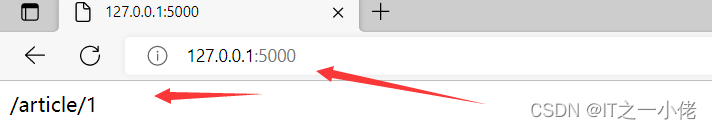

.svg)

# Flask 框架中的页面跳转和重定向

## url_for 函数

### url_for 函数介绍


一般情况下通过一个 URL 就可以执行到某一个函数。

如果反过来，知道一个函数，怎么去获得这个 URL 呢？

url_for 函数就可以帮我们实现这个功能。

> 注意：
>
> - url_for 函数可以接收 1 个及以上的参数，他接收函数名作为第一个参数，接收对应 URL 规则的命名参数
> - 如果还出现其他的参数，则会添加到 URL 的后面作为查询参数。

- **示例代码 1：**

```py
from flask import Flask, request, url_for
 
app = Flask(__name__)
 
 
@app.route('/')
def index():
    return url_for('profile', num=2, name='dgw')
 
 
@app.route('/profile/<int:num>')
def profile(num):
    name = request.args.get('name')
    if not name:
        return f"文件页码为:{num},无书名！"
    else:
        return f"文件页码为:{num},书名为：{name}"
 
 
if __name__ == '__main__':
    app.run(debug=True)
```

- 运行结果：


- **示例代码 2**：

```py
from flask import Flask, url_for
 
app = Flask(__name__)
 
app.config['JSON_AS_ASCII'] = False
 
 
@app.route('/')
def hello_world():
    return url_for('article', id=1)
 
 
@app.route('/article/<id>')
def article(id):
    return f'id {id} article detail'
 
 
if __name__ == '__main__':
    app.run()
```

- 运行结果



- **示例代码 3**：

```py
from flask import Flask, jsonify, url_for
 
app = Flask(__name__)
 
app.config['JSON_AS_ASCII'] = False
 
books = [
    {"id": 1, "name": '三国演义'},
    {"id": 2, "name": '水浒传'},
    {"id": 3, "name": '西游记'},
    {"id": 4, "name": '红楼梦'},
]
 
 
@app.route('/')
def hello_world():
    return 'hello world'
 
 
@app.route('/books/list')
def book_list():
    for book in books:
        book['url'] = url_for("book_detail", book_id=book['id'])
 
    # return books  # 直接返回books会报错的，类型格式不支持
    return jsonify(books)
 
 
@app.route('/book/details/<int:book_id>')
def book_detail(book_id):
    for book in books:
        if book_id == book['id']:
            return book
    return f"id:{book_id}的图书不存在！"
 
 
if __name__ == '__main__':
    app.run()
```

- 运行结果：


### 为什么使用 url_for 函数

> **问题：**
>
> 为什么选择 url_for 而不选择直接在代码中拼 URL ?
>
> **回答：**
>
> 1. 将来如果修改了 URL ，但没有修改该 URL 对应的函数名，就不用到处去替换 URL 了
> 2. url_for() 函数会转义一些特殊字符和 unicode 字符串，这些事情 url_for 会自动的帮我们

**技巧**

- *在定义 url 的时候，一定要记得在最后加一个斜杠。*
- *如果不加斜杠，那么在浏览器中访问这个 url 的时候，如果最后加了斜杠，那么就访问不到。这样用户体验不太好。*
- *搜索引擎会将不加斜杠的和加斜杠的视为两个不同的 url。而其实加和不加斜杠的都是同一个 url，那么就会给搜索引擎造成一个误解。加了斜杠，就不会出现没有斜杠的情况。*

- **示例代码:**

```py
from flask import Flask, url_for
 
app = Flask(__name__)
 
 
@app.route('/')
def index():
    return url_for('login', next='/')  # 会自动的将/编码，不需要手动去处理。
 
 
@app.route('/login/')
def login():
    return "登录成功"
 
 
if __name__ == '__main__':
    app.run(debug=True)
```

- 运行结果:


## 重定向 redirect 函数

### 重定向分类

重定向分为 *永久性重定向* 和 *暂时性重定向*，在页面代码操作中就是浏览器会从一个页面自动跳转到另外一个页面。比如用户访问了一个需要权限的页面，但是该用户当前并没有登录，因此应该给他重定向到登录页面。

#### **永久性重定向**

 http 的状态码是 301，多用于旧网址被废弃了要转到一个新的网址确保用户的访问。

比如：你输入 www.jingdong.com 的时候，会被重定向到 www.jd.com ，因为 jingdong.com 这个网址已经被废弃了，被改成 jd.com。

所以这种情况下应该用永久重定向。

#### **暂时性重定向**

http 的状态码是 302, 表示页面的暂时性跳转。比如：访问一个需要权限的网址，如果当前用户没有登录，应该重定向到登录页面，这种情况下，应该用暂时性重定向。

### flask 中重定向

重定向是通过 redirect(location, code = 302) 这个函数来实现的, location 表示需要重定向到的 URL, 应该配合 url_for() 函数来使用，code 表示采用哪个重定向，默认是 302 也即 暂时性重定向, 可以修改成 301 来实现永久性重定向。

- **示例代码1:**

```py
from flask import Flask, redirect, url_for
 
app = Flask(__name__)
 
 
@app.route('/')
def index():
    login_url = url_for('login')
    return redirect(login_url)
 
 
@app.route('/login')
def login():
    return '这是登陆页面'
 
 
if __name__ == '__main__':
    app.run(debug=True)
```


- **示例代码2:**

```py
from flask import Flask, request, redirect, url_for
 
app = Flask(__name__)
 
 
@app.route('/')
def login():
    return 'login'
 
 
@app.route('/profile/')
def profile():
    name = request.args.get('name')
    if not name:
        return redirect('http://www.baidu.com', code=301)  # 注意：如果这儿直接写www.baidu.com是不能实现重定向的，是url的拼接
    else:
        return redirect(url_for('login'))
 
 
if __name__ == '__main__':
    app.run(debug=True)
```

**运行结果：** 

请求：http://127.0.0.1:5000/profile


请求：http://127.0.0.1:5000/profile?name=123


- **示例代码3:**

```py
from flask import Flask, url_for, request, redirect
 
app = Flask(__name__)
 
 
@app.route('/')
def index():
    # return redirect('www.baidu.com')  # 这是一种错误写法
    return redirect('https://www.baidu.com')
 
 
if __name__ == '__main__':
    app.run()
```

运行结果:


- **示例代码4:**

```py
from flask import Flask, url_for, request, redirect
 
app = Flask(__name__)
 
 
@app.route('/userinfo')
def user_info():
    user_id = request.args.get('id')
    if user_id:
        return "欢迎进入用户中心"
    else:
        return redirect(url_for('login'))
 
 
@app.route('/login')
def login():
    return '请登录用户名！'
 
 
if __name__ == '__main__':
    app.run()
```

运行结果:


