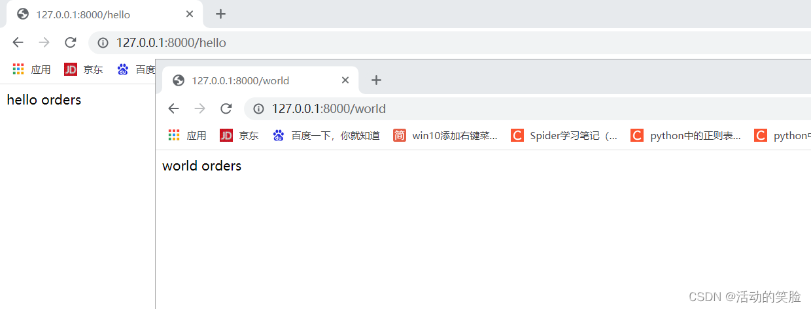

# Flask——蓝图的定义和基本使用方法

本文讲述Flask蓝图的使用，蓝图就是一个存储操作路由映射方法的容器，主要用来实现客户端请求和URL相互关联的功能。 在Flask中，使用蓝图可以帮助我们实现模块化应用的功能，这里先举一个小例子，新建**main.py**文件，内容如下：

```py
from flask import Flask

app = Flask(__name__)

@app.route("/")
def start():
    return "This is the beginning"

@app.route("/hello")
def one():
    return "hello main"


@app.route("/world")
def two():
    return "world main"

if __name__ == '__main__':
    print(app.url_map)
    app.run(debug=True, host="127.0.0.1", port=8000)
```

可以看到上面的程序的接口都写在同一文件中，这样会导致程序看起来臃肿，蓝图的作用可以将接口进行分类，使用蓝图首先创建**orders.py**文件，内容如下：

1. 创建一个蓝图的对象

```py
from flask import Blueprint

# 创建一个蓝图的对象，蓝图就是一个小模块的抽象的概念
app_orders = Blueprint("app_orders", __name__)
```

2. 利用蓝图对象定义具体的视图函数

```py
# 利用蓝图对象定义具体的视图函数
@app_orders.route("/hello")
def one():
    return "hello orders"


@app_orders.route("/world")
def two():
    return "world orders"
```

3. 然后在**main.py**文件中注册蓝图：

```py
# 注册蓝图
app.register_blueprint(app_orders)
```

完整代码如下：

main.py文件：

```py
from flask import Flask
# 导入蓝图模块
from orders import app_orders

app = Flask(__name__)

# 注册蓝图
app.register_blueprint(app_orders)

@app.route("/")
def start():
    return "This is the beginning"

if __name__ == '__main__':
    print(app.url_map)
    app.run(debug=True, host="127.0.0.1", port=8000)
```

orders.py文件：

```py
from flask import Blueprint

# 创建一个蓝图的对象，蓝图就是一个小模块的抽象的概念
app_orders = Blueprint("app_orders", __name__)

# 利用蓝图对象定义具体的视图函数
@app_orders.route("/hello")
def one():
    return "hello orders"


@app_orders.route("/world")
def two():
    return "world orders"

```

运行效果如下：

