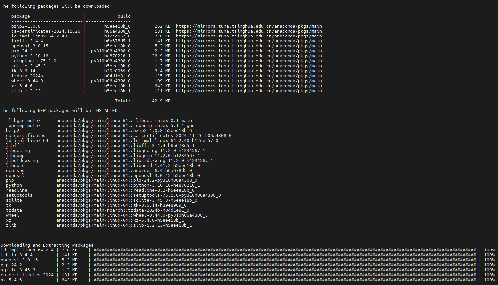
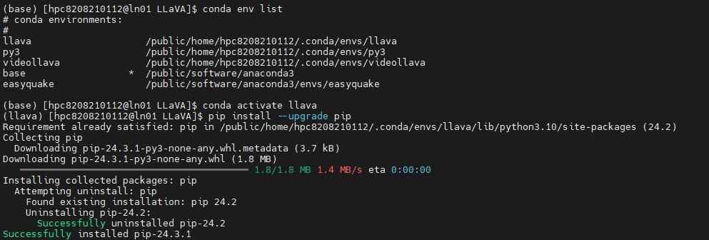
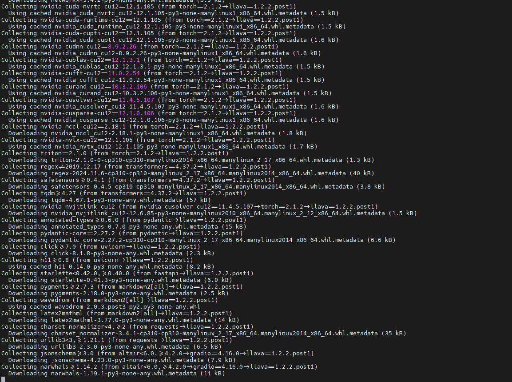

## Install

1. Clone this repository and navigate to LLaVA folder

```
git clone https://github.com/haotian-liu/LLaVA.git
cd LLaVA
```


2. Install Package

```
conda create -n llava python=3.10 -y
conda activate llava
pip install --upgrade pip  # enable PEP 660 support
pip install -e .
```








3. Install additional packages for training cases

```
pip install -e ".[train]"
pip install flash-attn --no-build-isolation
```


### Upgrade to latest code base

```
git pull
pip install -e .

# if you see some import errors when you upgrade,
# please try running the command below (without #)
# pip install flash-attn --no-build-isolation --no-cache-dir
```