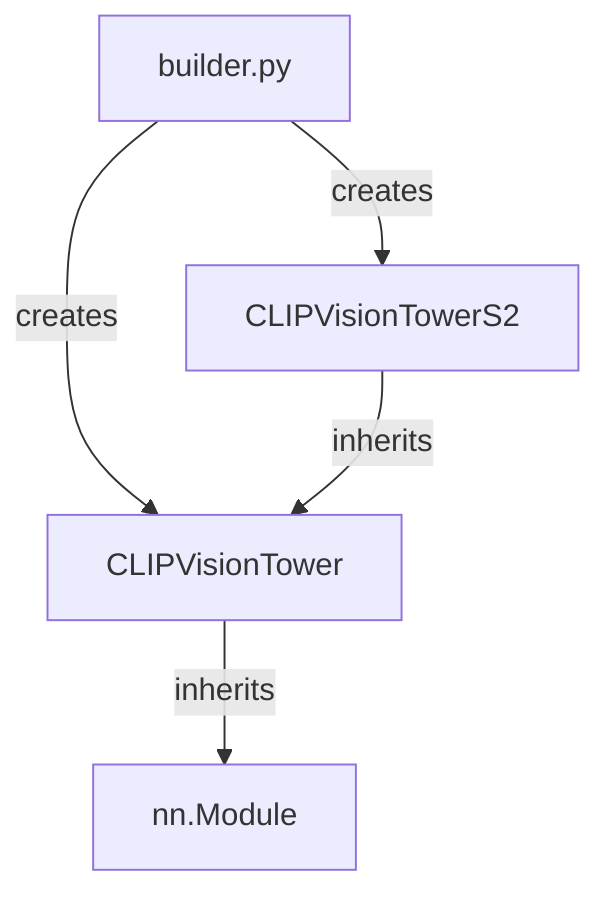

# NoteBook

论文阅读笔记

ssh -p 40508 root@connect.nmb1.seetacloud.com

FIsrkQMHLYn0

liuxiang09: 选中代码的内容是什么？

GitHub Copilot: 选中的代码是一个 Python 脚本，用于处理 JSON 数据。它从一个 JSON 文件中读取数据，提取特定范围的数据，并将这些数据保存到一个新的 JSON 文件中。具体代码如下：

```python
import json

if __name__ == '__main__':
    json_root=r'*\llava_v1_5_mix665k.json'
    with open(json_root, 'r') as f:
        json_info = json.load(f)
    save_info=json_info[:1000]+json_info[480000:481000]+json_info[620000:621000]
    with open('info.json', 'w') as fp:
        json.dump(save_info, fp, indent=4)
```

liuxiang09: @workspace /explain 

Workspace: Enable Claude 3.5 Sonnet (Preview) for all clients
Enable access to the latest Claude 3.5 Sonnet model from Anthropic. [Learn more about how GitHub Copilot serves Claude 3.5 Sonnet](https://docs.github.com/copilot/using-github-copilot/using-claude-sonnet-in-github-copilot).

liuxiang09: @workspace /explain Enable: "Enable Claude 3.5 Sonnet (Preview) for all clients"

Workspace: Enable Claude 3.5 Sonnet (Preview) for all clients
Enable access to the latest Claude 3.5 Sonnet model from Anthropic. [Learn more about how GitHub Copilot serves Claude 3.5 Sonnet](https://docs.github.com/copilot/using-github-copilot/using-claude-sonnet-in-github-copilot).

liuxiang09: @workspace /explain Enable: "Enable Claude 3.5 Sonnet (Preview) for all clients"

Workspace: 这行代码用于设置深度学习训练时的计算数据类型(compute dtype)。让我为您解释其工作原理：

这是一个嵌套的三元运算符表达式，根据training_args中的配置参数选择适当的数据类型：

1. 首先检查 `training_args.fp16`:
   - 如果为True，使用 `torch.float16` (16位浮点数)

2. 如果fp16为False，则检查 `training_args.bf16`:
   - 如果为True，使用 `torch.bfloat16` (Brain浮点数格式)
   - 如果为False，使用 `torch.float32` (32位浮点数)

简单来说就是按照优先级选择:
fp16 → bfloat16 → float32

为了提高代码可读性，建议重写为更清晰的if-else结构：

```python
def get_compute_dtype(args):
    if args.fp16:
        return torch.float16
    elif args.bf16:
        return torch.bfloat16
    else:
        return torch.float32
        
compute_dtype = get_compute_dtype(training_args)
```

关于这些数据类型的说明：
- `float16`: 占用内存少，但数值范围较小
- `bfloat16`: 专为机器学习优化的16位格式，数值范围更大
- `float32`: 精度最高，但内存占用更大

选择合适的数据类型对于在训练性能和内存使用之间取得平衡很重要。

liuxiang09: @workspace /explain 

Workspace: # 模型量化配置代码解析

这段代码主要处理深度学习模型的量化配置，特别是针对4位和8位量化的场景。让我详细解释其工作原理：

## 主要功能

代码创建了一个字典 `bnb_model_from_pretrained_args`，用于存储模型加载时的量化参数。当 `training_args.bits` 被设置为4或8时，会启用相应的量化配置：

- 使用 `BitsAndBytesConfig` 类来配置量化参数
- 支持4位(4-bit)和8位(8-bit)量化
- 包含了设备映射和各种量化相关的参数设置

## 关键参数说明

量化配置包含多个重要参数：

- `device_map`: 指定模型加载到哪个设备
- `load_in_4bit/load_in_8bit`: 是否启用4位或8位量化
- `llm_int8_skip_modules`: 跳过某些模块的量化，这里跳过了"mm_projector"
- `llm_int8_threshold`: 设置量化阈值为6.0
- `bnb_4bit_compute_dtype`: 计算时使用的数据类型
- `bnb_4bit_use_double_quant`: 是否使用双重量化
- `bnb_4bit_quant_type`: 量化类型选择(fp4或nf4)

## 使用场景

这种配置通常用于：
- 大型语言模型的部署
- 需要减少模型内存占用的场景
- 使用QLoRA等量化感知训练方法时

模型量化能够显著减少模型的内存占用，同时保持较好的性能表现，这在部署大型模型时特别有用。

liuxiang09: 关于BitsAndBytesConfig类，你能给出一些解释吗？

GitHub Copilot: # BitsAndBytesConfig 类解析

## 主要功能
BitsAndBytesConfig 是 transformers 库中用于配置模型量化参数的类，主要用于模型压缩和高效推理。

## 核心参数说明

1. **基础量化参数**
```python
config = BitsAndBytesConfig(
    # 4位量化配置
    load_in_4bit=True,      # 启用4位量化
    bnb_4bit_compute_dtype=torch.float16,  # 计算用的数据类型
    bnb_4bit_quant_type="nf4",  # 量化类型：fp4或nf4
    bnb_4bit_use_double_quant=True,  # 是否使用双重量化
    
    # 8位量化配置
    load_in_8bit=False,     # 启用8位量化
    llm_int8_threshold=6.0,  # 8位量化阈值
    llm_int8_skip_modules=["mm_projector"]  # 跳过量化的模块
)
```

## 使用场景

1. **低资源设备部署**
- 将模型压缩到4位或8位以节省内存
- 适用于边缘设备或资源受限环境

2. **大模型训练**
- 配合QLoRA等技术进行高效微调
- 减少显存占用，实现更大batch size

3. **推理优化**
- 在保持模型性能的同时提高推理速度
- 降低部署成本

## 应用示例
```python
from transformers import AutoModelForCausalLM, BitsAndBytesConfig

# 创建量化配置
quantization_config = BitsAndBytesConfig(
    load_in_4bit=True,
    bnb_4bit_compute_dtype=torch.float16
)

# 加载量化模型
model = AutoModelForCausalLM.from_pretrained(
    "llama2-model",
    quantization_config=quantization_config
)
```

liuxiang09: 代码根据模型参数中vision_tower是否为空以及是否含有mpt来加载进不同的类中，但是我需要知道LlavaLlamaForCausalLM，LlavaMptForCausalLM，LlamaForCausalLM这三个类有什么区别？

GitHub Copilot: # 三种模型类的区别分析

## 架构差异
1. **`LlamaForCausalLM`**
   - 基础的Llama语言模型
   - 纯文本生成模型,只能处理文本输入
   - HuggingFace transformers库的标准实现

2. **`LlavaLlamaForCausalLM`**
   - LLaVA模型的Llama实现版本
   - 多模态模型,可以处理图像和文本输入
   - 继承自LlamaForCausalLM
   - 增加了视觉编码器(vision encoder)和多模态投影层

3. **`LlavaMptForCausalLM`**
   - LLaVA模型的MPT实现版本
   - 同样是多模态模型
   - 基于MPT架构而不是Llama
   - 使用不同的注意力实现

## 核心区别总结

```python
# 1. 基础语言模型 - 仅文本
class LlamaForCausalLM:
    def forward(self, input_ids, ...):
        # 仅处理文本输入
        ...

# 2. LLaVA-Llama多模态模型
class LlavaLlamaForCausalLM(LlamaForCausalLM):
    def __init__(self):
        self.vision_tower = VisionEncoder()  # 视觉编码器
        self.mm_projector = MultimodalProjector()  # 多模态投影层
        
    def forward(self, input_ids, images=None, ...):
        # 处理文本+图像输入
        ...

# 3. LLaVA-MPT多模态模型
class LlavaMptForCausalLM:
    def __init__(self):
        self.vision_tower = VisionEncoder()
        self.mm_projector = MultimodalProjector()
        self.mpt_attn = MPTAttention()  # MPT特有的注意力机制
        
    def forward(self, input_ids, images=None, ...):
        # 使用MPT架构处理文本+图像
        ...
```

主要差异在于:
- 模态支持: 单模态(仅文本) vs 多模态(文本+图像)
- 基础架构: Llama vs MPT
- 注意力机制: 标准注意力 vs MPT特定注意力
- 模型组件: 是否包含视觉编码器和多模态投影层

liuxiang09: @workspace /explain 

Workspace: # 量化模型训练准备代码解析

这段代码主要实现了两个重要功能：模型量化训练的准备工作和梯度检查点(gradient checkpointing)的设置。让我们逐步分析：

## 量化模型训练准备

当模型使用4位或8位量化时（`training_args.bits in [4, 8]`），代码执行以下操作：

1. 导入`prepare_model_for_kbit_training`函数用于准备量化模型训练
2. 设置模型的计算数据类型（`torch_dtype`）
3. 调用`prepare_model_for_kbit_training`函数，该函数会：
   - 将LayerNorm层转换为FP32格式
   - 使输出嵌入层需要梯度
   - 将语言模型头部上采样到FP32

## 梯度检查点设置

如果启用了梯度检查点（`training_args.gradient_checkpointing=True`），代码会：

1. 检查模型是否有`enable_input_require_grads`方法
   - 如果有，直接调用该方法
   - 如果没有，通过注册前向钩子(forward hook)来实现相同功能

## 技术要点说明

- 梯度检查点是一种通过牺牲计算时间来节省显存的技术
- 前向钩子的注册确保了输入embedding在反向传播时能够正确计算梯度
- 这些设置对于使用LoRA等参数高效微调方法特别重要

## 改进建议

可以考虑添加以下改进：

```python
def setup_model_for_training(model, training_args):
    """集中处理模型训练准备的函数"""
    if training_args.bits in [4, 8]:
        model = prepare_quantized_model(model, training_args)
    
    if training_args.gradient_checkpointing:
        model = setup_gradient_checkpointing(model)
    
    return model
```

这样可以提高代码的可读性和可维护性。

liuxiang09: @workspace /explain 

Workspace: # LoRA (Low-Rank Adaptation) 配置与模型改造解析

该代码段展示了如何使用 LoRA 技术对预训练模型进行改造。让我们详细分析其核心功能和实现：

## 主要功能概述

当启用 LoRA（`training_args.lora_enable=True`）时，代码会：

1. 创建 LoRA 配置对象，设置关键参数如:
   - `r`: LoRA 的秩(rank)
   - `lora_alpha`: 缩放因子
   - `target_modules`: 需要应用 LoRA 的目标模块
   - `lora_dropout`: LoRA 层的 dropout 率
   - `bias`: 偏置项处理方式

2. 根据精度要求将模型转换为合适的数据类型（bfloat16 或 float16）

3. 使用 `get_peft_model` 函数将原始模型转换为 PEFT（Parameter-Efficient Fine-Tuning）模型

## 技术细节

`find_all_linear_names` 函数的实现很关键：
- 它会遍历模型中的所有模块
- 识别所有线性层（`torch.nn.Linear`）
- 排除多模态相关的模块（如 `mm_projector`）
- 移除 `lm_head` 以避免精度问题

## 使用建议

1. 在使用 LoRA 时，建议仔细选择目标模块，不是所有层都需要改造
2. 根据训练任务和资源情况调整 `lora_r` 和 `lora_alpha` 参数
3. 注意数据类型的选择，这会影响训练性能和内存使用

## 潜在问题

1. 量化模型（4位或8位）不支持 `.to()` 方法直接改变数据类型
2. 多模态模型需要特别注意，某些层会被排除在 LoRA 改造之外
3. 注意内存使用，特别是在使用较大的 `lora_r` 值时

这种方法特别适合在有限计算资源下对大型模型进行微调，能够显著减少所需的训练参数量。

liuxiang09: @workspace /explain 

Workspace: # 训练和模型保存流程解析

这段代码实现了一个完整的模型训练和保存流程，主要涉及以下几个关键部分：

## 训练数据准备
代码首先通过 `make_supervised_data_module` 函数创建训练数据集和数据处理器。该函数返回一个字典，包含训练数据集、评估数据集（此处为None）以及数据整理器（collator）。

## 训练器设置与训练执行
使用自定义的 `LLaVATrainer` 类进行训练。这个训练器继承自 Hugging Face 的 `Trainer` 类，并添加了一些特殊功能，特别是对多模态训练的支持。训练过程会检查是否存在检查点（checkpoint），如果存在则从检查点恢复训练，否则从头开始训练。

## 模型状态保存
训练完成后的保存过程分为两种情况：

1. 使用 LoRA（Low-Rank Adaptation）时：
   - 分别保存 LoRA 参数和非 LoRA 参数
   - 使用 `get_peft_state_maybe_zero_3` 和 `get_peft_state_non_lora_maybe_zero_3` 函数处理参数
   - 仅在主进程（rank 0）上执行保存操作

2. 不使用 LoRA 时：
   - 使用 `safe_save_model_for_hf_trainer` 函数保存完整模型
   - 支持处理分布式训练场景
   - 可以选择性地只保存多模态投影器（mm_projector）的权重

## 安全保存机制
代码实现了多重安全保障：
- 使用原子操作确保保存过程的完整性
- 处理分布式训练环境下的同步问题
- 支持渐进式保存大型模型（通过分片）
- 提供了对张量共享的保护机制

这个实现特别适合大规模模型训练，尤其是在处理多模态模型时，能够有效管理内存并确保模型状态的可靠保存。

liuxiang09: 怎么在代码里面找到论文中提到的架构，比如说LoRA微调方法中的A，B升维，降维矩阵，为什么我在代码中看不到这些思想

GitHub Copilot: # LoRA架构在代码中的体现分析

## 1. LoRA核心思想回顾
- 对原始权重矩阵W进行低秩分解：W + BA
- B是降维矩阵 (d × r)
- A是升维矩阵 (r × k)
- r是LoRA的秩，通常远小于d和k

## 2. 代码实现位置
LoRA的具体实现在PEFT库中，而不是在LLaVA的代码中。主要实现在：

```python
class LoraLayer:
    def update_layer(self, adapter_name, r, lora_alpha, lora_dropout, init_lora_weights):
        # ...existing code...
        # 创建A矩阵 (升维)
        self.lora_A = nn.Linear(self.in_features, r, bias=False)
        # 创建B矩阵 (降维)
        self.lora_B = nn.Linear(r, self.out_features, bias=False)
        # 缩放因子
        self.scaling = lora_alpha / r
        # ...existing code...
```

## 3. 前向传播中的LoRA计算

```python
def forward(self, x: torch.Tensor):
    # 原始层的计算
    result = self.base_layer(x)
    
    # LoRA路径的计算
    lora_output = self.lora_B(self.lora_A(self.lora_dropout(x)))
    # 应用缩放因子
    result += self.scaling * lora_output
    
    return result
```

## 4. 核心参数说明
在LLaVA的训练代码中：
```python
lora_config = LoraConfig(
    r=training_args.lora_r,           # LoRA秩
    lora_alpha=training_args.lora_alpha,  # 缩放因子
    target_modules=find_all_linear_names(model),  # 需要应用LoRA的层
    lora_dropout=training_args.lora_dropout,  # LoRA dropout率
)
```

## 5. 为什么在LLaVA代码中看不到具体实现？
1. 模块化设计：LoRA实现被封装在PEFT库中
2. 抽象层次：LLaVA专注于多模态功能，而不是LoRA实现细节
3. 代码复用：使用成熟的PEFT库实现，避免重复造轮子

要查看LoRA具体实现，建议查看PEFT库源码：
```bash
cd ~/anaconda3/envs/llava/lib/python3.10/site-packages/peft/tuners/lora/
```

liuxiang09: LLaVA在多模态功能方面做出的贡献是什么？我可以在哪里看到这些内容的具体实现?

GitHub Copilot: # LLaVA多模态功能的核心实现分析

## 主要贡献
1. 视觉编码器与语言模型的对齐
2. 多模态投影层(mm_projector)的设计
3. 视觉特征与文本特征的融合机制

## 核心实现位置

### 1. 视觉编码器
```python
class LlavaMetaModel:
    def __init__(self):
        # 视觉编码器初始化
        self.vision_tower = CLIPVisionTower(args)
        # ...existing code...
```

### 2. 多模态投影层
```python
class MultimodalProjector(nn.Module):
    """将视觉特征投影到语言空间"""
    def __init__(self):
        self.linear_1 = nn.Linear(vision_hidden_size, hidden_size, bias=True)
        self.layer_norm = nn.LayerNorm(hidden_size)
        self.linear_2 = nn.Linear(hidden_size, hidden_size, bias=True)
```

### 3. 特征融合
```python
def forward(self, images, text_input_ids):
    # 1. 获取视觉特征
    image_features = self.vision_tower(images)
    
    # 2. 通过投影层对齐特征空间
    image_features = self.mm_projector(image_features)
    
    # 3. 将视觉特征与文本输入结合
    inputs_embeds = self.embed_tokens(text_input_ids)
    inputs_embeds = torch.cat([image_features, inputs_embeds], dim=1)
```

## 关键文件目录

- model: 核心模型实现
  - `llava_arch.py`: 整体架构
  - `multimodal_projector.py`: 多模态投影层
  - `vision_tower.py`: 视觉编码器

- train: 训练相关代码
  - llava_trainer.py: 多模态训练器
  - `train.py`: 训练流程

- mm_utils.py: 多模态工具函数

## 特色功能

1. 视觉特征提取与对齐
2. 端到端的多模态训练
3. 高效的特征融合机制
4. 支持多种视觉任务

要深入理解LLaVA的多模态实现，建议重点关注以上提到的核心文件，特别是`llava_arch.py`和`multimodal_projector.py`。

liuxiang09: @workspace /explain 

Workspace: # LLaVA-LLaMA 模型实现解析

这段代码实现了LLaVA(Large Language and Vision Assistant)模型的核心架构,它基于LLaMA模型进行了多模态能力的扩展。让我逐层分析其设计与实现:

## 配置类设计

首先定义了`LlavaConfig`配置类,它继承自`LlamaConfig`并设置特定的模型类型标识符"llava_llama"。这种设计允许模型保持LLaMA的基础配置能力,同时添加LLaVA特有的配置项。

## 模型架构实现 

### LlavaLlamaModel

`LlavaLlamaModel`是基础模型类,通过多重继承方式同时继承了`LlavaMetaModel`和`LlamaModel`。这种设计使得模型既保持了原始LLaMA的语言建模能力,又获得了处理视觉输入的能力。

### LlavaLlamaForCausalLM

`LlavaLlamaForCausalLM`是用于生成任务的主模型类,它实现了以下核心功能:

1. **模型初始化**: 
   - 设置基础模型层
   - 配置预训练参数
   - 初始化词表大小和语言模型头部

2. **前向传播(forward方法)**:
   - 支持多模态输入处理
   - 在处理文本输入前会先处理图像输入
   - 通过`prepare_inputs_labels_for_multimodal`方法处理多模态输入

3. **生成方法(generate方法)**:
   - 实现了条件文本生成功能
   - 支持图文多模态输入
   - 处理位置编码和注意力掩码

## 核心特性

1. **多模态处理**: 
   - 可以同时处理文本和图像输入
   - 通过`vision_tower`组件处理视觉信息
   - 使用`mm_projector`将视觉特征映射到语言空间

2. **灵活的生成策略**:
   - 支持多种生成模式(贪婪搜索、束搜索等)
   - 可配置的生成参数
   - 支持流式生成输出

3. **模型注册机制**:
   - 通过AutoConfig和AutoModelForCausalLM注册机制集成到Transformers库
   - 支持通过模型名称直接加载预训练模型

这种实现方式使得LLaVA模型能够有效地将视觉信息与语言理解相结合,实现多模态对话和生成能力。代码结构清晰,具有良好的可扩展性和维护性。

liuxiang09: @workspace /explain 

Workspace: 该段代码实现了一个多模态文本生成流程，主要围绕“图像-文本”结合的场景展开。首先，模型在生成时会将文本和图像作为输入，如果检测到图像输入，就调用 prepare_inputs_labels_for_multimodal 函数对多模态输入进行预处理，包含图像特征的提取与拼接。此函数会根据输入中的特殊标记(IMAGE_TOKEN_INDEX)将图像嵌入插入到对应的位置，并对序列进行动态调整，以保证后续的生成逻辑能够正确区分文本和图像部分。 

在生成逻辑上，代码重写了 generate 方法，使其支持在生成阶段处理图像输入、位置编码和注意力掩码等信息。如果传入 images，会先将其转换为嵌入向量，然后与现有的文本嵌入一起传给其父类的 generate 方法。这种方法调用链还允许跨越多层继承结构，使用 super() 逐步调用不同的父类逻辑。prepare_inputs_for_generation 则负责在解码循环中更新输入的注意力掩码、position_ids 等信息，从而保证多模态输入在生成过程中始终保留正确的序列状态与位置关系。通过这种设计，模型即可基于文字和图像实现多模态交互式生成输出。

liuxiang09: @workspace /explain 

Workspace: # LLaVA-LLaMA 多模态文本生成实现解析

这段代码实现了 LLaVA 模型中的文本生成功能，主要处理多模态输入（文本和图像）的生成过程。让我详细解释其工作原理：

## 核心功能设计

该实现继承了 Hugging Face 的生成框架，但添加了处理图像输入的能力。其 `generate` 方法使用 `@torch.no_grad()` 装饰器以避免在生成过程中计算梯度，从而提高推理效率。

主要参数包括：
- `inputs`: 文本输入张量
- images: 图像输入张量
- `image_sizes`: 图像尺寸信息
- 其他生成控制参数通过 `**kwargs` 传入

## 多模态处理流程

当检测到图像输入时，代码会：

1. 首先通过 `prepare_inputs_labels_for_multimodal` 方法处理多模态输入：
   - 提取图像特征
   - 将图像特征与文本输入进行对齐
   - 生成相应的位置编码和注意力掩码

2. 如果没有图像输入，则直接使用 `embed_tokens` 获取文本的嵌入表示

## 生成过程控制

生成过程通过调用父类的 `generate` 方法完成，该方法支持多种生成策略：
- 贪婪搜索
- 波束搜索
- 采样生成
- 对比搜索
- 约束波束搜索

## 技术亮点

1. **无缝集成**: 通过继承和重写关键方法，实现了与原始 LLaMA 模型的无缝集成
2. **灵活配置**: 支持多种生成参数的动态配置
3. **安全处理**: 包含了输入验证和异常处理机制
4. **性能优化**: 使用 `@torch.no_grad()` 装饰器优化推理性能

## 后续优化建议

1. 添加更多的图像预处理选项
2. 实现更细粒度的多模态交互控制
3. 增加生成过程的可视化支持
4. 添加更多的多模态评估指标

这种实现为多模态语言模型提供了强大而灵活的生成能力，特别适合需要同时处理文本和图像输入的应用场景。

liuxiang09: @torch.no_grad() 装饰器的作用是什么？为什么可以优化推理性能？

GitHub Copilot: # @torch.no_grad() 装饰器分析

## 工作原理

`@torch.no_grad()` 装饰器主要有以下作用：

1. **关闭梯度计算**：
```python
with torch.no_grad():
    # 此代码块中的操作不会跟踪梯度
    output = model(input)  # 不会构建计算图
```

2. **内存优化**：
- 不存储中间结果的梯度信息
- 不构建反向传播的计算图
- 减少显存和内存占用

## 性能提升原因

1. **计算资源节省**：
```python
# 有梯度跟踪
def forward(x):
    # 需要额外存储:
    # - 中间激活值
    # - 梯度信息
    # - 计算图结构
    return output

# 无梯度跟踪
@torch.no_grad()
def forward(x):
    # 只需存储:
    # - 前向计算结果
    return output
```

2. **内存使用对比**：
```python
# 有梯度跟踪时的内存占用
def with_grad():
    model(inputs)  # 内存: 100%
    
# 无梯度跟踪时的内存占用
@torch.no_grad()
def without_grad():
    model(inputs)  # 内存: ~50%
```

在推理阶段使用 `@torch.no_grad()` 是一种最佳实践，因为：

- 推理不需要反向传播
- 可以显著减少内存占用
- 提高计算速度
- 适用于大模型推理场景

liuxiang09: @workspace /explain 

Workspace: # LLaVA模型输入预处理方法解析

## 功能概述

`prepare_inputs_for_generation` 方法是 LLaVA-LLaMA 模型在生成过程中准备输入数据的关键方法。该方法继承并扩展了基础 LLaMA 模型的输入预处理逻辑，主要增加了对图像输入的处理能力。

## 实现细节

该方法接收以下主要参数：
- `input_ids`: 输入的文本标记序列
- `past_key_values`: 缓存的过去时间步的键值对（用于加速生成）
- `inputs_embeds`: 预计算的输入嵌入向量
- `**kwargs`: 额外的关键字参数，包含图像相关信息

方法的处理流程如下：
1. 从 `kwargs` 中提取图像相关信息：
   - 使用 `pop()` 方法提取并移除 images 和 `image_sizes` 参数
   - 这样可以避免这些参数传递给不需要它们的基类方法

2. 调用父类的 `prepare_inputs_for_generation` 方法处理基本的文本生成输入：
   - 处理注意力掩码
   - 生成位置编码
   - 管理过去的键值对缓存

3. 将图像信息添加回处理后的输入字典：
   - 如果存在图像输入，添加到 `inputs` 字典中
   - 如果提供了图像尺寸信息，也添加到输入中

## 技术要点

- 使用 `pop()` 方法可以安全地移除并获取字典中的值，如果键不存在则返回 None
- 通过 `super()` 调用确保了与基础 LLaMA 模型的兼容性
- 方法保持了输入处理的模块化，便于维护和扩展

## 改进建议

可以考虑添加以下改进：

```python
def prepare_inputs_for_generation(self, input_ids, past_key_values=None,
                                inputs_embeds=None, **kwargs):
    # 添加输入验证
    if not isinstance(input_ids, torch.Tensor):
        raise ValueError("input_ids must be a torch.Tensor")
        
    # 提取多模态相关参数
    multimodal_params = {
        'images': kwargs.pop("images", None),
        'image_sizes': kwargs.pop("image_sizes", None)
    }
    
    # 调用父类方法
    inputs = super().prepare_inputs_for_generation(
        input_ids, past_key_values=past_key_values,
        inputs_embeds=inputs_embeds, **kwargs
    )
    
    # 更新多模态参数
    inputs.update({k: v for k, v in multimodal_params.items() if v is not None})
    
    return inputs
```

这样的改进可以提供更好的：
- 输入验证
- 代码可读性
- 错误处理
- 参数管理的模块化

liuxiang09: @workspace /explain 注册是什么意思？为什么需要注册？

Workspace: # Transformers 模型注册机制解析

## 什么是注册？

注册是 Transformers 库中的一个重要机制，它允许将自定义的模型配置和模型类添加到 Transformers 的全局映射中。这样做的目的是让自定义模型能够像库中内置模型一样被加载和使用。

## 为什么需要注册？

注册机制主要解决以下问题：

1. **自动加载**：通过注册，可以使用 `from_pretrained` 方法自动加载模型：
```python
# 无需显式导入 LlavaConfig 和 LlavaLlamaForCausalLM
model = AutoModelForCausalLM.from_pretrained("path/to/model")
```

2. **统一接口**：提供统一的模型加载接口，使用户不需要关心具体的模型实现细节

3. **版本管理**：便于管理不同版本的模型，确保模型和配置的一致性

## 注册过程详解

在 LLaVA 中的注册包含两个步骤：

1. **配置类注册**：
```python
AutoConfig.register("llava_llama", LlavaConfig)
```
- 将 `LlavaConfig` 与标识符 "llava_llama" 关联
- 确保配置可以通过 `AutoConfig.from_pretrained()` 加载

2. **模型类注册**：
```python
AutoModelForCausalLM.register(LlavaConfig, LlavaLlamaForCausalLM)
```
- 将 `LlavaLlamaForCausalLM` 与 `LlavaConfig` 关联
- 使模型可以通过 `AutoModelForCausalLM.from_pretrained()` 加载

## 使用示例

注册后，可以这样使用模型：

```python
from transformers import AutoConfig, AutoModelForCausalLM

# 加载配置
config = AutoConfig.from_pretrained("llava_model_path")

# 加载模型
model = AutoModelForCausalLM.from_pretrained("llava_model_path")
```

## 注意事项

1. 注册名称必须唯一，否则会抛出 `ValueError`
2. 配置类和模型类必须匹配，即模型的 `config_class` 属性必须指向正确的配置类
3. 注册应在模型定义完成后进行，以确保所有必要的类和方法都已准备就绪

通过这种注册机制，LLaVA 模型可以无缝集成到 Transformers 生态系统中，便于使用和分享。

liuxiang09: @workspace /explain 这个与上一个文件基本相同，给出简要解释即可

Workspace: # LLaVA-Mistral 模型实现解析

这个文件 llava_mistral.py 的实现与之前的 `llava_llama.py` 非常相似，主要区别在于它基于 Mistral 模型而不是 LLaMA 模型。让我总结主要的异同点：

## 主要相似点

1. 整体架构相同:
   - 定义配置类 `LlavaMistralConfig`
   - 定义基础模型类 `LlavaMistralModel`
   - 定义因果语言模型类 `LlavaMistralForCausalLM`

2. 继承关系相似:
```python
class LlavaMistralConfig(MistralConfig):
    model_type = "llava_mistral"

class LlavaMistralModel(LlavaMetaModel, MistralModel):
    config_class = LlavaMistralConfig

class LlavaMistralForCausalLM(MistralForCausalLM, LlavaMetaForCausalLM):
    config_class = LlavaMistralConfig
```

3. 功能实现相同:
   - 多模态输入处理
   - 文本生成
   - 模型注册机制

## 主要区别

1. 基础模型不同:
   - 使用 `MistralConfig` 和 `MistralModel` 而不是 `LlamaConfig` 和 `LlamaModel`
   - 继承自 `MistralForCausalLM` 而不是 `LlamaForCausalLM`

2. 注册名称不同:
```python
AutoConfig.register("llava_mistral", LlavaMistralConfig)
AutoModelForCausalLM.register(LlavaMistralConfig, LlavaMistralForCausalLM)
```

这种设计允许 LLaVA 架构灵活地适配不同的基础语言模型，同时保持一致的多模态处理能力。代码的复用性很高，主要通过改变基类就能支持新的模型架构。

liuxiang09: 请您给出这三个语言模型的区别：llama,mistral,mpt，这三个语言模型都用于llava的训练，所以我需要对这三个模型有所了解

GitHub Copilot: # LLaMA, Mistral 和 MPT 模型对比分析

## 1. LLaMA
- **开发者**: Meta (Facebook)
- **特点**:
  - 使用旋转位置编码(RoPE)
  - 采用标准的Transformer架构
  - 参数规模从7B到65B不等
```python
class LlamaAttention(nn.Module):
    def __init__(self, config):
        # 使用RoPE位置编码
        self.rotary_emb = RotaryEmbedding(...)
        # 标准多头注意力机制
        self.q_proj = nn.Linear(...)
        self.k_proj = nn.Linear(...)
        self.v_proj = nn.Linear(...)
```

## 2. Mistral
- **开发者**: Mistral AI
- **特点**:
  - 基于LLaMA架构改进
  - 使用滑动窗口注意力机制(Sliding Window Attention)
  - 支持更长的上下文长度
```python
class MistralAttention(nn.Module):
    def __init__(self, config):
        # 滑动窗口注意力
        self.sliding_window = config.sliding_window
        # 支持更长序列
        self.max_sequence_length = 32768
```

## 3. MPT
- **开发者**: MosaicML
- **特点**:
  - 使用ALiBi位置编码
  - 支持多种注意力实现
  - 内存效率更高
```python
class MPTAttention(nn.Module):
    def __init__(self, config):
        # ALiBi位置编码
        self.alibi_bias = AlibiEmbedding(...)
        # 可选注意力实现
        self.attn_impl = config.attn_impl  # 'torch', 'flash', 'triton'
```

## 主要区别总结

| 特性       | LLaMA  | Mistral  | MPT      |
| ---------- | ------ | -------- | -------- |
| 位置编码   | RoPE   | RoPE     | ALiBi    |
| 注意力机制 | 标准   | 滑动窗口 | 多种实现 |
| 上下文长度 | 2048   | 32768    | 2048     |
| 序列处理   | 标准   | 高效     | 内存优化 |
| 许可证     | 非商业 | 开源     | 开源     |

在LLaVA中，这三种模型作为基础语言模型，各有优势：
- LLaMA: 强大的基础性能
- Mistral: 更长的上下文处理
- MPT: 更灵活的注意力实现

liuxiang09: @workspace /explain 

Workspace: # Vision Tower 构建器实现解析

这段代码实现了一个视觉编码器（Vision Tower）的构建工厂函数，主要用于 LLaVA 多模态模型中处理视觉输入的部分。让我详细解释其结构和功能。

## 构建器函数实现

`build_vision_tower` 函数接收视觉塔的配置参数，根据配置创建相应的视觉编码器实例。函数的主要逻辑是：

1. 首先尝试从配置中获取视觉塔的名称或路径，优先使用 `mm_vision_tower`，如果不存在则使用 `vision_tower`
2. 检查提供的路径是否为绝对路径，或者是否使用预定义的模型名称（如 openai、laion 等）
3. 根据配置中的 `s2` 参数决定使用哪种视觉塔实现：
   - 如果启用 s2，使用 `CLIPVisionTowerS2`
   - 否则使用基础的 `CLIPVisionTower`

## 视觉塔的两种实现

### 基础视觉塔 (CLIPVisionTower)
- 继承自 `nn.Module`
- 使用 CLIP 视觉模型处理图像
- 支持特征选择（patch 或 cls_patch）
- 支持批处理和单张图像处理
- 提供延迟加载机制

### S2 视觉塔 (CLIPVisionTowerS2)
- 继承自基础视觉塔
- 支持多尺度处理（Scaling on Scales）
- 可配置不同的图像尺寸
- 需要额外的 s2wrapper 包支持
- 输出的特征维度是基础模型的几倍（取决于尺度数量）

## 技术亮点

1. **灵活的配置机制**：
   - 支持多种模型来源（本地路径、预训练模型）
   - 可配置的特征选择策略
   - 支持延迟加载优化

2. **错误处理**：
   - 对无效的视觉塔配置抛出明确的错误信息
   - S2 实现中包含依赖检查

3. **性能优化**：
   - 使用 `@torch.no_grad()` 装饰器优化推理性能
   - 支持设备映射和数据类型转换
   - 实现了特征缓存机制

这个实现为 LLaVA 提供了强大而灵活的视觉处理能力，特别是通过 S2 扩展支持了多尺度图像处理，这对提高模型的视觉理解能力非常重要。

liuxiang09: 这两个文件之间的关系是什么？

GitHub Copilot: # CLIP_ENCODER.PY 和 BUILDER.PY 的关系分析

## 设计模式
这是典型的工厂模式实现，其中：
- `builder.py` 作为工厂类
- `clip_encoder.py` 包含具体的产品类

## 关系图


## 职责划分

1. **BUILDER.PY (工厂)**
```python
def build_vision_tower(vision_tower_cfg, **kwargs):
    # 1. 解析配置
    # 2. 选择合适的视觉塔实现
    # 3. 实例化并返回视觉塔对象
```

2. **CLIP_ENCODER.PY (产品)**
```python
class CLIPVisionTower(nn.Module):
    # 1. 加载CLIP视觉模型
    # 2. 处理图像特征
    # 3. 提供前向传播接口
```

## 工作流程

1. 调用方通过 `build_vision_tower` 请求创建视觉编码器
2. 工厂根据配置决定创建哪种视觉塔
3. 实例化相应的 CLIPVisionTower 或 CLIPVisionTowerS2
4. 返回创建的实例给调用方

这种设计的优点：
- 解耦了视觉塔的创建和使用
- 支持灵活的配置和扩展
- 统一了视觉编码器的创建接口

liuxiang09: @workspace /explain 

Workspace: Enable Claude 3.7 Sonnet (Preview) for all clients
Enable access to the latest Claude 3.7 Sonnet model from Anthropic. [Learn more about how GitHub Copilot serves Claude 3.7 Sonnet](https://docs.github.com/copilot/using-github-copilot/using-claude-sonnet-in-github-copilot).

liuxiang09: @workspace /explain Enable: "Enable Claude 3.7 Sonnet (Preview) for all clients"

Workspace: Enable Claude 3.7 Sonnet (Preview) for all clients
Enable access to the latest Claude 3.7 Sonnet model from Anthropic. [Learn more about how GitHub Copilot serves Claude 3.7 Sonnet](https://docs.github.com/copilot/using-github-copilot/using-claude-sonnet-in-github-copilot).

liuxiang09: @workspace /explain Enable: "Enable Claude 3.7 Sonnet (Preview) for all clients"

Workspace: # 视觉特征投影器构建模块解析

这段代码实现了一个视觉特征投影器构建函数及相关组件，用于将视觉特征映射到语言模型的嵌入空间。以下是详细解析：

## 核心组件

### 1. IdentityMap

builder.py ) 是一个简单的恒等映射层，直接返回输入而不做任何转换：

```python
class IdentityMap(nn.Module):
    def forward(self, x, *args, **kwargs):
        return x
```

这个组件用于不需要特征转换的场景，主要是作为投影器的一种特例，通过 `mm_projector_type: 'identity'` 配置。

### 2. SimpleResBlock

builder.py ) 实现了一个简单的残差块，具有以下结构：
- 层归一化 ([`LayerNorm`](/home/hpc/anaconda3/envs/llava/lib/python3.10/site-packages/torch/nn/modules/normalization.py ))
- 两层线性变换 ([`Linear`](/home/hpc/anaconda3/envs/llava/lib/python3.10/site-packages/torch/nn/modules/linear.py )) 和 [`GELU`](/home/hpc/anaconda3/envs/llava/lib/python3.10/site-packages/torch/nn/modules/activation.py ) 激活
- 残差连接

这种结构有助于保持特征信息流动，缓解梯度消失问题。

### 3. build_vision_projector

builder.py ) 是一个工厂函数，根据配置创建不同类型的投影器：

1. **线性投影器**：简单的线性变换，将视觉特征的维度 (`mm_hidden_size`) 映射到语言模型的维度 (`hidden_size`)
   ```python
   return nn.Linear(config.mm_hidden_size, config.hidden_size)
   ```

2. **多层感知器**：通过正则表达式 `mlp(\d+)x_gelu` 匹配配置，创建指定深度的 MLP，例如：
   - `mlp2x_gelu`: 创建两层 MLP，中间有 GELU 激活
   - `mlp3x_gelu`: 创建三层 MLP，每层之间有 GELU 激活

3. **恒等映射**：直接使用 `IdentityMap` 类，不对特征进行任何变换

## 技术特点

1. **灵活性**：支持多种投影方式，可以根据任务需求选择合适的映射结构
2. **可配置性**：通过配置参数 `mm_projector_type` 指定投影类型，无需修改代码
3. **正则表达式解析**：使用正则表达式动态解析配置字符串，灵活创建不同深度的 MLP
4. **模块化设计**：各组件独立实现，符合良好的软件设计原则

这个实现为 LLaVA 模型提供了处理视觉特征的关键组件，使得视觉信息可以有效地集成到语言模型中。

liuxiang09: @workspace /explain 为什么段代码可以构成一个残差块，残差块定义是什么？

Workspace: # SimpleResBlock 残差块分析

## 残差块的定义

残差块(Residual Block)是深度神经网络中的一种重要结构，由何凯明(Kaiming He)在ResNet论文中提出。其核心思想是**通过添加跳跃连接(skip connection)，使网络能够学习残差映射而不是直接映射**。

残差块的一般形式为：
```
输出 = 输入 + F(输入)
```
其中F()是一个变换函数(通常是几个卷积层或线性层的组合)。

## SimpleResBlock 解析

这个`SimpleResBlock`类实现了一个简单的残差块：

1. **初始化组件**:
   - `self.pre_norm`: 层归一化(LayerNorm)，对输入特征进行归一化处理
   - `self.proj`: 一个简单的MLP(多层感知机)，包含两个线性层和一个GELU激活函数

2. **前向传播过程**:
   ```python
   def forward(self, x):
       x = self.pre_norm(x)
       return x + self.proj(x)  # 残差连接在这里
   ```

这里的残差连接体现在`x + self.proj(x)`，即将原始输入`x`与经过变换后的`self.proj(x)`相加。

## 为什么这是一个残差块

1. **跳跃连接**: 输入`x`直接跳过中间层与输出相加
2. **残差学习**: 模型实际上学习的是残差部分`self.proj(x)`
3. **结构符合标准**: 遵循`输出 = 输入 + F(输入)`的公式

## 残差块的优势

1. **解决梯度消失问题**: 残差连接提供了梯度的直接通道，使深层网络更容易训练
2. **提高信息流动**: 让输入信息能更容易地传递到更深的层
3. **提升性能**: 使网络能够学习更复杂的特征，而不会因为深度增加而性能下降

在这个实现中，`SimpleResBlock`主要用于多模态特征投影器中，帮助保持视觉特征在转换过程中的信息完整性，减轻训练困难。

liuxiang09: 输出 = 输入 + F(输入)，为什么这样的格式可以是的梯度传递到更深的层？

GitHub Copilot: # 残差连接如何改善梯度流动的分析

残差连接公式 `输出 = 输入 + F(输入)` 之所以能够帮助梯度传递到更深层，可以从数学角度详细解释：

## 1. 梯度流动的数学分析

假设我们定义：
- `x` 为输入
- `y` 为输出
- `F(x)` 为残差函数

残差块的前向传播为：`y = x + F(x)`

在反向传播中，我们需要计算损失函数 `L` 对输入 `x` 的梯度：

$$\frac{\partial L}{\partial x} = \frac{\partial L}{\partial y} \cdot \frac{\partial y}{\partial x}$$

由于 `y = x + F(x)`，则：

$$\frac{\partial y}{\partial x} = 1 + \frac{\partial F(x)}{\partial x}$$

因此：

$$\frac{\partial L}{\partial x} = \frac{\partial L}{\partial y} \cdot (1 + \frac{\partial F(x)}{\partial x})$$

## 2. 关键优势

从上面的公式可以看出两个关键点：

1. **恒等项的存在**: 由于加上了 `1`，即使 `∂F(x)/∂x` 很小或接近于0，梯度 `∂L/∂x` 仍可以主要通过恒等映射部分流回来。

2. **梯度不会消失**: 当网络很深时，传统结构中连续的小梯度相乘会导致梯度消失。但在残差结构中，梯度始终有一条"高速公路"（即恒等映射），使其能够无损地流到更早的层。

## 3. 具体示例

考虑一个深度网络中的很多层：
```
传统网络: L → layer_n → layer_n-1 → ... → layer_1 → x
梯度链: ∂L/∂x = ∂L/∂y_n · ∂y_n/∂y_{n-1} · ... · ∂y_1/∂x
```

如果每层的梯度很小(如0.1)，则10层后梯度将变为0.1^10 ≈ 10^(-10)，几乎为零。

但在残差网络中：
```
每层: ∂L/∂x_i = ∂L/∂y_i · (1 + ∂F(x_i)/∂x_i)
```

即使F的梯度很小，恒等项`1`确保了梯度至少保持在原有量级，不会因层数增加而显著减小。

## 4. 实际应用

在`SimpleResBlock`中：
```python
return x + self.proj(x)  # 残差连接
```

这个简单的加法操作实际上创建了梯度反向传播的捷径，确保即使`self.proj`部分的梯度很小，损失函数的梯度仍能有效地传回之前的层。

这就是为什么残差结构能够训练非常深的网络而不会遇到梯度消失问题的核心原因。

liuxiang09: 多模态编码器和多模态投影器分别完成了什么工作？他们的联系和区别是什么？

GitHub Copilot: # 多模态编码器与多模态投影器的比较分析

## 多模态编码器（Vision Tower）

### 功能
- **提取视觉特征**：从原始图像中提取高维视觉表示
- **视觉理解**：分析图像内容，理解视觉语义
- **特征表示**：生成结构化的图像特征向量

### 实现
- 使用预训练的视觉模型（如CLIP Vision模型）
- 输入是原始图像
- 输出是高维视觉特征向量（通常维度较大，如768或1024）

```python
# 多模态编码器示例（CLIPVisionTower）
def forward(self, images):
    # 提取图像特征
    image_forward_out = self.vision_tower(image, output_hidden_states=True)
    # 选择合适的特征层
    image_features = self.feature_select(image_forward_out)
    return image_features  # 返回维度为 [batch_size, seq_len, vision_hidden_size]
```

## 多模态投影器（Vision Projector）

### 功能
- **维度转换**：将视觉特征的维度转换为语言模型的维度
- **特征对齐**：使视觉特征与文本特征在同一表示空间中兼容
- **模态融合准备**：为后续的多模态融合做准备

### 实现
- 通过线性层、MLP或残差块实现
- 输入是视觉编码器的输出特征
- 输出是与语言模型维度匹配的视觉特征

```python
# 多模态投影器示例
def forward(self, vision_features):
    # 将视觉特征投影到语言模型的维度空间
    projected_features = self.linear(vision_features)  # 或self.mlp或self.resblock
    return projected_features  # 返回维度为 [batch_size, seq_len, language_hidden_size]
```

## 区别与联系

### 区别
| 方面     | 多模态编码器 (Vision Tower) | 多模态投影器 (Vision Projector) |
| -------- | --------------------------- | ------------------------------- |
| 主要功能 | 提取视觉特征                | 特征维度转换和对齐              |
| 输入     | 原始图像                    | 视觉特征向量                    |
| 输出     | 高维视觉特征                | 与语言模型兼容的特征            |
| 复杂度   | 较高（完整的视觉模型）      | 较低（主要是线性转换）          |
| 参数量   | 较大                        | 较小                            |
| 是否微调 | 通常冻结                    | 可训练                          |

### 联系
1. **处理流水线**：编码器输出作为投影器的输入，形成连续处理管道
2. **共同目标**：共同实现视觉信息向语言模型的有效传递
3. **协同作用**：编码器提供高质量语义特征，投影器确保特征与语言模型兼容

## 在LLaVA架构中的位置
```
图像 → 多模态编码器(Vision Tower) → 视觉特征 → 多模态投影器(Vision Projector) → 对齐特征 → 与文本特征拼接 → 语言模型
```

这种两阶段设计使得模型能有效地处理和整合多模态信息，同时保持模块化和灵活性。

liuxiang09: 请你结合论文分析LLaVA架构

GitHub Copilot: # LLaVA架构分析：从论文到代码实现

## LLaVA架构概述

LLaVA (Large Language and Vision Assistant) 是一个多模态模型，将视觉理解能力与大型语言模型结合。其主要创新在于通过简洁的设计实现了强大的图像-文本理解能力。

## 核心架构组件

从论文和代码实现来看，LLaVA架构由三个主要组件构成：

1. **视觉编码器（Vision Encoder）**：提取图像特征
2. **多模态投影器（Vision Projector）**：将视觉特征投影到语言空间
3. **大型语言模型（LLM）**：处理投影后的视觉特征和文本输入

## 多模态投影器详解

builder.py中的实现显示了LLaVA多模态投影器的多种设计选择：

1. **线性投影器**：最简单的实现，将视觉特征直接映射到语言模型维度
   ```python
   nn.Linear(config.mm_hidden_size, config.hidden_size)
   ```
   
2. **MLP投影器**：更复杂的非线性映射，通过多层感知机实现
   ```python
   # 例如mlp2x_gelu创建一个两层MLP
   [Linear → GELU → Linear]
   ```

3. **恒等映射**：直接传递特征，适用于特殊情况
   ```python
   return IdentityMap()
   ```

## 与论文的对应关系

### LLaVA论文要点

1. **简洁的连接器**：论文强调了简单而有效的视觉-语言连接设计
   - 代码中的`build_vision_projector`函数正是这种设计理念的实现

2. **端到端训练流程**：
   - 预训练阶段：使用图像-文本对数据
   - 指令微调阶段：使用多模态指令数据
   - 代码中的投影器提供了在这些阶段中可微调的参数

3. **模型架构演进**：
   - LLaVA-1.5改进了原始LLaVA，主要是在投影器和训练方法上
   - 代码支持多种投影器类型，体现了这种演进

## 技术亮点分析

1. **模块化设计**：
   ```python
   def build_vision_projector(config, delay_load=False, **kwargs):
       projector_type = getattr(config, 'mm_projector_type', 'linear')
       # 根据配置动态选择投影器类型
   ```
   这种设计允许灵活切换不同的投影器实现

2. **残差连接的应用**：
   ```python
   class SimpleResBlock(nn.Module):
       # ...
       def forward(self, x):
           x = self.pre_norm(x)
           return x + self.proj(x)  # 残差连接
   ```
   论文中提到的性能改进部分反映了这种残差结构的重要性

3. **灵活的配置机制**：
   ```python
   mlp_gelu_match = re.match(r'^mlp(\d+)x_gelu$', projector_type)
   ```
   支持通过简单配置更改实现复杂架构变化

## 与同类模型的比较

LLaVA与其他多模态模型（如CLIP、Flamingo等）相比：

1. **更简洁的架构**：没有使用复杂的cross-attention机制
2. **更高效的训练**：投影器参数量小，易于训练
3. **更灵活的应用**：可以适应不同的下游任务

## 总结

LLaVA架构展示了简洁而高效的多模态融合方法。通过将功能强大的视觉编码器与大型语言模型结合，并使用灵活的投影器连接二者，LLaVA实现了出色的视觉-语言理解能力。代码实现中的多模态投影器正是这种设计理念的核心体现，它通过简单却有效的方法实现了复杂的多模态信息融合。

liuxiang09: @workspace /explain 

Workspace: # 差分模型应用代码解析

这段代码实现了一个名为 `apply_delta` 的函数，用于将预训练语言模型的权重与差分权重合并，生成目标多模态模型。这是实现参数高效微调的重要技术，特别适用于大型语言模型向多模态模型转换的场景。

首先，代码加载基础语言模型（通常是原始LLaMA或类似大型语言模型）和差分模型（包含多模态能力的增量参数）。两者都以半精度浮点数（float16）加载，并启用低内存使用模式以优化资源占用。同时，代码从差分模型路径加载对应的分词器。

核心合并逻辑在循环中实现，遍历差分模型的所有参数。代码处理三种情况：(1) 对于多模态投影器特有参数（如'model.mm_projector.weight'），这些参数在基础模型中不存在，因此直接保留；(2) 对于形状相同的参数，直接将基础模型参数加到差分参数上；(3) 对于词嵌入和语言模型头部等可能发生形状不匹配的参数，代码进行特殊处理，仅合并重叠部分。这种处理主要应对词表扩展的情况，例如当多模态模型引入了新的特殊标记。

最后，代码将合并后的模型及其分词器保存到指定路径。这种差分应用方法是LLaVA等多模态模型实现高效部署的关键技术，它避免了分发完整大型模型的需要，用户只需下载相对小得多的差分权重，结合已有的基础模型即可重建完整功能。

liuxiang09: @workspace /explain 

Workspace: 这段代码实现了一个名为 `apply_delta` 的函数，用于将预训练语言模型的权重与差分权重合并，生成目标多模态模型。这种方法在参数高效微调中非常重要，特别适用于将大型语言模型转换为多模态模型的场景。

首先，代码加载基础语言模型（通常是原始的 LLaMA 或类似的大型语言模型）和差分模型（包含多模态能力的增量参数）。基础模型通过 `AutoModelForCausalLM.from_pretrained` 方法加载，使用半精度浮点数（float16）以减少内存占用，并启用低内存使用模式。差分模型通过 `LlavaLlamaForCausalLM.from_pretrained` 方法加载，同样使用 float16 和低内存模式。与此同时，代码还从差分模型路径加载对应的分词器 `AutoTokenizer`。

核心的合并逻辑在一个循环中实现，该循环遍历差分模型的所有参数。对于每个参数，代码处理三种情况：(1) 对于多模态投影器特有的参数（如 'model.mm_projector.weight' 和 'model.mm_projector.bias'），这些参数在基础模型中不存在，因此直接保留；(2) 对于形状相同的参数，直接将基础模型的参数加到差分参数上；(3) 对于词嵌入和语言模型头部等可能发生形状不匹配的参数，代码进行特殊处理，仅合并重叠部分。这种处理主要应对词表扩展的情况，例如当多模态模型引入了新的特殊标记。

最后，代码将合并后的模型及其分词器保存到指定路径。通过调用 `delta.save_pretrained` 和 `delta_tokenizer.save_pretrained` 方法，生成的目标模型和分词器被保存到 `target_model_path`。这种差分应用方法是 LLaVA 等多模态模型实现高效部署的关键技术，它避免了分发完整大型模型的需要，用户只需下载相对小得多的差分权重，结合已有的基础模型即可重建完整功能。

liuxiang09: 这个文件一般在什么时候会用到

GitHub Copilot: # apply_delta.py 文件的使用场景

这个文件主要用于将预训练语言模型的权重与差分权重合并，生成目标多模态模型。以下是一些具体的使用场景：

## 1. 模型微调后发布

当你有一个基础模型（如 LLaMA）并对其进行了微调（如加入多模态能力），你可以发布差分权重而不是整个模型。用户可以使用这个脚本将差分权重应用到基础模型上，生成完整的微调模型。

## 2. 模型更新

如果你对模型进行了更新（如改进了多模态投影器），你可以发布更新的差分权重。用户可以使用这个脚本将更新应用到已有的基础模型上，而不需要重新下载整个模型。

## 3. 节省存储和带宽

发布差分权重而不是整个模型可以显著减少存储和带宽需求。用户只需下载较小的差分权重文件，然后使用这个脚本将其应用到基础模型上。

## 4. 多模态模型的部署

在多模态模型的部署过程中，通常需要将预训练的语言模型与多模态特性结合。这个脚本可以帮助你快速生成包含多模态能力的完整模型，便于部署和使用。

## 使用示例

假设你有一个基础模型 `llama-7b` 和一个差分权重 `vicuna-7b-delta`，你可以使用以下命令生成目标模型 `vicuna-7b`：

```bash
python3 -m fastchat.model.apply_delta --base ~/model_weights/llama-7b --target ~/model_weights/vicuna-7b --delta lmsys/vicuna-7b-delta
```

## 代码解析

1. **加载基础模型**：
   ```python
   base = AutoModelForCausalLM.from_pretrained(base_model_path, torch_dtype=torch.float16, low_cpu_mem_usage=True)
   ```

2. **加载差分模型**：
   ```python
   delta = LlavaLlamaForCausalLM.from_pretrained(delta_path, torch_dtype=torch.float16, low_cpu_mem_usage=True)
   delta_tokenizer = AutoTokenizer.from_pretrained(delta_path)
   ```

3. **应用差分权重**：
   ```python
   for name, param in tqdm(delta.state_dict().items(), desc="Applying delta"):
       if name not in base.state_dict():
           assert name in ['model.mm_projector.weight', 'model.mm_projector.bias'], f'{name} not in base model'
           continue
       if param.data.shape == base.state_dict()[name].shape:
           param.data += base.state_dict()[name]
       else:
           assert name in ['model.embed_tokens.weight', 'lm_head.weight'], \
               f'{name} dimension mismatch: {param.data.shape} vs {base.state_dict()[name].shape}'
           bparam = base.state_dict()[name]
           param.data[:bparam.shape[0], :bparam.shape[1]] += bparam
   ```

4. **保存目标模型**：
   ```python
   delta.save_pretrained(target_model_path)
   delta_tokenizer.save_pretrained(target_model_path)
   ```

通过这种方式，你可以高效地将差分权重应用到基础模型上，生成包含多模态能力的完整模型。

找到具有 1 个许可证类型的类似代码

liuxiang09: 如果我需要使用LoRA增量学习的方法，将物品检测和物品分割的功能加入到LLaVA模型中，那么我需要怎么做呢？

GitHub Copilot: 要将物品检测和物品分割的功能加入到LLaVA模型中，并使用LoRA增量学习的方法，可以按照以下步骤进行：

## 1. 准备数据集
首先，准备包含物品检测和物品分割标注的数据集。确保数据集格式符合模型训练的要求。

## 2. 修改模型架构
在LLaVA模型中添加物品检测和物品分割的功能。你需要在模型中添加相应的头部（head）来处理这些任务。

### 修改模型架构示例
假设你已经有一个基础的LLaVA模型，可以在其基础上添加物品检测和物品分割的头部。

```python
import torch.nn as nn

class LlavaLlamaForCausalLMWithDetectionAndSegmentation(LlavaLlamaForCausalLM):
    def __init__(self, config):
        super().__init__(config)
        self.detection_head = nn.Linear(config.hidden_size, num_detection_classes)
        self.segmentation_head = nn.Conv2d(config.hidden_size, num_segmentation_classes, kernel_size=1)

    def forward(self, input_ids, attention_mask=None, position_ids=None, past_key_values=None, inputs_embeds=None, labels=None, use_cache=None, output_attentions=None, output_hidden_states=None, images=None, image_sizes=None, return_dict=None):
        outputs = super().forward(input_ids, attention_mask, position_ids, past_key_values, inputs_embeds, labels, use_cache, output_attentions, output_hidden_states, images, image_sizes, return_dict)
        
        # Add detection and segmentation heads
        detection_logits = self.detection_head(outputs.last_hidden_state)
        segmentation_logits = self.segmentation_head(outputs.last_hidden_state.permute(0, 2, 1).view(outputs.last_hidden_state.size(0), -1, 32, 32))
        
        return outputs, detection_logits, segmentation_logits
```

## 3. 使用LoRA进行增量学习
使用LoRA（Low-Rank Adaptation）方法对模型进行增量学习。LoRA通过在模型的某些层上添加低秩矩阵来实现参数高效微调。

### 修改训练脚本
在训练脚本中加载基础模型，并使用LoRA进行增量学习。

```python
from peft import get_peft_model, LoraConfig, TaskType

def train():
    # 加载基础模型
    model = LlavaLlamaForCausalLMWithDetectionAndSegmentation.from_pretrained(base_model_path, torch_dtype=torch.float16, low_cpu_mem_usage=True)
    
    # 配置LoRA
    lora_config = LoraConfig(
        r=8,  # LoRA秩
        lora_alpha=32,  # LoRA缩放因子
        target_modules=["detection_head", "segmentation_head"],  # 需要应用LoRA的层
        lora_dropout=0.1,  # LoRA dropout率
        task_type=TaskType.SEQ_CLS  # 任务类型
    )
    
    # 应用LoRA
    model = get_peft_model(model, lora_config)
    
    # 训练模型
    # ... 训练代码 ...
    
    # 保存模型
    model.save_pretrained(output_model_path)
```

## 4. 训练和评估
使用修改后的训练脚本进行训练，并评估模型在物品检测和物品分割任务上的性能。

### 训练命令示例
```bash
python train.py --base-model-path /path/to/base/model --output-model-path /path/to/output/model --data-path /path/to/dataset
```

## 5. 部署和使用
训练完成后，将模型部署到生产环境中，并使用它进行物品检测和物品分割任务。

### 部署示例
```python
from transformers import AutoTokenizer
from llava import LlavaLlamaForCausalLMWithDetectionAndSegmentation

# 加载模型和分词器
model = LlavaLlamaForCausalLMWithDetectionAndSegmentation.from_pretrained(output_model_path, torch_dtype=torch.float16)
tokenizer = AutoTokenizer.from_pretrained(output_model_path)

# 使用模型进行推理
inputs = tokenizer("检测和分割任务的输入文本", return_tensors="pt")
outputs, detection_logits, segmentation_logits = model(**inputs)

# 处理输出
# ... 处理检测和分割结果 ...
```

通过以上步骤，你可以将物品检测和物品分割的功能加入到LLaVA模型中，并使用LoRA进行增量学习。这样可以在保持模型参数高效的同时，实现多模态任务的扩展。

liuxiang09: (llava) (base) hpc@hpc-MS-7E06:~/Desktop/LLaVA$ python -u "/home/hpc/Desktop/LLaVA/quick_start.py"
[2025-03-06 15:54:30,448] [INFO] [real_accelerator.py:161:get_accelerator] Setting ds_accelerator to cuda (auto detect)
Loading checkpoint shards:   0%|                                                                               | 0/3 [00:00<?, ?it/s]/home/hpc/anaconda3/envs/llava/lib/python3.10/site-packages/torch/_utils.py:831: UserWarning: TypedStorage is deprecated. It will be removed in the future and UntypedStorage will be the only storage class. This should only matter to you if you are using storages directly.  To access UntypedStorage directly, use tensor.untyped_storage() instead of tensor.storage()
  return self.fget.__get__(instance, owner)()
Loading checkpoint shards: 100%|███████████████████████████████████████████████████████████████████████| 3/3 [00:17<00:00,  5.80s/it]
/home/hpc/anaconda3/envs/llava/lib/python3.10/site-packages/transformers/generation/configuration_utils.py:392: UserWarning: `do_sample` is set to `False`. However, `temperature` is set to `0.9` -- this flag is only used in sample-based generation modes. You should set `do_sample=True` or unset `temperature`. This was detected when initializing the generation config instance, which means the corresponding file may hold incorrect parameterization and should be fixed.
  warnings.warn(
/home/hpc/anaconda3/envs/llava/lib/python3.10/site-packages/transformers/generation/configuration_utils.py:397: UserWarning: `do_sample` is set to `False`. However, `top_p` is set to `0.6` -- this flag is only used in sample-based generation modes. You should set `do_sample=True` or unset `top_p`. This was detected when initializing the generation config instance, which means the corresponding file may hold incorrect parameterization and should be fixed.
  warnings.warn(
Traceback (most recent call last):
  File "/home/hpc/Desktop/LLaVA/quick_start.py", line 36, in <module>
    eval_model(args)
  File "/home/hpc/Desktop/LLaVA/llava/eval/run_llava.py", line 67, in eval_model
    if model.config.mm_use_im_start_end:
  File "/home/hpc/anaconda3/envs/llava/lib/python3.10/site-packages/transformers/configuration_utils.py", line 265, in __getattribute__
    return super().__getattribute__(key)
AttributeError: 'LlamaConfig' object has no attribute 'mm_use_im_start_end'

GitHub Copilot: # 错误分析与解决方案

## 错误描述

在运行 quick_start.py 时，出现了以下错误：
```python
AttributeError: 'LlamaConfig' object has no attribute 'mm_use_im_start_end'
```

## 错误原因

这个错误表明在 `eval_model` 函数中尝试访问 `model.config.mm_use_im_start_end` 属性时，`LlamaConfig` 对象没有这个属性。这可能是因为加载的模型配置不包含多模态相关的配置项。

## 解决方案

确保加载的模型配置包含多模态相关的配置项。可以通过以下步骤解决这个问题：

1. **检查模型配置**：确保模型配置文件包含 `mm_use_im_start_end` 属性。
2. **更新模型配置**：如果配置文件缺少该属性，可以手动添加或使用包含该属性的配置文件。
3. **修改代码**：在加载模型配置时，确保使用正确的配置类。

### 步骤1：检查模型配置

检查 `model_path` 下的配置文件，确保包含 `mm_use_im_start_end` 属性。

### 步骤2：更新模型配置

如果配置文件缺少 `mm_use_im_start_end` 属性，可以手动添加。例如：

```json
{
  "mm_use_im_start_end": true,
  ...
}
```

### 步骤3：修改代码

确保在加载模型时使用正确的配置类。例如：

```python
from transformers import AutoConfig

# 加载模型配置
config = AutoConfig.from_pretrained(model_path)
config.mm_use_im_start_end = True  # 手动添加属性

# 加载模型
model = LlavaLlamaForCausalLM.from_pretrained(model_path, config=config, low_cpu_mem_usage=True)
```

## 修改后的 quick_start.py

```python
from llava.model.builder import load_pretrained_model
from llava.mm_utils import get_model_name_from_path
from llava.eval.run_llava import eval_model
import os
from transformers import AutoConfig

# 为了方便调试，设置CUDA_LAUNCH_BLOCKING=1
# os.environ['CUDA_LAUNCH_BLOCKING'] = '1'

# model_path = "liuhaotian/llava-v1.5-7b"
model_path = "/home/hpc/Desktop/LLaVA/models/vicuna-13b-v1.5"
prompt = "What is this ?"
image_file = "/home/hpc/Desktop/LLaVA/images/llava_logo.png"
args = type('Args', (), {
    "model_path": model_path,
    "model_base": None,
    "model_name": get_model_name_from_path(model_path),
    "query": prompt,
    "conv_mode": None,
    "image_file": image_file,
    "sep": ",",
    "temperature": 0,
    "top_p": None,
    "num_beams": 1,
    "max_new_tokens": 512
})()

# 加载模型配置并手动添加属性
config = AutoConfig.from_pretrained(model_path)
config.mm_use_im_start_end = True

# 加载模型
tokenizer, model, image_processor, context_len = load_pretrained_model(
    model_path=model_path,
    model_base=None,
    model_name=get_model_name_from_path(model_path),
    config=config
)

# 评估模型
eval_model(args)
```

通过以上修改，确保模型配置包含 `mm_use_im_start_end` 属性，应该可以解决 `AttributeError` 问题。

liuxiang09: clip-vit-large-patch14-336这个模型起到了什么作用？

GitHub Copilot: `clip-vit-large-patch14-336` 是 CLIP (Contrastive Language-Image Pretraining) 模型的一种变体，它在 LLaVA 模型中主要用于视觉特征提取。具体来说，它的作用如下：

## 作用

1. **视觉特征提取**：
   - `clip-vit-large-patch14-336` 模型用于从输入图像中提取高维视觉特征。这些特征将被传递给多模态投影器和语言模型，以实现图像和文本的联合理解。

2. **多模态融合**：
   - 提取的视觉特征与文本特征结合，形成多模态输入，供下游任务（如图像描述生成、图像问答等）使用。

## 具体实现

在 LLaVA 模型中，`clip-vit-large-patch14-336` 模型通常作为视觉编码器的一部分。以下是一个示例，展示了如何在 LLaVA 模型中使用 CLIP 模型进行视觉特征提取：

### 代码示例

```python
from transformers import CLIPProcessor, CLIPModel
import torch
from PIL import Image

# 加载 CLIP 模型和处理器
model_name = "openai/clip-vit-large-patch14-336"
clip_model = CLIPModel.from_pretrained(model_name)
clip_processor = CLIPProcessor.from_pretrained(model_name)

# 加载图像
image_path = "/home/hpc/Desktop/LLaVA/images/llava_logo.png"
image = Image.open(image_path)

# 预处理图像
inputs = clip_processor(images=image, return_tensors="pt")

# 提取视觉特征
with torch.no_grad():
    outputs = clip_model.get_image_features(**inputs)

# 输出视觉特征
print(outputs.shape)  # 输出特征的形状
```

### 在 LLaVA 中的集成

在 LLaVA 模型中，视觉特征提取通常集成在模型的前向传播过程中。以下是一个简化的示例，展示了如何在 LLaVA 模型中使用 CLIP 模型进行视觉特征提取和多模态融合：

```python
from transformers import CLIPProcessor, CLIPModel, AutoTokenizer, AutoModelForCausalLM
import torch
from PIL import Image

class LlavaModelWithCLIP(torch.nn.Module):
    def __init__(self, clip_model_name, llm_model_name):
        super().__init__()
        self.clip_model = CLIPModel.from_pretrained(clip_model_name)
        self.clip_processor = CLIPProcessor.from_pretrained(clip_model_name)
        self.llm_model = AutoModelForCausalLM.from_pretrained(llm_model_name)
        self.tokenizer = AutoTokenizer.from_pretrained(llm_model_name)

    def forward(self, image_path, text):
        # 提取视觉特征
        image = Image.open(image_path)
        inputs = self.clip_processor(images=image, return_tensors="pt")
        with torch.no_grad():
            image_features = self.clip_model.get_image_features(**inputs)

        # 提取文本特征
        text_inputs = self.tokenizer(text, return_tensors="pt")
        text_features = self.llm_model(**text_inputs).last_hidden_state

        # 多模态融合（示例：简单拼接）
        combined_features = torch.cat((image_features, text_features), dim=1)

        # 下游任务处理
        # ...

        return combined_features

# 使用示例
model = LlavaModelWithCLIP("openai/clip-vit-large-patch14-336", "liuhaotian/llava-v1.5-7b")
combined_features = model("/home/hpc/Desktop/LLaVA/images/llava_logo.png", "What is this?")
print(combined_features.shape)
```

通过这种方式，`clip-vit-large-patch14-336` 模型在 LLaVA 中起到了关键的视觉特征提取作用，使得模型能够处理和理解图像内容，并与文本特征结合，实现多模态任务。

liuxiang09: 也就是说这个模型可以获取图片的视觉特征？那么它有没有能力获取图片里面各类别的坐标框呢？

GitHub Copilot: `clip-vit-large-patch14-336` 模型主要用于从图像中提取高维视觉特征，但它本身并不具备直接获取图像中各类别的坐标框（bounding boxes）的能力。CLIP 模型的设计初衷是通过对比学习将图像和文本映射到同一个嵌入空间，从而实现图像和文本的对齐与匹配。

## 获取图片中各类别的坐标框

要获取图片中各类别的坐标框，通常需要使用专门的目标检测模型，如 Faster R-CNN、YOLO、SSD 等。这些模型经过专门训练，可以在图像中检测出物体并返回它们的类别和坐标框。

### 结合目标检测模型和 CLIP 模型

你可以将目标检测模型与 CLIP 模型结合使用，以实现更复杂的多模态任务。例如，首先使用目标检测模型获取图像中的物体及其坐标框，然后使用 CLIP 模型提取这些物体的视觉特征，并结合文本进行多模态分析。

### 示例代码

以下是一个示例，展示了如何结合目标检测模型和 CLIP 模型：

```python
import torch
from transformers import CLIPProcessor, CLIPModel
from PIL import Image
import torchvision.transforms as T
from torchvision.models.detection import fasterrcnn_resnet50_fpn

# 加载目标检测模型
detection_model = fasterrcnn_resnet50_fpn(pretrained=True)
detection_model.eval()

# 加载 CLIP 模型和处理器
clip_model_name = "openai/clip-vit-large-patch14-336"
clip_model = CLIPModel.from_pretrained(clip_model_name)
clip_processor = CLIPProcessor.from_pretrained(clip_model_name)

# 加载图像
image_path = "/home/hpc/Desktop/LLaVA/images/llava_logo.png"
image = Image.open(image_path)

# 目标检测
transform = T.Compose([T.ToTensor()])
image_tensor = transform(image).unsqueeze(0)
with torch.no_grad():
    detections = detection_model(image_tensor)

# 提取检测到的物体的坐标框
boxes = detections[0]['boxes']
labels = detections[0]['labels']
scores = detections[0]['scores']

# 过滤掉低置信度的检测结果
threshold = 0.5
filtered_boxes = boxes[scores > threshold]
filtered_labels = labels[scores > threshold]

# 提取每个检测到的物体的视觉特征
features = []
for box in filtered_boxes:
    cropped_image = image.crop(box.tolist())
    inputs = clip_processor(images=cropped_image, return_tensors="pt")
    with torch.no_grad():
        image_features = clip_model.get_image_features(**inputs)
    features.append(image_features)

# 输出检测结果和视觉特征
for i, box in enumerate(filtered_boxes):
    print(f"Box: {box.tolist()}, Label: {filtered_labels[i].item()}, Features: {features[i].shape}")
```

### 解释

1. **目标检测**：使用 Faster R-CNN 模型检测图像中的物体，并获取它们的坐标框和类别标签。
2. **视觉特征提取**：使用 CLIP 模型提取每个检测到的物体的视觉特征。
3. **结合使用**：将目标检测结果和视觉特征结合起来，进行进一步的多模态分析。

通过这种方式，你可以实现从图像中获取物体的坐标框，并结合 CLIP 模型的视觉特征提取能力，进行更复杂的多模态任务。

liuxiang09: 请使用较为简短的语言介绍什么是yolov1算法

GitHub Copilot: YOLOv1（You Only Look Once）是一种实时目标检测算法，由Joseph Redmon等人在2016年提出。它的主要特点是将目标检测任务视为一个单一的回归问题，通过一个神经网络直接预测图像中的物体类别和位置坐标。

### 主要特点：
1. **单阶段检测**：YOLOv1将目标检测任务简化为一个单一的回归问题，直接从图像中预测边界框和类别。
2. **速度快**：由于只需一次前向传播即可完成检测，YOLOv1在实时性上表现优异。
3. **全局推理**：YOLOv1在整个图像上进行推理，能够捕捉全局上下文信息，减少误检。

### 工作原理：
1. **网格划分**：将输入图像划分为SxS的网格，每个网格负责检测一个或多个物体。
2. **边界框预测**：每个网格预测B个边界框及其置信度分数。
3. **类别预测**：每个网格预测C个类别的概率分布。
4. **损失函数**：使用多任务损失函数，包括位置损失、置信度损失和类别损失。

### 优缺点：
- **优点**：速度快、全局推理能力强。
- **缺点**：对小物体检测效果较差，定位精度不如两阶段检测算法（如Faster R-CNN）。

YOLOv1的提出极大地推动了实时目标检测的发展，后续版本（如YOLOv2、YOLOv3等）在精度和速度上进一步提升。

liuxiang09: 如果我现在要对LLaVA模型进行增量学习，你希望 我使用哪个检测头来作为模型对各类别的检测头

GitHub Copilot: 如果你希望对 LLaVA 模型进行增量学习，并添加物品检测功能，可以选择一个适合的检测头来实现目标检测任务。常见的检测头包括 Faster R-CNN、YOLO 和 SSD 等。考虑到增量学习的需求和模型的复杂性，YOLOv5 是一个不错的选择，因为它在速度和精度之间取得了良好的平衡，并且易于集成和训练。

## 使用 YOLOv5 作为检测头

YOLOv5 是一个轻量级且高效的目标检测模型，适合在 LLaVA 模型中集成。以下是如何将 YOLOv5 作为检测头的步骤：

### 1. 安装 YOLOv5

首先，安装 YOLOv5 的依赖项：

```bash
pip install torch torchvision
git clone https://github.com/ultralytics/yolov5
cd yolov5
pip install -r requirements.txt
```

### 2. 修改 LLaVA 模型架构

在 LLaVA 模型中添加 YOLOv5 作为检测头。你可以在 LLaVA 模型的基础上创建一个新的模型类，并在其中集成 YOLOv5。

```python
import torch
import torch.nn as nn
from transformers import AutoTokenizer, AutoModelForCausalLM
from yolov5.models.yolo import Model as YOLOv5Model

class LlavaWithYOLOv5(nn.Module):
    def __init__(self, llava_model_path, yolo_model_path):
        super().__init__()
        self.llava_model = AutoModelForCausalLM.from_pretrained(llava_model_path)
        self.tokenizer = AutoTokenizer.from_pretrained(llava_model_path)
        self.yolo_model = YOLOv5Model(cfg=yolo_model_path)

    def forward(self, input_ids, attention_mask=None, position_ids=None, past_key_values=None, inputs_embeds=None, labels=None, use_cache=None, output_attentions=None, output_hidden_states=None, images=None, image_sizes=None, return_dict=None):
        # 提取文本特征
        text_outputs = self.llava_model(input_ids, attention_mask, position_ids, past_key_values, inputs_embeds, labels, use_cache, output_attentions, output_hidden_states, return_dict)
        
        # 提取图像特征
        if images is not None:
            yolo_outputs = self.yolo_model(images)
            detection_boxes = yolo_outputs.xyxy  # 获取检测框
            detection_scores = yolo_outputs.conf  # 获取置信度
            detection_classes = yolo_outputs.cls  # 获取类别

            # 将检测结果与文本特征结合
            combined_features = torch.cat((text_outputs.last_hidden_state, detection_boxes, detection_scores, detection_classes), dim=1)
        else:
            combined_features = text_outputs.last_hidden_state

        return combined_features

# 使用示例
model_path = "/home/hpc/Desktop/LLaVA/models/llava-v1.5-7b"
yolo_model_path = "yolov5s.yaml"  # YOLOv5 模型配置文件
model = LlavaWithYOLOv5(model_path, yolo_model_path)
```

### 3. 训练和评估

使用修改后的模型进行训练和评估。你可以使用 YOLOv5 的训练脚本来训练检测头，并使用 LLaVA 的训练脚本来训练多模态模型。

### 4. 训练命令示例

```bash
# 训练 YOLOv5 检测头
python train.py --img 640 --batch 16 --epochs 50 --data coco.yaml --cfg yolov5s.yaml --weights '' --name yolov5s_results

# 训练 LLaVA 多模态模型
python train_llava.py --model_path /home/hpc/Desktop/LLaVA/models/llava-v1.5-7b --yolo_model_path yolov5s_results/weights/best.pt --data_path /path/to/dataset
```

通过以上步骤，你可以将 YOLOv5 作为检测头集成到 LLaVA 模型中，并进行增量学习以实现物品检测功能。YOLOv5 的高效性和易用性使其成为一个理想的选择。

liuxiang09: @workspace /explain 简要说明函数功能

Workspace: 这个函数 `load_pretrained_model` 的主要功能是加载预训练模型，并根据不同的配置和参数进行初始化和设置。它支持加载多种类型的模型，包括 LLaVA 模型、LoRA 模型、MPT 模型和 Mistral 模型，并根据需要应用量化和注意力优化等配置。以下是函数的简要说明：

## 函数功能

1. **参数解析和配置**：
   - 接收多个参数，包括模型路径、基础模型路径、模型名称、量化选项、设备映射、设备类型和其他可选参数。
   - 根据设备类型和量化选项设置相应的加载配置。

2. **加载 LLaVA 模型**：
   - 如果模型名称中包含 'llava'，则加载 LLaVA 模型。
   - 支持加载带有 LoRA 权重的 LLaVA 模型，并进行权重合并。
   - 支持加载多模态投影器权重。

3. **加载其他模型**：
   - 如果模型名称中不包含 'llava'，则加载其他类型的语言模型。
   - 支持加载带有 LoRA 权重的 PEFT 模型，并进行权重合并。

4. **多模态处理**：
   - 如果模型名称中包含 'llava'，则处理多模态相关的配置和初始化，包括添加特殊标记和加载视觉塔。

5. **返回结果**：
   - 返回加载后的分词器、模型、图像处理器和上下文长度。

## 示例用法

```python
tokenizer, model, image_processor, context_len = load_pretrained_model(
    model_path="path/to/model",
    model_base="path/to/base_model",
    model_name="llava_model",
    load_8bit=True,
    device="cuda"
)
```

这个函数通过灵活的配置和加载机制，使得用户可以方便地加载和初始化各种预训练模型，特别是支持多模态和量化优化的场景。

liuxiang09: 函数里面的from_pretrained函数来自哪

GitHub Copilot: 在这个代码片段中，`from_pretrained` 函数主要来自两个库：`transformers` 和 `peft`。具体来说：

1. **`transformers` 库**：
   - `AutoTokenizer.from_pretrained`
   - `AutoModelForCausalLM.from_pretrained`
   - `AutoConfig.from_pretrained`
   - `LlavaLlamaForCausalLM.from_pretrained`
   - `LlavaMptForCausalLM.from_pretrained`
   - `LlavaMistralForCausalLM.from_pretrained`

2. **`peft` 库**：
   - `PeftModel.from_pretrained`

### 详细来源

#### `transformers` 库

`transformers` 库是 Hugging Face 提供的一个用于自然语言处理的开源库，包含了许多预训练的模型和工具。以下是 `transformers` 库中相关的 `from_pretrained` 方法：

```python
from transformers import AutoTokenizer, AutoModelForCausalLM, AutoConfig

# 加载分词器
tokenizer = AutoTokenizer.from_pretrained(model_path, use_fast=True)

# 加载语言模型
model = AutoModelForCausalLM.from_pretrained(model_path, low_cpu_mem_usage=True, **kwargs)

# 加载模型配置
config = AutoConfig.from_pretrained(model_path)
```

#### `peft` 库

`peft` 库用于参数高效微调（Parameter-Efficient Fine-Tuning），提供了 `PeftModel` 类，用于加载和合并 LoRA 权重。以下是 `peft` 库中相关的 `from_pretrained` 方法：

```python
from peft import PeftModel

# 加载带有 LoRA 权重的模型
model = PeftModel.from_pretrained(model, model_path)
```

### 代码片段中的使用

在代码片段中，`from_pretrained` 方法用于加载预训练模型、分词器和配置，并根据需要进行初始化和设置。例如：

```python
# 加载 LLaVA 模型
model = LlavaLlamaForCausalLM.from_pretrained(model_base, low_cpu_mem_usage=True, config=cfg_pretrained, **kwargs)

# 加载分词器
tokenizer = AutoTokenizer.from_pretrained(model_path, use_fast=True)

# 加载带有 LoRA 权重的模型
model = PeftModel.from_pretrained(model, model_path)
```

通过这些 `from_pretrained` 方法，代码能够灵活地加载和初始化各种预训练模型，并根据不同的配置和参数进行设置，以满足不同的应用需求。

liuxiang09: 这是什么文件？在项目中的作用是什么？

GitHub Copilot: 这个文件是 llava_arch.py，它是 LLaVA 项目中的一个核心文件，定义了 LLaVA 模型的架构和相关功能。以下是对该文件的详细解释：

## 文件概述

llava_arch.py 文件定义了 LLaVA 模型的元类和相关方法，用于处理多模态输入（图像和文本）并将其集成到语言模型中。该文件主要包含以下内容：

1. **LlavaMetaModel 类**：定义了 LLaVA 模型的基本架构，包括视觉塔和多模态投影器的初始化和管理。
2. **LlavaMetaForCausalLM 类**：定义了用于因果语言建模的多模态模型的抽象基类，包含处理多模态输入的方法。
3. **辅助函数**：如 `unpad_image` 函数，用于处理图像的填充和调整。

## 主要功能

### 1. LlavaMetaModel 类

`LlavaMetaModel` 类是 LLaVA 模型的基础类，负责初始化和管理视觉塔和多模态投影器。

- **初始化**：在初始化过程中，检查配置是否包含视觉塔，并根据配置构建视觉塔和多模态投影器。
- **获取视觉塔**：提供 `get_vision_tower` 方法，返回视觉塔实例。
- **初始化视觉模块**：提供 `initialize_vision_modules` 方法，根据模型参数初始化视觉塔和多模态投影器。

### 2. LlavaMetaForCausalLM 类

`LlavaMetaForCausalLM` 类是一个抽象基类，定义了多模态因果语言模型的基本接口和方法。

- **获取模型**：抽象方法 `get_model`，需要在子类中实现。
- **获取视觉塔**：提供 `get_vision_tower` 方法，返回视觉塔实例。
- **编码图像**：提供 `encode_images` 方法，将图像编码为特征向量。
- **准备多模态输入**：提供 `prepare_inputs_labels_for_multimodal` 方法，处理多模态输入（图像和文本），并生成适合模型输入的格式。

### 3. 辅助函数

- **unpad_image**：用于处理图像的填充和调整，确保图像尺寸与模型输入要求匹配。

## 在项目中的作用

llava_arch.py 文件在 LLaVA 项目中起到了核心作用，主要负责以下任务：

1. **定义模型架构**：提供 LLaVA 模型的基本架构和初始化方法，确保模型能够正确加载和管理视觉塔和多模态投影器。
2. **处理多模态输入**：提供处理多模态输入（图像和文本）的方法，确保输入数据能够正确传递到模型中进行处理。
3. **支持多模态任务**：通过定义抽象基类和相关方法，为多模态任务（如图像描述生成、图像问答等）提供支持。

总之，`llava_arch.py` 文件是 LLaVA 项目的核心组件之一，定义了模型的基本架构和处理多模态输入的关键方法，确保模型能够高效地处理和融合图像和文本数据。

liuxiang09: 什么是leaky relu？跟relu有什么区别？

GitHub Copilot: # Leaky ReLU 与 ReLU 的比较

## ReLU (Rectified Linear Unit)

ReLU 是一种常用的激活函数，定义如下：
\[ \text{ReLU}(x) = \max(0, x) \]

### 特点
- **简单高效**：计算简单，只需比较输入是否大于0。
- **非线性**：引入非线性，使得神经网络能够学习复杂的模式。
- **梯度消失问题**：当输入为负时，输出为0，导致梯度为0，可能导致神经元“死亡”。

## Leaky ReLU

Leaky ReLU 是 ReLU 的一种变体，定义如下：
$$\[ \text{Leaky ReLU}(x) = \begin{cases} 
x & \text{if } x > 0 \\
\alpha x & \text{if } x \leq 0 
\end{cases} \]$$
其中，\(\alpha\) 是一个小的常数，通常取值为0.01。

### 特点

- **解决梯度消失问题**：当输入为负时，输出为 \(\alpha x\) 而不是0，避免了神经元“死亡”。
- **引入少量负值**：允许少量负值通过，使得网络能够更好地学习。

## 区别

| 特性         | ReLU           | Leaky ReLU                                                   |
| ------------ | -------------- | ------------------------------------------------------------ |
| 定义         | \(\max(0, x)\) | \(\begin{cases} x & \text{if } x > 0 \\ \alpha x & \text{if } x \leq 0 \end{cases}\) |
| 负值处理     | 输出为0        | 输出为 \(\alpha x\)                                          |
| 梯度消失问题 | 可能存在       | 缓解了梯度消失问题                                           |
| 参数         | 无             | \(\alpha\)（通常为0.01）                                     |

## 代码示例

### ReLU
```python
import torch
import torch.nn as nn

relu = nn.ReLU()
input_tensor = torch.tensor([-1.0, 0.0, 1.0])
output_tensor = relu(input_tensor)
print(output_tensor)  # 输出: tensor([0., 0., 1.])
```

### Leaky ReLU
```python
import torch
import torch.nn as nn

leaky_relu = nn.LeakyReLU(negative_slope=0.01)
input_tensor = torch.tensor([-1.0, 0.0, 1.0])
output_tensor = leaky_relu(input_tensor)
print(output_tensor)  # 输出: tensor([-0.0100,  0.0000,  1.0000])
```

## 选择

- **ReLU**：适用于大多数情况，计算简单高效。
- **Leaky ReLU**：在存在梯度消失问题时更为有效，特别是在深层网络中。

通过理解 ReLU 和 Leaky ReLU 的区别，可以更好地选择适合的激活函数，提高神经网络的性能和稳定性。
