## **RDD****编程**

 

在较高的层次上，每个Spark应用程序都包含一个驱动程序，该程序运行用户的主要功能并在群集上执行各种并行操作。 Spark提供的主要抽象是弹性分布式数据集（RDD），它是跨群集节点分区的元素的集合，可以并行操作。RDD是通过从Hadoop文件系统（或任何其他Hadoop支持的文件系统）中的文件或驱动程序中的现有Scala集合开始并对其进行转换而创建的。用户还可以要求Spark在内存中保留RDD，允许它在并行操作中有效地重用。最后，RDD会自动从节点故障中恢复。

 

### ***\*1 任务概述\****

Ø 了解Spark Python API

Ø 利用Python Spark RDD处理与分析职业能力平台中的数据

 

### ***\*2 任务分析\****

要编写Spark程序，需要在程序中引入Spark API。Spark程序一般称为算子。编写算子的流程是要创建Spark上下文对象，通过上下文对象调用Spark API。

通过API创建好RDD后就需要根据业务进行转换，在转换过程中编写对应的处理逻辑。编写完毕后就可以调用“行动”操作（“行动”操作具体什么后续介绍）API触发程序的执行。计算完毕后将结果存到外部设备，比如文件、数据库等。

综上所述，开发一个Spark应用的流程如图5-1所示。

 

图5-1 开发流程

​	建议读者按照本章行文顺序学习，并按随书源码进行练习，即可掌握Spark开发的具体方法。本章行文顺序如图5-2所示。

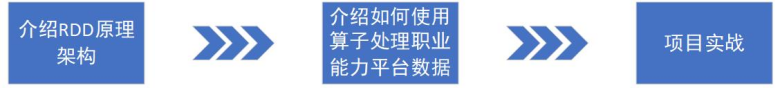 

图5-2 学习路线

### ***\*3 RDD架构原理\****

 

Resilient Distributed DataSet：弹性分布式数据集。如何理解RDD呢？

比如在操作系统中，有N个文件。RDD就可以代表这N个文件在内存中的一种表示。若是在分布式文件系统上，这N个文件存放于不同的机器，RDD仍然可以代表这些不同机器上的文件。

又比如把数据库表的数据加载到内存，在.NET里面，可以用dataset、datatable、list这些对象来装载这批数据；在Java里面，也可以使用HashMap、RecordSet、ArrayList来装载这批数据。

对于存储在普通计算机磁盘上的数据，把它加载到内存，在内存中就有一个对应的类型来进行表示或者有一个容器来装载。对于分布式的文件系统，上面存放的数据加载到内存，同样也有一个容器来装载，这个容器就是RDD。

***\*存放在HDFS，本地磁盘等，以及\*******\*S\*******\*park支持的其他各类数据源，这些数据源进入Sspark之后，就转换为R\*******\*DD\*******\*。\****

弹性分布式数据集(RDD)

spark中很重要的一一个概念RDD(弹性分布式数据集)它是可以执行并行操作且跨集群节点的元素的集合。

弹性分布式数据集：就是指数据对象可以横向扩展，比如某台计算机内存不够，就往磁盘写，或者往集群写，利用集群中机器的内存做存储。

为了让它在整个并行操作中更高效的重用,也许会让Spark persist (持久化)一个RDD到内存中。后, RDD自动的从节点故障中恢复。

RDD support两种类型的操作: transformations (转换) ,它会在一个已存在的 dataset.上创建一个新的dataset,和actions (动作) , 将在dataset.上运行的计算后返回到driver程序.例如，map是-个通过让每个数据集元素都执行-个函数，并返回的新RDD结果的transformation, reducereduce通过执行一些函数, 聚合RDD中所有元素，并将最终结果给返回驱动程序(虽然也有一个并行reduceByKey返回一一个分布式数据集)的action.

***\*Spark中所有的transformations都是lazy (懒加载的) ,因此它不会立刻计算出结果.相反,他们只记得应于一些基本数据集的转换 (例如.文件).只有当需要返回结果给驱动程序时,transformations杆始计算这种设计使Spark的运行更高效\****

***\*R\*******\*DD\*******\*对象分为行动操作\*******\*（\****action***\*）\*******\*与转换操作\*******\*（\****transformations***\*）\****，这些API可以支持常见的数据运算。

转换操作用于描述RDD之间的依赖关系，***\*行动操作会触发计算，得到一个具体的计算结果。\****

行动操作的计算逻辑，就是根据RDD之间的依赖关系来确定的。

行动操作与转换操作的区别是：

转换操作接收一个RDD为参数，并返回一个新的RDD

行动操作接收RDD返回非RDD

 

RDD对象具有如下属性：

Ø RDD是一个由多个分区组成的列表，其中分区是指：集群中一个节点里的一片连续的数据。将数据加载为RDD时，一般会遵循***\*数据的本地性\****，比如数据在哪个节点上，那么对应的RDD的这个分区就存在这个节点上。同时，每个分区上的计算任务，也由该节点承担。

Ø RDD的每个分区上都可以执行函数，也就是函数应用，用作RDD之间分区转换发了。

Ø 为了容错，RDD会记录相互间的依赖，在内存中的RDD操作时出错或丢失会根据依赖进行重算。

Ø 如果是键值对形式的RDD，里面存的数据是key-value形式，用户则可以对这些数据进行重新分区。自定义分区可以将RDD中的数据按key进行重新组合，将相同的key划分到一个分区中。

 

***\*R\*******\*DD\*******\*是分布式对象集合，由分区构成，这些分区是只读的。每个分区存放一个数据集的片段，因为一个数据集可以存在于不同的机器上，因此这些分区就可以存在于不同节点上，从而实现在不同的节点上并行计算数据。\****

***\*由于R\*******\*DD\*******\*的分区是只读的，不能修改，因此只能基于固定的数据集来创建R\*******\*DD\*******\*，或者在其它R\*******\*DD\*******\*上执行转换操作来生成性的R\*******\*DD\*******\*。\****

 

一个RDD转为另一个RDD，那么称前一个RDD为后一个的父RDD，后一个为前一个的子RDD。RDD对象上的依赖关系分为宽依赖于窄依赖。窄依赖是指一个父RDD的一个分区对应一个子RDD的一个分区，或者多个父RDD的一个分区，对应一个子RDD的一个分区。宽依赖就是一个父RDD的一个分区，对应子RDD的多个分区。如图5-3所示，竖线左边就是窄依赖，右边就是宽依赖。

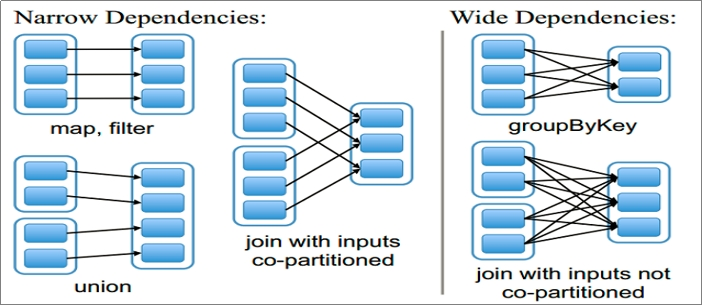 

图5-3 依赖关系

Spark引擎在运行时会根据RDD的依赖关系创建DAG，全称有向无环图。再通过DAG来划分阶段，划分逻辑是：遇到宽依赖就断开，将窄依赖划分到一个阶段中。Spark引擎为每个阶段创建任务。集群中的各个节点获取任务并执行。

 

### ***\*4 RDD编程基础\****

 

#### 4.1 **配置环境**

安装python3.7，并配置环境变量(默认自动添加到path中)

:校验:python

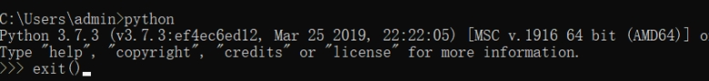 

安装spark包，解压到哪里，哪里就是安装路径。配置环境变量并校验

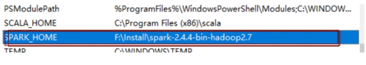 

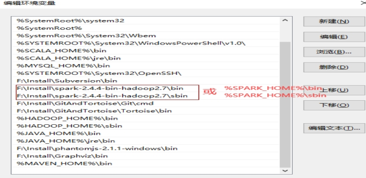 

校验：pyspark，出现如下情况说明版本不匹配(请改用python3.7版本)或者python安装环境变量有问题。

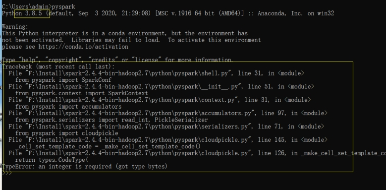 

校验正确如下：

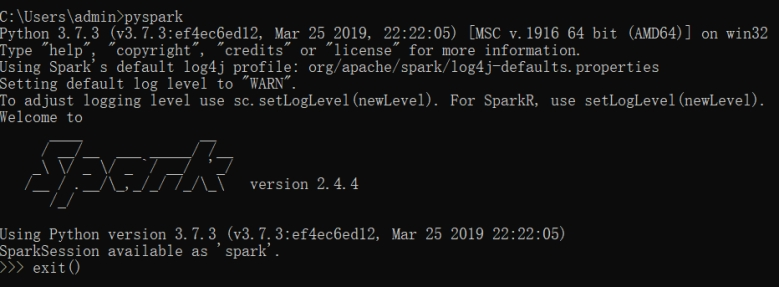 

配置spark开发依赖包

步骤1：选择菜单栏“File”—>“Project Structure ”命令，快捷键为“ctrl+alt+shift+s”打开图5-4所示界面。

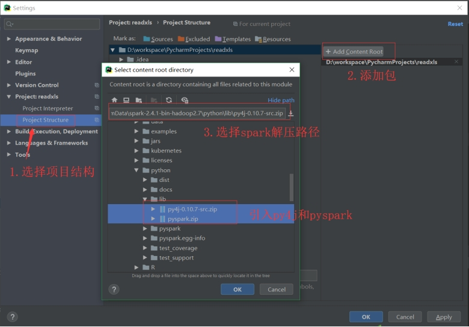 

图5-4 配置项目

​	步骤2：引入spark-core的包，如图5-5所示。

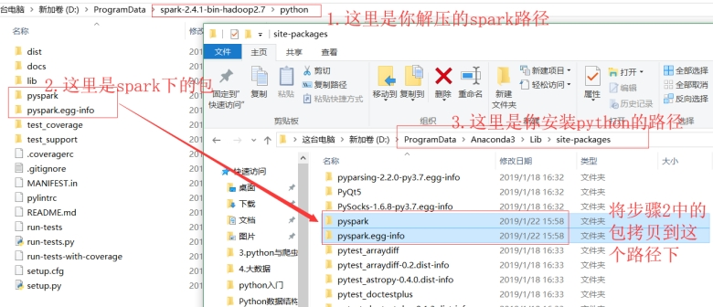 

图5-5 配置Spark库

至此就可以开发Spark程序了。

 

 

#### 4.2 **R****DD****编程**

***\*开发\*******\*S\*******\*park程序的基本流程，就是使用Spark提供的A\*******\*PI\*******\*来创建R\*******\*DD\*******\*、转换R\*******\*DD\*******\*、触发计算、转存计算结果。\****

##### **1.** ***\*创建R\*******\*DD\*******\*方式\****

spark主要就是用来创建RDD和操作RDD，创建RDD两种方式：

###### **1.1 parallelize()方法**

parallelize()方法：并行化，就是讲集合或者列表转换为RDD，一般在测试或者学习的情况使用。

案例

***\*parallelize\*******\*调用SparkContext 的 parallelize()，将一个存在的集合，变成一个RDD，这种方式试用于学习spark和做一些spark的测试\****spark = SparkSession.builder.appName("wordcount").master("local[2]").getOrCreate()sc = spark.sparkContext#案例1：ls = [1, 2, 3, 4, 5, 6, 7, 8, 9]rdd = sc.parallelize(ls)print(type(rdd))print(rdd)print(rdd.collect())rdd1 =rdd.map(lambda x:x*2)print(rdd1.collect()) #案例2：为方便操作集合或者列表，将列表转为RDDlist = ["Hadoop","Spark","Hive","Spark"]rdd = sc.parallelize(list)pairRDD = rdd.map(lambda word : (word,1))pairRDD.foreach(print) 

 

 

 

 

 

 

 

 

 

 

 

 

 

 

 

 

 

 

 

 

 

 

###### **1.2 读取一个外部的数据集**

读取一个外部的数据集，Spark将不同地方的数据源转为统一的rdd格式

例如：从本地加载数据集或者从hdfs文件系统上、hbase,、Amazoo S3 等加载外部数据集。。Spark可以支持文本文件、SequenceFile文件（Hadoop提供的 SequenceFile是一个由二进制序列化过的key/value的字节流组成的文本存储文件）和其他符合Hadoop InputFormat格式的文件。

 

spark = SparkSession.builder.appName("wordcount").master("local[2]").getOrCreate()sc = spark.sparkContext"""从本加载文件数据集,存储到本地"""rdd = sc.textFile("C:/WorkSpace/sparkProject/localfile/test.txt")print(type(rdd))print(rdd.collect())rdd.saveAsTextFile("C:/WorkSpace/sparkProject/localToLocal") """从本加载文件数据集,存储到hdfs"""rdd = sc.textFile("C:/WorkSpace/sparkProject/localfile/test.txt")print(type(rdd))print(rdd.collect())rdd.saveAsTextFile("hdfs://hadoop001:9000/localToHdfs") """从hdfs载文件数据集,存储到本地"""rdd = sc.textFile("hdfs://hadoop001:9000/test.txt")print(type(rdd))print(rdd.collect())rdd.saveAsTextFile("C:/WorkSpace/sparkProject/hdfsToLocal") """从hdfs载文件数据集,存储到HDFS"""rdd = sc.textFile("hdfs://hadoop001:9000/test.txt")print(type(rdd))print(rdd.collect())rdd.saveAsTextFile("hdfs://hadoop001:9000/HdfsToHdfs") 

​    

 

 

 

 

 

 

 

 

 

 

 

 

 

 

 

 

 

 

 

 

 

 

 

 

 

 

 

 

 

 

 

 

 

 

 

 

注意事项：

1.如果使用了本地文件系统的路径，那么，必须要保证在所有的worker节点上，也都能够采用相同的路径访问到该文件，比如，可以把该文件拷贝到每个worker节点上，或者也可以使用网络挂载共享文件系统。

2.textFile()方法的输入参数，可以是文件名，也可以是目录，也可以是压缩文件等。比如，textFile("/usr/local"), textFile("/usr/local/.txt"),  textFile("/usr/local/.gz")

3.textFile()方法也可以接受第2个输入参数（可选），用来指定分区的数目。默认情况下，Spark会为HDFS的每个block创建一个分区（HDFS中每个block默认是128MB）。你也可以提供一个比block数量更大的值作为分区数目，但是，不能提供一个小于block数量的值作为分区数目,那么有些块就不能创建成分区，对应数据就无法计算。

##### **2.** ***\*读取json文件\****

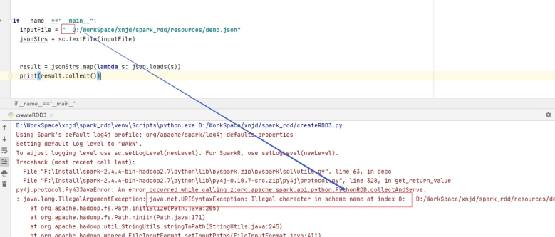 

JSON数据：

{***\*"name"\****: ***\*"\*******\*张国立\*******\*"\****, ***\*"sex"\****: ***\*"\*******\*男\*******\*"\****, ***\*"email"\****: ***\*"zhangguoli@123.com"\****, ***\*"url"\****: ***\*"./img/1.jpg"\****, ***\*"sax"\****: 3400}

{***\*"name"\****: ***\*"\*******\*张铁林\*******\*"\****, ***\*"sex"\****: ***\*"\*******\*男\*******\*"\****, ***\*"email"\****: ***\*"zhangtieli@123.com"\****, ***\*"url"\****: ***\*"./img/2.jpg"\****, ***\*"sax"\****: 3400}

{***\*"name"\****: ***\*"\*******\*猪八戒\*******\*"\****, ***\*"sex"\****: ***\*"\*******\*女\*******\*"\****, ***\*"email"\****: ***\*"zhenjie@123.com"\****, ***\*"url"\****: ***\*"./img/3.jpg"\****, ***\*"sax"\****: 3700}

{***\*"name"\****: ***\*"\*******\*张国立\*******\*"\****, ***\*"sex"\****: ***\*"\*******\*男\*******\*"\****, ***\*"email"\****: ***\*"zhangguoli@123.com"\****, ***\*"url"\****: ***\*"./img/4.jpg"\****, ***\*"sax"\****: 3500}

{***\*"name"\****: ***\*"\*******\*张铁林\*******\*"\****, ***\*"sex"\****: ***\*"\*******\*男\*******\*"\****, ***\*"email"\****: ***\*"zhangtieli@123.com"\****, ***\*"url"\****: ***\*"./img/5.jpg"\****, ***\*"sax"\****: 3500}

{***\*"name"\****: ***\*"\*******\*孙悟空\*******\*"\****, ***\*"sex"\****: ***\*"\*******\*女\*******\*"\****, ***\*"email"\****: ***\*"zhenjie@123.com"\****, ***\*"url"\****: ***\*"./img/6.jpg"\****, ***\*"sax"\****: 3200}

 

***\*import\**** json***\*from\**** pyspark.sql.session ***\*import\**** SparkSession spark = SparkSession.builder.appName(***\*"demo"\****).master(***\*"local[2]"\****).getOrCreate()sc = spark.sparkContext ***\*if\**** __name__==***\*"__main__"\****: inputFile = ***\*"D:/WorkSpace/xnjd/spark_rdd/resources/demo.json"\**** jsonStrs = sc.textFile(inputFile) result = jsonStrs.map(***\*lambda\**** s: json.loads(s)) print(result.collect())

 

### ***\*5 RDD的分类及应用\****

***\*5.1 RDD的分类\****

Transfermation:懒操作即转换操作，用于描述RDD之间的依赖关系，接收一个RDD作为参数，转换为新的RDD    

Action：行动操作，用来触发计算，得到一个具体的结果，行动操作的计算逻辑就是根据RDD之间的依赖关系来确定的。

 

***\*常用的转换操作（Transformation API）Transfermation算子\****

**Ø** ***\*textFile()：读取数据--文件数据转换为spark的统一的基本的运行单位-格式rdd\****

**Ø** ***\*map(func)：将每个元素传递到函数func中，并将结果返回为一个新的数据集\****

**Ø** ***\*reduceByKey(func)：应用于(K,V)键值对的数据集时，返回一个新的(K, V)形式的数据集，其中的每个值是将每个key传递到函数func中进行聚合\****

**Ø** ***\*groupByKey()：应用于(K,V)键值对的数据集时，返回一个新的(K, Iterable)形式的数据集\****

**Ø** ***\*keys()\****

**Ø** ***\*values()\****

**Ø** ***\*sorteByKey()\****

**Ø** ***\*mapValues()\****  

**Ø** ***\*join()\****

**Ø** ***\*filter(func)：筛选出满足函数func的元素，并返回一个新的数据集\****

**Ø** ***\*flatMap(func)：与map()相似，但每个输入元素都可以映射到0或多个输出结果\****

 

**Ø** ***\*常用的行动操作（Action API）\****

**Ø** ***\*count() 返回数据集中的元素个数\****

**Ø** ***\*collect() 以数组的形式返回数据集中的所有元素\****

**Ø** ***\*first() 返回数据集中的第一个元素\****

**Ø** ***\*take(n) 以数组的形式返回数据集中的前n个元素\****

**Ø** ***\*reduce(func) 通过函数func（输入两个参数并返回一个值）聚合数据集中的元素\****

**Ø** ***\*foreach(func) 将数据集中的每个元素传递到函数func中运行\****

 

 

#### **5.2 RDD的应用**

**1、*****\*构建Pair RDD\****

***\*什么是Pair RDD\**** 

　　　***\*（1）包含键值对类型的RDD被称作Pair RDD。\****

　　　***\*（2）Pair RDD通常用来进行聚合计算。\****

　　　***\*（3）Pair RDD通常由普通RDD做ETL转换而来。\****

**from** pyspark.sql **import** SparkSession**if** __name__ == **"__main__"**:  spark = SparkSession.builder.appName(**"wordcount"**).master(**"local[2]"**).getOrCreate()  sc = spark.sparkContext  **"""**  **创建Pair RDD****什么是Pair RDD****？**   **包含key-vaule键值对类型的RDD就****称****为Pair RDD**   **Pair RDD通常用来对数据进行聚合计算**   **Pair RDD通过普通RDD转换来的，例如：**   **通过map构建一个Pair RDD**     **"""**  案例1：  *# context = sc.textFile("C:/WorkSpace/sparkProject/localfile/test.txt")*  *# #将每一行的数字作为key值，每行的数据作为value，构建pairRDD*  *# pairRDD = context.map(lambda line:(line.split(" ")[0],line))*  *# print(pairRDD.count())*  案例2：  context = sc.textFile(**"C:/WorkSpace/sparkProject/localfile/word.txt"**)  *#将每一行的数字作为key值，每行的数据作为value，构建pairRDD*  pairRDD = context.map(**lambda** word:(word,1))  tmp_list = pairRDD.collect()  print(type(tmp_list))  **def** fun(x):    print(x)  [ fun(i) **for** i **in** tmp_list] 

 

 

 

 

 

 

 

 

 

 

 

 

 

 

 

 

 

 

 

 

 

 

 

 

 

 

 

 

 

 

**2、*****\*reduceByKey()\****

​     ***\*是\*******\*使\*******\*用一个相关函数\*******\*来\*******\*合并相同key值的vlaues的\*******\*一个算子\****

***\*主干是：reduceByKey是个算子/函数\****

***\*那么这就基本奠定了reduceByKey的作用域是key-value类型的键值对，并且是只对每个key的value进行处理，如果含有多个key的话，那么就对多个values进行处理。这里的函数是我们自己传入的，那么举个例子：\****

   ***\*x = sc.parallelize(Array(("a", 1), ("b", 1), ("a", 1),("a", 1), ("b", 1), ("b", 1),("b", 1), ("b", 1)), 3)\****

***\*x.reduceByKey((pre, after) => (pre + after))\****

***\*该函数用于将RDD[K,V]中每个K对应的V值根据映射函数来运算。\****

***\*用于对每个key对应的多个value进行merge操作，最重要的是它能够在本地先进行merge操作，并且merge操作可以通过函数自定义：\****

***\*def reduceByKey(func: (V, V) => V): RDD[(K, V)]\****

***\*def reduceByKey(func: (V, V) => V, numPartitions: Int): RDD[(K, V)]\****

***\*def reduceByKey(partitioner: Partitioner, func: (V, V) => V): RDD[(K, V)]\****

***\*参数numPartitions用于指定分区数：参数partitioner用于指定分区函数\****

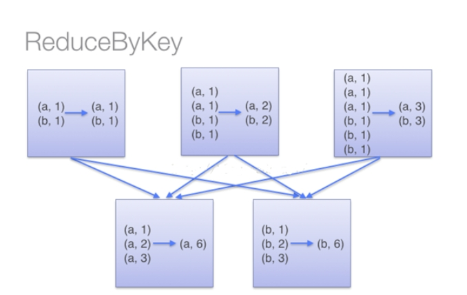 **from** pyspark.sql **import** SparkSession**if** __name__ == **"__main__"**:  spark = SparkSession.builder.appName(**"wordcount"**).master(**"local[2]"**).getOrCreate()  sc = spark.sparkContext  **"""**  **reduceByKey()**   **是使用一个相关函数来合并相同key值的vlaues的一个算子**  **"""** *#*案例1 nums= sc.parallelize(((1, 2), (3, 4), (3, 6)))  sumCount = nums.reduceByKey(lambda x, y: x + y)   print(sumCount.collect()) *#*案例2  ls=[**"java"**,**"pthon"**,**"java"**,**"java"**,**"bigdata"**,**"pthon"**,**"java"**,**"C"**,**"C"**,**"python"**,**"bigdata"**,**"java"**]  data = sc.parallelize(ls)  pairRDD= data.map(**lambda** x:(x,1))#a,b表示pairRDD元素的值  wordCount=pairRDD.reduceByKey(**lambda** a,b:a+b)  rsList=wordCount.collect()  print(rsList)  def fun(x):   print(x)  [fun(i) for i in rsList]

 

  

 

 

 

 

 

 

 

 

 

 

 

 

 

 

 

 

 

 

 

**3、*****\*groupByKey()按照key值分组\****

**from** pyspark.sql **import** SparkSession**if** __name__ == **"__main__"**:  spark = SparkSession.builder.appName(**"wordcount"**).master(**"local[2]"**).getOrCreate()  sc = spark.sparkContext  **"""**  **groupByKey() 是按照key值进行分组,例如：**  **ls = ["java", "pthon", "java", "java", "bigdata", "python", "java", "C", "C", "python", "bigdata", "java"]**  **按key分组，结果是下面形式**  **[("java",[1, 1, 1, 1, 1])，("bigdata",[1, 1])，("python",[1, 1])，("C",[1, 1])]**  **"""**  ls = [**"java"**, **"pthon"**, **"java"**, **"java"**, **"bigdata"**, **"python"**, **"java"**, **"C"**, **"C"**, **"python"**, **"bigdata"**, **"java"**]  data = sc.parallelize(ls)  pairRDD = data.map(**lambda** x: (x, 1))  groupRdd=pairRDD.groupByKey()  tmp_list=groupRdd.collect()  print(tmp_list)  print(len(tmp_list))  **def** fun(x):    print(x[0])    print(type(x[1]))    result =list(x[1])    print(result)    **for** i **in** result:      print(i)    print(**"\*"***60)  [fun(i) **for** i **in** tmp_list]

 

 

 

 

 

 

 

 

 

 

 

**4、*****\*Keys\*******\*()\*******\*与\*******\*values()\****

用来取出rdd中所有key值，存储到一个集合

用来取出rdd中所有value值，存储到一个集合

 

**from** pyspark.sql **import** SparkSession**if** __name__ == **"__main__"**:  spark = SparkSession.builder.appName(**"wordcount"**).master(**"local[2]"**).getOrCreate()  sc = spark.sparkContext  **"""**  **keys() 是取rdd中所有的key值，存储到一个列表中**  **Values****() 是取rdd中所有的****value****值，存储到一个列表中**  **ls = ["java", "pthon", "java", "java", "bigdata", "python", "java", "C", "C", "python", "bigdata", "java"]**  **"""****#案例**  ls = [**"java"**, **"pthon"**, **"java"**, **"java"**, **"bigdata"**, **"python"**, **"java"**, **"C"**, **"C"**, **"python"**, **"bigdata"**, **"java"**]  data = sc.parallelize(ls)  pairRDD = data.map(**lambda** word: (word, 1))  newPairRDD=pairRDD.reduceByKey(**lambda** x,y:x+y)  print(newPairRDD.collect())  keysRDD= newPairRDD.keys()  valuesRDD=newPairRDD.values()  keys_list =keysRDD.collect()  values_list =valuesRDD.collect()  print(keys_list)  print(values_list) 

 

 

 

 

 

 

 

 

 

 

 

 

 

 

 

 

 

 

 

 

 

 

 

 

 

 

 

 

**5、*****\*mapValues\****

**from** pyspark.sql **import** SparkSession**if** __name__ == **"__main__"**:  spark = SparkSession.builder.appName(**"wordcount"**).master(**"local[2]"**).getOrCreate()  sc = spark.sparkContext  **"""**  **mapValues() 是是对所有的value进行操作**   **ls = ["java", "pthon", "java", "java", "bigdata", "python", "java", "C", "C", "python", "bigdata", "java"]**  **"""**  ls = [**"java"**, **"pthon"**, **"java"**, **"java"**, **"bigdata"**, **"python"**, **"java"**, **"C"**, **"C"**, **"python"**, **"bigdata"**, **"java"**]  data = sc.parallelize(ls)  pairRDD = data.map(**lambda** word: (word, 1))  reduceRDD=pairRDD.reduceByKey(**lambda** x,y:x+y)  mapValuesRDD=reduceRDD.mapValues(**lambda** a:100+a)  rs_list=mapValuesRDD.collect()  print(rs_list)

 

 

 

 

 

**6、*****\*sorteByKey\****

**from** pyspark.sql **import** SparkSession**if** __name__ == **"__main__"**:  spark = SparkSession.builder.appName(**"wordcount"**).master(**"local[2]"**).getOrCreate()  sc = spark.sparkContext  **"""**  **sortByKey() 是对所有数据按key值进行排序**  **ls = ["java", "pthon", "java", "java", "bigdata", "python", "java", "C", "C", "python", "bigdata", "java"]**  **"""**  ls = [**"java"**, **"pthon"**, **"java"**, **"java"**, **"bigdata"**, **"python"**, **"java"**, **"C"**, **"C"**, **"python"**, **"bigdata"**, **"java"**]  data = sc.parallelize(ls)  pairRDD = data.map(**lambda** word: (word, 1))  reduceRDD=pairRDD.reduceByKey(**lambda** x,y:x+y)  sorteRDD =reduceRDD.sortByKey()  rs_list=sorteRDD.collect()  print(rs_list)

 

 

 

 

 

 

 

 

 

 

 

 

 

 

 

 

 

 

 

**7、*****\*sortBy\****

 

 

 

 

 

 

 

 

 

 

**8、*****\*Join\****

**from** pyspark.sql **import** SparkSession**if** __name__ == **"__main__"**:  spark = SparkSession.builder.appName(**"wordcount"**).master(**"local[2]"**).getOrCreate()  sc = spark.sparkContext  **"""**  **join()**   **"""**  ls1 = [**"java"**, **"python"**, **"java"**, **"java"**, **"bigdata"**, **"python"**, **"java"**, **"C"**]  ls2 = [**"C"**, **"python"**, **"C"**, **"java"**, **"bigdata"**, **"python"**, **"bigdata"**, **"C"**]   rdd1= sc.parallelize(ls1)  rdd2= sc.parallelize(ls2)  pairRDD1 = rdd1.map(**lambda** word:(word,1))  pairRDD2 = rdd2.map(**lambda** word:(word,1))  newPairRDD =pairRDD1.join(pairRDD2)  rs_list =newPairRDD.collect()  print(rs_list)  print(len(rs_list))

 

 

 

 

 

 

 

 

 

 

 

 

 

 

 

 

 

 

 

 

 

 

 

### ***\*6\**** ***\*持久化\****

上传一个文件到hdfs

hdfs dfs -put ./README.md /input1

***\*使用持久化的原因案例：\******from** pyspark.sql **import** SparkSession**if** __name__ == **"__main__"**:  spark = SparkSession.builder.appName(**"wordcount"**).master(**"local[2]"**).getOrCreate()  sc = spark.sparkContext  textFile=sc.textFile(**"C:/WorkSpace/sparkProject/localfile/test.txt"**)  print(textFile.collect())  filterRDD= textFile.filter(**lambda** line:**"Spark"** **in** line)  print(filterRDD.collect())  counter =filterRDD.count()  print(counter)  first_line =textFile.first()  print(first_line)

 

 

 

 

 

 

 

 

 

 

 

 

 

 

 

如上，spark会进行两次重头到尾的计算操作。可以通过持久化（缓存）机制避免这种重复计算的开销。可以***\*使用persist()\****方法对一个RDD***\*标记为持久化\****，之所以说是***\*标记为持久化\****，是因为出现persist()语句的地方，并***\*不会马上计算生成RDD并把它持久化\****，而是要等到***\*遇到第一个行动操作触发真正计算\****以后，才***\*会把计算结果进行持久化，持久化后的RDD将会被保留在计算节点的内存中\*******\*，\*******\*被后面的行动操作重复使用。\****

 

***\*persist():\*******\*持久化级别参数\****

1、persist(MEMORY_ONLY)：表示将RDD作为反序列化的对象存储于JVM中，如果内存不足，则数据可能就不会进行持久化。那么下次对这个RDD执行算子操作时，那些没有被持久化的数据，需要从源头处重新计算一遍。这是默认的持久化策略，使用cache()方法时，会调用persist(MEMORY_ONLY)实际就是使用的这种持久化策略

2、persist(MEMORY_AND_DISK)：表示将RDD作为反序列化的对象存储在JVM中，如果内存不足，超出的分区将会被存放在硬盘上。下次对这个RDD执行算子时，持久化在磁盘文件中的数据会被读取出来\

3、persist(MEMORY_ONLY_SER)：会将RDD中的数据进行序列化，RDD的每个partition会被序列化成一个字节数组。这种方式更加节省内存，从而可以避免持久化的数据占用过多内存导致频繁GC。 

4、persist(MEMORY_AND_DISK_SER)：唯一的区别是，会将RDD中的数据进行序列化，RDD的每个partition会被序列化成一个字节数组。这种方式更加节省内存，从而可以避免持久化的数据占用过多内存导致频繁GC。

5、persist(DISK_ONLY):将数据全部写入磁盘文件中。

MEMORY_ONLY_2,MEMORY_AND_DISK_2，对于上述任意一种持久化策略，如果加上后缀_2，代表的是将每个持久化的数据，都复制一份副本，并将副本保存到其他节点上。这种基于副本的持久化机制***\*主要用于进行容错。\****假如某个节点挂掉，节点的内存或磁盘中的持久化数据丢失了，那么后续对RDD计算时还可以使用该数据***\*在其他节点上的副本\****。如果没有副本的话，就只能将这些数据从源头处重新计算一遍了。

  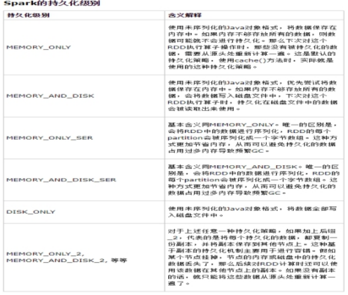

 

### ***\*7\**** ***\*分区\****

RDD是弹性分布式数据集，通常RDD很大，会被分成很多个分区，分别保存在不同的节点上。***\*RDD分区的一个分区原则是使得分区的个数尽量等于集群中的CPU核心（core）数目\****。对于不同的Spark部署模式而言（本地模式、Standalone模式、YARN模式、Mesos模式），都可以***\*通过设置spark.default.parallelism（conf/spark-default.conf）\****这个参数的值，来配置默认的分区数目，一般而言：

Ø 本地模式：默认为本地机器的CPU数目，若设置了local[N],则默认为N

Ø Apache Mesos：默认的分区数为8

Ø Standalone或YARN：在“集群中所有CPU核心数目总和”和“2”二者中取较大值作为默认值

 

tmp_lisy = [1,2,3,4,5]

rdd = sc.parallelize(tmp_lisy,2) #设置两个分区

对于parallelize而言，如果没有在方法中指定分区数，则默认为spark.default.parallelism。指定了，就取：min(defaultParallelism,2)

如果是从HDFS中读取文件，则分区数为文件分片数(比如，hadoop2.x 128MB/片)

 

### ***\*8\**** ***\*共享变量\****

在默认情况下，Spark在集群的多个不同节点上的多个任务上，并行运行一个函数时，它会把函数中涉及到的每个【变量】，在每个任务上都生成一个副本。但是，有时候，需要在多个任务之间共享变量，或者在任务（Task）和任务控制节点（Driver Program）之间共享变量。为了满足这种需求，Spark提供了两种类型的变量：广播变量（broadcast variables）和累加器（accumulators）。广播变量用来把变量在所有节点的内存之间进行共享。累加器则支持在所有不同节点之间进行累加计算（比如计数或者求和）

 

##### ***\*1\*******\*.\**** ***\*广播变量\****

 

广播变量允许程序开发人员在每个机器上缓存一个【只读】的变量，而不是为机器上的每个任务都生成一个副本。

两种实用的场景：

Ø 跨机器、跨阶段等并行计算的情况下的任务需要相同的数据

Ø 不用序列化进行缓存的数据

 

**from** pyspark.sql **import** SparkSession**if** __name__ == **"__main__"**:  spark = SparkSession.builder.appName(**"wordcount"**).master(**"local[2]"**).getOrCreate()  sc = spark.sparkContext  **"""**  **广播变量：用于每个计算节点上多个任务可以共享的变量**  **"""**  ls =[1,2,3,4,5,6,7,8,9]  broadcastRDD =sc.broadcast(ls)  print(broadcastRDD.value)

 

在此之后，不能使用ls，只能使用broadcastRDD r，避免在集群重复分发ls同时，ls不能再修改。

 

##### ***\*2\*******\*.\**** ***\*累加器\****

 

累加器是仅仅被相关操作累加的变量，通常可以被用来实现计数器（counter）和求和（sum）。Spark原生地支持数值型（numeric）的累加器，可以编写对新类型的支持。如果创建累加器时指定了名字，则可以在Spark UI界面看到，这有利于理解每个执行阶段的进程。一个数值型的累加器，可以通过调用SparkContext.accumulator()来创建。运行在集群中的任务，就可以使用add方法来把数值累加到累加器上，但是，这些任务只能做累加操作，不能读取累加器的值，只有任务控制节点可以使用value方法来读取累加器的值。

**from** pyspark.sql **import** SparkSession**if** __name__ == **"__main__"**:  spark = SparkSession.builder.appName(**"wordcount"**).master(**"local[2]"**).getOrCreate()  sc = spark.sparkContext  **"""**   **累加器：SparkContext.accumulator()来创建，使用add方法来把数值累加到累加器上，**   **使用value方法来读取累加器的值**  **"""**  ls = [1, 2, 3, 4, 5, 6, 7, 8, 9]  lsRDD=sc.parallelize(ls)  addRDD=sc.accumulator(0)  lsRDD.foreach(**lambda** x:addRDD.add(x))  print(addRDD.value) 

 

### RDD编程综合运用

 

##### **1.** ***\*数据集概述\****

 

在这个环节中，我们要将前面学习的api结合案例进行综合运用。

实例背景： 商品分别在天猫和京东平台上的销售情况。

商品信息：

1001	戴尔笔记本

1002	联想笔记本

1003	华硕笔记本

1004	神州笔记本

1005	小米笔记本

1006	华为笔记本

1007	三星笔记本

1008	微软笔记本

1009	微星笔记本

1010	雷神笔记本

1011	宏碁笔记本

1012	机械革命

 

 

 

 

 

 

京东销售量（jd.txt）：

1001	京东	9600

1002	京东	9400

1003	京东	5000

1004	京东	5000

1005	京东	9400

1006	京东	8000

1007	京东	9000

1008	京东	9400

1009	京东	8400

1010	京东	8600

1011	京东	7900

1012	京东	9100

 

天猫销售量(tianmao.txt)：

1001	天猫	9000

1002	天猫	9400

1003	天猫	5000

1004	天猫	9900

1005	天猫	9000

1006	天猫	9400

1007	天猫	5000

1008	天猫	9300

1009	天猫	8900

1010	天猫	7800

1011	天猫	9100

1012	天猫	8400

##### **2.** ***\*导入数据集\****

 

hdfs dfs -mkdir /product

 

##### **3.** ***\*查询销量前3名\****

 

from pyspark.sql import SparkSession if __name__ == "__main__":  spark = SparkSession.builder.appName("wordcount").master("local[2]").getOrCreate()  sc = spark.sparkContext  tianmao =sc.textFile("hdfs://hadoop001:9000/product/tm.txt")  print(tianmao.collect())  jingdong=sc.textFile("hdfs://hadoop001:9000/product/jd.txt")  print(jingdong.collect())   def handleLine(line):    infos =line.split("\t")    return infos[0],infos[1],int(infos[2])  tmRDD = tianmao.map(lambda line:handleLine(line))  jdRDD = jingdong.map(lambda line:handleLine(line))   """  使用sorteBy排序，可以指定按照那个值排序，指定升序降序。  按照value降序排序  """  sorte_tmRDD=tmRDD.sortBy(lambda x:x[2],False)  print(sorte_tmRDD.collect())  sorte_jdRDD=jdRDD.sortBy(lambda x:x[2],False)  print(sorte_jdRDD.collect())   """  使用take方法取出数组中前n个数据  """  tm_data=sorte_tmRDD.take(3)  jd_data=sorte_jdRDD.take(3)   [print(x) for x in tm_data]  [print(x) for x in jd_data]

 

 

##### **4.** ***\*输出销量大于9\*******\*000\*******\*的商品id\****

from pyspark.sql import SparkSession if __name__ == "__main__":  spark = SparkSession.builder.appName("wordcount").master("local[2]").getOrCreate()  sc = spark.sparkContext  tianmao =sc.textFile("hdfs://hadoop001:9000/product/tm.txt")  jingdong=sc.textFile("hdfs://hadoop001:9000/product/jd.txt")   def handleLine(line):    infos =line.split("\t")    return infos[0],infos[1],int(infos[2])  tmRDD = tianmao.map(lambda line:handleLine(line))  print(tmRDD.collect())  jdRDD = jingdong.map(lambda line:handleLine(line))  print(jdRDD.collect())   #过滤满足条件的数据。  filter_tmRDD=tmRDD.filter(lambda x:x[2]>9000)  filter_jdRDD=jdRDD.filter(lambda x:x[2]>9000)  #然后把id单独输出  id_tmRDD =filter_tmRDD.map(lambda info:info[0])  id_jdRDD =filter_jdRDD.map(lambda info:info[0])   #对重复数据去重  dist_tmRDD=id_tmRDD.distinct()  dist_jdRDD=id_jdRDD.distinct()   #输出id  reasult_tm=dist_tmRDD.collect()  reasult_jd=dist_jdRDD.collect()  [print(x) for x in reasult_tm]  [print(x) for x in reasult_jd] 

 

##### **5.** ***\*输出每个商品的总销量\****

 

from pyspark.sql import SparkSessionif __name__ == "__main__":  spark = SparkSession.builder.appName("wordcount").master("local[2]").getOrCreate()  sc = spark.sparkContext  tianmao =sc.textFile("hdfs://hadoop001:9000/product/tm.txt")  jingdong=sc.textFile("hdfs://hadoop001:9000/product/jd.txt")   def handleLine(line):    infos =line.split("\t")    return infos[0],int(infos[2])  """  1001	京东	9600  1001	天猫	9600  1001	天猫	9600  """  tmPairRDD = tianmao.map(lambda line:handleLine(line))  jdPairRDD = jingdong.map(lambda line:handleLine(line))   """  联合RDD，方法是union(rdd参数)  join和union的区别：  join求的是两个中的交集  union求的是两个中的并集  """   union_RDD=tmPairRDD.union(jdPairRDD)  print(union_RDD.collect())   #数据聚合。按照key值进行对value值的聚合  data_RDD=union_RDD.reduceByKey(lambda x,y:x+y)   #rs_list =data_RDD.collect()  data_RDD.foreach(print)

 

 

 

##### **6.** ***\*输出每个商品在两个平台的平均销量\****

 

 

from pyspark import SparkConf, SparkContextfrom pyspark.sql import SparkSession if __name__ == "__main__":  spark = SparkSession.builder.appName("wordcount").master("local[2]").getOrCreate()  sc = spark.sparkContext   # conf = SparkConf()  # conf.setAppName("wordcount")  # conf.setMaster("spark://hadoop001:7077")  # conf.set("spark.executor.menory","1g")  # conf.set("spark.executor.cores","2")  # sc = SparkContext(conf=conf)   tianmao = sc.textFile("hdfs://hadoop001:9000/product/tm.txt")  jingdong = sc.textFile("hdfs://hadoop001:9000/product/jd.txt")   def handleLine(line):    infos = line.split("\t")    return infos[0], int(infos[2])   tmPairRDD = tianmao.map(lambda line: handleLine(line))  jdPairRDD = jingdong.map(lambda line: handleLine(line))   union_RDD = tmPairRDD.union(jdPairRDD)  print(union_RDD.collect())	  # 对每个value进行操作，记录当前key的出现次数1表示一次  createCombiner = (lambda value: (value, 1))	# 若是key已经出现过，调动此方法  mergeValue = (lambda merge1, sale: (merge1[0] + sale, merge1[1] + 1))	# 经过前两步之后进行第3步：所有key的对应值的总和和所有key的出现次数  mergeGroup = (lambda merge1, merge2: (merge1[0] + merge2[0], merge1[1] + merge2[1]))   data = union_RDD.combineByKey(createCombiner, mergeValue, mergeGroup)   print(data.collect())   def average(x):    product = x[0]    sale = x[1][0]    count = x[1][1]    return (product, sale / count)   result = data.map(lambda x:average(x))   result.foreach(print)	

 

10 拓展提高

经过上文的介绍，相信读者已经了解了RDD的架构原理和已经掌握了Spark程序的基本开发。那么Spark程序的运行流程是怎么样的？具体如下：

在Spark软件解压之后，bin目录下有一个程序名为：spark-submit。这个程序是Spark的客户端程序，也称驱动程序、驱动器。驱动器提交任务到Spark引擎的语法格式如下：

./bin/spark-submit py文件完整路径

一个py文件被提交到Spark引擎后，会被转换成应用，开始以下流程：

Ø 首先驱动器（包含SparkContext对象的程序）会为这个应用构建基本的运行环境。驱动器将RDD的依赖关系生成DAG，然后DAG被划分成多个阶段，每个阶段都创建好任务，因此一个阶段会包含一个任务集。

Ø 驱动器对象联系资源管理器（Spark引擎默认使用Spark自带资源管理器，也可以使用YARN等），申请需要使用多少CPU、多少内存。

Ø 资源管理器为执行器分配资源、启动执行器进程，执行器进程将运行状态通过心跳发送到资源管理器。

Ø 已经启动好的执行器向驱动器申请待执行的任务。此时驱动器将程序发送给对应的执行器。

Ø 执行器任务执行完毕后 结果通知到驱动器。

Ø 驱动器收到结果后注销应用，释放资源。

 

若是需要将数据提交到集群，需要按以下格式执行命令。

./bin/spark-submit --master 集群地址 py文件的完全路径

​	其中，master-url是指集群的地址，master-url可以按以下方式取值：

Ø local：只有一个线程在运行Spark程序。

Ø local[*] ：根据本地节点虚拟CPU的个数来开启线程来运行Spark程序。

Ø local[K] ：使用K个线程来运行Spark程序。

Ø spark://IP:PORT ：连接到指定的Spark 自带的集群来运行程序。默认端口是7077。

Ø yarn-client ：以客户端模式连接YARN集群。

Ø yarn-cluster ：以集群模式连接YARN集群。

Ø mesos://HOST:PORT 连接到指定的Mesos集群。默认接口是5050。

 

截止目前，所有的任务都是在编辑器中进行的。在实际生产环境中，任务是提交到Spark集群运行的，Spark自带一个WebUI页面，可用于观察Spark程序的运行过程。

以下示例程序：

 

​	将python文件上传到部署好Spark集群的服务器上，使用命令提交应用。

cd /usr/local/spark

./bin/spark-submit myspark.py

​	任务提交完毕。

​	在浏览器打开页面：

http://192.168.182.11:8080/

可以看到Spark引擎已经创建好应用，其中应用ID是： [app-20190424114752-0000](http://192.168.182.11:8080/app?appId=app-20190424114752-0000) ，名称是：[筛选重庆地区的数据](http://192.168.182.11:4040/)，使用CPU核心：8等，如图所示。

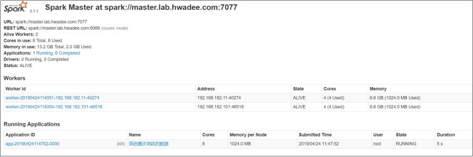 

点击应用ID的链接，进入应用详情页，如图所示。可以看到有几个节点在执行应用。

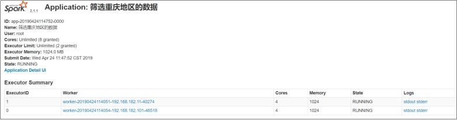 

点击菜单栏的Stages，可以看到该应用生成的DAG图，如图所示。

 

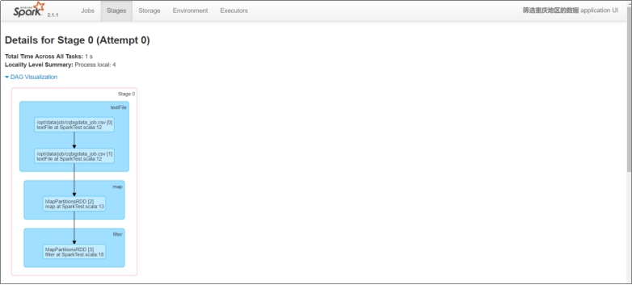 

该页面继续下拉，可以看到各任务执行情况，如图所示。

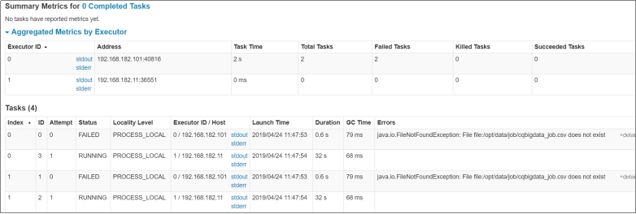 

点击菜单栏的Executors连接，可以看到各执行对任务的执行情况，如图5-36所示。

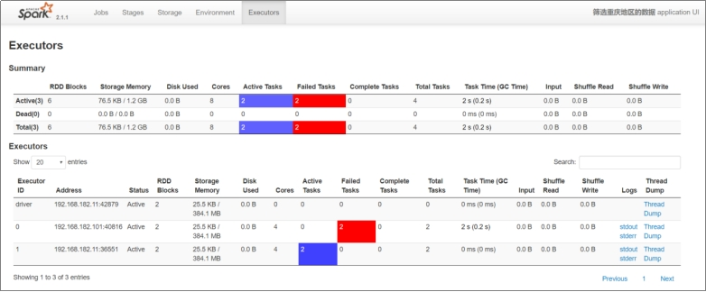 

​	

 

 