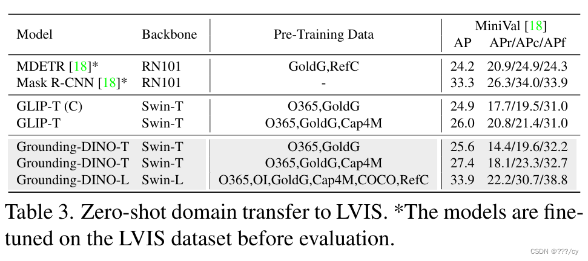

 

**🐧大模型系列篇章**

[💖 多模态大模型 🔎 GroundingDINO 论文总结](https://blog.csdn.net/qq_45842681/article/details/138945406)  
[💖 端到端目标检测 🔎 从DETR 到 GroundingDINO](https://blog.csdn.net/qq_45842681/article/details/139289113)  
[💖 多模态大模型 👉 CLIP论文总结](https://blog.csdn.net/qq_45842681/article/details/135379694?ops_request_misc=%257B%2522request%255Fid%2522%253A%2522171703290316777224422345%2522%252C%2522scm%2522%253A%252220140713.130102334.pc%255Fblog.%2522%257D&request_id=171703290316777224422345&biz_id=0&utm_medium=distribute.pc_search_result.none-task-blog-2~blog~first_rank_ecpm_v1~rank_v31_ecpm-2-135379694-null-null.nonecase&utm_term=clip&spm=1018.2226.3001.4450)  
[💖 多模态大模型 👉 EVA-CLIP](https://blog.csdn.net/qq_45842681/article/details/135451962?ops_request_misc=%257B%2522request%255Fid%2522%253A%2522171703290316777224422345%2522%252C%2522scm%2522%253A%252220140713.130102334.pc%255Fblog.%2522%257D&request_id=171703290316777224422345&biz_id=0&utm_medium=distribute.pc_search_result.none-task-blog-2~blog~first_rank_ecpm_v1~rank_v31_ecpm-1-135451962-null-null.nonecase&utm_term=clip&spm=1018.2226.3001.4450)  
[💚 生成模型 👉 从 VAE 到 Diffusion Model （上）](https://blog.csdn.net/qq_45842681/article/details/139163045)  
[💚 生成模型 👉 从 VAE 到 Diffusion Model （下）](https://blog.csdn.net/qq_45842681/article/details/139167526)  
[💧 天气大模型](https://blog.csdn.net/qq_45842681/article/details/134545475)

<table><tbody><tr><td bgcolor="#D1EEEE"><b>欢迎订阅专栏，第一时间掌握最新科技</b> <a href="https://blog.csdn.net/qq_45842681/category_12674641.html?spm=1001.2014.3001.5482">专栏链接</a></td></tr></tbody></table>

  
论文：https://arxiv.org/pdf/2303.05499  
题目：Grounding DINO: Marrying DINO with Grounded Pre-Training for Open-Set Object Detection  

从题目就可以知道Grounding DINO 的内容了：introducing language to a closed-set detector for open-set concept generalization.

+   如何高效的融合图像，文本两种模态？  
    作者把 **闭集的目标检测器** 分成了三个阶段  
    1\. 颈部阶段（Neck Module）2. 查询初始化阶段 3. 头部阶段（Head Phase）

同时提出了一个紧凑的融合方法 (a tight fusion solution)，包括一个特征增强(feature enchancer)，一个语言指导问答选择 (a language-guided query selection)，一个跨模态解码器 (a cross-modality decoder for cross-modality fusion).

<table><tbody><tr><td bgcolor="#C0FF3E"><b>Grounding DINO 如何训练</b> <a href="https://blog.csdn.net/qq_45842681/article/details/139289113">端到端目标检测 | 从DETR 到 GroundingDINO</a></td></tr></tbody></table>

#### 文章目录

+   [1\. Introduction](#1_Introduction_41)
+   +   [1.1 如何通过在闭集检测器的基础上引入语言感知机制，将其扩展为开放集检测器](#11__60)
    +   [1.2 特征融合的重要性](#12__70)
    +   [1.3 多模态融合](#13__77)
    +   +   [1\. 颈部阶段（Neck Module）:](#1_Neck_Module_80)
        +   [2\. 查询初始化阶段:](#2__83)
        +   [3\. 头部阶段（Head Phase）:](#3_Head_Phase_87)
+   [2\. 相关工作](#2__93)
+   +   [2.1 OV-DETR（Object-Vocabulary DETR）](#21_OVDETRObjectVocabulary_DETR_96)
    +   [2.2 ViLD（Vision and Language Detector）](#22_ViLDVision_and_Language_Detector_99)
    +   [2.3 GLIP（Grounded Language-Image Pre-training）](#23_GLIPGrounded_LanguageImage_Pretraining_102)
    +   [2.4 DetCLIP（Detection CLIP）](#24_DetCLIPDetection_CLIP_105)
+   [3\. Grounding DINO](#3_Grounding_DINO_110)
+   +   [3.1 特征的提取与增强：Feature Extraction and Enhancer](#31__Feature_Extraction_and_Enhancer_117)
    +   [3.2 语言指导的问答选择：Language-Guided Query Selection](#32__LanguageGuided_Query_Selection_129)
    +   [3.3 跨模态解码器：Cross-Modality Decoder](#33_CrossModality_Decoder_144)
    +   [3.4 子句级别的特征：Sub-Sentence Level Text Feature](#34_SubSentence_Level_Text_Feature_152)
    +   [3.5 损失函数：Loss Function](#35_Loss_Function_159)
+   [4\. Experiments](#4_Experiments_174)
+   +   [4.1 Setup](#41_Setup_175)
    +   [4.2 Zero-Shot Transfer of Grounding DINO](#42_ZeroShot_Transfer_of_Grounding_DINO_185)
    +   +   [4.2.1 COCO Benchmark](#421_COCO_Benchmark_186)
        +   [4.2.2 LVIS Benchmark](#422_LVIS_Benchmark_199)
        +   [4.2.3 ODinW Benchmark](#423__ODinW_Benchmark_210)
    +   [4.3 Referring Object Detection Settings](#43_Referring_Object_Detection_Settings_226)
    +   [4.4. 消融实验：Ablations](#44_Ablations_233)
    +   [4.5. Transfer from DINO to Grounding DINO](#45_Transfer_from_DINO_to_Grounding_DINO_251)
+   [5\. Conclusion](#5_Conclusion_266)

## 1\. Introduction

先来认识一下**开放集目标检测** *open-set* object detection: To detect arbitrary objects specified by human langugage inputs.  
作为一个通用的开放集目标检测器 **非常有潜力**，比如，它可以与 **生成模型 *(generative models)*** 结合，去实现 **图像编辑 *(image editing)***。

The key to open-set detection is **introducing langugage for unseen object gerenalization  
**

+   **GLIP: 它重新将目标检测问题解释为短语定位任务，并引入了目标区域与语言短语之间的对比训练  
    **
    
    +   **将目标检测任务重新解释为短语定位任务**。这意味着不再简单地识别物体，而是将物体与语言描述的短语相关联。这样做的好处是，可以更直接地从语言描述中理解图像中的内容，同时也为图像理解和自然语言处理之间的融合提供了一种框架。
        
    +   **引入目标区域与语言短语之间的对比训练**：对比训练是一种机器学习中常用的技术，旨在通过比较不同样本之间的相似性来学习表示。GLIP利用对比训练的思想，将目标区域（即图像中的物体区域）与对应的语言短语进行比较训练。通过这种方式，模型学习到了如何将语言描述与图像中的物体区域相关联，从而提高了模型在短语定位任务上的性能。
        
    +   **在数据集上展现出色的灵活性**： GLIP表现出了对于不同类型和特征的数据集具有出色的适应能力。这意味着即使在处理各种不同结构和特性的数据时，GLIP模型也能够保持良好的性能。
        
    +   **在闭集和开集检测方面表现出了显著的性能**： GLIP在闭集和开集检测任务中都取得了显著的性能表现。闭集检测是指模型只能识别训练集中存在的类别，而开集检测则是指模型需要处理未见过的类别。GLIP在两种情况下都取得了令人瞩目的结果，表明其在处理各种检测任务时的通用性和鲁棒性。
    
+   **Grounding DINO相比于GLIP有几个优势  
    **
    
    +   首先，基于Transformer的架构类似于语言模型，这使得它更容易处理图像和语言数据。例如，由于所有图像和语言分支都是基于Transformers构建的，因此我们可以轻松地在其整个流程中融合跨模态特征。
    +   其次，基于Transformer的检测器已经证明了利用大规模数据集的卓越能力。
    +   最后，作为一个类似于DETR的模型，DINO可以在不使用任何硬编码模块（如NMS，即非最大抑制）的情况下进行端到端优化，这极大地简化了整体基础模型的设计。

### 1.1 如何通过在闭集检测器的基础上引入语言感知机制，将其扩展为开放集检测器

<table><tbody><tr><td bgcolor="#54FF9F"><b>如何通过在闭集检测器的基础上引入语言感知机制，将其扩展为开放集检测器。这种扩展的关键是使用语言信息来使模型能够识别新的类别，并通过对比损失来确保不同模态（图像和语言）的信息在模型中得到合适的融合。</b></td></tr></tbody></table>

现有的开放集检测器通常是通过在 **语言信息的基础上** 将闭集检测器扩展到开放集场景中来开发的。一般来说，闭集检测器通常由三个重要模块组成：用于 **特征提取的骨干网络**、用于 **特征增强的颈部网络**以及用于 **区域细化（或框预测）的头部网络**。  
通过 **学习与语言相关的区域嵌入（language-aware region embeddings）**，闭集检测器可以被推广用于检测新的对象，模型可以将图像中的每个区域（可能包含对象）与语言描述中的新类别相关联。在这种方法中，图像中的每个区域都会被嵌入到一个与语言相关的语义空间中。这个语义空间是基于语言定义的，因此它能够将 **图像中的视觉内容与自然语言中的概念** 联系起来。例如，如果一个新类别的对象是“蓝色的小鸟”，那么模型需要能够在视觉上识别这个对象，并且知道它与“蓝色”和“小鸟”这些词汇相关联。

<table><tbody><tr><td bgcolor="#54FF9F"><b>通过在这样一个语言感知的语义空间中对区域进行分类，模型就能够将新对象分类到它们对应的、在训练期间未见过的类别中。这种方法的关键优势在于，它利用了语言的信息来桥接视觉数据和未知的对象类别，从而提高了模型对新对象的泛化能力。</b></td></tr></tbody></table>

**在语言感知的语义空间中将每个区域分类为新的类别。实现这一目标的关键在于在颈部和/或头部输出处使用区域输出与语言特征之间的对比损失。  
**  
**A closed-set detector can be generalized to detect novel objects by learning language-aware region embeddings so that each region can be classified into novel categories in a language-aware semantic space. The key to achieving this goal is using contrastive loss between region outputs and language features at the neck and/or head outputs  
**

为了帮助模型对齐跨模态信息，一些工作尝试在最终损失阶段之前融合特征。图2显示了特征融合可以在三个阶段进行：颈部（阶段A）、查询初始化（阶段B）和头部（阶段C）。例如，GLIP \[26\] 在颈部模块（阶段A）中执行早期融合，而 OV-DETR \[56\] 则使用语言感知查询作为头部输入（阶段B）。  
![为了帮助模型对齐跨模态信息，一些工作尝试在最终损失阶段之前融合特征。图2显示了特征融合可以在三个阶段进行：颈部（阶段A）、查询初始化（阶段B）和头部（阶段C）。例如，GLIP [26] 在颈部模块（阶段A）中执行早期融合，而 OV-DETR [56] 则使用语言感知查询作为头部输入（阶段B）。](../Typora_images/30973ce8b82ed64a0bb4fbb45b9184be-17447192668123.png)

### 1.2 特征融合的重要性

+   在pipline中 **增加更多的特征融合可以使模型表现更好。**
    
+   对于检索任务（如图像-文本检索），更倾向于使用类似CLIP的双塔架构。在这种架构中，图像和文本分别通过两个独立的塔（即神经网络）进行处理，只在最后阶段进行多模态特征比较。这种设计是出于效率的考虑，因为在检索任务中，通常不需要为每个图像-文本对生成一个联合表示，而只需要比较它们之间的相似性。
    
+   然而，对于开放集检测（open-set detection）任务，情况则不同。在开放集检测中，模型通常同时接收图像和文本输入，文本指定了目标对象的类别或特定对象。在这种情况下，紧密（和早期）融合模型更受青睐，因为它在处理过程中早期就将图像和文本信息融合在一起。这种早期融合允许模型更全面地理解图像内容与文本描述之间的关系，从而在识别和定位目标对象时获得更好的性能。
    
+   虽然概念上很简单，但以往的工作很难在所有三个阶段进行特征融合。像Faster R-CNN这样的经典检测器的设计使得在大多数模块中与语言信息进行交互变得困难。与经典检测器不同，**基于Transformer的检测器DINO具有与语言块一致的结构，逐层的设计使其能够轻松地与语言信息进行交互。**
    

### 1.3 多模态融合

一种多模态模型的设计，其中包含了三个特征融合阶段：颈部（neck）、查询初始化（query initialization）和头部（head）。这些阶段的目的是增强模型对不同模态（如图像和文本）特征的理解和利用，以提高模型在现有基准测试上的性能。

#### 1\. 颈部阶段（Neck Module）:

+   在这个阶段，设计了一个特征增强器（feature enhancer），它通过堆叠自注意力（self-attention）、从文本到图像的交叉注意力（text-to-image cross-attention）和从图像到文本的交叉注意力（image-to-text cross-attention）模块来增强特征表示。
+   自注意力允许模型关注图像或文本内部的上下文信息，而交叉注意力则帮助模型理解两个模态之间的关联。

#### 2\. 查询初始化阶段:

+   在这个阶段，开发了一种语言引导的查询选择方法（language-guided query selection method），用于初始化头部的查询。
+   这意味着模型使用文本信息来指导生成查询，这些查询将用于后续的图像处理。这种方法有助于模型更准确地定位和识别图像中与文本描述相对应的对象。

#### 3\. 头部阶段（Head Phase）:

+   在这个阶段，设计了一个跨模态解码器（cross-modality decoder），它包含图像和文本的交叉注意力层。
+   这个解码器进一步增强了查询表示（query representations），使得模型能够更有效地结合图像和文本信息，从而提高性能。

这三个特征融合阶段共同作用，帮助模型在处理图像和文本任务时获得更好的性能。这些改进的效果将在论文的第4.4节中展示，可能包括在各种基准测试上的性能提升数据。

## 2\. 相关工作

开放集目标检测（open-set object detection）的训练方法，其目的是利用语言泛化能力来检测任意类别。开放集目标检测与传统的封闭集目标检测不同，后者仅限于检测训练时见过的类别。在开放集目标检测中，模型需要能够识别和定位图像中未在训练数据中明确标注的物体类别。

### 2.1 OV-DETR（Object-Vocabulary DETR）

它使用由CLIP模型编码的图像和文本嵌入作为查询，在DETR（Detection Transformer）框架中解码特定类别的边界框。

### 2.2 ViLD（Vision and Language Detector）

通过从CLIP教师模型中提取知识到类似R-CNN的检测器，使得学到的区域嵌入包含语言语义。

### 2.3 GLIP（Grounded Language-Image Pre-training）

将目标检测形式化为一个定位问题，并利用额外的定位数据来帮助学习在短语和区域层面的对齐语义。GLIP展示了这样的公式化甚至可以在完全监督的目标检测基准测试上实现更强的性能。

### 2.4 DetCLIP（Detection CLIP）

涉及大规模的图像字幕数据集，并使用生成的伪标签来扩展知识数据库。这些生成的伪标签有效地帮助扩展了检测器的泛化能力。

<table>
    <tbody>
        <tr>
            <td bgcolor="#54FF9F">
                <b>先前的工作仅在部分阶段融合多模态信息，这可能导致次优的语言泛化能力。例如，GLIP仅在特征增强阶段（phase A）考虑融合，而OV-DETR仅在解码器输入阶段（phase B）注入语言信息。此外，REC（Referring Expression Comprehension）任务通常在评估中被忽略，这对于开放集检测是一个重要的场景。					</b>
            </td>
        </tr>
    </tbody>
</table>

## 3\. Grounding DINO

整体架构如下图所示：  
  
每个图像和文本对，模型首先使用图像骨干网络和文本骨干网络分别提取图像特征和文本特征。然后，这两个原始特征被输入到特征增强器模块 **Feature Enhancer** 中进行跨模态特征融合。在获得跨模态的文本和图像特征后，模型使用语言引导的查询选择模块 **(Language-guide Query Selection)** 从图像特征中选取跨模态查询。这些跨模态查询类似于大多数DETR-like模型中的对象查询，它们被输入到跨模态解码器中 **(Cross-Modality Decoder)**，以从两个模态的特征中探测期望的特征并更新自身。最后一层解码器的输出查询被用于预测对象边界框并提取相应的短语。

在对象检测任务中，模型将所有类别名称拼接作为输入文本，这与GLIP方法一致。在REC（Referring Expression Comprehension）任务中，每个文本输入需要一个边界框，模型使用得分最高的输出对象作为REC任务的输出。通过这种方式，Grounding DINO能够同时处理对象检测和REC任务，提高了模型在视觉和语言理解方面的能力。

### 3.1 特征的提取与增强：Feature Extraction and Enhancer

> 普通的注意力用于文本，以便更好地捕捉文本中的上下文信息；可变自注意力用于图像，有助于模型更好地理解图像内容的局部和全局结构。

给定一个图像和文本对，我们首先使用类似于Swin Transformer的图像骨干网络提取多尺度图像特征，使用类似于BERT的文本骨干网络提取文本特征。遵循之前的DETR-like检测器，我们从不同块的输出中提取多尺度特征。

提取原始的图像和文本特征后，我们将它们输入到特征增强器中进行跨模态特征融合。特征增强器包含多个特征增强器层。我们在图3中的第2个方块中展示了特征增强器层。我们使用可变的自注意力（Deformable self-attention）来增强图像特征，使用普通的自注意力（vanilla self-attention）来增强文本特征。受到GLIP的启发，我们添加了图像到文本的交叉注意力和文本到图像的交叉注意力模块，用于特征融合。这些模块有助于对齐不同模态的特征。

具体来说，**Deformable self-attention 可变的自注意力允许模型在图像特征的空间中进行动态的注意力计算，** 这有助于模型更好地理解图像内容的局部和全局结构。而普通的自注意力则用于文本特征，因为它能够有效地捕捉文本中的上下文信息。

图像到文本的交叉注意力和文本到图像的交叉注意力模块则允许模型在图像特征和文本特征之间建立联系，从而帮助模型更好地理解图像内容与文本描述之间的关系。这些模块的结合使用，使得模型能够更准确地理解图像和文本的语义信息，从而提高模型在视觉和语言理解任务中的性能。

### 3.2 语言指导的问答选择：Language-Guided Query Selection

Grounding DINO的目标是从图像中检测出由输入文本指定的对象。为了有效地利用输入文本来指导对象检测，我们设计了一个语言引导的查询选择模块来选择与输入文本更相关的特征作为解码器的查询。我们用PyTorch风格的伪代码在Algorithm 1中展示了查询选择过程。  

在这个模块中，我们使用以下变量：

+   `image features` 和 `text features` 分别用于表示图像特征和文本特征。
+   `num_query` 是解码器中的查询数量，在我们的实现中设置为900。
+   `bs` 和 `ndim` 分别用于表示批次大小和特征维度。
+   `num_img_tokens` 和 `num_text_tokens` 分别用于表示图像和文本的令牌数量。  
    语言引导的查询选择模块输出 `num_query` 个索引。我们可以基于选定的索引提取特征来初始化查询。遵循DINO的做法，我们使用混合查询选择来初始化解码器的查询。每个解码器查询包含两部分：内容部分和位置部分。位置部分被形式化为动态锚框，它们使用编码器的输出进行初始化。另一部分，即内容查询，在训练期间被设置为可学习的。

动态锚框是一种灵活的边界框表示，它允许模型在不同的查询中为每个对象生成不同的边界框，从而增加了模型对各种对象形状和大小变化的适应性。内容查询的可学习性使得模型能够在训练过程中调整查询以更好地匹配输入文本描述的对象。

通过这种方式，Grounding DINO能够利用输入文本的信息来指导对象检测，从而提高模型在处理复杂视觉任务时的性能。

### 3.3 跨模态解码器：Cross-Modality Decoder

  
开发了一个跨模态解码器来结合图像和文本模态的特征，如图3中的第3个方块所示。每个跨模态查询都被输入到一个自注意力层、一个图像交叉注意力层、一个文本交叉注意力层和一个FFN（前馈神经网络）层。在每个跨模态解码器层中，都有一个额外的文本交叉注意力层，与DINO解码器层相比，我们需要将文本信息注入查询中，以便更好地对齐不同模态。

在这个跨模态解码器中，每个查询首先通过自注意力层处理，这有助于模型关注查询中的关键信息。然后，这些查询分别通过图像交叉注意力层和文本交叉注意力层，与图像特征和文本特征进行交互，以增强它们之间的关联性。FFN层则用于进一步处理查询，以提高特征的表示能力。

通过这种方式，跨模态解码器能够在不同模态之间建立更紧密的联系，从而提高模型在视觉和语言理解任务中的性能。特别是在开放集目标检测等任务中，这种跨模态的交互对于理解图像内容和文本描述之间的关系至关重要。

### 3.4 子句级别的特征：Sub-Sentence Level Text Feature

  
在之前的工作中，有两种文本提示（prompts）的方法，我们分别称之为句子级表示（sentence level representation）和词级表示（word level representation），如图4所示。

1.  **句子级表示**：这种方法将整个句子编码成一个特征。如果句子中的短语定位数据包含多个短语，它会提取这些短语并丢弃其他单词。这样做的好处是消除了单词之间的影响，但同时也丢失了句子中的细粒度信息。
2.  **词级表示**：这种方法允许用一个前向传播来编码多个类别名称，但它引入了类别之间的不必要的依赖关系，尤其是在输入文本是任意顺序连接的多个类别名称时。如图4（b）所示，一些无关的单词在注意力过程中相互影响。为了避免不想要的单词交互，我们引入了注意力掩码来阻断无关类别名称之间的注意力，这种方法我们称之为“子句”级表示（subsentence level representation）。它消除了不同类别名称之间的影响，同时保持了用于细粒度理解的每个单词的特征。  
    简而言之，句子级表示和词级表示都试图通过不同的方式来利用文本信息，但都存在一定的局限性。子句级表示则试图在这两者之间找到平衡，既避免了单词之间的不必要交互，又保留了句子中的细粒度信息。

### 3.5 损失函数：Loss Function

Grounding DINO模型在训练过程中使用的损失函数和辅助损失。它遵循了之前DETR（Detection Transformer）类型的相关工作，并采用了L1损失和GIOU（Generalized Intersection over Union）损失来优化边界框回归。此外，还使用了对比损失来增强预测对象和语言标记之间的分类能力。  
具体步骤如下：

1.  **边界框回归（Bounding Box Regression）**：
    +   L1损失（L1 loss）：是一种平滑的损失函数，用于优化边界框的回归问题。它计算预测边界框与真实边界框之间的L1距离，并将其最小化。
    +   GIOU损失（GIOU loss）：是一种用于评估边界框重叠的损失函数。它考虑了边界框的面积和重叠面积，以提供更准确的评估。
2.  **分类（Classification）**：
    +   对比损失（Contrastive loss）：GLIP使用对比损失来增强预测对象和语言标记之间的分类能力。它通过计算每个查询（query）与文本特征的点积来预测每个文本标记的logits，然后对每个logit计算焦距损失（focal loss）。
3.  **匹配（Matching）**：
    +   边界框回归和分类成本首先用于预测和真实标签之间的二进制匹配。
    +   然后计算与匹配预测相同的损失组件之间的真实标签和匹配预测的最终损失。
4.  **辅助损失（Auxiliary Loss）**：
    +   类似于DETR-like模型，Grounding DINO在每个解码器层之后和每个编码器输出之后都添加了辅助损失。这种辅助损失有助于模型更好地学习，尤其是在训练初期，当模型对输入数据的表示还不够准确时。  
        通过这些损失函数和辅助损失的组合，Grounding DINO模型能够在训练过程中更有效地优化其参数，从而提高其在对象检测任务中的性能。

## 4\. Experiments

### 4.1 Setup

这段话描述了作者进行了一系列实验，以评估Grounding DINO模型在不同设置下的性能。这些实验包括：

1.  **闭集 数据集（Closed-set Setting）**：在COCO检测基准上进行的封闭集设置（Sec. C.1）。在这个设置中，模型被训练来检测和定位COCO数据集中已知的类别。
2.  **开放集 数据集（Open-set Setting）**：在零样本COCO、LVIS和ODinW数据集上进行的开放集设置（Sec. 4.2）。在这个设置中，模型需要检测和定位在训练期间未见过的类别，即新类别。
3.  **引用检测设置（Referring Detection Setting）**：在RefCOCO/+/g数据集上进行的引用检测设置（Sec. 4.3）。在这个设置中，模型需要根据文本描述来定位图像中的对象。

+   作者还进行了一系列消融实验（Sec. 4.4），以展示他们模型设计的效果。此外，他们探索了一种将训练良好的DINO模型转移到开放集场景的方法，即通过训练几个插件模块（Sec. 4.5）。
+   在模型效率的测试方面，作者在附录的Sec. I中进行了展示。
+   关于实现细节，作者训练了两个模型变体：Grounding-DINO-T，使用Swin-T作为图像骨干网络；Grounding-DINO-L，使用Swin-L作为图像骨干网络。他们使用了来自Hugging Face的BERT-base作为文本骨干网络。由于他们更关注模型在新类别上的性能，因此主要文本中列出了零样本迁移和引用检测的结果。更多的实现细节可以在附录的Sec. A中找到。

### 4.2 Zero-Shot Transfer of Grounding DINO

#### 4.2.1 COCO Benchmark

  
表2中对Grounding DINO、GLIP和DINO模型进行比较的实验结果的总结。

1.  **预训练和评估**：作者在大型数据集上预训练了这些模型，并直接在COCO基准测试上评估了他们的模型。
2.  **零样本迁移性能**：由于O365数据集几乎覆盖了COCO中的所有类别，作者将O365预训练的DINO模型在COCO上进行零样本迁移的评估，作为零样本迁移的基线。结果显示，DINO在COCO零样本迁移任务上表现优于DyHead。
3.  **Grounding DINO的性能**：Grounding DINO在零样本迁移上超越了所有之前的模型，比DINO和GLIP分别提高了0.5个AP和1.8个AP。在零样本转移设置下，Grounding 数据仍然对 Grounding DINO 有所帮助，增加了超过 1AP（48.1 对比 46.7），它在新类别上的表现提升幅度超过了1个AP（从46.7个AP增加到48.1个AP）。
4.  **更强的骨干网络和更大的数据集**：当使用更强的骨干网络和更大的数据集时，Grounding DINO在COCO对象检测基准测试上达到了一个新的记录，即52.5个AP，而它在训练过程中并没有看到任何COCO图像。
5.  **COCO minival评估**：在COCO minival评估中，Grounding DINO取得了62.6个AP，超过了DINO的62.5个AP。
6.  **输入图像尺寸的影响**：当将输入图像尺寸放大1.5倍时，模型的优势有所减少。作者怀疑文本信息的引入可能会增加模型的不稳定性，从而导致了性能差异的增加
7.  **COCO test-dev评估**：尽管如此，Grounding DINO在COCO test-dev评估中仍然取得了令人印象深刻的63.0个AP，这是在COCO数据集上微调后的结果（表2中的括号中的数字）。

<table><tbody><tr><td bgcolor="#54FF9F"><b>综上所述，Grounding DINO在多个评估指标上都取得了优异的成绩，尤其是在零样本迁移和开放集检测任务上。这些结果表明，该模型设计有效地利用了图像和文本信息，提高了模型的泛化能力和性能。</b></td></tr></tbody></table>

#### 4.2.2 LVIS Benchmark

LVIS是一个用于长尾对象的数据集，它包含超过1000个类别用于评估。作者使用LVIS作为下游任务来测试他们的模型在零样本设置下的能力，并将GLIP作为基线。结果在表3中展示。Grounding DINO在相同设置下优于GLIP。  
在结果中，作者发现了两个有趣的现象：

1.  **长尾对象的表现**：Grounding DINO在常见对象上的表现优于GLIP，但在罕见类别上的表现则不如GLIP。作者怀疑这可能是因为900个查询的设计限制了对长尾对象的识别能力。相比之下，单阶段检测器使用特征图中的所有proposal进行比较，可能更适合处理长尾对象。
2.  **数据增益**：Grounding DINO随着数据的增加获得的增益大于GLIP。例如，在使用了Cap4M字幕数据的Grounding DINO上，AP增加了1.8，而GLIP只增加了1.1。作者认为Grounding DINO的扩展性优于GLIP。他们计划在未来进行更大规模的数据集训练。

<table><tbody><tr><td bgcolor="#54FF9F"><b>综上所述，Grounding DINO在长尾对象检测任务上表现良好，尤其是在常见对象上，但它在罕见类别上的表现仍有提升空间。此外，Grounding DINO对数据的增益响应比GLIP更显著，这表明它具有更好的扩展性，尤其是在处理大量数据时</b></td></tr></tbody></table>

#### 4.2.3 ODinW Benchmark

ODinW（Object Detection in the Wild）是一个更具挑战性的基准测试，用于评估模型在真实世界场景下的性能。它收集了超过35个数据集进行评估。在表4中，作者报告了零样本、少量样本和全样本三种设置的结果。  

1.  **ODinW基准测试**：
    +   ODinW是一个更具挑战性的基准测试，因为它涵盖了多个真实世界的数据集，这使得模型在评估时需要面对更多样化和复杂的环境。
2.  **Grounding DINO的表现**：
    +   在这个基准测试中，Grounding DINO表现良好。仅使用O365和GoldG进行预训练的Grounding-DINO-T在少量样本和全样本设置上都优于DINO。
    +   令人印象深刻的是，使用Swin-T骨干网络的Grounding DINO在全样本设置上优于使用Swin-L骨干网络的DINO。
    +   在零样本设置上，Grounding DINO的性能优于GLIP，并且与GLIPv2相当，后者采用了如遮蔽训练等新技术。
3.  **Grounding-DINO-L的成绩**：
    +   Groundin-DINO-L在ODinW的零样本设置上取得了新的记录，达到了26.1个AP，甚至超过了大型Florence模型。
4.  **Grounding DINO的泛化能力和可扩展性**：
    +   这些结果表明Grounding DINO模型的泛化能力和可扩展性。

<table><tbody><tr><td bgcolor="#54FF9F"><b>综上所述，Grounding DINO在ODinW基准测试上取得了优异的成绩，这进一步证明了其模型设计的优越性。尤其是在零样本设置上，Grounding-DINO-L取得了新的记录，这显示了该模型在真实世界场景下的强大性能和潜在的应用前景。</b></td></tr></tbody></table>

### 4.3 Referring Object Detection Settings

在 RefCOCO/+/g 数据集上评估模型性能的结果。  

首先，作者在表5中展示了模型在 RefCOCO/+/g 数据集上的性能结果。结果显示，Grounding DINO 在相同的设置下表现优于 GLIP。然而，无论是 GLIP 还是 Grounding DINO，在没有 REC 数据（指 Referential Expression Comprehension，参考表达理解数据）的情况下性能都不好。作者观察到，更多的训练数据（如标题数据）或更大的模型对最终性能有一些帮助，但影响并不显著。然而，在训练中注入 RefCOCO/+/g 数据之后，Grounding DINO 获得了显著的提升。

这些结果表明，大多数现今的开放式目标检测器需要更多地关注细粒度的检测。在 RefCOCO/+/g 数据集上，Grounding DINO 的性能优于 GLIP，而且在加入了 REC 数据后，性能得到了显著提升。这些观察结果对于指导未来的模型设计和训练策略具有重要意义。

### 4.4. 消融实验：Ablations

作者在本节中进行的消融研究。他们提出了一种**紧密融合的基于语言感知的模型** 用于开放式目标检测，并采用了**子句级别的文本提示**。为了验证模型设计的有效性，他们移除了一些融合模块，得到了不同的变体，并在表6中展示了结果。

1.  **模型设计**：
    +   紧密融合的基于语言感知的模型 *(a tight fusion grounding model for open-set object detection )*：这种模型设计旨在通过融合不同模态（如图像和文本）的信息来提高开放集对象检测的性能。
    +   子句级文本提示：这种提示方法允许模型在处理文本描述时关注更小的文本单位，如子句，以提高对文本内容的理解和利用。
2.  **消融实验**：
    +   作者移除了不同融合块，以评估每个融合块对模型性能的影响。
    +   所有模型都是在O365数据集上预训练的，并使用了Swin-T骨干网络。
3.  **实验结果**：
    +   结果表明，每个融合块都对最终性能有帮助。
    +   **编码器融合是最重要的设计**，它在LVIS和COCO数据集上都表现出了显著的影响。
    +   **词级文本提示的影响最小**，但也是有帮助的。
    +   **语言引导的查询选择和文本交叉注意力在LVIS和COCO数据集上分别呈现较大的影响。**

<table><tbody><tr><td bgcolor="#54FF9F"><b>作者对模型设计的消融实验。他们通过移除不同的融合模块来验证模型设计的有效性，并观察到每个融合模块都对最终性能有所帮助，其中编码器融合的影响最为显著。</b></td></tr></tbody></table>

### 4.5. Transfer from DINO to Grounding DINO

从头开始训练一个Grounding DINO模型是昂贵的。然而，如果我们利用预训练的DINO权重，成本可以显著降低。因此，我们进行了一些实验，将预训练的DINO迁移到Grounding DINO模型上。我们冻结了DINO和Grounding DINO中共存的模块，并只微调其他参数。

1.  **模型训练改进**：
    +   实验结果显示，我们仅使用预训练的DINO来训练Grounding-DINO模型的文本和融合块，就可以达到类似的性能。
    +   有趣的是，预训练的DINO初始化的Grounding DINO在相同的设置下在LVIS数据集上优于标准的Grounding DINO。
    +   这些结果表明，模型训练还有很大的改进空间，这将是我们的未来工作要探索的。
2.  **收敛速度**：
    +   使用预训练的DINO初始化，模型的收敛速度比从头开始训练的Grounding DINO快，如图5所示。
3.  **EMA的使用**：
    +   在图5的曲线中，使用了没有指数移动平均（EMA）的结果，这导致了与表7中不同的最终性能。
    +   因为从头开始训练的模型需要更多的训练时间，所以只展示了早期几个周期的结果。  
        

<table><tbody><tr><td bgcolor="#54FF9F"><b>综上所述，这些实验结果表明，通过利用预训练的DINO权重，可以显著降低训练Grounding DINO模型的成本，并且在某些情况下，预训练的模型甚至可以优于从头开始训练的模型。此外，预训练的模型可以更快地收敛，为未来的模型训练改进提供了研究方向。</b></td></tr></tbody></table>

## 5\. Conclusion

在这篇论文中，介绍了一个名为Grounding DINO的模型。**Grounding DINO扩展了DINO模型，使其能够进行开放集对象检测，即能够根据文本查询检测任意对象**。我们对开放集对象检测器的架构进行了回顾，并提出了一个**紧密融合的方法**，以更好地融合跨模态信息。我们还提出了一个**子句级表示的方法**，以更加合理地使用检测数据作为文本提示。

1.  **模型设计**：
    +   Grounding DINO模型通过将文本查询与图像特征相结合，实现了对任意对象的检测。
    +   紧密融合的方法和子句级表示方法的有效性在实验结果中得到了证明。
2.  **扩展到REC任务**：
    +   作者将开放集对象检测扩展到了引用检测（REC）任务，并根据这个任务进行了相应的评估。
    +   实验结果表明，现有的开放集检测器在没有微调的情况下，对于REC数据的表现并不理想。
    +   因此，作者呼吁在未来的研究中更加关注REC零样本性能。
3.  **局限性**：
    +   尽管在开放集对象检测任务上取得了出色的性能，但Grounding DINO不能用于像GLIPv2那样的分割任务。
    +   我们的训练数据量少于最大的GLIP模型，这可能限制了我们的最终性能。

<table><tbody><tr><td bgcolor="#54FF9F"><b>综上所述，Grounding DINO模型通过紧密融合图像和文本信息，实现了开放集对象检测，并在引用检测任务上表现出了潜力。然而，它也存在一些局限性，如不能直接应用于分割任务，以及训练数据量有限。这些局限性为未来的研究提供了改进的方向。</b></td></tr></tbody></table>