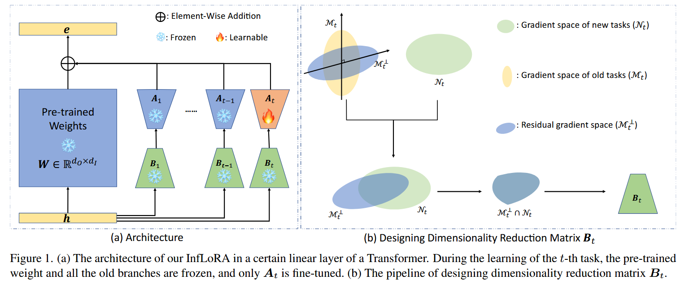

# 《InfLoRA: Interference-Free Low-Rank Adaptation for Continual Learning》

> - 在持续学习中，模型应具有在旧任务上保持其性能的能力（稳定性）和持续适应新任务的能力（可塑性）。
> - 参数高效微调（PEFT）在持续学习中大受欢迎，它通过冻结预训练权重并注入少量可学习参数以适应下游任务。
> - 尽管现有的PEFT方法比不基于PEFT的方法性能更好，但是大多数方法没有考虑如何消除新任务对旧任务的干扰，阻碍了模型在稳定性和可塑性之间的权衡。
> - 文章提出了一个新的基于PEFT的方法，叫做无干扰低秩适应（InfLoRA），用于持续学习。
> - InfLoRA注入少量参数来重新参数化预训练的权重，并表明微调这些注入的参数等同于微调子空间内的预训练权重。
> - 此外，InfLoRA设计了这个子空间，以消除新任务对旧任务的干扰。
> - 实验结果表明，InfLoRA在多个数据集上优于现有的最先进的持续学习方法。

[TOC]

## 1. Introduction

- 持续学习经常考虑两种场景：**任务增量场景**和**类增量场景**。
- 任务增量场景允许模型在推理过程中获取任务身份，相反，类增量场景不允许模型在推理过程中获取任务身份，而是使模型能够区分所有任务的所有类。
- 当学习新任务时，现有的持续学习方法要么重新使用先前学习的参数来适应新的任务，要么先随机扩展一些参数再适应新任务（比如额外的权重矩阵，LoRA分支）。

**文章的贡献如下：**

- InfLoRA注入了少量的参数来重参数化预训练权重，并表明微调这些注入参数等价于在一个子空间内微调预训练权重。
- InfLoRA设计了一个子空间来消除新任务对老任务的干扰，使模型在稳定性和可塑性上做出更好的权衡。
- 实验结果表明InfLoRA在多个数据集上的性能优于现有的最先进的持续学习方法。

## 2. Related Work and Preliminaries

### 2.1 Related Work

- 参数高效微调（PEFT）：参数高效微调减少了完整微调中低效率的学习方法，即微调预训练模型中的所有参数来学习下游任务。
- **Adapter**方法在模型的各层之间插入小型可训练模块（适配器），这些模块在微调过程中被训练以适应新任务，而原始模型的参数保持冻结。这种方法通过增加少量参数，实现对模型行为的调整。
- **Prompt-tuning**方法在输入序列的嵌入层添加可训练的提示向量（软提示），这些向量在训练过程中被优化，以引导模型产生特定任务的输出。Prompt Tuning 仅调整输入层的提示向量，保持模型其余部分的参数不变。
- **Prefix Tuning**：在输入序列的开头添加可训练的前缀，这些前缀作为虚拟标记，影响模型的生成过程。与 Prompt Tuning 类似，Prefix Tuning 通过在输入中添加前缀来控制生成结果的格式和结构，但它不仅影响输入层，还影响模型的各个层次。
- 与 Adapter、Prompt Tuning 和 Prefix Tuning 等方法相比，LoRA 的主要区别在于其直接对模型内部的权重矩阵进行低秩分解和调整，而不是通过添加额外的模块或输入前缀来实现微调。 这种方法可以在保持模型性能的同时，减少微调所需的参数量和计算成本。
- 实验证明完全微调预训练模型的方法是无效的，但这些PEFT方法都没有考虑到消除新任务对老任务的干扰，并在稳定性和可塑性之前取得良好的平衡。

### 2.2 Preliminaries

- **LoRA**方法假设当模型对下游任务进行完全微调时，参数的变化位于**低秩空间**。

- Low-Rank Adaptation (LoRA) [16] 是最流行的参数高效微调（PEFT）方法之一。它假设当模型在下游任务上进行完整微调时，参数的变化处于一个低秩空间中。

- 具体来说，对于一个输入维度为 $d_I$、输出维度为$d_O$的线性层，其权重矩阵 $\boldsymbol{W}^{d_{O} \times d_{I}}$。LoRA 通过增加一个由两个矩阵组成的分支来重新参数化预训练权重 \(W\)，这两个矩阵分别为：

  - $A \in \mathbb{R}^{d_O \times r}$：升维矩阵  
  - $B \in \mathbb{R}^{r \times d_I}$：降维矩阵  

  通常，秩 \(r\) 的大小远小于输入维度 \($d_I$\) 和输出维度 \($d_O$\)。最终，LoRA 将此线性层中的前向传播公式修改为：

  $$
  e = W h + ABh
  $$

  其中，$h$ 和 $e$ 分别表示此层的输入和输出。

  LoRA 初始化矩阵 $A$ 为零矩阵，并用高斯分布对矩阵 $B$ 进行初始化。在学习下游任务的过程中，LoRA **冻结预训练权重 $W$**，仅微调矩阵 $A$ 和 $B$ 的参数。

## 3. Methodology

#### InfLoRA 与 LoRA 的主要区别

1. **针对增量学习任务的设计**：
   - **LoRA**：主要用于单任务或静态环境下的微调，所有参数 $A$和 $B$都是同时训练的，没有任务的增量更新。
   - **InfLoRA**：针对 **类增量学习场景（class-incremental scenario）**，在每个任务 $t$中，引入新的增维矩阵 $A_t$和降维矩阵 $B_t$，从而扩展模型的能力，同时保持之前任务的知识。
2. **矩阵 $ A_t $的初始化方式**：
   - LoRA 和 InfLoRA 均将增维矩阵 $A_t$初始化为 **0**，目的是避免模型在初始阶段对权重的扰动。
   - 初始化为 **0** 的好处是，在初始状态下，模型的行为完全由原始权重 $W$决定，降低不稳定性。
3. **矩阵 $ B_t$的处理方式**：
   - **LoRA**：直接通过**高斯分布**初始化矩阵$ B$，并在整个微调过程中同时训练 $A$和 $B$。
   - **InfLoRA**：在学习第 $t$个任务之前，**设计降维矩阵 $B_t$**。这意味着 $B_t$的初始化不是随机的，而是通过特定的设计（例如考虑梯度空间的关系，如前图所示）来确定。这种设计旨在确保 $B_t$在新任务中能够有效地捕获新知识，同时与旧任务的梯度空间兼容。
4. **参数冻结策略**：
   - LoRA 不会冻结任何 $A$或 $B$，所有任务的适配器都同时参与训练。
   - InfLoRA 在学习新任务时，会**冻结旧任务的所有 **$A_j$、$B_j$$（j < t）$，以及预训练权重 $W$。这样可以避免新任务对旧任务知识的干扰，解决灾难性遗忘问题。

#### 针对 $A_t$ 和 $B_t$设计的独特之处

1. **增维矩阵** $A_t$：
   - **初始化为 0**，确保任务学习的过程是从预训练模型的基础上逐步建立起来的，而不会受到随机初始化的干扰。
   - 在增量学习过程中，**仅对当前任务的 $A_t$进行训练**，从而保证之前任务的知识保持不变。
2. **降维矩阵 $B_t$**：
   - LoRA 的 $B$是高斯随机初始化的，而 InfLoRA 通过**梯度空间设计**，确保 $B_t $能有效表示新任务的特性，同时与旧任务保持兼容性。
   - $B_t$在任务开始前被设计，而不是通过随机初始化学习，这种“先设计后优化”的方式大幅降低了新任务学习的干扰。

#### 子空间的概念

1. **降维矩阵 $ B_t $的作用**：
   - $ B_t $将输入空间 $\mathbb{R}^{d_I}$ 投影到一个低维子空间 $\mathbb{R}^r$。
   - $ B_t $的行张成了这个子空间的基底，因此任何通过 $ B_t $的线性组合都受限于这个子空间。
2. **增维矩阵 $ A_t $的作用**：
   -  $ A_t $是可训练的矩阵，它负责将这个低维子空间的特征重新映射回输出空间 $\mathbb{R}^{d_o}$。
   - $A_t B_t$ 的结果实际上限制了模型只能在 $ B_t $的子空间内调整权重。

#### 训练  $ A_t $等价于在 $ B_t $的子空间内训练 $W$

1. **训练  $ A_t $**：
   - 当  $ A_t $被训练时，实际上是在学习如何对 $ B_t $的行空间进行组合，以适应新的任务。
     - $ B_t $的设计决定了权重更新的方向和范围，因此 $A_t B_t$ 是受 $ B_t $的行张成子空间限制的。
2. **对比直接训练 $W$**：
   - 如果直接训练 $W$，模型可以自由地调整所有的权重。
   - 而在 InfLoRA 中，通过训练  $ A_t $，权重更新被限制在 $ B_t $的行张成的低秩子空间中，这相当于对 $W$进行了一种受限优化。
3. **数学等价性**：
   - 调整  $ A_t $相当于找到一个合适的线性组合，使得 $A_t B_t$ 最好地近似所需的权重变化。
   - 因此，训练  $ A_t $实质上是对 $W$进行优化，但优化范围仅限于 $ B_t $所定义的子空间。

### 3.1. Relationship between InfLoRA and FineTuning the Pre-Trained Weight

#### 证明的问题（Proposition 1）

- 问题描述：在学习第 $t $个任务时（使用公式 (1) 的前向传播方式），微调 $A_t$是否等价于在由 $B_t$的行张成的子空间 $\text{span}(b_1^t, \dots, b_r^t)$中微调 $W$？
  - $b_i^t$ 是降维矩阵 $B_t$ 的第 $i$ 行向量。
  - 目标是展示微调 $A_t$ 对 $W_t$ 的影响实际上受限于 $B_t$ 定义的低秩子空间。

#### 证明过程

##### 1. 微调$$W$$的梯度推导

根据链式法则，权重矩阵$W$的梯度为：

$$
\frac{\partial \mathcal{L}}{\partial W} = \frac{\partial \mathcal{L}}{\partial e} \cdot \frac{\partial e}{\partial W} = \frac{\partial \mathcal{L}}{\partial e} \cdot h^T
$$

其中：
- $$\mathcal{L}$$ 是损失函数。
- $$e$$ 是线性层的输出。
- $$h$$ 是输入向量。

因此，微调 $$W$$ 的变化为：

$$
\Delta W = -\alpha \cdot \frac{\partial \mathcal{L}}{\partial W} = -\alpha \cdot \frac{\partial \mathcal{L}}{\partial e} \cdot h^T
$$

这里 $$\alpha$$ 是学习率。

---

##### 2. 微调 $$A_t$$ 的梯度推导

同理，当调整 $$A_t$$ 时，其梯度可以表示为：

$$
\frac{\partial \mathcal{L}}{\partial A_t} = \frac{\partial \mathcal{L}}{\partial e} \cdot \frac{\partial e}{\partial A_t} = \frac{\partial \mathcal{L}}{\partial e} \cdot h^T \cdot B_t^T
$$

因此，微调 $$A_t$$ 的变化为：

$$
\Delta A_t = -\alpha \cdot \frac{\partial \mathcal{L}}{\partial A_t}
$$

然后，使用公式 (1) 中 $$W_t = W_{t-1} + A_t B_t$$，可以得到 $$W_t$$ 的变化：

$$
\Delta_{A_t} W_t = [W_{t-1} + (A_t + \Delta A_t) B_t] - (W_{t-1} + A_t B_t)
$$

化简得到：

$$
\Delta_{A_t} W_t = \Delta A_t \cdot B_t = -\alpha \cdot \frac{\partial \mathcal{L}}{\partial e} \cdot h^T \cdot B_t^T \cdot B_t
$$

---

##### 3. 比较 $$W$$ 和 $$A_t$$ 对 $$W_t$$ 的影响

根据第 1 步，调整 $$W$$ 对 $$W_t$$ 的变化为：

$$
\Delta_W W_t = -\alpha \cdot \frac{\partial \mathcal{L}}{\partial e} \cdot h^T
$$

而调整 $$A_t$$ 对 $$W_t$$ 的变化为：

$$
\Delta_{A_t} W_t = \Delta_W W_t \cdot B_t^T \cdot B_t
$$

从公式可以看出：
- 调整 $$A_t$$ 对 $$W_t$$ 的变化是通过矩阵 $$B_t^T B_t$$ 对 $$\Delta_W W_t$$ 进行投影。
- 矩阵 $$B_t^T B_t$$ 是一个投影矩阵，将 $$\Delta_W W_t$$ 的更新限制在 $$B_t$$ 的行张成的子空间内。

---

##### 4. 结论

$$
\Delta_{A_t} W_t = \Delta_W W_t \cdot B_t^T \cdot B_t
$$

因此，微调 $$A_t$$ 等价于将预训练权重 $$W$$ 的更新限制在 $$B_t$$ 的行张成的子空间内。命题得证。

### 3.2. Eliminating the Interference of the New Task on the Old Tasks

> 首先介绍InfLoRA希望让子空间具有的特征，有了这些特征，InfLoRA就可以消除旧任务对新任务的干扰，使其能在稳定性和可塑性之间做出更好地权衡。
>
> 然后介绍如何设计降维矩阵$B_t$使得它的子空间 $\text{span}\{b_1^t \dots b_r^t\}$ 能够具有这些特征。

#### 3.2.1 Desired Characteristics

##### 期望的特征：

1. **新任务更新与旧任务梯度的正交性**：
   - 期望新任务更新的方向与旧任务梯度的空间正交。
   - 根据 Proposition 1，当 $B_t$的行张成的子空间 $\text{span}\{b_1^t, \dots, b_r^t\}$ 与旧任务梯度的空间正交时，InfLoRA 的更新对旧任务的干扰最小。
   - 这种正交性确保新任务的学习不会对旧任务的性能造成干扰，从而避免灾难性遗忘。

2. **子空间包含新任务梯度空间**：
   - 除了与旧任务梯度正交外，还期望 $B_t$ 的子空间包含新任务梯度所在的低秩子空间。
   - 这确保模型可以有效地捕获新任务的特征，同时保持模型的高效性和可塑性。
   - **基于现有研究（如 [19]），微调过程中权重的增量通常是冗余的，因此新任务的梯度通常位于低维子空间内。**

#### 3.2.2 Designing Dimensionality Reduction Matrix

> InfLoRA 通过设计降维矩阵 $B_t$，旨在实现对新任务和旧任务之间的干扰最小化，同时在稳定性（旧任务性能）和可塑性（新任务适应能力）之间取得良好平衡。以下是设计 $B_t$ 的关键点和具体方法：

##### 1. 目标特性

为了消除新任务对旧任务的干扰，并保持模型适应新任务的能力，$B_t$ 需要具备以下特性：

- **正交性**：$B_t$ 的行向量所定义的子空间 $\text{span}\{b_1^t, \dots, b_r^t\}$ 与旧任务的梯度空间 $\mathcal{M}_t$ 正交，从而保证新任务的更新不会影响旧任务的性能。
- **包含性**：$B_t$ 的子空间 $\text{span}\{b_1^t, \dots, b_r^t\}$ 应该位于新任务梯度空间 $\mathcal{N}_t$ 中，以确保模型能够有效学习新任务。

##### 2. 设计方法

1. **梯度空间的近似**：
   - 新任务的梯度空间 $\mathcal{N}_t$ 使用其输入矩阵 $H_t = [h_1^t, \dots, h_r^t]$ 的列向量来近似，假设每列代表新任务的一个输入向量。
   - 旧任务的梯度空间 $\mathcal{M}_t$ 由于无法直接获取旧任务数据，通过 **DualGPM** 技术预先保存其正交基。
2. **交集空间计算**：
   - 当 ${M}_t$ 已知时，**InfLoRA** 对新任务输入矩阵 $H_t$ 执行操作 $\hat{H}_t = H_t - {M}_t {M}_t^T H_t$，去除 $H_t$ 中与 ${M}_t$ 重叠的成分。
   - 如果维护的是 ${M}_t$ 的正交补 ${M}_t^\perp$，则执行 $\hat{H}_t = {M}_t^\perp ({M}_t^\perp)^T H_t$。
3. **主成分分析（PCA）提取**：
   - 为了从形状为 $(\hat{H}_t)^T \in \mathbb{R}^{n \times d_I}$ 的矩阵中选取降维矩阵 $B_t$，对其进行奇异值分解 (SVD)：$(\hat{H}_t)^T = V_t \Sigma_t U_t$
   - 最终 $B_t$ 由 $U_t$ 的前 $r$ 个奇异值对应的行向量构成，即 $B_t = (U_t)_r$。

##### 3. 矩阵设计的优势

- **避免干扰**：通过让 $\text{span}\{b_1^t, \dots, b_r^t\}$ 与旧任务的梯度空间正交，有效消除了新任务对旧任务的干扰。
- **保持可塑性**：将 $B_t$ 限制在新任务的梯度空间 $\mathcal{N}_t$ 内，确保模型能够专注于新任务。

##### 4. 辅助技术

InfLoRA 借助 DualGPM 来维护旧任务梯度信息，并通过优化正交补 $\mathcal{M}_t^\perp$ 的维度，减缓空间受限对新任务学习能力的负面影响。