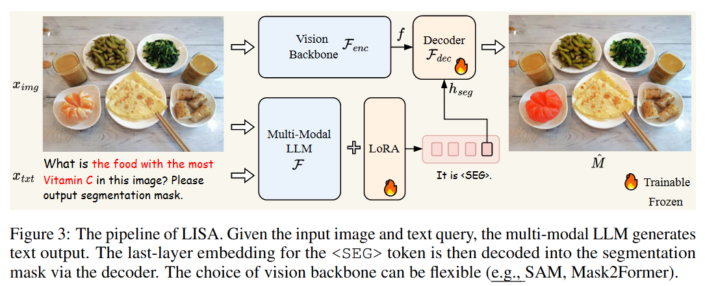
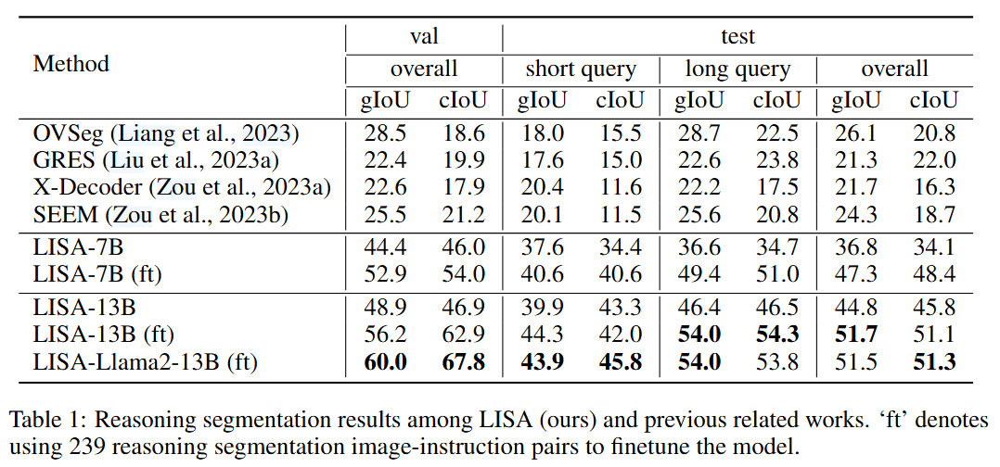

# 《LISA: Reasoning Segmentation via Large Language Model》

## 1. Introduction
- 提出问题：
  - 现有感知系统需要明确的人工指令，缺乏推理能力。
  - 推理分割任务（Reasoning Segmentation）的定义。
- 方法概述：
  - 提出 **LISA** 模型，将大语言模型的语言生成能力与分割掩码生成能力结合。
  - 引入 `<SEG>` 标记，利用 **Embedding-as-Mask** 方法扩展分割能力。
- 核心贡献：
  - 定义推理分割任务，强调模型的自推理能力。
  - 构建 ReasonSeg 基准测试集，包含 1218 对图像-指令样本。
  - 提出 LISA 模型，通过轻量级训练实现强大的零样本和少样本能力。

---

## 2. Related Work
### 2.1 Image Segmentation
- 语义分割、实例分割、全景分割等领域的相关研究。
- 多任务兼容模型（如 SAM, X-Decoder, SEEM）的发展现状。
- 当前模型的局限：缺乏推理能力。

### 2.2 Multi-modal Large Language Model
- 多模态大语言模型的发展，如 Flamingo, BLIP-2, LLaVA。
- 相关模型（如 VisionLLM, DetGPT）的特点和不足。
- 本文的定位：
  - 将分割能力高效注入多模态 LLM。
  - 解锁感知系统的自推理能力。

---

## 3. Reasoning Segmentation

### 3.1 Problem Definition
- 定义：
  - 输入：图像 $x_{img}$和隐含查询文本$x_{txt}$。
  - 输出：对应的二值分割掩码$ M$。
- 难点：与目标指代分割不同，推理分割涉及复杂推理和世界知识。

### 3.2 Benchmark: ReasonSeg
- 数据集：
  - 来源：OpenImages 和 ScanNetv2。
  - 查询文本分两种：短查询（short query）和长查询（long query）。
- 数据划分：
  - 训练集（239）、验证集（200）、测试集（779）。
- 用途：推动社区开发新技术。

---

## 4. Our Method

### 4.1 Architecture
- **Embedding-as-Mask** 方法：
  - 扩展 `<SEG>` 标记，用于请求分割掩码。
  - `<SEG>` 标记的嵌入向量通过 MLP 投影为掩码语义嵌入。
  - 结合视觉骨干网络（SAM/Mask2Former）提取的特征嵌入，生成最终掩码。
- 训练目标：
  - 文本生成损失$L_{txt}$（交叉熵）。
  - 掩码生成损失$L_{mask}$（BCE + DICE 损失）。

### 4.2 Training
- **训练数据**：
  - 语义分割数据、目标指代分割数据、视觉问答数据。
- **训练策略**：
  - LoRA 微调多模态 LLM。
  - 完全训练分割掩码解码器。
  - 冻结视觉骨干网络。
- **零样本能力**：
  - 不使用推理分割数据，直接在 ReasonSeg 上表现优异。
- **少样本微调**：
  - 仅使用 239 对推理分割样本进行微调，显著提升性能。

---

## 5. Experiment
### 5.1 Experimental Setting
- **网络架构**：
  - 多模态 LLM：LLaVA-7B-v1-1 / LLaVA-13B-v1-1。
  - 视觉骨干网络：SAM（ViT-H）。
  - 解码器：MLP 投影层，通道 [256, 4096, 4096]。
- **实现细节**：
  - 硬件：8 × NVIDIA 24GB 3090 GPUs。
  - 优化器：AdamW，学习率 0.0003。
  - 损失函数：文本损失 $L_{txt}$、掩码损失$L_{mask}$（BCE + DICE）。
- **数据集**
  - 语义分割数据集
  - 参考分割数据集
  - 视觉问答数据集（VQA）

- **评估指标**
  - gIoU和cIoU

### 5.2 Reasoning Segmentation Results

- **模型表现**：
  - LISA 在 ReasonSeg 数据集中优于现有方法（如 X-Decoder, SEEM）。
  - 提高了复杂推理任务的 gIoU 和 cIoU 指标。
  - 性能瓶颈：存在于LLM是否能很好地理解推理文本，LISA-13B的性能要明显优于LISA-7B。

### 5.3 Vanilla Referring Segmentation Results
- 比较任务：目标指代分割。
- LISA 在 refCOCO 系列基准数据集中表现优异，达到 SOTA 水平。

### 5.4 Ablation Study
- **视觉骨干网络**：
  - SAM 优于 Mask2Former-Swin-L。
- **LoRA 微调**：
  - 微调对性能的影响较小。
- **训练数据贡献**：
  - 使用语义分割数据显著提高性能。
  - 使用 GPT-3.5 对指令进行改写提升效果。

---

## 6. Conclusion
- 提出推理分割任务和 ReasonSeg 基准测试。
- 提出 LISA 模型，通过 Embedding-as-Mask 方法扩展分割能力。
- 展现出在复杂推理分割任务中的零样本和少样本能力。
- 未来方向：结合 LLM 和视觉任务的进一步发展。

---

## References
- 列出所有引用的相关研究。

---

## 附录（Appendix）
### A.1 Qualitative Results
- 提供推理分割的视觉结果展示，与现有方法的对比。