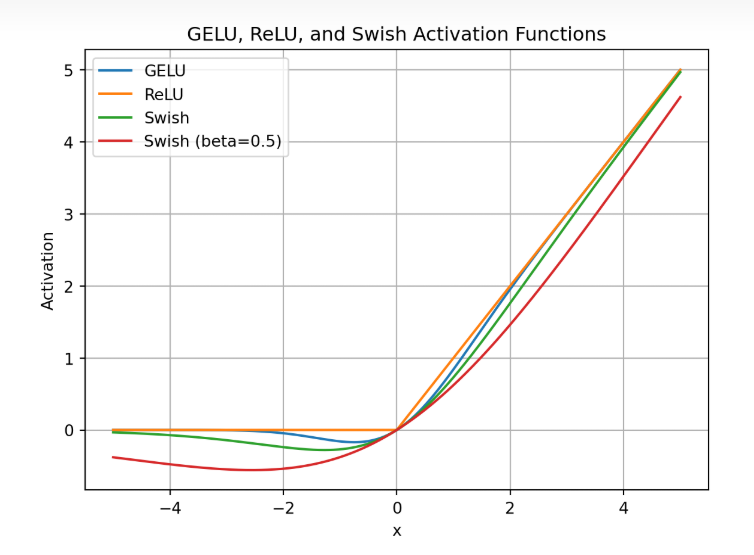
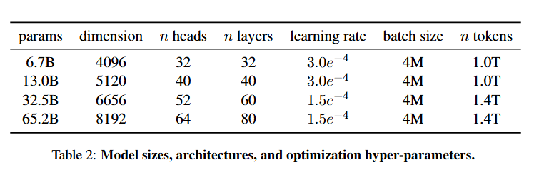

# LLaMA: Open and Efficient Foundation Language Models - 论文结构模板

## 1. **引言 (Introduction)**

#### 1.1. **背景**

大型语言模型（LLMs）近年来已经展现了从文本指令或少量示例中执行新任务的能力（即零样本和小样本学习），这主要得益于模型规模的扩展（参考 Brown et al., 2020 和 Kaplan et al., 2020 的研究）。研究人员发现，通过增加模型参数的数量，性能通常会有所提高。然而，**霍夫曼等人（Hoffmann et al., 2022）**的研究表明，在给定计算预算的情况下，性能的最优点并不由模型的最大规模决定，而是由更小规模的模型通过更大数据集训练而成。

#### 1.2. **问题与挑战**

尽管更大的模型在训练时可能更高效，但在推理阶段的成本较高，尤其当语言模型需要大规模服务时，这种成本尤为关键。为此，文章提出了一个关键问题：在目标性能水平下，理想的模型并非训练最快的，而是推理成本最低的。比如：

- 霍夫曼等人建议使用10B参数模型训练200B token的数据。
- 作者则发现，7B参数的模型在使用超过1万亿（1T）个token训练后，性能仍能不断提升。

#### 1.3. **LLaMA的目标**

这项研究的主要目标是：**在不同推理预算下训练一系列能够实现最佳性能的语言模型**。为此，作者训练了一组从7B到65B参数规模的语言模型，这些模型具备竞争力且只使用公开可用的数据集进行训练。这避免了依赖专有且无法获取的数据（如一些未公开的“图书数据”或社交媒体对话）。

#### 1.4. **主要贡献**

- LLaMA 系列模型的性能表现：
  - **LLaMA-13B** 参数模型超越了 GPT-3（175B参数）在大多数基准测试中的表现，尽管其参数量仅为GPT-3的十分之一。
  - **LLaMA-65B** 参数模型的性能与 Chinchilla-70B 和 PaLM-540B 等大型模型相当。
- 数据使用：模型的训练完全基于公开数据（如 CommonCrawl 和 Wikipedia），确保了研究的透明性和开源兼容性。这一点与依赖未公开数据集的模型（如 GPT-3）形成了鲜明对比。
- 开源：作者承诺将所有模型开放给研究社区，使得研究人员可以在单块 GPU 上运行这些模型，从而**推动大型语言模型的民主化**。

#### 1.5. **论文结构概述**

作者在后续部分中：

- 介绍了他们对 Transformer 架构的改进以及训练方法。
- 报告了模型的性能表现，并与其他主流语言模型进行了对比。
- 探讨了模型可能存在的偏见与毒性问题。

## 2. 方法(Approach)

### **2.1 预训练数据（Pre-training Data）**

#### **数据来源**

LLaMA 模型的训练数据来自多种公开数据源，涵盖了不同领域，确保数据的多样性和开放性。以下是数据来源的具体组成及其处理方式：

1. **CommonCrawl (67%)**：
   - 数据来自 2017 至 2020 年间的 CommonCrawl 数据集。
   - 处理流程包括：
     - 使用 CCNet 管道对数据进行去重。
     - 用 fastText 线性分类器进行语言识别，移除非英语网页。
     - 过滤低质量内容，例如用 n-gram 语言模型筛选。
     - 通过线性模型识别 Wikipedia 的参考页面，并删除不相关的页面。
2. **C4 (15%)**：
   - 数据集为 C4，旨在补充 CommonCrawl 数据。
   - 数据处理包括去重和语言识别，但过滤策略更注重句子长度、标点符号等启发式规则。
3. **GitHub (4.5%)**：
   - 数据源为公开的 GitHub 项目，只包含开源许可证（Apache、BSD、MIT）下的代码。
   - 使用启发式规则过滤低质量文件，并去除样板代码。
   - 文件级去重（完全匹配）。
4. **Wikipedia (4.5%)**：
   - 包括 2022 年 6 月至 8 月期间的 Wikipedia 数据，覆盖 20 种语言。
   - 处理流程包括移除超链接、注释以及其他格式化样板。
5. **Books (4.5%)**：
   - 包括 Gutenberg Project 和 Books3 数据集（来自 The Pile）。
   - 去重策略是在书籍层面，移除内容重复率超过 90% 的书籍。
6. **ArXiv (2.5%)**：
   - 数据来源于科学论文平台 ArXiv 的 LaTeX 文件。
   - 处理方式：
     - 移除摘要前的内容及参考文献。
     - 清理注释，并规范化用户定义的宏和命令。
7. **StackExchange (2%)**：
   - 包含 28 个最大的 StackExchange 网站数据，涵盖计算机科学、化学等多个领域。
   - 去除 HTML 标签并按评分排序。

#### **数据比例与处理**

- 所有数据被分成 1.4 万亿个 token。
- 训练过程中：
  - 大部分数据只训练一轮（1 epoch）。
  - Wikipedia 和 Books 数据重复使用约两轮。

**解释**： 这种数据选择和处理策略强调多样性和质量，确保 LLaMA 的训练数据覆盖了不同领域的高质量文本。同时，完全使用公开数据增强了模型的可开放性。

------

### **2.2 模型架构（Architecture）**

LLaMA 模型基于 Transformer 架构，并在以下几个方面进行了改进：

1. **预归一化（Pre-normalization）**：
   - 将归一化操作从子层输出移动到子层输入。
   - 使用 **RMSNorm** 替代 **LayerNorm**，提升训练稳定性。
   - 改进来源：GPT-3。
2. **SwiGLU 激活函数**：
   - 使用 **SwiGLU** 替代标准的 **ReLU** 激活函数。
   - **SwiGLU** 提供更高的非线性表达能力，同时具有较高的效率。
   - 改进来源：PaLM。
   - 

3. **旋转位置嵌入（Rotary Positional Embeddings, RoPE）**：

   - 移除了绝对位置嵌入，改用 **RoPE**，使位置信息嵌入更有效。

   - **RoPE** 可以自然地扩展到长序列建模，提升对长距离依赖的捕获能力。

   - 改进来源：GPT-Neo。

4. **架构参数调整**：

   - 根据模型规模调整隐藏层维度、注意力头数和 Transformer 层数，优化性能和计算成本。

#### **模型参数**

模型共有四种大小，超参数如下：

| 参数规模 | 隐藏层维度 | 注意力头数 | 层数 | 学习率      | 批量大小 | token 数 |
| -------- | ---------- | ---------- | ---- | ----------- | -------- | -------- |
| 6.7B     | 4096       | 32         | 32   | $3.0e^{-4}$ | $4M$     | $1T$     |
| 13B      | 5120       | 40         | 40   | $3.0e^{-4}$ | $4M$     | $1T$     |
| 32.5B    | 6656       | 52         | 60   | $1.5e^{-4}$ | $4M$     | $1.4T$   |
| 65.2B    | 8192       | 64         | 80   | $1.5e^{-4}$ | $4M$     | $1.4T$   |

**解释**： 这些改进专注于提高训练效率和模型性能，例如预归一化提高了训练稳定性，RoPE 改进了长距离依赖建模能力。

------

### **2.3 优化器（Optimizer）**

1. **优化算法**：
   - 使用 AdamW 优化器，参数为：
     - $\beta_1 = 0.9$     ,     $\beta_2 = 0.95$。
     - 学习率采用余弦调度策略，最终学习率为最大值的 10%。
     - 权重衰减设置为 0.1，梯度裁剪阈值为 1.0。
2. **学习策略**：
   - 使用 2000 步的热身（warm-up）。
   - 批量大小和学习率随模型规模调整。

#### **训练效率**

- 训练实现了高效的因果多头注意力计算，减少了内存使用。
- 使用检查点技术减少反向传播中重新计算的激活数量。
- 最大化 GPU 通信与激活计算的重叠。

#### **训练速度**

- 使用 2048 块 A100 GPU，每块处理 380 token/s。
- 训练 65B 模型共需 1.4 万亿 token，耗时约 21 天。

**解释**： 这些优化策略着重于在硬件和算法层面提高训练效率，使得大规模训练任务能够在合理的时间和资源内完成。

### 2.4 Efficient Implementation（高效实现）

1. **高效因果多头注意力**：
   - 避免存储注意力权重和屏蔽的 Key/Query 分数，降低内存使用和计算需求。

2. **激活检查点**：

   - 保存关键激活值，减少反向传播中的激活重新计算。

   - 手动实现 Transformer 层的反向传播，进一步优化内存和速度。

3. **模型与序列并行**：
   - 使用模型并行和序列并行技术，将计算和存储分布在多块 GPU 上。

4. **计算与通信重叠**：
   - 优化 GPU 激活计算和网络通信的重叠，提升资源利用效率。

5. **硬件性能**：
   - 使用 2048 块 A100 GPU，训练 65B 模型处理速度达 380 token/s，耗时约 21 天。