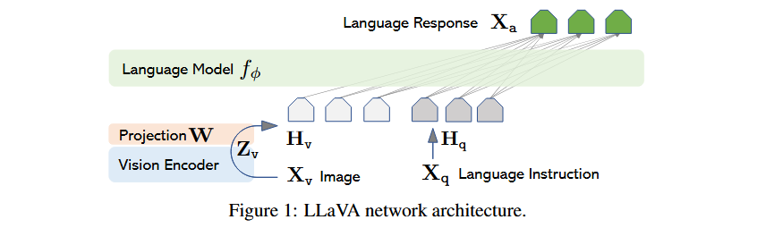

# 《Visual Instruction Tuning》

> - 本文提出了LLaVA，一种多模态大模型，通过语言和视觉结合的指令调整训练，展示了卓越的多模态对话能力。
> - 使用GPT-4生成的多模态数据进行训练，并在Science QA数据集上实现了新的SOTA性能。

[TOC]

------

### **1. Introduction（引言）**

- 研究背景：多模态模型结合视觉和语言，追求通用的AI助手目标。
- 现状：现有模型通常独立处理单一任务，缺乏对复杂指令的广泛适应能力。
- 贡献：首次探索多模态领域的指令调整，提出LLaVA模型，支持通用视觉语言任务。

------

### **2. Related Work（相关工作）**

- 概述了计算机视觉和自然语言处理中与指令调整和多模态模型开发相关的主要工作。
- 提及OpenAI的GPT-4、LLaMA，以及Flamingo等模型。
- **多模态任务独特性**： 本文填补了多模态指令调整的研究空白，首次探索如何通过生成的视觉-语言指令数据提升模型的指令跟随能力。
- **创新**： 与视觉提示调整（Visual Prompt Tuning）不同，本文的视觉指令调整旨在提升模型处理复杂指令的能力，为构建通用的视觉语言助手奠定基础。

#### **2.1 多模态指令跟随代理（Multimodal Instruction-following Agents）**

- 分类

  1. 端到端训练模型

     ：专注于特定任务的研究，例如：

     - **视觉-语言导航任务**（如 Habitat）要求代理根据自然语言指令在视觉环境中完成一系列操作。
     - **图像编辑领域**中的 **InstructPix2Pix**：根据输入的图像和文本指令编辑图像。

  2. **系统协调多个模型**：通过 LangChain 或大型语言模型（如 Visual ChatGPT 和 X-GPT）整合不同任务。

- 差异

  ：

  - 作者的研究聚焦于开发一个面向多任务的端到端训练的多模态模型，而非依赖于外部模型协同的系统。

------

#### **2.2 指令调优（Instruction Tuning）**

- **自然语言处理中的发展**：

  - 大型语言模型（如 GPT-3、T5、PaLM、OPT）通过指令调整提升模型的零样本和少样本泛化能力。
  - 指令调整的成功案例：InstructGPT、FLAN-T5、FLAN-PaLM、OPT-IML。

- **迁移到多模态领域**：

  - Flamingo：被认为是多模态领域的 “GPT-3时刻”，展示了强大的零样本任务迁移和上下文学习能力。
  - BLIP-2、FROMAGe、KOSMOS-1：这些模型利用图像-文本对训练，但未显式使用视觉-语言指令数据进行调整。
  - PaLM-E：面向具身AI的多模态模型。

  > 具身AI（Embodied AI）旨在通过整合多种感知能力（如视觉、语言、触觉等）和行动能力（如导航、操作、对话等）来完成任务。
  >
  > 它通常模拟一个具身代理（Embodied Agent），以接近人类在真实世界中的行为模式，包括感知、推理、决策和行动。

  - OpenFlamingo 和 LLaMA-Adapter：开放源码模型，将图像输入与 LLaMA 结合。

- **贡献与研究空白**：

  - 现有模型未显式使用视觉-语言指令数据进行调整。
  - 本文提出视觉指令调整（Visual Instruction Tuning），专注于提升模型的指令跟随能力，而非仅提高参数高效性。

------

### **3. GPT-assisted Visual Instruction Data Generation（基于GPT的视觉指令数据生成）**

- 提出了一种基于GPT-4的数据生成方法，利用图片和文本对生成视觉指令数据。
- 数据形式：
  - **对话型数据（Conversation）**：模拟助理与用户对图片内容的问答。
  - **详细描述数据（Detailed Description）**：生成图像的全面描述。
  - **复杂推理数据（Complex Reasoning）**：涉及多步逻辑推理的问答。

#### **3.1 Conversation（对话型数据）**

- **目的**：通过模拟助理与用户的对话，生成与图像相关的问题和回答。
- **示例**：
  - **图像**：图像中是几个人正在尝试将行李装入一辆黑色的 SUV。
  - **问题**：问图像中某个物体的类型、数量、位置等。
  - 对话内容：
    - **问题**：图像中的车辆是什么类型？
    - **回答**：图像中的车辆是一辆黑色的运动型多用途车（SUV）。
    - **问题**：人们在图像中做什么？
    - **回答**：他们正在尝试将行李装进 SUV 中，似乎是准备去旅行。
- **分析**：
  - **简洁与明确**：该对话类型生成的问答都基于图像内容，问题简单明了，回答也非常直接。通过这种方式，模型可以学习如何从视觉信息中提取具体细节，并用自然语言进行表述。
  - **应用场景**：这种问答形式非常适合训练聊天型机器人，帮助机器人根据图像内容回答用户提出的具体问题。

#### **3.2 Detailed Description（详细描述）**

- **目的**：生成图像的详细描述，涵盖图像的各个方面，通常比对话型数据提供更多的细节。
- **示例**：
  - **图像**：图像展示了同样的情景——几个人围着黑色 SUV 包装行李。
  - 描述内容：
    - **详细描述**：图像显示在一个地下停车场，黑色 SUV 停在停车位上，周围散落着各种行李物品。场景中有三个人，分别站在车辆的左侧、中间和右侧。他们正在合作将行李放入 SUV，准备开始一次旅行。图像中还可以看到其他几辆停着的车，和一个看起来有些拥挤的环境。
- **分析**：
  - **信息丰富**：与对话型数据相比，详细描述给出了更全面的图像内容，覆盖了多个层次的细节，不仅描述了图像中主要的物体（如 SUV 和行李），还提供了额外的上下文（如停车场、其他车辆等）。
  - **用途**：这种类型的数据有助于模型学习如何生成详细的文本描述，适合用于图像字幕生成和增强图像理解能力。

#### **3.3 Complex Reasoning（复杂推理）**

- **目的**：生成需要多步推理和深度理解的复杂问题和答案，通常涉及更多的背景知识。
- **示例**：
  - **图像**：与前面两种类型相同，是图像中三个人和一辆 SUV。
  - 推理问题：
    - **问题**：这些人面临的挑战是什么？
    - **回答**：这群人站在一辆黑色 SUV 前面，四周是各种行李物品，他们面临的挑战是如何高效地将所有的行李装进车里。显然，他们的物品很多，需要仔细考虑如何合理安排行李的位置，以确保车内空间得到最大化利用。此外，他们还需要考虑到旅行中的舒适性和安全性，确保行李不会影响司机的视线，也不会让车内乘客感到不适。
- **分析**：
  - **深度推理**：这个问题要求模型不仅仅提取图像中的简单信息，还需要推理出人物面临的具体挑战，并给出多方面的推理过程（如行李安排、舒适性、安全性等）。
  - **用途**：复杂推理数据有助于训练模型进行更深入的语义理解，尤其是涉及背景知识和实际问题解决时。这种数据类型对于提升模型的推理能力至关重要，适合于更高级的多模态任务（例如，科学问答或复杂场景理解）。

------

### **4. Visual Instruction Tuning（视觉指令调整）**

> **目标**：通过“视觉指令调整”（Visual Instruction Tuning），将视觉和语言模型的能力进行结合，训练一个通用的视觉语言助手，能够理解并执行多种视觉和语言任务。
>
> - 传统的视觉模型通常只针对特定的任务进行训练，如图像分类或物体检测，而语言模型则是基于文本数据进行训练的。
> - 视觉指令调整的核心目标是使模型不仅能够理解视觉信息，还能够根据语言指令生成响应，进行推理或执行复杂任务。

#### 4.1 **Architecture（架构）**

##### **1. 图像输入 $X_v$**

- $X_v$ 是图像输入数据，通过视觉编码器处理。
- 视觉编码器：
  - 提取图像特征，输出一个视觉特征向量 $Z_v$。
  - 这个向量是图像的高维嵌入表示，包含图像的核心信息（如物体、场景等）。

##### **2. 投影矩阵 $W$**

- 作用：
  - 将视觉编码器输出的图像特征 $Z_v$ 转换为与语言模型嵌入空间兼容的特征表示 $H_v$。
  - 投影矩阵 $W$ 是一个可训练的*线性变换*，用于在视觉特征和语言嵌入之间建立联系。
- 输出：
  - 经过投影后，生成的视觉特征 $H_v $能够与语言模型的输入格式对齐。

##### **3. 文本指令输入 $X_q$ **

- $X_q$ 是语言模型的文本输入部分，即用户提供的语言指令或问题。
- 语言模型会将文本指令编码为特征向量 $H_q$，作为模型进一步推理的基础。

##### **4. 联合处理（融合视觉和语言特征）**

- 融合：
  - 视觉特征 $H_v$ 和语言特征 $H_q$ 一起输入到语言模型。
  - 语言模型根据视觉特征和语言指令，进行语义理解和推理。

##### **5. 输出：语言响应 $ X_a $ **

- $ X_a $  是语言模型生成的输出，即最终的文本响应。
- 输出可能是对图像的描述、问题的答案或其他基于图像和指令生成的结果。

##### **数据流解析**

1. 图像输入 $X_v$ → 视觉编码器 → 提取视觉特征 $Z_v$。
2.  $Z_v$ → 投影矩阵  $W$ → 转换为嵌入空间特征  $H_v$。
3. 文本输入  $X_q$ → 语言模型编码 → 得到语言特征  $H_q$。
4. 视觉特征$H_v $和语言特征  $H_q$→ 联合输入到语言模型 $f_\phi$。
5. 模型生成最终语言响应 $X_a$。

#### 4.2 **Training（训练）**

- **阶段1：特征对齐预训练（映射层$W$）**，将视觉特征与预训练语言模型的嵌入对齐。
- **阶段2：端到端微调语言模型+映射层**，优化多轮对话、科学问答等任务的能力。

------

### **5. Experiments（实验）**

#### 5.1 **Multimodal Chatbot（多模态聊天机器人）**

- 实验表明LLaVA在未见过的数据上展现出与多模态GPT-4接近的推理能力。
- 通过GPT-4对响应质量的评估，验证模型性能提升。

#### 5.2 **ScienceQA（科学问答）**

- 在Science QA数据集上达到92.53%的准确率，刷新SOTA。
- 将LLaVA与GPT-4结合，通过模型融合进一步提高性能。

------

### **6. Discussions（讨论）**

- 提到扩展数据规模和引入更多视觉模型的潜力。
- 未来工作包括结合更强大的视觉编码器（如SAM），提升模型能力。