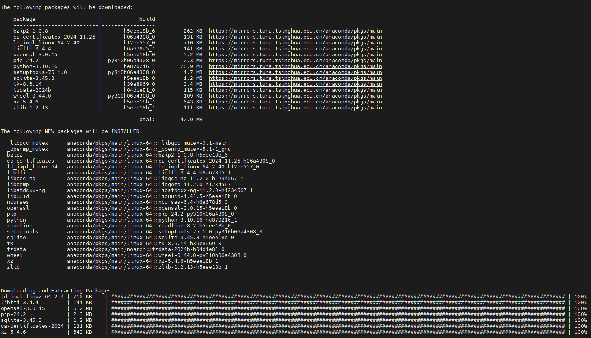
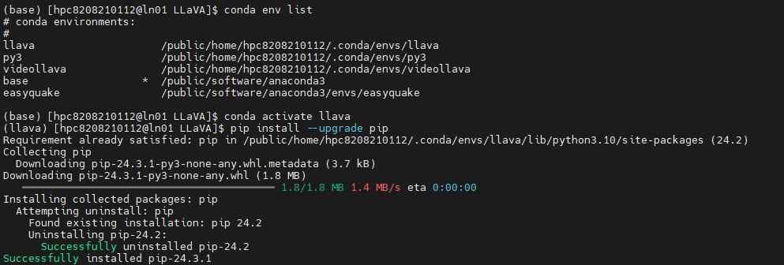

## 〇、Install

1. Clone this repository and navigate to LLaVA folder

```
git clone https://github.com/haotian-liu/LLaVA.git
cd LLaVA
```


2. Install Package

```
conda create -n llava python=3.10 -y
conda activate llava
pip install --upgrade pip  # enable PEP 660 support
pip install -e .
```






3. Install additional packages for training cases

```
pip install -e ".[train]"
pip install flash-attn --no-build-isolation    #执行这个命令如果出错了，大概率是cuda或者pytorch的版本与llava不兼容，重新安装指定版本即可
```

### Upgrade to latest code base

```
git pull
pip install -e .

# if you see some import errors when you upgrade,
# please try running the command below (without #)
# pip install flash-attn --no-build-isolation --no-cache-dir


```


## 一、在本地配置llava环境时，会出现Pytorch和cuda版本不匹配，原因是Pytorch自动使用了系统中的11.8版本的CUDA

### **1. 卸载当前 PyTorch**

确保当前环境中没有冲突的 PyTorch 版本：

```bash
pip uninstall torch torchvision torchaudio -y
```

------

### **2. 安装 PyTorch（带内置 CUDA 12.1）**

使用 PyTorch 官方的 `pip` 安装源指定 CUDA 12.1：

```bash
pip install torch torchvision torchaudio --index-url https://download.pytorch.org/whl/cu121   # 这样下载的pytorch版本与LLAVA不兼容

pip install torch==2.1.2 torchvision==0.16.2 --index-url https://download.pytorch.org/whl/cu121 # 可以使用这种方式指定版本

```

这样，安装的 PyTorch 会包含其自带的 CUDA 12.1 库，不再依赖系统中安装的 CUDA 11.8。

------

### **3. 验证安装是否成功**

安装完成后，可以通过以下代码验证：

```py
import torch
print(torch.__version__)       # 确认 PyTorch 版本
print(torch.version.cuda)      # 确认 CUDA 版本
print(torch.cuda.is_available())  # 确认 CUDA 是否可用
```

如果输出显示 CUDA 版本为 `12.1`，并且 `torch.cuda.is_available()` 返回 `True`，说明安装成功。

------

### **注意事项**

1. **系统中的 CUDA 驱动版本**：即使使用 PyTorch 自带的 CUDA 12.1，也需要确保系统的 NVIDIA 驱动支持 CUDA 12.1。使用以下命令确认驱动支持的 CUDA 版本：

   ```bash
   nvidia-smi
   nvcc --version # 查看当前cuda版本
   ```

   输出中的 `CUDA Version` 必须大于或等于 12.1。

2. **系统中的旧版本 CUDA**：安装 PyTorch 自带的 CUDA 库时，不会影响系统中已有的 CUDA 版本（如 11.8），它们可以共存。

3. **安装其他依赖**：如果您还需要安装其他依赖（如 `flash-attn`），请确保它们与 PyTorch 的 CUDA 版本兼容。


## 二、重新下载torchaudio使其兼容LLAVA

#### **1. 卸载不兼容的 `torchaudio` 并安装兼容版本**

根据 LLaVA 的需求，`torch==2.1.2` 对应的 `torchaudio` 版本是 `2.1.2`。

运行以下命令修复：

```bash
pip uninstall torchaudio -y
pip install torchaudio==2.1.2 --index-url https://download.pytorch.org/whl/cu121
```

#### **2. 验证安装**bash


复制代码

安装完成后，检查当前环境中的 PyTorch、torchvision 和 torchaudio 版本：

```bash
python -c "import torch; import torchvision; import torchaudio; print(torch.__version__, torchvision.__version__, torchaudio.__version__)"
```

输出应为：

```
2.1.2 0.16.2 2.1.2
```

------

### **其他注意事项**

- **确保 CUDA 运行正常**： 验证 PyTorch 是否正确检测到 GPU 和 CUDA：

  ```py
  import torch
  print(torch.cuda.is_available())  # 应输出 True
  ```

- **清理未使用的包**： 如果环境中存在许多未使用的包，可以使用以下命令清理：

  ```bash
  pip freeze | grep -v "torch" | xargs pip uninstall -y
  ```

  

## **三、CUDA 库缺失** (`libcusparse.so.12` 问题)：使用`locate libcusparse.so.12`定位，然后添加到环境变量即可

  要将 `/home/hpc/anaconda3/envs/llava/lib/python3.10/site-packages/nvidia/cusparse/lib/` 添加到环境变量 `LD_LIBRARY_PATH`，可以按照以下步骤操作：

------

  ### **1. 临时添加环境变量**

  这种方法只对当前会话有效，当关闭终端后环境变量会消失。

  运行以下命令：

  ```bash
export LD_LIBRARY_PATH=/home/hpc/anaconda3/envs/llava/lib/python3.10/site-packages/nvidia/cusparse/lib:$LD_LIBRARY_PATH
  ```

  然后运行脚本验证是否解决问题。

------

  ### **2. 永久添加环境变量**

  如果希望每次打开终端时自动加载路径，可以将路径写入 `~/.bashrc` 文件。

  #### **步骤：**

  1. 编辑 `~/.bashrc` 文件：

     ```bash
     nano ~/.bashrc
     ```

  2. 在文件末尾添加以下行：

     ```
     export LD_LIBRARY_PATH=/home/hpc/anaconda3/envs/llava/lib/python3.10/site-packages/nvidia/cusparse/lib:$LD_LIBRARY_PATH
     ```

  3. 保存文件并使其立即生效：

     ```bash
     source ~/.bashrc
     ```

  4. 验证是否成功：

     ```bash
     echo $LD_LIBRARY_PATH
     ```

------

  ### **3. 验证环境变量设置**

  运行以下命令，确认 `libcusparse.so.12` 是否可以被正确加载：

  ```bash
ldconfig -p | grep libcusparse
  ```

  或者直接运行脚本检查问题是否解决：

  ```bash
python -u "/home/hpc/Desktop/LLaVA/quick_start.py"
  ```


## 四、无法连接huggingface

#### **原因**

无法连接 `https://huggingface.co`，可能是网络问题或超时。

#### **解决方法**


1. **检查网络连接** 通过以下命令确认能否访问 Hugging Face：

   ```bash
   curl -I https://huggingface.co
   ```

   如果无法访问，可能需要切换网络或使用代理。

2. **设置代理** 如果您需要代理来访问外网，可以在运行脚本时设置代理：

   ```bash
   export http_proxy=http://127.0.0.1:7890
   export https_proxy=http://127.0.0.1:7890
   ```

   然后重新运行脚本。

3. **手动下载模型** 如果网络无法解决，可以手动下载 Hugging Face 上的模型到本地：

   - 模型页面：https://huggingface.co/liuhaotian/llava-v1.5-7b
   - 下载后，将模型文件放在本地目录中，并修改代码中 `model_path` 的路径为本地路径。

4. **使用离线模式** 设置 `TRANSFORMERS_OFFLINE` 环境变量，让 Transformers 使用本地缓存：

   ```bash
   export TRANSFORMERS_OFFLINE=1
   ```

   这需要您确保所有模型文件已被缓存到本地。

## 五、[CUDA显存溢出问题](https://blog.csdn.net/qq_58400270/article/details/135072952)

查阅资料得知该问题主要是由显存不足引起，可能的解决方案包括以下几种：

- 减小`batch_size`，使用小批次评估和训练可以减小显存消耗；
- 推理阶段忽略代码的梯度变化，`with torch.no_grad()`可以有效节省显存；
- 减小输入大小
- …

根据建议设置了`max_split_size_mb`，命令行输入：

```bash
set PYTORCH_CUDA_ALLOC_CONF=max_split_size_mb:32
```

再次出现报错：

```bash
RuntimeError: cuDNN error: CUDNN_STATUS_NOT_INITIALIZED
```

查阅资料得知可能是`cudnn`，`cuda`，`pytorch`的配置问题，因为前期准备的时候是对照着相应版本下载的，应该不存在兼容性问题。考虑环境变量配置问题（笔者也没搞懂具体原因），在环境变量中添加`CUDNN_HOME`，`CUDA_HOME`以及库环境变量。

```bash
export LD_LIBRARY_PATH=/usr/local/cuda/lib64:$LD_LIBRARY_PATH
export CUDNN_HOME=/usr/local/cuda
export CUDA_HOME=/usr/local/cuda
```

配置好`source`之后重启命令行生效（这里笔者因为没有重启命令行所以仍然一直报错，也没找到其他方法，确实重启解决90%的问题），检查环境变量配置。

```bash
echo $LD_LIBRARY_PATH
echo $CUDNN_HOME
echo $CUDA_HOME
```

检查无误后运行程序，得到输出如下：

```bash
Loading checkpoint shards: 100%|███████████████████████████████████████████████████████████████████████████████████████████████████████| 2/2 [00:16<00:00,  8.08s/it]
When visiting this location, which features a pier extending over a large body of water, there are a few things to be cautious about. First, be mindful of the weather conditions, as the pier may be affected by strong winds or storms, which could make it unsafe to walk on. Second, be aware of the water depth and any potential hazards, such as submerged rocks or debris, that could pose a risk to your safety. Additionally, be cautious of the presence of wildlife in the area, as there might be birds or other animals that could pose a threat or disturbance. Finally, be respectful of the environment and other visitors, and follow any posted rules or guidelines to ensure a safe and enjoyable experience for everyone.
```

> 个人经验：demo分为两部分：第一部分是加载模型，第二部分是评估模型，千万不要把两份代码写在一起，运行评估时必须注释掉前面的部分，不然必然导致CUDA显存溢出。当我把前半部分一注释掉，单独评估模型是不会导致显存溢出的！！

六、[将模型下载到本地，并进行推理运行](https://blog.csdn.net/weixin_38252409/article/details/134183555)

