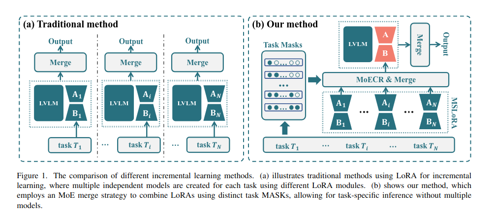

# 《Modality-Specific LoRA Fine-Tuning over Mixture of Experts with Contrastive  Regularization for Multimodal Biomedical Image Incremental Learning》

## **1. 引言**

增量学习要求模型按顺序学习多个任务，平衡两个关键方面：保持对先前学习任务的性能（稳定性）和适应新任务（可塑性）。尽管大多数增量学习算法都专注于单模态内的任务增量，但生物医学领域由于图像模态的多样性（如放射学和病理学）提出了独特的挑战，这种复杂性增加了确保稳定性和可塑性的难度。为了解决这一问题，我们引入了多模态生物医学图像增量学习（MBIIL）任务，旨在增量式地训练一个统一模型，使其能够处理各种生物医学图像模态和任务。MBIIL任务提出了两个主要挑战：在更新过程中保持先前学习模态和任务的性能，以及高效利用预训练模型来支持新任务的学习。

最近在参数高效微调（PEFT）方法方面的进展促进了增量学习的发展，其中LoRA受到了广泛关注。这些方法涉及冻结预训练模型，同时为每个新任务微调一小部分可学习参数。虽然这种方法解决了任务适应的挑战，但它没有考虑新旧LoRA参数之间的交互，这可能导致次优性能。为了克服这一问题并解决知识共享的第二个挑战，InfLoRA引入了一个子空间矩阵，以防止新任务与先前学习任务之间的干扰。混合专家（MoE）适配器进一步通过学习任务特定的路由来增强这一点，以适应性地合并LoRA参数，特别是在CLIP框架中。然而，这些方法主要针对自然场景图像的任务增量学习设计，没有考虑模态增量学习的复杂性。

在本文中，我们通过在不同的生物医学图像模态上应用任务增量学习来解决MBIIL问题。由于任务增量学习在推理时提供任务身份，模型可以在适应新任务的同时保持对先前学习任务的性能。我们采用这种策略来为新任务增量式地微调LoRA参数，从而保持已学习模态和任务的性能。如图1所示，与现有方法不同，这些方法独立微调新LoRA参数，我们提出了一种对比正则化技术，以促进同一模态任务的LoRA参数之间具有更高的相似性，以及不同模态之间具有更高的不相似性。这种对比学习增强了多模态生物医学图像增量学习中的整体性能。

此外，如图1（b）所示，我们利用混合专家方法根据任务掩码合并LoRA参数。这种方法允许我们将来自当前和先前任务的LoRA参数合并，有效地在顺序学习过程中利用从早期任务中获得的知识。我们的模型通过合并不同的专家实现了更大的专业化，同时与为每种模态和任务训练单独模型相比，降低了部署成本。这种效率是由于在推理过程中只使用合并的LoRA参数，确保没有额外的计算开销。

本文的主要贡献如下：

- 我们引入了MBIIL问题，并提出了**模态特定的LoRA微调结合混合专家与对比正则化（MSLoRA-MoECR）**方法来解决它。我们的方法利用已训练的LoRA参数，通过对比学习跨LoRA模块正则化新LoRA参数。
- 我们提出了一种**掩码合并策略**，用于在训练和推理期间合并不同的LoRA参数。这种策略在保持模型对每个任务的性能的同时，确保没有额外的计算开销。
- 在放射学和病理学图像的不同任务上的广泛实验验证了所提出的MSLoRA-MoECR方法的有效性。

## 2. 相关工作

### **1. 持续学习（Continual Learning）**

- **核心目标**：使模型能够逐步适应新任务，同时保留先前学习的知识，避免灾难性遗忘。
- **主要方法分类**：
  - **基于正则化的方法**：通过在损失函数中添加正则化项，限制权重更新，以保留对先前任务至关重要的参数。
  - **基于回放的方法**：利用记忆缓冲区保留先前任务的信息，并在学习新任务时回放这些信息。
  - **基于架构的方法**：将模型划分为共享组件和动态任务特定模块，随着新任务的出现而扩展。
- **与本文的关系**：本文提出的方法属于基于架构的方法，通过在预训练模型中插入LoRA模块，实现对新任务的适应，同时保持对旧任务的性能。

### **2. 参数高效微调（Parameter Efficient Fine-Tuning, PEFT）**

- **核心目标**：在微调预训练模型时，通过引入少量可训练参数，减少资源消耗和过拟合风险。
- **主要方法分类**：
  - **基于适配器的方法**：在预训练模型中添加额外的可训练组件（如线性层）。
  - **基于提示的方法**：通过在输入嵌入前添加可学习的嵌入矩阵来引导模型适应下游任务。
  - **基于增量的方法**：如LoRA，通过在模型的线性层中引入低秩分解的增量参数。
- **与本文的关系**：本文基于LoRA方法，通过冻结预训练模型的参数，仅对新任务的LoRA模块进行微调，从而实现参数高效的增量学习。

### **3. 生物医学大型视觉语言模型训练（Biomedical Large Vision Language Model Training）**

- **核心目标**：开发能够处理多种生物医学图像模态和任务的通用模型，提高模型的通用性和实用性。
- **主要方法分类**：
  - **联合训练方法**：将不同模态和任务的数据整合到一个统一的模型中，进行全面微调。
  - **预训练加任务特定微调**：先在基础生物医学知识和一般视觉任务上预训练模型，然后针对特定任务进行微调。
- **与本文的关系**：本文提出的方法结合了持续学习和参数高效微调技术，通过对比正则化和混合专家机制，解决了多模态生物医学图像增量学习中的关键问题。这种方法不仅提高了模型的适应性和稳定性，还减少了计算资源的消耗。