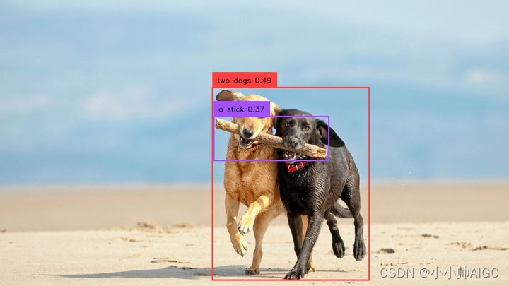

 

# Grounding [DINO](https://so.csdn.net/so/search?q=DINO&spm=1001.2101.3001.7020): Marrying DINO with Grounded Pre-Training for Open-Set Object Detection

**对于Grounding DINO paper地详细阅读，请移步之前的文章：**

[由文本提示检测图像任意目标(Grounding DINO)论文阅读: Marrying DINO for Open-Set Object Detection](https://zhuanlan.zhihu.com/p/680702265)

> 结合Grounding DINO paper和Grounding DINO code，真正理解Grounding DINO的设计思路和整体数据走向

本篇主要针对Grounding DINO code的使用，以及从代码端对model进一步理解：很多人看完论文后，其实对模型的构造以及数据中维度的流向是一知半解的。因此，本篇将详细讲解model中每个部件的构成。本篇较长，包含了交叉注意力机制，多池可变形注意力机制等源码的详细讲解。  
因篇幅较长（4.6w+字！！！），可能存在错误的地方，请多多包涵！

## 1.Grounding DINO安装/简单上手

### 1.1.Installation (安装官方指南)

1.从 GitHub 克隆 GroundingDINO 仓库

```python
git clone https://github.com/IDEA-Research/GroundingDINO.git
```

> 如果git出现网络超时问题，可以自行从Github中下载到本地

2.将当前目录更改为 GroundingDINO 文件夹

```python
cd GroundingDINO/
```

3.在当前目录下安装所需的依赖项

```python
pip install -e .
```

4.下载预训练的 groundingdino-swin-tiny 模型

```python
wget https://github.com/IDEA-Research/GroundingDINO/releases/download/v0.1.0-alpha/groundingdino_swint_ogc.pth
```

> Note:如果要使用GPU运行，需要提前设置 export CUDA\_HOME=/path/to/cuda\-xxx，否则在运行的时候会报错: NameError: name ‘\_C’ is not defined  
> 如果忘记设置，需要设置后在重新安装GroundingDINO，即重新执行 pip install -e .

### 1.2.Running with Python （简单上手）

1.创建一个新的python文件命名为：grounding\_dino\_demo.py 放在GroundingDINO目录下，其代码如下：

```python
from groundingdino.util.inference import load_model, load_image, predict, annotate, Model
import cv2
CONFIG_PATH = "groundingdino/config/GroundingDINO_SwinT_OGC.py"    #源码自带的配置文件
CHECKPOINT_PATH = "./groundingdino_swint_ogc.pth"   #下载的权重文件
DEVICE = "cpu"   #可以选择cpu/cuda
IMAGE_PATH = "../assets/demo4.jpg"    #用户设置的需要读取image的路径
TEXT_PROMPT = "Two dogs with a stick."    #用户给出的文本提示
BOX_TRESHOLD = 0.35     #源码给定的边界框判定阈值
TEXT_TRESHOLD = 0.25    #源码给定的文本端获取关键属性阈值
image_source, image = load_image(IMAGE_PATH)
model = load_model(CONFIG_PATH, CHECKPOINT_PATH)
boxes, logits, phrases = predict(
    model=model,
    image=image,
    caption=TEXT_PROMPT,
    box_threshold=BOX_TRESHOLD,
    text_threshold=TEXT_TRESHOLD,
    device=DEVICE,
)
annotated_frame = annotate(image_source=image_source, boxes=boxes, logits=logits, phrases=phrases)
cv2.imwrite("../result_image/annotated_image.jpg", annotated_frame)
123456789101112131415161718192021AI写代码
```

> Note:  
> 在运行过程中因为使用了bert做为文本编码器，当本地文件没有bert权重文件时，程序会自动请求[bert-base-uncased·Hugging Face](https://huggingface.co/bert-base-uncased)并下载权重文件，但是如果存在网络问题，即出现443时，可以进行手动下载，并将下载的文件保存到bert-base-uncased文件夹下，放在GroundingDINO目录下（需要下载的文件：config.json/pytorch\_model.bin/tokenizer.json/tokenizer\_config.json/vocab.txt）

**图为我的输入image示例**：  


**图为Grounding DINO的输出结果，输出box/scores/entity property of text：**  


## 2.从Grounding DINO code角度解析其model构造

### 2.1.Model结构

Grounding DINO是一种双编码器-单解码器架构。它包含用于**图像特征提取的图像主干、用于文本特征提取的文本主干，用于图像和文本特征融合的特征增强器，用于查询初始化的语言引导查询选择模块和用于框细化的跨模态解码器**（共5个大模块）。

### 2.2.处理流程

输入：（图像，文本）对 对于每个(图像、文本)对，首先分别使用\*\*Swin

+   Transformer和Bert\*\*提取普通图像特征和普通文本特征。
+   这两个普通特征被送到用于**跨模态特征融合的特征增强器模块**（颈部模块）中。
+   在获得跨模态文本和图像特征后，使用**语言引导的查询选择模块**从图像特征中选择**跨模态查询**。
+   这些跨模态查询将被送到**跨模态解码器**（头部模块）中，以从双模态特征中探测所需特征并更新它们自己。

输出：最后一个解码器层的输出查询将用于预测对象框并提取相应的短语以及scores

> note: 颈部模块（Neck Module）是VLP模型中的一部分，主要负责图像和文本特征的融合。 头部模块（Head Module）是VLP模型中的一部分，主要负责根据预训练的特征进行下游任务的推断和预测。

### 2.3.进入模型前的准备工作

### 2.3.1.加载图片预处理（image）

`image_source, image = load_image(IMAGE_PATH)`: 它接受一个图像路径作为输入，并返回原始图像数组以及经过预处理后的图像张量。

```python
def load_image(image_path: str) -> Tuple[np.array, torch.Tensor]:
    transform = T.Compose(
        [
            T.RandomResize([800], max_size=1333),
            T.ToTensor(),
            T.Normalize([0.485, 0.456, 0.406], [0.229, 0.224, 0.225]),
        ]
    )
    image_source = Image.open(image_path).convert("RGB")
    image = np.asarray(image_source)
    image_transformed, _ = transform(image_source, None)
    return image, image_transformed
123456789101112AI写代码
```

**函数内部的操作如下：**

1.  使用PIL库的Image.open()函数打开图像，并将其转换为RGB模式（如果不是RGB模式的话）。
2.  将图像转换为NumPy数组格式，以便进行后续操作。
3.  将原始图像和空标签（None）作为参数，通过转换器对图像进行预处理。预处理操作包括随机调整大小（RandomResize）、转换为张量（ToTensor）和归一化（Normalize）。
4.  返回原始图像数组和经过预处理后的图像张量。

### 2.3.2.文本提示预处理（text prompt）

`caption = preprocess_caption(caption=caption)` : caption（文本提示）作为输入，并返回预处理后的文本提示信息，即将输入的caption字符串进行小写化处理，并确保其以句号结尾。

```python
def preprocess_caption(caption: str) -> str:
    result = caption.lower().strip()
    if result.endswith("."):
        return result
    return result + "."
caption = preprocess_caption(caption=caption)
123456AI写代码
```

**函数内部的操作如下：**

1.  result = caption.lower().strip(): 首先，将输入的caption字符串转换为小写字母，并去除首尾的空格。这样做是为了统一字符的大小写形式，并去除可能存在的前导或尾随空格。
2.  if result.endswith(“.”): return result: 接下来，检查处理后的字符串是否以句号"."结尾。如果是，那么直接返回处理后的字符串result 。 return result + “.”: 如果处理后的字符串不以句号结尾，那么在末尾加上句号后返回。这个步骤是为了确保所有的caption字符串都以句号结尾。

### 2.3.3. 将预处理后的（image，text）输入模型中

`boxes, logits, phrases = predict(model=model,image=image,caption=TEXT_PROMPT, box_threshold=BOX_TRESHOLD,text_threshold=TEXT_TRESHOLD,device=DEVICE)` 执行model推理。

```python
def predict(
        model,
        image: torch.Tensor,
        caption: str,
        box_threshold: float,
        text_threshold: float,
        device: str = "cuda"
) -> Tuple[torch.Tensor, torch.Tensor, List[str]]:
    caption = preprocess_caption(caption=caption)
    model = model.to(device)
    image = image.to(device)
    with torch.no_grad():
        outputs = model(image[None], captions=[caption])
...
...
123456789101112131415AI写代码
```

> Note: image\[None\]是将image转换为一个包含一维元组的二维数组。这个操作可以用image.unsqueeze(0)来实现相同的效果。

### 2.4.文本编码器提取文本特征（First Module）

在预处理结束后，就要开始执行模型处理流程了，首先是第一个模块：将文本经过文本编码器转换为text embedding，Grounding DINO使用的文本编码器是**Bert**（bert-base-uncased）。假设  
captions

| captions | Two dogs. with a stick. |
| -------- | ----------------------- |

作为例子执行流程。

具体流程如下：

### 2.4.1.将输入的文本提示进行标记化（tokenized）

**输入：\[captions\] 输出: \[tokenized\]**

```python
tokenized = self.tokenizer(captions, padding="longest", return_tensors="pt").to(samples.device)
1AI写代码
```

### 2.4.2.生成文本的自注意力掩码（text\_self\_attention\_masks）、位置 ID（position\_ids） 和类别到标记的映射列表（cate\_to\_token\_mask\_list）

**输入：\[tokenized\] 输出: \[text\_self\_attention\_masks,position\_ids,cate\_to\_token\_mask\_list\]**

```python
(text_self_attention_masks,position_ids, cate_to_token_mask_list,)= generate_masks_with_special_tokens_and_transfer_map(tokenized, self.specical_tokens, self.tokenizer)
1AI写代码
```

GroundingDINO为了消除sentence level（失了句子中的细粒度信息）和word level（类别之间引入了不必要的依赖性）中的缺陷，使用了Sub-Sentence Level Text Feature，即引入了注意力masks来阻断不相关类别名称之间的注意力，它消除了不同类别名称之间的影响，同时保留了每个单词的特征，以便进行细粒度的理解。因此，需要重构caption的self-attention mask和生成类别标记映射。

> 类别：输入的一个句子中可能会包括多个待检测的实体，每个待检测的实体就是一个类别，例：Two dogs. with a stick. GroundingDINO使用特殊符号(. ?)作为分割标准，这个句子中就有两个类别，一个是Two dogs，一个是with a stick，通过引入的self-attention mask，使得两个类别之间在编码时互不干扰。 Note: GroundingDINO建议在不同类别名称之间用 .分隔。

**具体细节（参考如下代码）：**

+   **生成special\_tokens\_mask（特殊标记掩码）**：根据input\_ids的shape确定batch（bs）和最大token数量（num\_token），创建一个形状为(bs, num\_token)的special\_tokens\_mask，用于指示哪些token是特殊标记，特殊标记的位置置为1，反之为0，GroundingDINO给定的特殊标记有4个：\[“\[CLS\]”, “\[SEP\]”, “.”, “?”\]

```python
bs, num_token = input_ids.shape
special_tokens_mask = torch.zeros((bs, num_token), device=input_ids.device).bool()
for special_token in special_tokens_list:
   special_tokens_mask |= input_ids == special_token
1234AI写代码
```

+   **生成idxs（特殊标记的索引）**：special\_tokens\_mask中为1的元素的索引。

```python
git clone https://github.com/IDEA-Research/GroundingDINO.git
1AI写代码
```

```python
idxs = torch.nonzero(special_tokens_mask
1AI写代码
```

+   **生成attention\_mask（注意力掩码）、position\_ids（位置编码）和cate\_to\_token\_mask\_list（类别到token的映射生成掩码列表）**：注意力掩码是一个(bs, num\_token, num\_token)的张量，每个类别位置上的元素为True，其余元素为False。位置编码是一个(bs, num\_token)的张量，每个位置都表示该位置在每个类别中的索引。cate\_to\_token\_mask\_list是一个大小为(bs, m, num\_token)的张量列表，每个张量表示一个类别到token的映射，并且在对应的位置上为True，其他位置为False，m表示每个类别对应的标记的数量

```python
attention_mask = (torch.eye(num_token, device=input_ids.device).bool().unsqueeze(0).repeat(bs, 1, 1))
position_ids = torch.zeros((bs, num_token), device=input_ids.device)
cate_to_token_mask_list = [[] for _ in range(bs)]
previous_col = 0
for i in range(idxs.shape[0]):
  row, col = idxs[i]
  if (col == 0) or (col == num_token - 1):
     attention_mask[row, col, col] = True
     position_ids[row, col] = 0
  else:
     attention_mask[row, previous_col + 1 : col + 1, previous_col + 1 : col + 1] = True
     position_ids[row, previous_col + 1 : col + 1] = torch.arange(0, col - previous_col, device=input_ids.device)
     c2t_maski = torch.zeros((num_token), device=input_ids.device).bool()
     c2t_maski[previous_col + 1 : col] = True
     cate_to_token_mask_list[row].append(c2t_maski)
     previous_col = col
cate_to_token_mask_list = [torch.stack(cate_to_token_mask_listi, dim=0) for cate_to_token_mask_listi in cate_to_token_mask_list]
return attention_mask, position_ids.to(torch.long), cate_to_token_mask_list
123456789101112131415161718AI写代码
```

### 2.4.3.经过BERT生成text Embedding（bert\_output）

**输入：\[input\_ids,text\_self\_attention\_masks,position\_ids\] 输出: \[bert\_output\]**

```python
bert_output = self.bert(**tokenized_for_encoder) 
1AI写代码
```

### 2.4.4.将BERT输出的Embedding经过MLP映射层（text\_dict）

**输入：\[bert\_output\[“last\_hidden\_state”\]\] 输出: \[text\_dict\]**

将bert输出的768维度映射到256维度，目的是为了对齐图像端的embedding维度。最终输出的结果存储到text\_dict字典中。

```python
encoded_text = self.feat_map(bert_output["last_hidden_state"]) 
text_dict = {
            "encoded_text": encoded_text,
            "text_token_mask": text_token_mask, 
            "position_ids": position_ids, 
            "text_self_attention_masks": text_self_attention_masks}
123456AI写代码
```

### 2.5.图像编码器提取多尺度图像特征（Second Module）

在获取text embedding后，GroundingDINO使用**Swin Transformer**做为图像backbone，对输入的image提取image embedding。

**具体流程如下：**

### 2.5.1.从图片张量列表中创建一个嵌套的张量（samples）

**输入：\[samples\] 输出: \[samples\]**

这样做的目的是将输入数据转换为嵌套的张量形式，以便后续的处理和计算。嵌套的张量可以方便地处理不同大小的输入数据，并且还可以保留原始形状的信息。

```python
if isinstance(samples, (list, torch.Tensor)): samples = nested_tensor_from_tensor_list(samples)
1AI写代码
```

### 2.5.2.将图片嵌套张量送入到SwinTransformer中生成图片特征和位置编码（features,poss）

**输入：\[samples\] 输出: \[features,poss\]**

```python
features, poss = self.backbone(samples)
1AI写代码
```

**对于self.backone中的具体细节：**

```python
class Joiner(nn.Sequential):
    def __init__(self, backbone, position_embedding):
        super().__init__(backbone, position_embedding)
    def forward(self, tensor_list: NestedTensor):
        xs = self[0](tensor_list)
        out: List[NestedTensor] = []
        pos = []
        for name, x in xs.items():
            out.append(x)
            pos.append(self[1](x).to(x.tensors.dtype))
        return out, pos
1234567891011AI写代码
```

其中，Joiner类继承自nn.Sequential。Joiner类的作用是将backbone和position\_embedding合并成一个整体的模型，并定义了前向传播的过程。在forward方法中：

+   首先调用`self[0](tensor_list)`对输入的`tensor_list`进行前向传播。这里self\[0\]表示Joiner类的第一个子模块，即backbone（swin Transformer）模型。xs是一个字典，它保存了从backbone模型中得到的特征图。
+   然后，定义两个空的列表out和pos，用于分别存储特征图和位置编码。在遍历xs的过程中，将每个特征图添加到out列表中，并通过self[1](x)将当前特征图传递给第二个子模块position\_embedding进行位置编码。编码后的位置张量也添加到pos列表中。
+   最后，forward方法返回了out和pos两个列表作为结果。

**对于backbone中的swin Transformer （`self[0](tensor_list)`）细节分析：**

1.  对输入的嵌套图像张量分块，并将每个块通过卷积操作投影到一个低维向量空间中，得到特征图表示 x x x

+   首先，代码对输入的 x x x进行填充操作。通过获取 x x x的尺寸H和W，判断W是否不能被`self.patch_size[1]`整除，如果不能整除，则对 x x x应用水平填充。同理，判断H 。填充操作旨在确保输入图像的高度和宽度都能被patch\_size整除。（patch\_size=(4,4)）
+   接下来，将填充后的图像 x x x传递给卷积层self.proj进行投影操作。self.proj作为一个卷积层，将输入图像的每一个路径块（大小为patch\_size）进行卷积操作，将其投影到一个低维度的向量空间中。投影操作将会改变输入图像的通道数，使之变为embed\_dim。
+   然后，如果存在标准化操作self.norm，则对投影后的特征图进行处理。首先，获取特征图的尺寸Wh和Ww。然后，将特征图展平，并执行转置操作以进行标准化操作。最后，将标准化后的结果-重新调整尺寸，变为\[batch\_size, embed\_dim, Wh, Ww\]的形状。
+   最后，返回处理后的特征图 x x x作为前向传播的输出。

```python
class PatchEmbed(nn.Module):
  ...
  def forward(self, x):
     _, _, H, W = x.size()
     if W % self.patch_size[1] != 0:
           x = F.pad(x, (0, self.patch_size[1] - W % self.patch_size[1]))
     if H % self.patch_size[0] != 0:
           x = F.pad(x, (0, 0, 0, self.patch_size[0] - H % self.patch_size[0]))
     x = self.proj(x)  # B C Wh Ww
     if self.norm is not None:
           Wh, Ww = x.size(2), x.size(3)
           x = x.flatten(2).transpose(1, 2)
           x = self.norm(x)
           x = x.transpose(1, 2).view(-1, self.embed_dim, Wh, Ww)
     return x

x = self.patch_embed(x)
1234567891011121314151617AI写代码
```

2.根据特征图x的尺寸Wh和Ww，对位置编码进行插值以匹配特征图的尺寸。如果启用了位置编码（self.ape为真，本代码为False），则将特征图与位置编码相加，并进行展平和转置操作。最后经过位置的随机丢弃操作(Dropout)，得到最终的特征图 x x x

```python
Wh, Ww = x.size(2), x.size(3)
if self.ape:
   absolute_pos_embed = F.interpolate(
     self.absolute_pos_embed, size=(Wh, Ww), mode="bicubic")
   x = (x + absolute_pos_embed).flatten(2).transpose(1, 2)  
else:
   x = x.flatten(2).transpose(1, 2)
x = self.pos_drop(x)
12345678AI写代码
```

3.使用一个循环处理Swin Transformer的各个层（num\_layers=4），对特征图 x x x进行处理，并按照指定的out\_indices采集输出。这一部分的代码还会将处理得到的特征图尺寸按照一定的约定进行整理，最终将结果存储到outs列表中。

```python
outs = []
for i in range(self.num_layers):
    layer = self.layers[i]
    x_out, H, W, x, Wh, Ww = layer(x, Wh, Ww)
    if i in self.out_indices:
        norm_layer = getattr(self, f"norm{i}")
        x_out = norm_layer(x_out)
        out = x_out.view(-1, H, W, self.num_features[i]).permute(0, 3, 1, 2).contiguous()
        outs.append(out)
123456789AI写代码
```

**对于Swin Transformer块具体的细节：**

Swin Transformer块使用的是BasicLayer, BasicLayer对输入特征进行了窗口化处理，并使用[自注意力机制](https://so.csdn.net/so/search?q=%E8%87%AA%E6%B3%A8%E6%84%8F%E5%8A%9B%E6%9C%BA%E5%88%B6&spm=1001.2101.3001.7020)进行特征提取。注意力掩码的创建确保了每个窗口只能关注同一个窗口内部的关联。下面是代码的详细解释:

+   首先，根据输入特征的空间分辨率H和W，计算出一个更大的分辨率Hp和Wp，以便能够被整除窗口大小self.window\_size。这样可以确保所有窗口都具有相同的大小。

```python
Hp = int(np.ceil(H / self.window_size)) * self.window_size
Wp = int(np.ceil(W / self.window_size)) * self.window_size
12AI写代码
```

+   然后，创建一个大小为(1, Hp, Wp, 1)的全零张量img\_mask，用于存储像素位置的标识符。这个张量将被用于创建注意力掩码。

```python
img_mask = torch.zeros((1, Hp, Wp, 1), device=x.device) 
1AI写代码
```

+   通过遍历h\_slices和w\_slices，将对应窗口的标识符赋值给img\_mask。注意，h\_slices和w\_slices是按照窗口大小和位移大小划分的窗口区域。

```python
h_slices = (slice(0, -self.window_size),slice(-self.window_size, -self.shift_size), slice(-self.shift_size, None),)
w_slices = (slice(0, -self.window_size),slice(-self.window_size, -self.shift_size), slice(-self.shift_size, None), )
cnt = 0
for h in h_slices:
    for w in w_slices:
       img_mask[:, h, w, :] = cnt
    cnt += 1
1234567AI写代码
```

+   接下来，将img\_mask进行窗口分割，得到一系列窗口。然后将这些窗口重新排列成形状为(nW, window\_size, window\_size, 1)的张量，并展平为形状为(nW, window\_size \* window\_size)的二维张量。

```python
mask_windows = window_partition( img_mask, self.window_size )  # nW, window_size, window_size, 1
mask_windows = mask_windows.view(-1, self.window_size * self.window_size)
12AI写代码
```

+   使用这些窗口的标识符张量创建一个注意力掩码attn\_mask。attn\_mask中的每个元素值表示两个窗口之间的相对位置差异。非零元素表示不同的窗口，被填充为负无穷大(-100.0)，零元素表示相同的窗口，被填充为0。

```python
attn_mask = mask_windows.unsqueeze(1) - mask_windows.unsqueeze(2)
attn_mask = attn_mask.masked_fill(attn_mask != 0, float(-100.0)).masked_fill(attn_mask == 0, float(0.0))
12AI写代码
```

+   通过遍历网络中的每个块，进行特征处理。如果设置了use\_checkpoint，使用checkpoint技术来节省内存。否则，直接调用块的前向传播函数。**(中间块的构造省略了，后续在补充)**

```python
for blk in self.blocks:
    blk.H, blk.W = H, W
    if self.use_checkpoint:
         x = checkpoint.checkpoint(blk, x, attn_mask)
    else:
         x = blk(x, attn_mask)
123456AI写代码
```

+   如果设置了下采样层(downsample)，将特征进行下采样，并返回下采样后的特征以及相应的空间分辨率。

```python
if self.downsample is not None:
    x_down = self.downsample(x, H, W)
    Wh, Ww = (H + 1) // 2, (W + 1) // 2
    return x, H, W, x_down, Wh, Ww
 else:
    return x, H, W, x, H, W
123456AI写代码
```

4.通过循环遍历outs列表，将每个特征图和对应的掩码信息存储到outs\_dict字典中，并用NestedTensor进行包装。最终，返回outs\_dict作为整个前向传播方法的输出结果。

```python
outs_dict = {}
for idx, out_i in enumerate(outs):
    m = tensor_list.mask
    assert m is not None
    mask = F.interpolate(m[None].float(), size=out_i.shape[-2:]).to(torch.bool)[0]
    outs_dict[idx] = NestedTensor(out_i, mask)
123456AI写代码
```

**对于position\_embedding中的 (`self[1](x)`）细节分析：**

+   首先，从tensor\_list中提取出图像的张量x和对应的掩码mask。
+   利用掩码矩阵mask得到一个反向掩码not\_mask，即将掩码中的1改为0，0改为1。
+   对于反向掩码not\_mask，沿着第1个维度（行）进行累加运算，并将数据类型转换为torch.float32，得到y\_embed。这一步计算了每个像素点的y方向的累积。
+   对于反向掩码not\_mask，沿着第2个维度（列）进行累加运算，并将数据类型转换为torch.float32，得到x\_embed。这一步计算了每个像素点的x方向的累积。
+   如果self.normalize为True，则对y\_embed和x\_embed进行归一化处理。首先加上一个很小的正数eps，然后除以最后一个元素的值，最后乘以缩放因子self.scale。这一步可以使得累计的位置值在一个可控的范围内。
+   创建一个维度向量dim\_tx，用于生成位置编码的x坐标，其中每个元素根据self.temperatureW和self.num\_pos\_feats计算得到。
+   创建一个维度向量dim\_ty，用于生成位置编码的y坐标，其中每个元素根据self.temperatureH和self.num\_pos\_feats计算得到。
+   将x\_embed和y\_embed与dim\_tx和dim\_ty进行相除，并使用三角函数生成正弦和余弦的值。然后将这些正弦和余弦堆叠起来，并展平一部分维度，得到位置编码的张量。
+   对于得到的位置编码，通过torch.cat函数将x坐标和y坐标的位置编码连接在一起，并调整维度顺序。最终得到的位置编码张量pos形状为(B, 2\*num\_pos\_feats, H, W)，其中B是批次大小，H和W是图像的高度和宽度，num\_pos\_feats是位置编码的维度。
+   返回位置编码张量pos作为函数的输出

```python
 def forward(self, tensor_list: NestedTensor):
        x = tensor_list.tensors
        mask = tensor_list.mask
        assert mask is not None
        not_mask = ~mask
        y_embed = not_mask.cumsum(1, dtype=torch.float32)
        x_embed = not_mask.cumsum(2, dtype=torch.float32)
        # import ipdb; ipdb.set_trace()
        if self.normalize:
            eps = 1e-6
            y_embed = y_embed / (y_embed[:, -1:, :] + eps) * self.scale
            x_embed = x_embed / (x_embed[:, :, -1:] + eps) * self.scale
        dim_tx = torch.arange(self.num_pos_feats, dtype=torch.float32, device=x.device)
        dim_tx = self.temperatureW ** (2 * (torch.div(dim_tx, 2, rounding_mode='floor')) / self.num_pos_feats)
        pos_x = x_embed[:, :, :, None] / dim_tx
        dim_ty = torch.arange(self.num_pos_feats, dtype=torch.float32, device=x.device)
        dim_ty = self.temperatureH ** (2 * (torch.div(dim_ty, 2, rounding_mode='floor')) / self.num_pos_feats)
        pos_y = y_embed[:, :, :, None] / dim_ty
        pos_x = torch.stack((pos_x[:, :, :, 0::2].sin(), pos_x[:, :, :, 1::2].cos()), dim=4).flatten(3)
        pos_y = torch.stack((pos_y[:, :, :, 0::2].sin(), pos_y[:, :, :, 1::2].cos()), dim=4).flatten(3)
        pos = torch.cat((pos_y, pos_x), dim=3).permute(0, 3, 1, 2)
        # import ipdb; ipdb.set_trace()
        return pos
1234567891011121314151617181920212223AI写代码
```

### 2.5.3.特征图的维度转换和通道归一化(srcs,masks,poss)

**输入：\[features,poss\] 输出: \[srcs,poss,masks\]**

在获取features, poss后，需要对features的维度就行转换，以能够与text embedding执行特征融合操作。由2.5.2可知，features的通道数并没有统一，而2.4.4的encoded\_text(text embedding)的维度是256，因此需要将features中的多尺度特征图进行变换。

**具体操作如下:**

1.  对于输入的特征列表features中的每个特征feat，代码执行以下操作：

+   使用feat.decompose()将特征进行解压，得到特征图(src)和对应的遮罩(mask)。
+   将经过投影处理的特征图(src)添加到srcs列表中，同时将获取的遮罩(mask)添加到masks列表中。
+   在添加遮罩之前，通过assert mask is not None断言确保遮罩不为空，以防出现意外错误。

```python
srcs = []
masks = []
for l, feat in enumerate(features):
      src, mask = feat.decompose()
      srcs.append(self.input_proj[l](src))
      masks.append(mask)
      assert mask is not None
1234567AI写代码
```

其中，投影处理：有两个模块：

+   nn.Conv2d，它是一个二维卷积层，用于将特征图从backbone.num\_channels\[-1\]通道数转换为hidden\_dim通道数。这里使用了1x1的卷积核来进行通道之间的线性变换。
+   nn.GroupNorm，它是一种归一化方法，用于在特征图中的每个通道上进行归一化。这里使用了32个归一化组来处理hidden\_dim通道。

这个操作用来进行特征图的维度转换和通道归一化，为后续的特征处理和图像识别任务做准备。

```python
self.input_proj = nn.ModuleList([nn.Sequential(nn.Conv2d(backbone.num_channels[-1], hidden_dim, kernel_size=1),nn.GroupNorm(32, hidden_dim), )] )
1AI写代码
```

2.  如果需要扩展特征层数（self.num\_feature\_levels（4）大于当前特征层数），则执行以下操作：

+   首先获取当前srcs列表的长度，存储在\_len\_srcs中。
+   对于需要扩展的每个特征层(l)，通过以下步骤进行处理：
+   如果当前特征层是第一个需要扩展的层（即l等于\_len\_srcs），则使用最后一个特征(features\[-1\])的张量进行投影，得到新的特征(src)。如果当前特征层不是第一个需要扩展的层，那么使用前一层获得的结果进行投影，得到新的特征(src)。
+   对输入mask进行插值和处理，生成适应当前特征层尺寸的新遮罩(mask)，并将其添加到masks列表中。
+   使用得到的新特征(src)和遮罩(mask)，通过模型的第一个背景元素(self.backbone\[1\])获取位置信息(pos\_l)，并将其添加到poss列表中。
+   将新的特征(src)添加到srcs列表中，以供后续处理使用。

```python
if self.num_feature_levels > len(srcs):
    _len_srcs = len(srcs)
    for l in range(_len_srcs, self.num_feature_levels):
        if l == _len_srcs: src = self.input_proj[l](features[-1].tensors)
        else: src = self.input_proj[l](srcs[-1])
        m = samples.mask
        mask = F.interpolate(m[None].float(), size=src.shape[-2:]).to(torch.bool)[0]
        pos_l = self.backbone[1](NestedTensor(src, mask)).to(src.dtype)
        srcs.append(src),masks.append(mask),poss.append(pos_l)
123456789AI写代码
```

### 2.6.特征增强器执行跨模态特征融合(Third Module)

在提取普通的图像（srcs,masks,poss）和文本特征后(维度对齐后)(text\_dict)，我们将它们输入到特征增强器中进行跨模态特征融合。特征增强器包括多个特征增强层。**利用可变形的自注意力来增强图像特征，并利用普通的自注意力增强文本特征，添加了一个图像到文本的交叉注意力和一个文本到图像的交叉注意力来进行特征融合**。

```python
input_query_bbox = input_query_label = attn_mask = dn_meta = None
hs, reference, hs_enc, ref_enc, init_box_proposal = self.transformer(srcs, masks, input_query_bbox, poss, input_query_label, attn_mask, text_dict)
12AI写代码
```

### 2.6.1.对输入的特征图和位置嵌入进行预处理

**输入：\[srcs, masks,poss\] 输出: \[src\_flatten,mask\_flatten,lvl\_pos\_embed\_flatten，spatial\_shapes, level\_start\_index,valid\_ratios\]**

1.  首先，定义了几个临时变量用于存储预处理后的数据: src\_flatten：存储展平后的特征图。mask\_flatten：存储展平后的mask、lvl\_pos\_embed\_flatten：存储展平后的位置嵌入和spatial\_shapes：存储每个级别特征图的空间形状。
2.  使用enumerate函数遍历输入的特征图、mask和位置嵌入。对于每个级别的特征图，获取其形状并将其添加到spatial\_shapes中。对特征图、遮罩和位置嵌入进行展平和转置操作，以便进行后续处理。如果有多个特征级别且存在嵌入级别，则将位置嵌入与嵌入级别进行相加。将处理后的特征图、mask和位置嵌入添加到相应的临时变量中。
3.  将列表中的特征图、mask和位置嵌入进行拼接，得到src\_flatten、mask\_flatten和lvl\_pos\_embed\_flatten。

+   src\_flatten 中保存了所有特征图的展平后的结果，形状为 (batch\_size,{hxw}, c)
+   mask\_flatten 中保存了所有遮罩的展平后的结果，形状为 (batch\_size, {hxw})
+   lvl\_pos\_embed\_flatten 中保存了所有位置嵌入的展平后的结果，形状为 (batch\_size, {hxw}, c)

4.  通过 torch.cat 函数，将spatial\_shapes 的前缀零张量与所有空间形状的乘积的累积和连接起来，得到 level\_start\_index。
5.  使用torch.stack函数将遮罩集合masks中每个遮罩的有效比例(valid\_ratio)堆叠起来，得到valid\_ratios

```python
# prepare input for encoder
src_flatten = []
mask_flatten = []
lvl_pos_embed_flatten = []
spatial_shapes = []
for lvl, (src, mask, pos_embed) in enumerate(zip(srcs, masks, pos_embeds)):
    bs, c, h, w = src.shape
    spatial_shape = (h, w)
    spatial_shapes.append(spatial_shape)
    src = src.flatten(2).transpose(1, 2) 
    mask = mask.flatten(1)  # bs, hw
    pos_embed = pos_embed.flatten(2).transpose(1, 2)  
    if self.num_feature_levels > 1 and self.level_embed is not None:
        lvl_pos_embed = pos_embed + self.level_embed[lvl].view(1, 1, -1)
    else:
        lvl_pos_embed = pos_embed
    lvl_pos_embed_flatten.append(lvl_pos_embed)
    src_flatten.append(src)
    mask_flatten.append(mask)
src_flatten = torch.cat(src_flatten, 1) 
mask_flatten = torch.cat(mask_flatten, 1)  
lvl_pos_embed_flatten = torch.cat(lvl_pos_embed_flatten, 1) 
spatial_shapes = torch.as_tensor(spatial_shapes, dtype=torch.long, device=src_flatten.device)
level_start_index = torch.cat((spatial_shapes.new_zeros((1,)), spatial_shapes.prod(1).cumsum(0)[:-1]))
valid_ratios = torch.stack([self.get_valid_ratio(m) for m in masks], 1)
12345678910111213141516171819202122232425AI写代码
```

### 2.6.2.计算参考点

**输入：\[spatial\_shapes, valid\_ratios\] 输出: \[reference\_points\]**  
计算参考点(reference points)，函数 get\_reference\_points 接收三个参数 spatial\_shapes、valid\_ratios 和 device。它首先创建一个空列表 reference\_points\_list 用于存储各个层的参考点。接下来，通过循环遍历 spatial\_shapes 列表的每个元素，其中每个元素代表一层的空间形状。在每次循环中，它会执行以下步骤：

+   通过 torch.meshgrid 创建一个网格，其中 ref\_y 是 0.5 到 H\_ - 0.5 之间的均匀分布的数值，ref\_x 是 0.5 到 W\_ - 0.5 之间的均匀分布的数值。这将生成一个 (H\_, W\_) 大小的二维矩阵，表示层内每个位置的网格坐标。
+   将 ref\_y 和 ref\_x 重塑成一维张量，并将其除以相应的 valid\_ratios。这将对坐标进行归一化，以适应不同的层大小和缩放比例。
+   创建一个 (H\_ \* W\_, 2) 的二维矩阵 ref，其中每一行都是一个归一化后的坐标点 (ref\_x, ref\_y)。
+   将 ref 添加到 reference\_points\_list 列表中。

循环结束后，通过torch.cat将reference\_points\_list列表中的所有参考点连接起来，形成一个(batch, H\_\*W\_,num\_levels, 2)的张量reference\_points，其中num\_levels是层的数量。最后，通过乘以相应的valid\_ratios对参考点进行缩放。

```python
memory, memory_text = self.encoder(
            src_flatten,
            pos=lvl_pos_embed_flatten,
            level_start_index=level_start_index,
            spatial_shapes=spatial_shapes,
            valid_ratios=valid_ratios,
            key_padding_mask=mask_flatten,
            memory_text=text_dict["encoded_text"],
            text_attention_mask=~text_dict["text_token_mask"],
            # we ~ the mask . False means use the token; True means pad the token
            position_ids=text_dict["position_ids"],
            text_self_attention_masks=text_dict["text_self_attention_masks"],
        )
def get_reference_points(spatial_shapes, valid_ratios, device):
    reference_points_list = []
    for lvl, (H_, W_) in enumerate(spatial_shapes):
        ref_y, ref_x = torch.meshgrid(
            torch.linspace(0.5, H_ - 0.5, H_, dtype=torch.float32, device=device),
            torch.linspace(0.5, W_ - 0.5, W_, dtype=torch.float32, device=device),
        )
        ref_y = ref_y.reshape(-1)[None] / (valid_ratios[:, None, lvl, 1] * H_)
        ref_x = ref_x.reshape(-1)[None] / (valid_ratios[:, None, lvl, 0] * W_)
        ref = torch.stack((ref_x, ref_y), -1)
        reference_points_list.append(ref)
    reference_points = torch.cat(reference_points_list, 1)
    reference_points = reference_points[:, :, None] * valid_ratios[:, None]
    return reference_points

if self.num_layers > 0:
   reference_points = self.get_reference_points(
        spatial_shapes, valid_ratios, device=src.device)
12345678910111213141516171819202122232425262728293031AI写代码
```

### 2.6.3.生成文本的正弦位置嵌入（sine position embedding）

**输入：\[position\_ids\] 输出: \[pos\_text\]**

通过一个函数 get\_sine\_pos\_embed，用于生成正弦位置嵌入（sine position embedding）。该函数接收四个参数 pos\_tensor、num\_pos\_feats、temperature 和 exchange\_xy。

+   函数首先定义了一个常数 scale，然后创建了一个维度为 num\_pos\_feats 的浮点张量 dim\_t，用于计算正弦函数中的分母部分。接下来定义了一个内部函数 sine\_func，用于计算正弦函数的值。在这个内部函数中，首先根据输入的 x，计算出 sin\_x，然后利用正弦函数和余弦函数得到最终的结果，并将结果展平成一维张量。
+   随后，在 get\_sine\_pos\_embed 函数中，对输入的 pos\_tensor 进行循环分割，并分别计算正弦位置嵌入，最终通过torch.cat将结果连接起来。
+   在函数的最后，如果 exchange\_xy 参数为 True，则交换位置嵌入中的 x 和 y 维度。最终返回正弦位置嵌入张量 pos\_res 作为函数的输出。

```python
if position_ids is not None:
      pos_text = get_sine_pos_embed(position_ids[..., None], num_pos_feats=256, exchange_xy=False)
def get_sine_pos_embed(pos_tensor: torch.Tensor,
    num_pos_feats: int = 128,temperature: int = 10000, exchange_xy: bool = True,):
    scale = 2 * math.pi
    dim_t = torch.arange(num_pos_feats, dtype=torch.float32, device=pos_tensor.device)
    dim_t = temperature ** (2 * torch.div(dim_t, 2, rounding_mode="floor") / num_pos_feats)
    def sine_func(x: torch.Tensor):
        sin_x = x * scale / dim_t
        sin_x = torch.stack((sin_x[..., 0::2].sin(), sin_x[..., 1::2].cos()), dim=3).flatten(2)
        return sin_x
    pos_res = [sine_func(x) for x in pos_tensor.split([1] * pos_tensor.shape[-1], dim=-1)]
    if exchange_xy:
        pos_res[0], pos_res[1] = pos_res[1], pos_res[0]
    pos_res = torch.cat(pos_res, dim=-1)
    return pos_res
12345678910111213141516AI写代码
```

### 2.6.4.执行交叉注意力特征融合

**输入：\[output,memory\_text,key\_padding\_mask,text\_attention\_mask\] 输出:\[output,memory\_text\]**

GroundingDINO使用了6层的交叉注意力模块，具体执行操作如下：

+   首先，通过 self.layer\_norm\_v 和 self.layer\_norm\_l 对视觉特征 v 和语言特征 l 进行层归一化，以确保它们具有相似的分布特性。
+   接下来，调用 self.attn 函数对视觉特征 v 和语言特征 l 进行双向注意力计算，得到新的视觉特征更新量 delta\_v 和语言特征更新量 delta\_l。这里的注意力计算会根据 attention\_mask\_v 和 attention\_mask\_l 来控制对注意力的加权处理。
+   然后，通过 self.drop\_path 和 self.gamma\_v 对视觉特征更新量 delta\_v 进行加权和路径丢弃操作，并与原来的视觉特征 v 相加，得到更新后的视觉特征 v。同样的操作也应用在语言特征上，得到更新后的语言特征 l。
+   最后，将更新后的视觉特征 v 和语言特征 l 作为函数的输出返回。

```python
#Bi-Direction MHA (text->image, image->text)
output, memory_text = self.fusion_layers[layer_id](
            v=output,
            l=memory_text,
            attention_mask_v=key_padding_mask,
            attention_mask_l=text_attention_mask,
        )
def forward(self, v, l, attention_mask_v=None, attention_mask_l=None):
        v = self.layer_norm_v(v)
        l = self.layer_norm_l(l)
        delta_v, delta_l = self.attn(
            v, l, attention_mask_v=attention_mask_v, attention_mask_l=attention_mask_l
        )
        # v, l = v + delta_v, l + delta_l
        v = v + self.drop_path(self.gamma_v * delta_v)
        l = l + self.drop_path(self.gamma_l * delta_l)
        return v, l
1234567891011121314151617AI写代码
```

其中，最重要的就是**交叉注意力机制（self.attn）**，其内部的具体流程如下：

+   获取输入视觉特征 v 的批量大小（bsz）、目标长度（tgt\_len）以及特征维度（\_）。

```python
bsz, tgt_len, _ = v.size() 
1AI写代码
```

+   将输入视觉特征 v 经过一个线性变换（v\_proj）得到查询向量 query\_states，并乘以一个缩放因子 scale。缩放的目的是为了控制自注意力的结果的数值范围。
+   将输入语言特征 l 经过一个线性变换（l\_proj）得到键向量 key\_states。通过 \_shape 函数对其进行形状重塑，以便后续的注意力计算。
+   将输入视觉特征 v 经过另一个线性变换（values\_v\_proj）得到值向量 value\_v\_states。同样通过 \_shape 函数对其进行形状重塑。
+   将输入语言特征 l 经过另一个线性变换（values\_l\_proj）得到值向量 value\_l\_states。同样通过 \_shape 函数对其进行形状重塑。

```python
query_states = self.v_proj(v) * self.scale
key_states = self._shape(self.l_proj(l), -1, bsz)
value_v_states = self._shape(self.values_v_proj(v), -1, bsz)
value_l_states = self._shape(self.values_l_proj(l), -1, bsz) 
1234AI写代码
```

+   计算出用于后续操作的投影矩阵的形状：对查询向量 query\_states 进行形状重塑，并通过 view 方法转换为投影矩阵的形状。对键向量 key\_states 进行形状变换，使其与投影矩阵具有相同的形状。对视觉值向量 value\_v\_states 进行形状变换，使其与投影矩阵具有相同的形状。对语言值向量 value\_l\_states 进行形状变换，使其与投影矩阵具有相同的形状。

```python
proj_shape = (bsz * self.num_heads, -1, self.head_dim)
query_states = self._shape(query_states, tgt_len, bsz).view(*proj_shape)
key_states = key_states.view(*proj_shape)
value_v_states = value_v_states.view(*proj_shape)
value_l_states = value_l_states.view(*proj_shape)
12345AI写代码
```

+   获取键向量的长度（src\_len）。计算查询向量和键向量之间的注意力权重，使用了批量矩阵乘法（torch.bmm）操作。检查注意力权重的形状应为 (bsz \* self.num\_heads, tgt\_len, src\_len)，如果不符合则抛出异常。

```python
src_len = key_states.size(1)
attn_weights = torch.bmm(query_states, key_states.transpose(1, 2)) 
if attn_weights.size() != (bsz * self.num_heads, tgt_len, src_len):
    raise ValueError(f"Attention weights should be of size {(bsz * self.num_heads, tgt_len, src_len)}, but is {attn_weights.size()}")
1234AI写代码
```

+   如果设置了稳定的 softmax 选项，则对注意力权重进行稳定性处理，减去注意力权重的最大值。注意力权重可能被裁剪到一定的范围内（如果设定了 clamp\_min\_for\_underflow 和 clamp\_max\_for\_overflow），以防止溢出或下溢。

```python
if self.stable_softmax_2d:
    attn_weights = attn_weights - attn_weights.max()
if self.clamp_min_for_underflow:
    attn_weights = torch.clamp(attn_weights, min=-50000) 
if self.clamp_max_for_overflow:
    attn_weights = torch.clamp( attn_weights, max=50000)  
123456AI写代码
```

+   计算注意力权重的转置。对注意力权重的转置值进行操作，并减去转置值中的最大值。注意力权重的转置可能被裁剪到一定的范围内（如果设定了 clamp\_min\_for\_underflow 和 clamp\_max\_for\_overflow），以防止溢出或下溢。

```python
attn_weights_T = attn_weights.transpose(1, 2)
attn_weights_l = attn_weights_T - torch.max(attn_weights_T, dim=-1, keepdim=True)[0]
if self.clamp_min_for_underflow:
   attn_weights_l = torch.clamp(attn_weights_l, min=-50000)  
if self.clamp_max_for_overflow:
   attn_weights_l = torch.clamp( attn_weights_l, max=50000) 
123456AI写代码
```

+   如果存在视觉注意力掩码，则对语言注意力权重进行掩码操作，屏蔽视觉部分信息。对语言注意力权重进行 softmax 归一化，得到最终的注意力分布。

```python
# mask vison for language
if attention_mask_v is not None:
    attention_mask_v = (attention_mask_v[:, None, None, :].repeat(1, self.num_heads, 1, 1).flatten(0, 1))
    attn_weights_l.masked_fill_(attention_mask_v, float("-inf"))
attn_weights_l = attn_weights_l.softmax(dim=-1)
12345AI写代码
```

+   如果存在语言注意力掩码，则对视觉注意力权重进行掩码操作，屏蔽语言部分信息。对视觉注意力权重进行 softmax 归一化，得到最终的注意力分布。

```python
# mask language for vision
if attention_mask_l is not None:
    attention_mask_l = (attention_mask_l[:, None, None, :].repeat(1, self.num_heads, 1, 1).flatten(0, 1))
    attn_weights.masked_fill_(attention_mask_l, float("-inf"))
attn_weights_v = attn_weights.softmax(dim=-1)
12345AI写代码
```

+   对视觉/语言注意力分布进行 dropout 操作，以防止过拟合。

```python
attn_probs_v = F.dropout(attn_weights_v, p=self.dropout, training=self.training)
attn_probs_l = F.dropout(attn_weights_l, p=self.dropout, training=self.training)
12AI写代码
```

+   根据视觉注意力分布和语言值向量计算更新后的视觉特征。根据语言注意力分布和视觉值向量计算更新后的语言特征。

```python
attn_output_v = torch.bmm(attn_probs_v, value_l_states)
attn_output_l = torch.bmm(attn_probs_l, value_v_states)
12AI写代码
```

+   检查更新后的视觉/语言特征的形状是否符合预期，如果不符合则抛出异常。

```python
if attn_output_v.size() != (bsz * self.num_heads, tgt_len, self.head_dim):
    raise ValueError(f"`attn_output_v` should be of size {(bsz, self.num_heads, tgt_len, self.head_dim)}, but is {attn_output_v.size()}")
if attn_output_l.size() != (bsz * self.num_heads, src_len, self.head_dim):
    raise ValueError(f"`attn_output_l` should be of size {(bsz, self.num_heads, src_len, self.head_dim)}, but is {attn_output_l.size()}")
1234AI写代码
```

+   对更新后的视觉特征进行形状变换，使其与原始特征具有相同的形状。对更新后的视觉特征进行维度转换，使其符合模型的要求。对更新后的视觉特征进行形状变换，得到最终的视觉特征。对更新后的语言特征同理。

```python
attn_output_v = attn_output_v.view(bsz, self.num_heads, tgt_len, self.head_dim)
attn_output_v = attn_output_v.transpose(1, 2)
attn_output_v = attn_output_v.reshape(bsz, tgt_len, self.embed_dim)

attn_output_l = attn_output_l.view(bsz, self.num_heads, src_len, self.head_dim)
attn_output_l = attn_output_l.transpose(1, 2)
attn_output_l = attn_output_l.reshape(bsz, src_len, self.embed_dim)
1234567AI写代码
```

+   对最终的视觉/语言特征进行线性变换，得到最终的视觉/语言输出。返回最终的视觉输出和语言输出。

```python
attn_output_v = self.out_v_proj(attn_output_v)
attn_output_l = self.out_l_proj(attn_output_l)
return attn_output_v, attn_output_l
123AI写代码
```

### 2.6.5.自注意力增强文本特征

**输入：\[memory\_text,text\_self\_attention\_masks,text\_attention\_mask,pos\_text\] 输出: \[memory\_text\]**

在执行完交叉注意力机制后，对文本端执行自注意力已增强文本特征，

```python
if self.text_layers:  # 执行text的self-attention
    memory_text = self.text_layers[layer_id](
        src=memory_text.transpose(0, 1),
        src_mask=~text_self_attention_masks,  # note we use ~ for mask here
        src_key_padding_mask=text_attention_mask,
        pos=(pos_text.transpose(0, 1) if pos_text is not None else None)).transpose(0, 1)
123456AI写代码
```

具体操作如下：

+   检查 src\_mask 的维度和形状是否符合预期，如果符合则将 src\_mask 在第一个维度上进行扩展，复制 self.nhead 次，以匹配注意力计算的要求。

```python
if src_mask.dim() == 3 and src_mask.shape[0] == src.shape[1]:
    src_mask = src_mask.repeat(self.nhead, 1, 1)
12AI写代码
```

+   使用位置嵌入 pos 对输入的 src 进行增强，得到查询向量 q 和键向量 k。

```python
q = k = self.with_pos_embed(src, pos)
1AI写代码
```

+   调用自注意力模块的 self\_attn 方法，传入查询向量 q、键向量 k、值向量 src 和注意力掩码 src\_mask 进行自注意力计算，并获取计算结果 src2。

```python
 src2 = self.self_attn(q, k, value=src, attn_mask=src_mask)[0]
1AI写代码
```

+   将原始输入的 src 与计算得到的 src2 相加，得到更新后的特征表示。并对更新后的特征进行归一化操作。

```python
src = src + self.dropout1(src2)
src = self.norm1(src)
12AI写代码
```

+   对更新后的特征经过一系列线性变换和激活函数操作，得到新的特征表示 src2。将原始输入的 src 与新特征 src2 相加，得到另一个更新后的特征表示。对更新后的特征进行归一化操作。返回最终的特征表示。

```python
src2 = self.linear2(self.dropout(self.activation(self.linear1(src))))
src = src + self.dropout2(src2)
src = self.norm2(src)
return src
1234AI写代码
```

### 2.6.6.可变形的自注意力增强图像特征

**输入：\[output,pos,reference\_points,spatial\_shapes,level\_start\_index,key\_padding\_mask\] 输出: \[output\]**

**对于可变形自注意力增强图像特征的执行如下：**

+   首先，通过将输入的特征src与位置嵌入pos进行叠加得到查询向量query，该过程用于考虑特征的相对位置信息。
+   然后，通过self\_attn方法计算自注意力。该方法接收查询向量query、参考点(reference\_points)、值向量src、空间形状(spatial\_shapes)、级别起始索引(level\_start\_index)和键掩码(key\_padding\_mask)等参数。自注意力计算的结果为src2。
+   将原始输入的特征src与计算得到的src2进行相加。
+   对更新后的特征进行规范化处理。
+   将更新后的特征src传入前馈神经网络进行处理。

```python
output = layer(
        src=output,
        pos=pos,
        reference_points=reference_points,
        spatial_shapes=spatial_shapes,
        level_start_index=level_start_index,
        key_padding_mask=key_padding_mask,)

def forward(self, src, pos, reference_points, spatial_shapes, level_start_index, key_padding_mask=None):
    src2 = self.self_attn(
        query=self.with_pos_embed(src, pos),
        reference_points=reference_points,
        value=src,
        spatial_shapes=spatial_shapes,
        level_start_index=level_start_index,
        key_padding_mask=key_padding_mask,
    )
    src = src + self.dropout1(src2)
    src = self.norm1(src)
    src = self.forward_ffn(src)

    return src
12345678910111213141516171819202122AI写代码
```

**其中可变形自注意力具体操作：**

+   如果value为None，则将value设置为query。如果query\_pos不为None，则将其加到query上。如果batch\_first为False，则将query和value的维度置换为(bs, num\_query, embed\_dims)。

```python
if value is None:
    value = query
if query_pos is not None:
    query = query + query_pos
if not self.batch_first:
    # change to (bs, num_query ,embed_dims)
    query = query.permute(1, 0, 2)
    value = value.permute(1, 0, 2)
12345678AI写代码
```

+   对value进行投影操作，根据key\_padding\_mask进行值填充操作。并且对value进行形状变换，以便于后续计算。

```python
value = self.value_proj(value)
if key_padding_mask is not None:
    value = value.masked_fill(key_padding_mask[..., None], float(0))
value = value.view(bs, num_value, self.num_heads, -1)
1234AI写代码
```

+   根据 query 计算采样偏移，并进行相应的 reshape 操作。
+   根据 query 计算注意力权重，并进行 reshape 操作。并对注意力权重进行 softmax 操作。最后对- 注意力权重进行 reshape 操作。

```python
sampling_offsets = self.sampling_offsets(query).view(bs, num_query, self.num_heads, self.num_levels, self.num_points, 2)
attention_weights = self.attention_weights(query).view(bs, num_query, self.num_heads, self.num_levels * self.num_points)
attention_weights = attention_weights.softmax(-1)
attention_weights = attention_weights.view(bs,num_query,self.num_heads,self.num_levels,self.num_points,)
1234AI写代码
```

+   接下来根据 reference\_points 的最后一个维度的不同情况进行不同的处理，并计算采样位置。
+   根据当前环境是否有可用的GPU，以及 value 是否在GPU上，对数值进行处理。
+   调用 MultiScaleDeformableAttnFunction.apply 函数或者 multi\_scale\_deformable\_attn\_pytorch 函数进行多尺度可变形注意力的计算

```python
if reference_points.shape[-1] == 2:
    offset_normalizer = torch.stack([spatial_shapes[..., 1], spatial_shapes[..., 0]], -1)
    sampling_locations = (reference_points[:, :, None, :, None, :]+ sampling_offsets / offset_normalizer[None, None, None, :, None, :])
elif reference_points.shape[-1] == 4:
    sampling_locations = (reference_points[:, :, None, :, None, :2]+ sampling_offsets/ self.num_points* reference_points[:, :, None, :, None, 2:]* 0.5)
else:
    raise ValueError("Last dim of reference_points must be 2 or 4, but get {} instead.".format(reference_points.shape[-1]))
if torch.cuda.is_available() and value.is_cuda:
    halffloat = False
    if value.dtype == torch.float16:
        halffloat = True
        value = value.float()
        sampling_locations = sampling_locations.float()
        attention_weights = attention_weights.float()
    output = MultiScaleDeformableAttnFunction.apply(value,spatial_shapes,level_start_index,sampling_locations,attention_weights,self.im2col_step,)
    if halffloat:
        output = output.half()
else:
    output = multi_scale_deformable_attn_pytorch(value, spatial_shapes, sampling_locations, attention_weights)
12345678910111213141516171819AI写代码
```

+   对输出进行值映射。如果不是以batch为首维度，对输出进行维度调整。返回处理后的输出

```python
output = self.output_proj(output)
if not self.batch_first:
    output = output.permute(1, 0, 2)
return output
1234AI写代码
```

### 2.7.语言引导的查询选择器(Fourth Module)

**输入:\[memory,mask\_flatten,spatial\_shapes,text\_dict\] 输出: \[refpoint\_embed, tgt,init\_box\_proposal\]**

语言引导的查询选择模块，以选择与输入文本更相关的特征作为解码器查询。num\_query是解码器中的查询数，在实现中设置为900，并且使用混合查询选择来初始化解码器查询。每个解码器查询分别包含两部分：内容部分和位置部分。

1.  根据不同的两阶段类型进行处理，生成相应的初始边界框建议和目标信息。首先对 self.two\_stage\_type 的取值进行判断，如果是 “standard”，则执行以下操作：

+   调用 gen\_encoder\_output\_proposals 函数生成编码器的输出和建议的边界框。
+   对输出进行归一化处理，并额外使用类别信息 text\_dict 更新编码器的输出。
+   计算编码器输出中各类别得分的最大值，得到 topk\_logits。
+   计算编码器输出和建议边界框的结合，得到初始的边界框建议 init\_box\_proposal。
+   对编码器输出和目标进行采样，得到 refpoint\_embed\_ 和 tgt\_。
+   如果存在 refpoint\_embed，则将新得到的 refpoint\_embed\_ 和 tgt\_ 追加到原有的 refpoint\_embed 和 tgt 上；否则，直接将 refpoint\_embed\_ 和 tgt\_ 赋值给 refpoint\_embed 和 tgt。

2.  如果 self.two\_stage\_type 取值为“no”，则执行以下操作：

+   直接将目标 tgt\_ 和参考点嵌入refpoint\_embed分别追加到原有的 tgt 和 refpoint\_embed 上。
+   如果存在模式数量大于零，对目标和参考点嵌入进行重复以对齐模式数量，并将模式嵌入相加到目标上，得到最终的目标 tgt。

3.  如果 self.two\_stage\_type 取值不是 “standard” 也不是 “no”，则抛出未实现错误。

(这部分后续在补充)

```python
if self.two_stage_type == "standard":
    output_memory, output_proposals = gen_encoder_output_proposals(memory, mask_flatten, spatial_shapes)
    output_memory = self.enc_output_norm(self.enc_output(output_memory))
    if text_dict is not None:
        enc_outputs_class_unselected = self.enc_out_class_embed(output_memory, text_dict)
    else:
        enc_outputs_class_unselected = self.enc_out_class_embed(output_memory)
    topk_logits = enc_outputs_class_unselected.max(-1)[0]
    enc_outputs_coord_unselected = (self.enc_out_bbox_embed(output_memory) + output_proposals) 
    topk = self.num_queries
    topk_proposals = torch.topk(topk_logits, topk, dim=1)[1]  # bs, nq
    # gather boxes
    refpoint_embed_undetach = torch.gather( enc_outputs_coord_unselected, 1, topk_proposals.unsqueeze(-1).repeat(1, 1, 4)) 
    refpoint_embed_ = refpoint_embed_undetach.detach()
    init_box_proposal = torch.gather(output_proposals, 1, topk_proposals.unsqueeze(-1).repeat(1, 1, 4)).sigmoid() 
    # gather tgt
    tgt_undetach = torch.gather(output_memory, 1, topk_proposals.unsqueeze(-1).repeat(1, 1, self.d_model))
    if self.embed_init_tgt:
        tgt_ = (self.tgt_embed.weight[:, None, :].repeat(1, bs, 1).transpose(0, 1))
    else:
        tgt_ = tgt_undetach.detach()
    if refpoint_embed is not None:
        refpoint_embed = torch.cat([refpoint_embed, refpoint_embed_], dim=1)
        tgt = torch.cat([tgt, tgt_], dim=1)
    else:
        refpoint_embed, tgt = refpoint_embed_, tgt_
elif self.two_stage_type == "no":
    tgt_ = (self.tgt_embed.weight[:, None, :].repeat(1, bs, 1).transpose(0, 1))
    refpoint_embed_ = (self.refpoint_embed.weight[:, None, :].repeat(1, bs, 1).transpose(0, 1))
    if refpoint_embed is not None:
        refpoint_embed = torch.cat([refpoint_embed, refpoint_embed_], dim=1)
        tgt = torch.cat([tgt, tgt_], dim=1)
    else:
        refpoint_embed, tgt = refpoint_embed_, tgt_
    if self.num_patterns > 0:
        tgt_embed = tgt.repeat(1, self.num_patterns, 1)
        refpoint_embed = refpoint_embed.repeat(1, self.num_patterns, 1)
        tgt_pat = self.patterns.weight[None, :, :].repeat_interleave(self.num_queries, 1)  
        tgt = tgt_embed + tgt_pat
    init_box_proposal = refpoint_embed_.sigmoid()

else:
    raise NotImplementedError("unknown two_stage_type {}".format(self.two_stage_type))
12345678910111213141516171819202122232425262728293031323334353637383940414243AI写代码
```

### 2.8.Cross-Modality Decoder（Fifth Module）

**输入:\[…\] 输出: \[hs, references\]**

跨模态解码器来组合图像和文本模态特征，每个跨模态查询被送到自注意力层、用于组合图像特征的图像交叉注意力层、用来组合文本特征的文本交叉注意力层以及每个跨模态解码器层中的FFN层。具体流程：

1.  初始化变量：output是输入的初始值，intermediate和ref\_points是用于存储中间特征和参考点的列表。
2.  迭代每一层的神经网络：使用一个for循环迭代self.layers中的每一层。在每一层中进行以下操作：

+   根据reference\_points的形状选择参考点：根据reference\_points的形状选择参考点的值。如果reference\_points的形状为(?, ?, 4)，则进行一系列操作，否则如果形状为(?, ?, 2)，则进行另一系列操作。
+   生成查询位置：使用参考点生成查询位置，并进行一些后续处理。
+   主要处理：将输出作为下一层的输入，并执行self.layer函数，其中传递了许多参数。
+   输出检查：检查输出是否包含NaN或Inf，如果是，则打印相关信息。
+   更新参考点：如果存在self.bbox\_embed，则使用输出和参考点计算delta\_unsig，并将其与reference\_before\_sigmoid相加得到未经处理的输出。然后使用sigmoid函数将其限制在(0, 1)范围内，并将新的参考点存储在new\_reference\_points中。
+   存储中间特征和参考点：将输出的中间特征和参考点分别存储在intermediate和ref\_points中。
+   返回结果：将存储的中间特征和参考点作为二维列表返回。

```python
def forward(self,tgt,memory,tgt_mask: Optional[Tensor] = None,memory_mask: Optional[Tensor] = None,tgt_key_padding_mask: Optional[Tensor] = None,memory_key_padding_mask: Optional[Tensor] = None,pos: Optional[Tensor] = None,refpoints_unsigmoid: Optional[Tensor] = None,  # num_queries, bs, 2level_start_index: Optional[Tensor] = None,  # num_levelsspatial_shapes: Optional[Tensor] = None,  # bs, num_levels, 2valid_ratios: Optional[Tensor] = None,memory_text: Optional[Tensor] = None,text_attention_mask: Optional[Tensor] = None,):
    output = tgt
    intermediate = []
    reference_points = refpoints_unsigmoid.sigmoid()
    ref_points = [reference_points]

    for layer_id, layer in enumerate(self.layers):
        if reference_points.shape[-1] == 4:
            reference_points_input = (reference_points[:, :, None]* torch.cat([valid_ratios, valid_ratios], -1)[None, :]) 
        else:
            assert reference_points.shape[-1] == 2
            reference_points_input = reference_points[:, :, None] * valid_ratios[None, :]
        query_sine_embed = gen_sineembed_for_position(reference_points_input[:, :, 0, :])
        # conditional query
        raw_query_pos = self.ref_point_head(query_sine_embed)  # nq, bs, 256
        pos_scale = self.query_scale(output) if self.query_scale is not None else 1
        query_pos = pos_scale * raw_query_pos
        # main process
        output = layer(tgt=output,tgt_query_pos=query_pos,tgt_query_sine_embed=query_sine_embed,tgt_key_padding_mask=tgt_key_padding_mask,tgt_reference_points=reference_points_input,memory_text=memory_text,text_attention_mask=text_attention_mask,memory=memory,memory_key_padding_mask=memory_key_padding_mask,
            memory_level_start_index=level_start_index,memory_spatial_shapes=spatial_shapes,memory_pos=pos,self_attn_mask=tgt_mask,cross_attn_mask=memory_mask,)
        if output.isnan().any() | output.isinf().any():
            print(f"output layer_id {layer_id} is nan")
            try:
                num_nan = output.isnan().sum().item()
                num_inf = output.isinf().sum().item()
                print(f"num_nan {num_nan}, num_inf {num_inf}")
            except Exception as e:
                print(e)
        # iter update
        if self.bbox_embed is not None:
            reference_before_sigmoid = inverse_sigmoid(reference_points)
            delta_unsig = self.bbox_embed[layer_id](output)
            outputs_unsig = delta_unsig + reference_before_sigmoid
            new_reference_points = outputs_unsig.sigmoid()

            reference_points = new_reference_points.detach()
            ref_points.append(new_reference_points)
        intermediate.append(self.norm(output))
    return [[itm_out.transpose(0, 1) for itm_out in intermediate],[itm_refpoint.transpose(0, 1) for itm_refpoint in ref_points],]
123456789101112131415161718192021222324252627282930313233343536373839AI写代码
```

**layer具体操作：**

1.  首先，进行了断言检查，确保交叉注意力的掩码 cross\_attn\_mask 是空的。

```python
assert cross_attn_mask is None
1AI写代码
```

2.  如果存在自注意力机制 self\_attn，则进行以下操作（nn.MultiheadAttention）：

+   将tgt和tgt\_query\_pos输入到self.with\_pos\_embed中，得到查询q和键值对k。
+   将q、k和tgt输入到self.self\_attn中进行自注意力计算，得到tgt2。
+   将tgt和tgt2相加，然后通过dropout2函数进行dropout操作，并传入norm2函数中进行归一化。

```python
# self attention
if self.self_attn is not None:
    # import ipdb; ipdb.set_trace()
    q = k = self.with_pos_embed(tgt, tgt_query_pos)
    tgt2 = self.self_attn(q, k, tgt, attn_mask=self_attn_mask)[0]
    tgt = tgt + self.dropout2(tgt2)
    tgt = self.norm2(tgt)
1234567AI写代码
```

3.  如果使用文本交叉注意力机制 use\_text\_cross\_attention，则进行以下操作（nn.MultiheadAttention）：

+   将tgt和tgt\_query\_pos输入到self.with\_pos\_embed中，得到查询q。
+   将查询q、记忆数据memory\_text和填充数据掩码text\_attention\_mask输入到self.ca\_text中进行交叉注意力计算，得到tgt2。
+   将tgt和tgt2相加，然后通过catext\_dropout函数进行dropout操作，并传入catext\_norm函数中进行归一化。

```python
if self.use_text_cross_attention:
    tgt2 = self.ca_text(self.with_pos_embed(tgt, tgt_query_pos),memory_text.transpose(0, 1),memory_text.transpose(0, 1),
        key_padding_mask=text_attention_mask,)[0]
    tgt = tgt + self.catext_dropout(tgt2)
    tgt = self.catext_norm(tgt)
12345AI写代码
```

4.  执行可变形自注意力（MultiScaleDeformableAttention 如2.6.6）:

+   将tgt和tgt\_query\_pos输入到self.with\_pos\_embed中，得到查询query。
+   将tgt\_reference\_points转置并进行连续化，得到参考点reference\_points。
+   将参考点reference\_points、记忆数据memory和相关参数输入到self.cross\_attn中进行交叉注意力计算，得到tgt2。
+   将tgt和tgt2相加，然后通过dropout1函数进行dropout操作，并传入norm1函数中进行归一化。

```python
tgt2 = self.cross_attn(query=self.with_pos_embed(tgt, tgt_query_pos).transpose(0, 1),
    reference_points=tgt_reference_points.transpose(0, 1).contiguous(),value=memory.transpose(0, 1),
    spatial_shapes=memory_spatial_shapes,level_start_index=memory_level_start_index,
    key_padding_mask=memory_key_padding_mask,).transpose(0, 1)
tgt = tgt + self.dropout1(tgt2)
tgt = self.norm1(tgt)
123456AI写代码
```

5.  执行前馈神经网络操作：将tgt输入到self.forward\_ffn中进行前馈神经网络计算，得到最终的输出tgt。返回最终的输出tgt

```python
tgt = self.forward_ffn(tgt)
return tgt
12AI写代码
```

### 2.9.更新检测框（bounding box）的坐标和类别预测

最后实现了目标检测模型中的anchor更新操作，包括预测目标框的坐标和类别信息，并将结果存储在输出字典中，具体操作如下：

1.  创建一个空列表 outputs\_coord\_list，用于存储各层预测的坐标信息。
2.  使用循环遍历每个解码层的索引 dec\_lid 和对应的数据：对每个解码层，首先获取目标框的参考信号 layer\_ref\_sig，目标框的嵌入 layer\_bbox\_embed，以及该解码层的隐藏状态 layer\_hs。对目标框的嵌入 layer\_bbox\_embed 计算得到未经信号转换的目标框的增量信息 layer\_delta\_unsig。将未经信号转换的目标框的增量信息 layer\_delta\_unsig 与逆Sigmoid函数应用于目标框的参考信号 layer\_ref\_sig 的结果进行相加，得到未经信号转换的目标框坐标预测信息 layer\_outputs\_unsig。对未经信号转换的目标框坐标预测信息进行Sigmoid函数操作，得到最终的目标框坐标预测信息，并将其添加到 outputs\_coord\_list 中。
3.  将 outputs\_coord\_list 中的各个层的目标框坐标信息进行堆叠，得到一个张量。
4.  对类别预测进行处理： 使用循环遍历每个类别预测层和对应的隐藏状态，通过类别嵌入函数 layer\_cls\_embed 对隐藏状态 layer\_hs 进行类别预测，得到各层的类别预测信息。将各层的类别预测信息进行堆叠，得到一个张量。
5.  构建输出字典 out，包括预测的类别 logits 和目标框坐标。

```python
# deformable-detr-like anchor update
outputs_coord_list = []
for dec_lid, (layer_ref_sig, layer_bbox_embed, layer_hs) in enumerate(zip(reference[:-1], self.bbox_embed, hs)):
    layer_delta_unsig = layer_bbox_embed(layer_hs)
    layer_outputs_unsig = layer_delta_unsig + inverse_sigmoid(layer_ref_sig)
    layer_outputs_unsig = layer_outputs_unsig.sigmoid()
    outputs_coord_list.append(layer_outputs_unsig)
outputs_coord_list = torch.stack(outputs_coord_list)
# output
outputs_class = torch.stack(
    [layer_cls_embed(layer_hs, text_dict) for layer_cls_embed, layer_hs in zip(self.class_embed, hs)])
out = {"pred_logits": outputs_class[-1], "pred_boxes": outputs_coord_list[-1]}
return out
12345678910111213AI写代码
```

### 2.10.输出满足条件的边界框和类别

**输入:\[…\] 输出: \[boxes, logits, phrases\]**

根据目标检测模型输出的预测结果，进行后处理并返回结果：

1.处理模型输出：

+   首先从outputs中取出"pred\_logits"和"pred\_boxes"部分，分别表示预测的分类logits和边界框坐标。
+   通过cpu()方法将数据转移到CPU上，然后对"pred\_logits"执行sigmoid函数，将输出的预测logits进行缩放到0-1范围。此处取第一个样本的结果，所以加上\[0\]。
+   对"pred\_boxes"也取第一个样本的结果。
+   根据一定的条件（这里使用了box\_threshold）筛选出符合条件的预测结果，形成一个掩码mask。
+   根据掩码，从logits和boxes中提取出符合条件的部分，分别保存为logits和boxes。

2.模型tokenizer标记化文本：

+   使用模型的tokenizer对变量caption中的文本进行标记化处理。tokenizer的具体操作包括把文本转换成对应的tokens，并进行必要的预处理，例如添加特殊标记、截断、填充等操作。

3.基于预测结果和tokenized生成短语信息：

+   针对每个通过阈值筛选后的logit，通过get\_phrases\_from\_posmap方法生成对应的短语信息，并将其放入phrases列表中。这里get\_phrases\_from\_posmap方法可能是用于从tokenized中提取短语的自定义函数。

4.返回结果：

+   返回筛选后的边界框boxes、logits中的最大置信度、以及根据阈值生成的短语phrases。

```python
prediction_logits = outputs["pred_logits"].cpu().sigmoid()[0]  # prediction_logits.shape = (nq, 256)
prediction_boxes = outputs["pred_boxes"].cpu()[0]  # prediction_boxes.shape = (nq, 4)

mask = prediction_logits.max(dim=1)[0] > box_threshold
logits = prediction_logits[mask]  # logits.shape = (n, 256)
boxes = prediction_boxes[mask]  # boxes.shape = (n, 4)

tokenizer = model.tokenizer
tokenized = tokenizer(caption)

phrases = [get_phrases_from_posmap(logit > text_threshold, tokenized, tokenizer).replace('.', '') for logit in logits]

return boxes, logits.max(dim=1)[0], phrases
12345678910111213AI写代码
```

## 3.总结

通过  
上述的流程，最终返回边界框boxes、logits中的最大置信度、以及根据阈值生成的短语phrases，整个过程用到了交叉注意力机制，自注意力机制，多头注意力机制，多尺度可变形注意力，并通过许多细节的处理最终完成整个从文本到图像端的对象检测。

对于一些小细节：后续补充 ！
