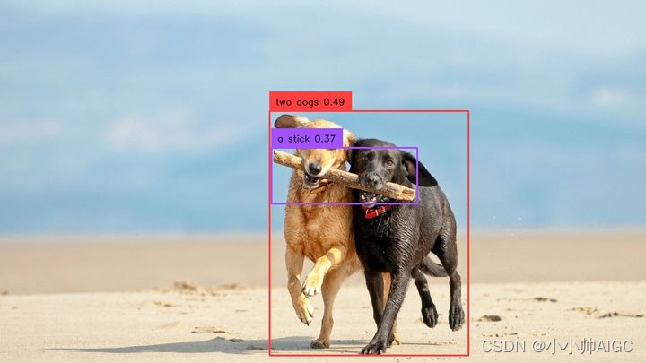

```
=== Python 环境信息 ===
Python 版本: 3.10.17 | packaged by conda-forge | (main, Apr 10 2025, 22:19:12) [GCC 13.3.0]

=== CUDA 环境 ===
CUDA_HOME: /usr/local/cuda
PyTorch 版本: 2.5.1+cu124
CUDA 是否可用: True
CUDA 版本: 12.4
GPU 设备: NVIDIA GeForce RTX 3090

=== 关键包版本 ===
transformers: 4.51.2
accelerate: 未安装
bitsandbytes: 未安装
peft: 未安装
flash-attn: 未安装
deepspeed: 未安装
torch: 2.5.1+cu124
triton: 3.1.0
torchvision: 0.20.1+cu124
torchaudio: 2.5.1+cu124
supervision: 0.6.0
groundingdino-py: 0.4.0
```

## 一、GroundingDINO 安装、简单上手

### 1.1 Installation

```sh
git clone https://github.com/IDEA-Research/GroundingDINO.git
cd GroundingDINO/
pip install -e .
wget https://github.com/IDEA-Research/GroundingDINO/releases/download/v0.1.0-alpha/groundingdino_swint_ogc.pth
```

> Note:如果要使用GPU运行，需要提前设置 `export CUDA_HOME=/path/to/cuda-xxx`，否则在运行的时候会报错: _NameError: name ‘\_C’ is not defined_
> 如果忘记设置，需要设置后在重新安装GroundingDINO，即重新执行 pip install -e .
>
> 这里要注意，CUDA_HOME的CUDA版本必须要和conda虚拟环境里面的Pytorch对应的CUDA版本要相同，比如github项目中默认的是12.4版本的CUDA，那么CUDA_HOME也要选择相同版本。
>
> 设置好相同版本后，在执行`pip install -e .`后，运行`python setup.py clean` `python setup.py build_ext --inplace`进行配置，即可成功运行。

### 1.2 Running

```python
from groundingdino.util.inference import load_model, load_image, predict, annotate, Model
import cv2
CONFIG_PATH = "groundingdino/config/GroundingDINO_SwinT_OGC.py"    #源码自带的配置文件
CHECKPOINT_PATH = "./groundingdino_swint_ogc.pth"   #下载的权重文件
DEVICE = "cuda"   #可以选择cpu/cuda
IMAGE_PATH = "../assets/demo4.jpg"    #用户设置的需要读取image的路径
TEXT_PROMPT = "Two dogs with a stick."    #用户给出的文本提示
BOX_TRESHOLD = 0.35     #源码给定的边界框判定阈值
TEXT_TRESHOLD = 0.25    #源码给定的文本端获取关键属性阈值
image_source, image = load_image(IMAGE_PATH)
model = load_model(CONFIG_PATH, CHECKPOINT_PATH)
boxes, logits, phrases = predict(
    model=model,
    image=image,
    caption=TEXT_PROMPT,
    box_threshold=BOX_TRESHOLD,
    text_threshold=TEXT_TRESHOLD,
    device=DEVICE,
)
annotated_frame = annotate(image_source=image_source, boxes=boxes, logits=logits, phrases=phrases)
cv2.imwrite("../result_image/annotated_image.jpg", annotated_frame)

```

> Note:
> 在运行过程中因为使用了bert做为文本编码器，当本地文件没有bert权重文件时，程序会自动请求bert-base-uncased·Hugging Face并下载权重文件，但是如果存在网络问题，即出现443时，可以进行手动下载，并将下载的文件保存到`bert-base-uncased`文件夹下，放在GroundingDINO目录下（需要下载的文件：config.json/pytorch_model.bin/tokenizer.json/tokenizer_config.json/vocab.txt）

###### 输入Image示例：


###### Grounding DINO的输出结果，输出box/scores/entity property of text：



## 2.从Grounding DINO code角度解析其model构造

### 2.1.Model结构

Grounding DINO是一种双编码器-单解码器架构。它包含用于**图像特征提取的图像主干、用于文本特征提取的文本主干，用于图像和文本特征融合的特征增强器，用于查询初始化的语言引导查询选择模块和用于框细化的跨模态解码器**（共5个大模块）。

### 2.2.处理流程

输入：（图像，文本）对 对于每个(图像、文本)对，首先分别使用

- **SwinTransformer和Bert**提取普通图像特征和普通文本特征。

- 这两个普通特征被送到用于跨模态特征融合的特征增强器模块（颈部模块）中。
- 在获得跨模态文本和图像特征后，使用语言引导的查询选择模块从图像特征中选择跨模态查询。
- 这些跨模态查询将被送到跨模态解码器（头部模块）中，以从双模态特征中探测所需特征并更新它们自己。

输出：最后一个解码器层的输出查询将用于预测对象框并提取相应的短语以及scores。

> 颈部模块（Neck Module）是[VLP](https://zhuanlan.zhihu.com/p/679419910)模型中的一部分，主要负责图像和文本特征的融合。 
>
> 头部模块（Head Module）是VLP模型中的一部分，主要负责根据预训练的特征进行下游任务的推断和预测。

### 2.3.进入模型前的准备工作

#### 2.3.1.加载图片预处理（image）

`image_source, image = load_image(IMAGE_PATH)`: 它接受一个图像路径作为输入，并返回原始图像数组以及经过预处理后的图像张量。

```python
def load_image(image_path: str) -> Tuple[np.array, torch.Tensor]:
    transform = T.Compose(
        [
            T.RandomResize([800], max_size=1333),
            T.ToTensor(),
            T.Normalize([0.485, 0.456, 0.406], [0.229, 0.224, 0.225]),
        ]
    )
    image_source = Image.open(image_path).convert("RGB")
    image = np.asarray(image_source)
    image_transformed, _ = transform(image_source, None)
    return image, image_transformed

```

函数内部的操作如下：

1. 使用PIL库的Image.open()函数打开图像，并将其转换为RGB模式（如果不是RGB模式的话）。
2. 将图像转换为NumPy数组格式，以便进行后续操作。
3. 将原始图像和空标签（None）作为参数，通过转换器对图像进行预处理。预处理操作包括随机调整大小（RandomResize）、转换为张量（ToTensor）和归一化（Normalize）。
4. 返回原**始图像数组**和**经过预处理后的图像张量**。

#### 2.3.2.文本提示预处理（text prompt）

`caption = preprocess_caption(caption=caption)` : caption（文本提示）作为输入，并返回预处理后的文本提示信息，即将输入的caption字符串进行小写化处理，并确保其以句号结尾。

```python
def preprocess_caption(caption: str) -> str:
    result = caption.lower().strip()
    if result.endswith("."):
        return result
    return result + "."
caption = preprocess_caption(caption=caption)

```

函数内部的操作如下：

1. `result = caption.lower().strip()`: 首先，将输入的caption字符串转换为小写字母，并去除首尾的空格。这样做是为了统一字符的大小写形式，并去除可能存在的前导或尾随空格。
2. `if result.endswith(“.”): return result`: 接下来，检查处理后的字符串是否以句号"."结尾。如果是，那么直接返回处理后的字符串result 。 return result + “.”: 如果处理后的字符串不以句号结尾，那么在末尾加上句号后返回。这个步骤是为了确保所有的caption字符串都以句号结尾。

#### 2.3.3. 将预处理后的（image，text）输入模型中

`boxes, logits, phrases = predict(model=model,image=image,caption=TEXT_PROMPT, box_threshold=BOX_TRESHOLD,text_threshold=TEXT_TRESHOLD,device=DEVICE) `执行model推理。

```python
def predict(
        model,
        image: torch.Tensor,
        caption: str,
        box_threshold: float,
        text_threshold: float,
        device: str = "cuda"
) -> Tuple[torch.Tensor, torch.Tensor, List[str]]:
    caption = preprocess_caption(caption=caption)
    model = model.to(device)
    image = image.to(device)
    with torch.no_grad():
        outputs = model(image[None], captions=[caption])
...
...

```

> Note: image[None]是将image转换为一个包含一维元组的二维数组。这个操作可以用image.unsqueeze(0)来实现相同的效果。

### 2.4.文本编码器提取文本特征（First Module）

在预处理结束后，就要开始执行模型处理流程了，首先是第一个模块：将文本经过文本编码器转换为`text embedding`，Grounding DINO使用的文本编码器是**Bert**（bert-base-uncased）。假设`captions`：

| captions | Two dogs. with a stick. |
| -------- | ----------------------- |

#### 2.4.1.将输入的文本提示进行标记化（tokenized）

**输入：[captions] 输出: [tokenized]**

```python
tokenized = self.tokenizer(captions, padding="longest", return_tensors="pt").to(samples.device)

```

#### 2.4.2.生成文本的自注意力掩码（text_self_attention_masks）、位置 ID（position_ids） 和类别到标记的映射列表（cate_to_token_mask_list）

**输入：[tokenized] 输出: [text_self_attention_masks,position_ids,cate_to_token_mask_list]**

```python
(text_self_attention_masks,position_ids, cate_to_token_mask_list,)= generate_masks_with_special_tokens_and_transfer_map(tokenized, self.specical_tokens, self.tokenizer)

```

GroundingDINO为了消除sentence level（失去了句子中的细粒度信息）和word level（类别之间引入了不必要的依赖性）中的缺陷，使用了Sub-Sentence Level Text Feature，即引入了注意力masks来阻断不相关类别名称之间的注意力，它消除了不同类别名称之间的影响，同时保留了每个单词的特征，以便进行细粒度的理解。因此，需要重构caption的self-attention mask和生成类别标记映射。

> 类别：输入的一个句子中可能会包括多个待检测的实体，每个待检测的实体就是一个类别，例：Two dogs. with a stick. GroundingDINO使用特殊符号(. ?)作为分割标准，这个句子中就有两个类别，一个是Two dogs，一个是with a stick，通过引入的self-attention mask，使得两个类别之间在编码时互不干扰。 Note: GroundingDINO建议在不同类别名称之间用 .分隔。

具体细节（参考如下代码）：

- 生成special_tokens_mask（特殊标记掩码）：根据input_ids的shape确定batch（bs）和最大token数量（num_token），创建一个形状为(bs, num_token)的special_tokens_mask，用于指示哪些token是特殊标记，特殊标记的位置置为1，反之为0，GroundingDINO给定的特殊标记有4个：[“[CLS]”, “[SEP]”, “.”, “?”]

```python
bs, num_token = input_ids.shape
special_tokens_mask = torch.zeros((bs, num_token), device=input_ids.device).bool()
for special_token in special_tokens_list:
   special_tokens_mask |= input_ids == special_token

```

- **生成idxs（特殊标记的索引）**：special_tokens_mask中为1的元素的索引。

```
idxs = torch.nonzero(special_tokens_mask
```

- 生成attention_mask（注意力掩码）、position_ids（位置编码）和cate_to_token_mask_list（类别到token的映射生成掩码列表）：注意力掩码是一个(bs, num_token, num_token)的张量，每个类别位置上的元素为True，其余元素为False。位置编码是一个(bs, num_token)的张量，每个位置都表示该位置在每个类别中的索引。cate_to_token_mask_list是一个大小为(bs, m, num_token)的张量列表，每个张量表示一个类别到token的映射，并且在对应的位置上为True，其他位置为False，m表示每个类别对应的标记的数量

```python
attention_mask = (torch.eye(num_token, device=input_ids.device).bool().unsqueeze(0).repeat(bs, 1, 1))
position_ids = torch.zeros((bs, num_token), device=input_ids.device)
cate_to_token_mask_list = [[] for _ in range(bs)]
previous_col = 0
for i in range(idxs.shape[0]):
row, col = idxs[i]
if (col == 0) or (col == num_token - 1):
attention_mask[row, col, col] = True
position_ids[row, col] = 0
else:
attention_mask[row, previous_col + 1 : col + 1, previous_col + 1 : col + 1] = True
position_ids[row, previous_col + 1 : col + 1] = torch.arange(0, col - previous_col, device=input_ids.device)
c2t_maski = torch.zeros((num_token), device=input_ids.device).bool()
c2t_maski[previous_col + 1 : col] = True
cate_to_token_mask_list[row].append(c2t_maski)
previous_col = col
cate_to_token_mask_list = [torch.stack(cate_to_token_mask_listi, dim=0) for cate_to_token_mask_listi in cate_to_token_mask_list]
return attention_mask, position_ids.to(torch.long), cate_to_token_mask_list

```


