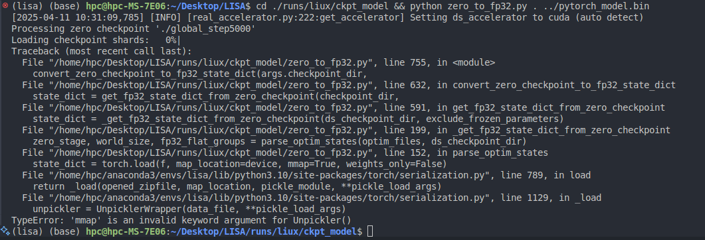

## 一、准备数据集

### Training Data Preparation

The training data consists of 4 types of data:

1. Semantic segmentation datasets: [ADE20K](http://data.csail.mit.edu/places/ADEchallenge/ADEChallengeData2016.zip), [COCO-Stuff](http://calvin.inf.ed.ac.uk/wp-content/uploads/data/cocostuffdataset/stuffthingmaps_trainval2017.zip), [Mapillary](https://www.mapillary.com/dataset/vistas), [PACO-LVIS](https://github.com/facebookresearch/paco/tree/main#dataset-setup), [PASCAL-Part](https://github.com/facebookresearch/VLPart/tree/main/datasets#pascal-part), [COCO Images](http://images.cocodataset.org/zips/train2017.zip)

   Note: For COCO-Stuff, we use the annotation file stuffthingmaps_trainval2017.zip. We only use the PACO-LVIS part in PACO. COCO Images should be put into the `dataset/coco/` directory.

2. Referring segmentation datasets: [refCOCO](https://web.archive.org/web/20220413011718/https://bvisionweb1.cs.unc.edu/licheng/referit/data/refcoco.zip), [refCOCO+](https://web.archive.org/web/20220413011656/https://bvisionweb1.cs.unc.edu/licheng/referit/data/refcoco+.zip), [refCOCOg](https://web.archive.org/web/20220413012904/https://bvisionweb1.cs.unc.edu/licheng/referit/data/refcocog.zip), [refCLEF](https://web.archive.org/web/20220413011817/https://bvisionweb1.cs.unc.edu/licheng/referit/data/refclef.zip) ([saiapr_tc-12](https://web.archive.org/web/20220515000000/http://bvisionweb1.cs.unc.edu/licheng/referit/data/images/saiapr_tc-12.zip))

   Note: the original links of refCOCO series data are down, and we update them with new ones. If the download speed is super slow or unstable, we also provide a [OneDrive link](https://mycuhk-my.sharepoint.com/:f:/g/personal/1155154502_link_cuhk_edu_hk/Em5yELVBvfREodKC94nOFLoBLro_LPxsOxNV44PHRWgLcA?e=zQPjsc) to download. **You must also follow the rules that the original datasets require.**

3. Visual Question Answering dataset: [LLaVA-Instruct-150k](https://huggingface.co/datasets/liuhaotian/LLaVA-Instruct-150K/blob/main/llava_instruct_150k.json)

4. Reasoning segmentation dataset: [ReasonSeg](https://github.com/dvlab-research/LISA#dataset)

Download them from the above links, and organize them as follows.

```
├── dataset
│   ├── ade20k
│   │   ├── annotations
│   │   └── images
│   ├── coco
│   │   └── train2017
│   │       ├── 000000000009.jpg
│   │       └── ...
│   ├── cocostuff
│   │   └── train2017
│   │       ├── 000000000009.png
│   │       └── ...
│   ├── llava_dataset
│   │   └── llava_instruct_150k.json
│   ├── mapillary
│   │   ├── config_v2.0.json
│   │   ├── testing
│   │   ├── training
│   │   └── validation
│   ├── reason_seg
│   │   └── ReasonSeg
│   │       ├── train
│   │       ├── val
│   │       └── explanatory
│   ├── refer_seg
│   │   ├── images
│   │   |   ├── saiapr_tc-12 
│   │   |   └── mscoco
│   │   |       └── images
│   │   |           └── train2014
│   │   ├── refclef
│   │   ├── refcoco
│   │   ├── refcoco+
│   │   └── refcocog
│   └── vlpart
│       ├── paco
│       │   └── annotations
│       └── pascal_part
│           ├── train.json
│           └── VOCdevkit
```

## 二、准备预训练权重

### LLaVA

To train LISA-7B or 13B, you need to follow the [instruction](https://github.com/haotian-liu/LLaVA/blob/main/docs/MODEL_ZOO.md) to merge the LLaVA delta weights. Typically, we use the final weights `LLaVA-Lightning-7B-v1-1` and `LLaVA-13B-v1-1` merged from `liuhaotian/LLaVA-Lightning-7B-delta-v1-1` and `liuhaotian/LLaVA-13b-delta-v1-1`, respectively. For Llama2, we can directly use the LLaVA full weights `liuhaotian/llava-llama-2-13b-chat-lightning-preview`.

### SAM ViT-H weights

Download SAM ViT-H pre-trained weights from the [link](https://dl.fbaipublicfiles.com/segment_anything/sam_vit_h_4b8939.pth).

## 三、开始训练

### Training

```sh
deepspeed --master_port=24999 train_ds.py 
\
  --version="/home/hpc/Desktop/LLaVA/checkpoints/llava-v1.5-7b" \
  --dataset_dir='./dataset' \
  --vision_pretrained="checkpoints/sam_vit_h_4b8939.pth" \
  --dataset="sem_seg" \
  --sample_rates="1" \
  --exp_name="liux-7b" \
  --sem_seg_data="cocostuff||paco_lvis" \

```

When training is finished, to get the full model weight:

```sh
cd ./runs/liux/ckpt_model && python zero_to_fp32.py . ../pytorch_model.bin
```

### Merge LoRA Weight

Merge the LoRA weights of `pytorch_model.bin`, save the resulting model into your desired path in the Hugging Face format:

```sh
CUDA_VISIBLE_DEVICES="" python merge_lora_weights_and_save_hf_model.py \
  --version="PATH_TO_LLaVA" \
  --weight="PATH_TO_pytorch_model.bin" \
  --save_path="PATH_TO_SAVED_MODEL"
```

For example:

```sh
CUDA_VISIBLE_DEVICES="" python3 merge_lora_weights_and_save_hf_model.py \
  --version="./LLaVA/LLaVA-Lightning-7B-v1-1" \
  --weight="lisa-7b/pytorch_model.bin" \
  --save_path="./LISA-7B"
```

### Validation

```sh
deepspeed --master_port=24999 train_ds.py \
  --version="PATH_TO_LISA_HF_Model_Directory" \
  --dataset_dir='./dataset' \
  --vision_pretrained="PATH_TO_SAM" \
  --exp_name="lisa-7b" \
  --eval_only
```

Note: the `v1` model is trained using both `train+val` sets, so please use the `v0` model to reproduce the validation results. (To use the `v0` models, please first checkout to the legacy version repo with `git checkout 0e26916`.)


## BUG

### 一、在训练完模型后，出现了`TypeError: 'mmap' is an invalid keyword argument for Unpickler()`报错

> 根据报错找到152行，删掉`mmap=True`即可
>
> **根本原因**:
>
> - 在 `zero_to_fp32.py` 脚本中，尝试使用 `torch.load()` 加载优化器状态文件时传递了 `mmap=True` 参数
> - 但您使用的 PyTorch 版本中，`Unpickler()` 不再接受 `mmap` 这个参数

